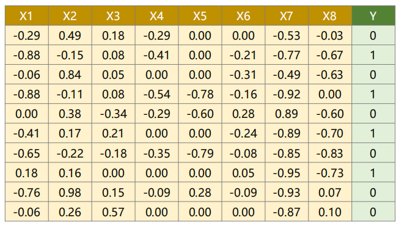
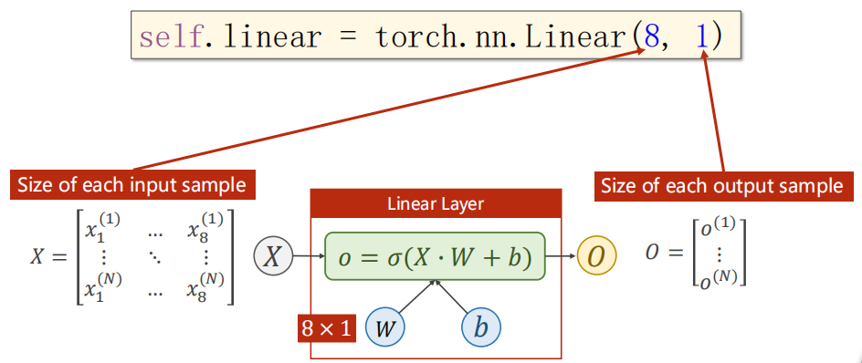

> 视频：
>
> 1. [PyTorch深度学习实践](https://www.bilibili.com/video/BV1Y7411d7Ys)——河北工业大学
>
> 代码及笔记：https://github.com/tsuirak/skills/tree/main/Pytorch/Pytorch_learn_by_dragen1860

## 多维特征输入

在不同的领域，说法不同：

| Java | 数据库 | 深度学习 |
| :--- | ------ | -------- |
| 属性 | 字段   | 特征     |
| 对象 | 记录   | 样本     |




```
x = torch.from_numpy(data[:, : -1]) # 表示拿所有行，除倒数第一列的所有列
y = torch.from_numpy(data[:, [-1]]) # 表示拿所有行，倒数第一列。加[]是为了拿到矩阵，如果不加就是向量了。
```


以下代码表示：输入为8个特征（8维空间），输出为1维。换句话说，将8维的空间映射到1维的空间上，8D->1D。

`以下代码实现的空间映射是简单的线性映射，但是往往需要解决的是非线性问题，就需要经过多次的线性映射和sigmoid函数这些激活函数来增加非线性因子，以此来模拟拟合非线性映射，。这也是神经网络的本质！`

注：不关样本多少的事。sigmoid函数用作非线性变换

```python
self.linear = torch.nn.Linear(8, 1) # 实现空间维度的变换
```

如果想输出维度为2，那么扩充权重$W$即可。



## 训练

前馈、反馈（反向传播）、更新


```python
import torch
class Model(torch.nn.Module):
    def __init__(self):
        super(Model, self).__init__()
        self.linear1 = torch.nn.Linear(8, 6)	# 8维空间压缩到6维
        self.linear2 = torch.nn.Linear(6, 4)
        self.linear3 = torch.nn.Linear(4, 1)
        self.sigmoid = torch.nn.Sigmoid()		# 非线性变换
    def forward(self, x):
        x = self.sigmoid(self.linear1(x))		# x就是输出
        x = self.sigmoid(self.linear2(x))
        x = self.sigmoid(self.linear3(x))
        return x
model = Model()
```

```python
x_data = torch.from_numpy(data[:, : -1]) # 表示拿所有行，除倒数第一列的所有列
y_data = torch.from_numpy(data[:, [-1]]) # 表示拿所有行，倒数第一列。加[]是为了拿到矩阵，如果不加就是向量了。

......

for epoch in range(100) :
	# Forward
	y_pred = model(x_data)	# 上面是所有行的数据，从性能等角度，要考虑使用minibatch
	loss = criterion(y_pred, y_data)
	print(epoch, loss.item())
	# Backward
	optimizer.zero_grad()
	loss.backward()
	# Update
	optimizer.step()
```

### 反向传播


## 网络层数越多越好吗？

`如果网络层数越深，加入的激活函数非线性变换越多，那么按道理学习能力也越强。但是需要知道的是，样本中是有噪声的，不断增加网络并不是一个明智之举。`

题外话：学习能力强是其次，最重要的是有泛化能力，学了一门语言，一通百通，泛化到其他方向。