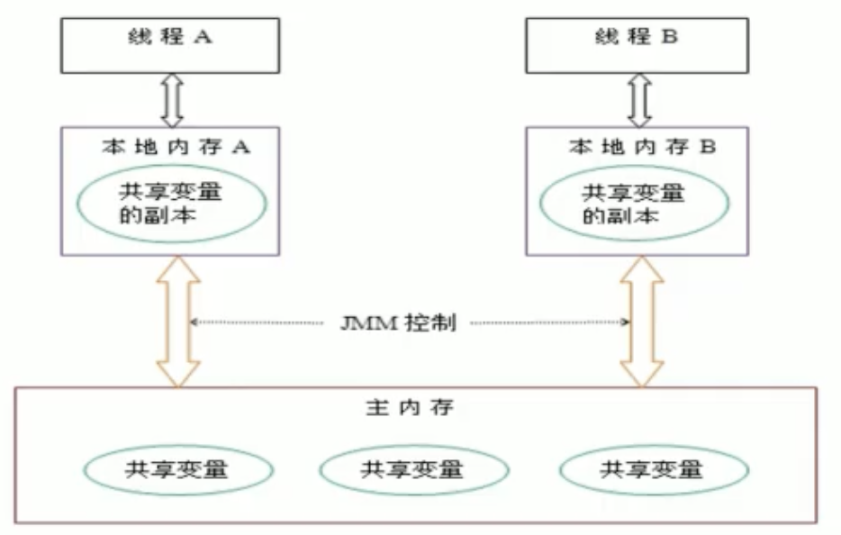
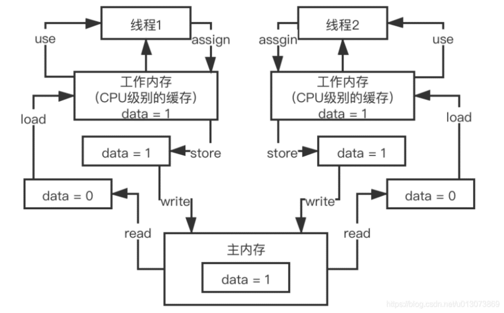

# Java内存模型

## 谈谈对JMM的理解？

JMM就是Java内存模型(Java memory model)，它定义了`主存`、`工作内存`抽象概念，底层对应着 CPU 寄存器、缓存、硬件内存、 CPU 指令优化等。 

**JMM 体现在以下几个方面** 

```markdown
原子性 保证指令不会受到线程上下文切换的影响 

可见性 保证指令不会受 cpu 缓存的影响 

有序性 保证指令不会受 cpu 指令并行优化的影响
```


因为在不同的硬件生产商和不同的操作系统下，内存的访问有一定的差异，所以会造成相同的代码运行在不同的系统上会出现各种问题。所以`Java内存模型(JMM)屏蔽掉各种硬件和操作系统的内存访问差异，以实现让Java程序在各种平台下都能达到一致的并发效果`。

**Java内存模型的同步规定**

```
1. 所有的变量都存储在主内存中，包括实例变量，静态变量，但是不包括局部变量和方法参数。
2. 每个线程都有自己的工作内存，线程的工作内存保存了该线程用到的变量和主内存的副本拷贝，线程对变量的操作都在工作内存中进行。线程不能直接读写主内存中的变量。
3. 加锁解锁是同一把锁
```



不同的线程之间也无法访问对方工作内存中的变量。线程之间变量值的传递均需要通过主内存来完成。



## Volatile	

volatile关键字是Java提供的一种`轻量级同步机制`。它能够保证可见性和有序性（禁止指令重排），但是不能保证原子性，所以也可以说是乞丐版的synchronized。

### 可见性

我们看下面的代码，有两个线程，分别为main主线程和我们new的一个线程t1，现在有一个共享变量 flag，如果没有对这个变量使用volatile修饰，那么t1线程拿到flag会`一直循环`，就算main线程将flag改为flase，t1也不知道，它还是用的自己的本地内存中的flag。

但是如果加了volatile，一旦发现volatile修饰的变量发生了改变，那么会立即通知所有线程。这就是可见性！

```java
public class VolatileDemo {
    public static volatile boolean flag = true;   // volatile保证可见性
//    public static boolean flag = true;
    public static void main(String[] args) throws InterruptedException {
        new Thread(() -> {
            while (flag){
            }
            System.out.println("结束");
        },"t1").start();

        Thread.sleep(1000);
        flag = false;
    }
}
```


### 原子性

不可分割，完整性，也即某个线程正在做某个具体业务时，中间不可以被加塞或者被分割。 需要整体完整，要么同时成功，要么同时失败。

volatile并不能保证操作的原子性。这是因为，比如一条number++的操作，会形成3条指令。

```
getfield        //读
iconst_1				//++常量1
iadd						//加操作
putfield				//写操作
```

假设有3个线程，分别执行number++，都先从主内存中拿到最开始的值，number=0，然后三个线程分别进行操作。假设线程0执行完毕，number=1，也立刻通知到了其它线程，但是此时线程1、2已经捷足先登，拿到了number=0，所以结果就是写覆盖，线程1、2将number变成1，也就相当于丢了2次了。

解决的方式就是：

```
1、对addPlusPlus()方法加锁。但是Synchronized太重了
2、使用Java.util.concurrent.AtomicInteger类。详情见Atomic原子类
```


### 有序性、指令重排

volatile可以保证有序性，也就是防止指令重排序。所谓指令重排序，就是出于优化考虑，`CPU执行指令的顺序跟程序员自己编写的顺序不一致`。就好比一份试卷，题号是老师规定的，是程序员规定的，但是考生（CPU）为了拿好成绩，可以先做选择，也可以先做填空。处理器在进行重排序时必须要考虑指令之间的数据依赖性。

单线程环境里面确保程序最终执行结果和代码顺序执行的结果一致。单线程重排没关系因为考虑数据依赖性，最终结果依然正确。

多线程环境中线程交替执行，由于编译器优化重排的存在（客观存在），两个线程中使用的变量能否保证一致性是无法确定的，结果无法预测。

```
int x = 11; //语句1
int y = 12; //语句2
x = x + 5;  //语句3
y = x * x;  //语句4
```

以上例子，可能出现的执行顺序有1234、2134、1342，这三个都没有问题，最终结果都是x = 16，y=256。但是如果是`4开头`，就有问题了，y=0。这个时候就不需要指令重排序。我们就使用volatile修饰变量。

volatile实现禁止指令重排优化（不要你自作聪明了），从而避免多线程环境下程序出现乱序执行的现象。

### 禁止指令重排序的底层实现/happens-before

volatile底层是用`CPU的内存屏障（Memory Barrier）指令`来实现的，有两个作用，一个是保证特定操作的顺序性，二是保证变量的可见性。在指令之间插入一条Memory Barrier指令，告诉编译器和CPU，在Memory Barrier指令之间的指令不能被重排序。


happens-before的规则很多，没必要死记，你只需要知道happens-before是`一套规则`，在一些特殊情况下不允许编译器、指令器对你写的代码进行指令重排，必须保证代码的有序性。

但是如果没满足上面的规则，那么就可能会出现指令重排，就这个意思。这8条原则是避免说出现乱七八糟扰乱秩序的指令重排，要求是这几个重要的场景下，比如是按照顺序来，但是8条规则之外，可以随意重排指令。


## Synchronized

## 共享的问题

自增自减在Java中是一行代码，但是实际上有4行指令。所以在多线程场景中，不能保证线程安全。

现在两个线程共享一个静态变量`i`。

线程2 执行 `i--`

线程1 执行 `i++`

线程2 先进来，读到了`i = 0`，它现在需要对`i`进行4步操作，最终修改为了`i  = -1`，此时还没有写回去。

线程1 进来了，读到了`i = 0`，速度太快，修改为 `i = 1`并且写了回去。

现在线程 2终于把 `i = -1`写了回去。

最终结果为 `i = -1`。

```java
public class Test1 {
    static int i = 0;
    public static void main(String[] args) throws InterruptedException {
        Thread t1 = new Thread(() -> {
            for (int j = 0; j < 5000; j++) {
                i++;
            }
        },"t1");
        Thread t2 = new Thread(() -> {
            for (int j = 0; j < 5000; j++) {
                i--;
            }
        },"t2");
        t1.start();
        t2.start();
        t1.join();
        t2.join();

        System.out.println(i);
    }
}
```


最简单的方法就是加上`synchronized`。

两个线程首先要尝试拿到锁，如果线程2先拿到，那么它可以读到i，即使时间片上下文切换到线程1，因为线程2还没有释放锁，也得等到线程2 i--操作，释放锁并唤醒线程1去拿锁。

```java
public class Test2 {
    static Object o1 = new Object();
    static int i = 0;

    public static void main(String[] args) throws InterruptedException {
        Thread t1 = new Thread(() -> {
            synchronized (o1) {
                for (int j = 0; j < 5000; j++) {
                    i++;
                }
            }
        }, "t1");
        Thread t2 = new Thread(() -> {
            synchronized (o1) {
                for (int j = 0; j < 5000; j++) {
                    i--;
                }
            }
        }, "t2");
        t1.start();
        t2.start();
        t1.join();
        t2.join();

        System.out.println(i);
    }
}
```


synchronized只能对对象进行加锁，即使在修饰方法也是针对对象加锁的。


