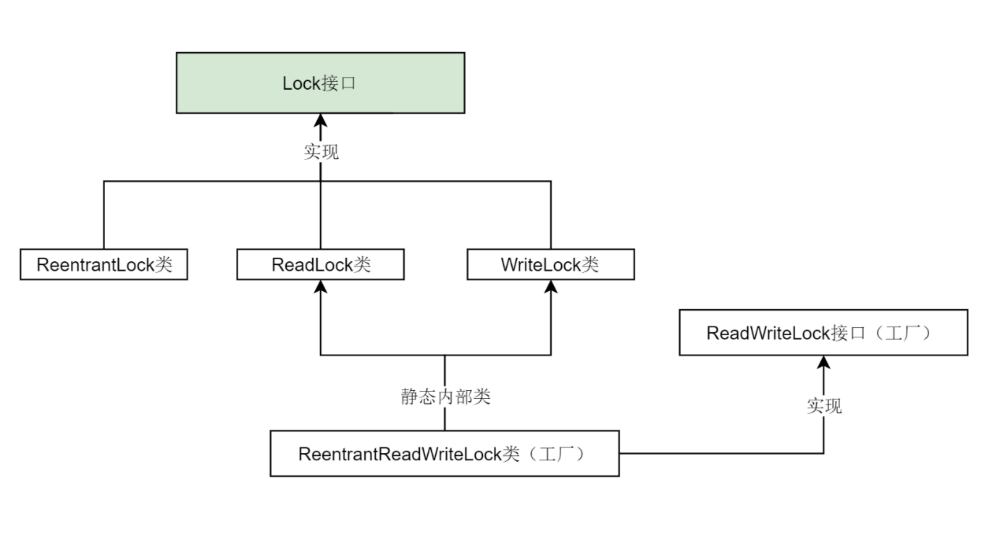
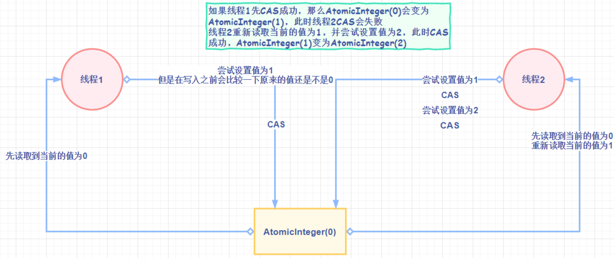
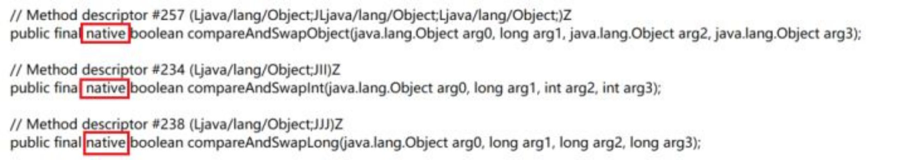
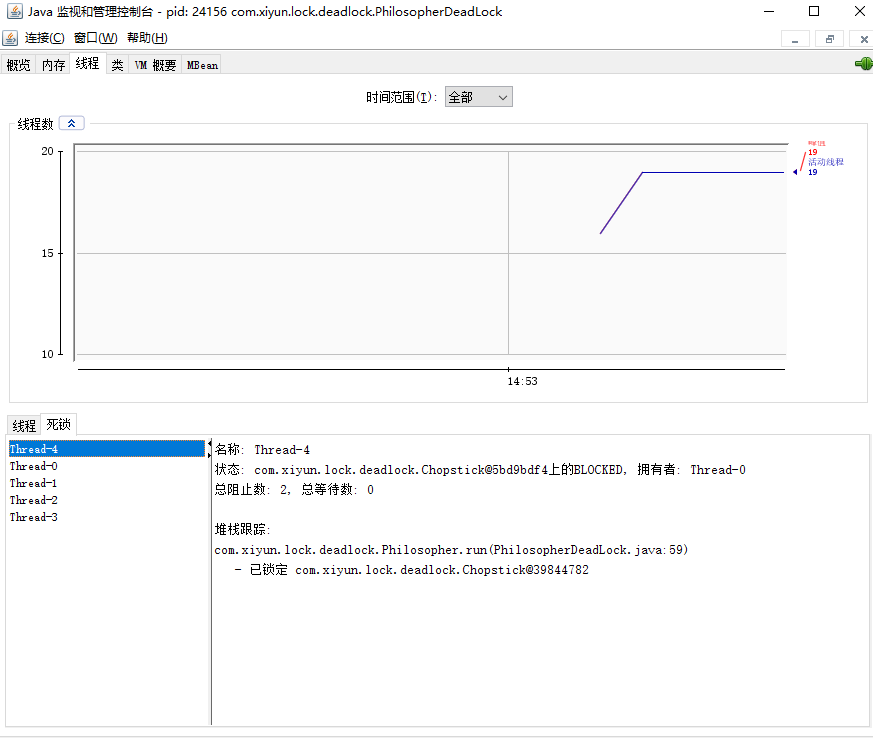
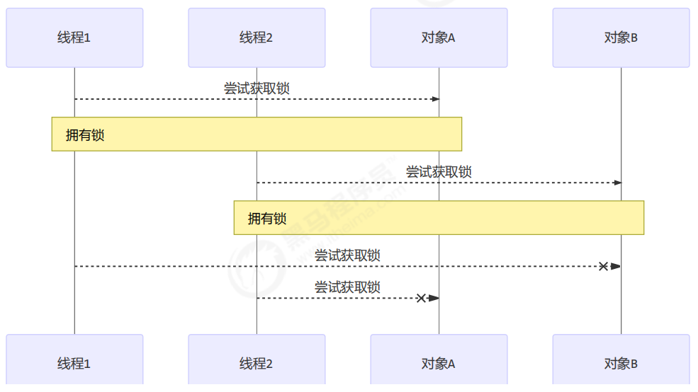

# Lock

## Lock接口

> 锁是用来控制多个线程访问共享线程的方式。

```java
Lock lock = new ReentrantLock(); 
lock.lock(); 	// 手动挡，必须手动加锁
try { 
} finally { 
lock.unlock(); 	// 手动挡，必须手动释放锁
}
```

在finally块中释放锁，目的是保证在获取到锁之后，最终能够被释放。 

不要将获取锁的过程写在try块中，因为如果在获取锁（自定义锁的实现）时发生了异常，异常抛出的同时，也会导致锁无故释放。



`ReentrantLock、ReadLock、WriteLock `是Lock接口最重要的三个实现类。对应了“可重入锁”、“读锁”和“写锁”。

ReadWriteLock其实是一个工厂接口，而ReentrantReadWriteLock是ReadWriteLock的实现类，它包含两个静态内部类ReadLock和WriteLock。这两个静态内部类又分别实现了Lock接口。

## Condition接口

Condition接口提供了类似Object的监视器方法，与Lock配合可以实现等待、通知模式。await和signal。

当线程调用Condition的方法是，需要提前获取到Condition对象关联的锁。Condition对象是由Lock对象（调用Lock对象的newCondition()方法）创建出来的，换句话说，Condition是依赖Lock对象的。

## LockSupport

AQS的`acquireQueued()`方法会用到

LockSupport是一个`线程阻塞工具类`，所有的方法都是`静态方法`，可以让线程在任意位置阻塞，阻塞之后也有对应的唤醒方法。归根结底，LockSupport调用的Unsafe中的native代码。是wait和notify的改良加强版

LockSupport中的park()和unpark()的作用分别是阻塞线程和解除阻塞线程，park就是停车的意思，进停车场，你就需要许可证，否则只能阻塞在那儿。

**凭证(permit)**

```
线程阻塞需要消耗凭证(permit)，这个凭证最多只有1个。
LockSupport和每个使用它的线程都有一个许可(permit)关联。permit相当于1，0的开关，默认是0，
调用一次unpark就加1变成1，
调用一次park会消费permit，也就是将1变成0，同时park立即返回。
如再次调用park会变成阻塞(因为permit为零了会阻塞在这里，一直到permit变为1)，这时调用unpark会把permit置为1。
每个线程都有一个相关的permit, permit最多只有一个，重复调用unpark也不会积累凭证。
```

面试题：

```
为什么可以先唤醒线程后阻塞线程?
答：因为unpark获得了一个凭证，之后再调用park方法，就可以名正言顺的凭证消费，故不会阻塞。

为什么唤醒两次后阻塞两次，但最终结果还会阻塞线程?
答：因为凭证的数量最多为1，连续调用两次unpark和调用一次unpark效果一样，只会增加一个凭证；
而调用两次park却需要消费两个凭证，证不够，不能放行。
```

**3种让线程等待和唤醒的方法**

1、使用Object中的wait()方法让线程等待，使用Object中的notify()方法唤醒线程。

 

2、使用JUC包中Condition的await()方法让线程等待，使用signal()方法唤醒线程 。

3、LockSupport类可以阻塞当前线程以及唤醒指定被阻塞的线程。

## CAS——乐观锁的基础



说到乐观锁，就必须提到一个概念：CAS

什么是CAS呢？Compare-and-Swap，即比较并替换，也有叫做Compare-and-Set的，比较并设置。

```
1、比较：读取到了一个值A，在将其更新为B之前，检查原值是否仍为A（未被其他线程改动）。
2、设置：如果是，将A更新为B，结束。如果不是，则什么都不做。
```

上面的两步操作是原子性的，可以简单地理解为瞬间完成，在CPU看来就是一步操作。
有了CAS，就可以实现一个乐观锁：

```java
data = 123; // 共享数据

/* 更新数据的线程会进行如下操作 */
flag = true;
while (flag) {
    oldValue = data; // 保存原始数据
    newValue = doSomething(oldValue); 

    // 下面的部分为CAS操作，尝试更新data的值
    if (data == oldValue) { // 比较
        data = newValue; // 设置
        flag = false; // 结束
    } else {
	// 啥也不干，循环重试
    }
}
/* 
   很明显，这样的代码根本不是原子性的，
   因为真正的CAS利用了CPU指令，
   这里只是为了展示执行流程，本意是一样的。
*/
```

这是一个简单直观的乐观锁实现，它允许多个线程同时读取（因为根本没有加锁操作），但是只有一个线程可以成功更新数据，并导致其他要更新数据的线程回滚重试。CAS利用CPU指令，从硬件层面保证了操作的原子性，以达到类似于锁的效果。



Java中真正的CAS操作调用的native方法

因为整个过程中并没有“加锁”和“解锁”操作，因此乐观锁策略也被称为`无锁编程`。换句话说，乐观锁其实不是“锁”，它仅仅是一个循环重试CAS的算法而已！


### CAS缺点

CAS实际上是一种自旋锁

```
1、一直循环，开销比较大。
2、只能保证一个变量的原子操作，多个变量依然要加锁。
3、引出了ABA问题。
```

### ABA问题

所谓ABA问题，就是比较并交换的循环，存在一个时间差，而这个时间差可能带来意想不到的问题。比如线程T1将值从A改为B，然后又从B改为A。线程T2看到的就是A，但是却不知道这个A发生了更改。尽管线程T2 CAS操作成功，但不代表就没有问题。
有的需求，比如CAS，只注重头和尾，只要首尾一致就接受。但是有的需求，还看重过程，中间不能发生任何修改，这就引出了AtomicReference原子引用。

```
狸猫换太子、中间过程神不知鬼不觉。
你借了别人100块钱，别人到时候会还给你，但是他拿100块去炒股还是赌博还是吃喝，你不知道，还给你的100块可能还是高利贷借来的。
```

> CAS只注重首尾一致，中间过程忽视！

**解决方法**

使用AtomicStampedReference类可以解决ABA问题。这个类维护了一个`“版本号”Stamp时间戳`，在进行CAS操作的时候，不仅要比较当前值，还要`比较版本号`。只有两者都相等，才执行更新操作。

## 自旋锁

所谓自旋锁，就是尝试获取锁的线程不会立即阻塞，而是采用while(true)无限循环的方式去尝试获取。自己在那儿一直循环获取，就像“自旋”一样。这样的好处是减少线程切换的上下文开销，缺点是会消耗CPU。CAS底层的getAndAddInt就是自旋锁思想，但是也要注意，自旋锁不等同于乐观锁。


举个例子：A在打电话，B上楼找A有事，但是看A忙，于是下楼买东西；过一会儿再上楼，A还在忙，B下楼买东西；一直到A空闲下来。


## 可重入锁


重入锁ReentrantLock，顾名思义，就是支持重进入的锁，它表示该锁能够支持一个线程对资源的重复加锁。除此之外，该锁的还支持获取锁时的公平和非公平性选择。

可重入是指同一个线程如果首次获得了这把锁，那么因为它是`这把锁的拥有者`，因此有权利再次进入。

如果是不可重入锁，那么第二次获得锁时，自己也会被锁挡住，自己等待自己释放锁，很容易就死锁。所以可重入锁的作用可以`避免死锁`的问题。另外synchronized关键字隐式的支持重进入。

ReentrantLock和Synchronized是典型的非公平可重入锁。

**Synchronized**

```java
public class ReentranLock1 {

    private static Object object = new Object();

    public static void method01() {
        new Thread("t1") {
            @Override
            public void run() {
                synchronized (object) {
                    System.out.println(Thread.currentThread().getName() + "\t" + "外层调用");
                    synchronized (object) {
                        System.out.println(Thread.currentThread().getName() + "\t" + "中层调用");
                        synchronized (object) {
                            System.out.println(Thread.currentThread().getName() + "\t" + "内层调用");
                        }
                    }
                }
            }
        }.start();
    }

    public static void main(String[] args) {
        method01();
    }
}
```

**ReentrantLock**

```java
public class ReentranLockDemo {
    private static ReentrantLock lock = new ReentrantLock();

    public static void main(String[] args) {
        lock.lock();
        try {
            System.out.println("enter main");
            m1();
        } finally {
            lock.unlock();
        }
    }

    public static void m1() {
        lock.lock();
        try {
            System.out.println("m1");
            m2();
        } finally {
            lock.unlock();
        }
    }

    public static void m2() {
        lock.lock();
        try {
            System.out.println("m2");
        } finally {
            lock.unlock();
        }
    }
}
```


## 读写锁

写必须限制，读没限制。

> 多个人读，一个人写：飞机场的屏幕上显示（写，只允许航空公司一个人修改，要是多个线程更改相关事宜，那乘客要疯掉了；并且此时乘客不能读）一些航班信息。

**为什么需要读写锁？**

`读锁是共享的，写锁是独占的`。`juc.ReentrantLock`和`synchronized`都是独占锁（排它锁），独占锁就是一个锁只能被一个线程所持有，以前读写通通都是一个人，数据一致性保证了，但是并发性急剧下降。

有的时候，需要读写分离，那么就要引入读写锁，即`juc.ReentrantReadWriteLock`。**既保证数据一致性又保证并发性**。

比如缓存，就需要读写锁来控制。缓存就是一个键值对，以下Demo模拟了缓存的读写操作，读的get方法使用了ReentrantReadWriteLock.ReadLock()，写的put方法使用了ReentrantReadWriteLock.WriteLock()。这样避免了写被打断，实现了多个线程同时读。

## 工具类

###  CountDownLatch（秦灭六国，一统天下）

CountDownLatch内部维护了一个`计数器`，只有当计数器==0时，某些线程才会停止阻塞，开始执行。

CountDownLatch主要有两个方法，countDown()来让计数器-1，await()来让线程阻塞。当count==0时，阻塞线程自动唤醒。

**案例1：**班长关门、main线程是班长，6个线程是学生。只有6个线程运行完毕，都离开教室后，main线程班长才会关教室门。

```java
public class CountDownLatchDemo {
    public static void main(String[] args) throws InterruptedException {
        leaveClassroom();
    }
    private static void leaveClassroom() throws InterruptedException {
        CountDownLatch countDownLatch=new CountDownLatch(6);
        for (int i = 1; i <=6 ; i++) {
            new Thread(()->{
                System.out.println(Thread.currentThread().getName()+"\t上完自习，离开教室");
                countDownLatch.countDown();
            },String.valueOf(i)).start();
        }
        countDownLatch.await();
        System.out.println(Thread.currentThread().getName()+"\t ******班长最后关门走人");
}
```

案例2：秦灭六国、只有6国都被灭亡后（执行完毕），main线程才会显示秦国一统天下。

**枚举类的使用**

在案例二中会使用到枚举类，因为灭六国，循环6次，想根据i的值来确定输出什么国，比如1代表楚国，2代表赵国。如果用判断则十分繁杂，而枚举类可以简化操作。

枚举类就像一个简化的数据库，枚举类名就像数据库名，枚举的项目就像数据表，枚举的属性就像表的字段。


### CyclicBarrier 同步屏障（集齐龙珠，召唤神龙）

CountDownLatch是减，而CyclicBarrier是加，理解了CountDownLatch，CyclicBarrier就很容易。比如召集7颗龙珠才能召唤神龙。

### Semaphore（抢车位，抢手机）

CountDownLatch的问题是`不能复用`。比如count=3，那么加到3，就不能继续操作了。而Semaphore可以解决这个问题，比如6辆车3个停车位，对于CountDownLatch只能停3辆车，而Semaphore可以停6辆车，车位空出来后，其它车可以占有，这就涉及到了Semaphore.accquire()和Semaphore.release()方法。

```java
public class SemaphoreDemo {
    public static void main(String[] args) {
        Semaphore semaphore=new Semaphore(3);
        for(int i = 1; i <= 6; i++) {
            new Thread(()->{
                try {
                    //占有资源
                    semaphore.acquire();
                    System.out.println(Thread.currentThread().getName()+"\t抢到车位");
                    try{ TimeUnit.SECONDS.sleep(3);} catch (Exception e){e.printStackTrace(); }
                    System.out.println(Thread.currentThread().getName()+"\t停车3秒后离开车位");
                }
                catch (InterruptedException e) {e.printStackTrace();}
                //释放资源
                finally {semaphore.release();}
            },String.valueOf(i)).start();
        }
    }
}
```


## 多把锁

### 多把不相干的锁

一间大屋子有两个功能：睡觉、学习，互不相干。
现在小南要学习，小女要睡觉，但如果只用一间屋子（一个对象锁）的话，那么`并发度很低`。
解决方法是准备多个房间（多个对象锁）
例如

```java
class BigRoom {
    public void sleep() {
        synchronized (this) {
            log.debug("sleeping 2 小时");
            Sleeper.sleep(2);
        }
    }
    public void study() {
        synchronized (this) {
            log.debug("study 1 小时");
            Sleeper.sleep(1);
        }
    }
}
```

执行

```java
BigRoom bigRoom = new BigRoom();
new Thread(() -> {
 	bigRoom.compute();
},"小南").start();

new Thread(() -> {
 	bigRoom.sleep();
},"小女").start();
```

某次结果

```r
12:13:54.471 [小南] c.BigRoom - study 1 小时
12:13:55.476 [小女] c.BigRoom - sleeping 2 小时
```

改进

```java
class BigRoom {
    private final Object studyRoom = new Object();
    private final Object bedRoom = new Object();

    public void sleep() {
        synchronized (bedRoom) {
            log.debug("sleeping 2 小时");
            Sleeper.sleep(2);
        }
    }

    public void study() {
        synchronized (studyRoom) {
            log.debug("study 1 小时");
            Sleeper.sleep(1);
        }
    }
}
```

某次执行结果

```r
12:15:35.069 [小南] c.BigRoom - study 1 小时
12:15:35.069 [小女] c.BigRoom - sleeping 2 小时
```

将`锁的粒度`细分

```r
好处，是可以增强并发度
坏处，如果一个线程需要同时获得多把锁，就容易发生死锁
```

## 死锁:fire:

```r
两个线程都是抱着锁不释放，并且还想拿对方的锁。这就是吃着碗里的，看着锅里的啊!
```

前面我们说了，为了提高并发读，将一个粗粒度的锁变为多个细粒度的锁。这样的坏处就是会出现死锁。

```r
有这样的情况：一个线程需要同时获取多把锁，这时就容易发生死锁
t1线程 获得 A对象锁，接下来想获取 B对象的锁 
t2线程 获得 B对象锁，接下来想获取 A对象的锁
```

例：

```java
Object A = new Object();
Object B = new Object();
Thread t1 = new Thread(() -> {
    synchronized (A) {
        log.debug("lock A");
        sleep(1);	// sleep不会释放锁
        synchronized (B) {
            log.debug("lock B");
            log.debug("操作...");
        }
    }
}, "t1");
Thread t2 = new Thread(() -> {
    synchronized (B) {
        log.debug("lock B");
        sleep(0.5);
        synchronized (A) {
            log.debug("lock A");
            log.debug("操作...");
        }
    }
}, "t2");
t1.start();
t2.start();
```

结果

```r
12:22:06.962 [t2] c.TestDeadLock - lock B 
12:22:06.962 [t1] c.TestDeadLock - lock A
```

### 定位死锁

检测死锁可以使用

1. ` jconsole`工具
2. `jvisualvm`工具
3.  `jps` 定位进程 id，再用` jstack` 定位死锁

```ruby
cmd > jps
Picked up JAVA_TOOL_OPTIONS: -Dfile.encoding=UTF-8
12320 Jps
22816 KotlinCompileDaemon
33200 TestDeadLock // JVM 进程
11508 Main
28468 Launcher
```

```ruby
cmd > jstack 33200
Picked up JAVA_TOOL_OPTIONS: -Dfile.encoding=UTF-8
2018-12-29 05:51:40
Full thread dump Java HotSpot(TM) 64-Bit Server VM (25.91-b14 mixed mode):
    
"DestroyJavaVM" #13 prio=5 os_prio=0 tid=0x0000000003525000 nid=0x2f60 waiting on condition 
[0x0000000000000000]
	java.lang.Thread.State: RUNNABLE

"Thread-1" #12 prio=5 os_prio=0 tid=0x000000001eb69000 nid=0xd40 waiting for monitor entry 
    [0x000000001f54f000]
     java.lang.Thread.State: BLOCKED (on object monitor)
         at thread.TestDeadLock.lambda$main$1(TestDeadLock.java:28)
         - waiting to lock <0x000000076b5bf1c0> (a java.lang.Object)
         - locked <0x000000076b5bf1d0> (a java.lang.Object)
         at thread.TestDeadLock$$Lambda$2/883049899.run(Unknown Source)
         at java.lang.Thread.run(Thread.java:745)
"Thread-0" #11 prio=5 os_prio=0 tid=0x000000001eb68800 nid=0x1b28 waiting for monitor entry 
[0x000000001f44f000]
	java.lang.Thread.State: BLOCKED (on object monitor)
		at thread.TestDeadLock.lambda$main$0(TestDeadLock.java:15)
			- waiting to lock <0x000000076b5bf1d0> (a java.lang.Object)
            - locked <0x000000076b5bf1c0> (a java.lang.Object)
             at thread.TestDeadLock$$Lambda$1/495053715.run(Unknown Source)
             at java.lang.Thread.run(Thread.java:745)
// 略去部分输出
Found one Java-level deadlock:
=============================
"Thread-1":
 	waiting to lock monitor 0x000000000361d378 (object 0x000000076b5bf1c0, a java.lang.Object),
 	which is held by "Thread-0"
"Thread-0":
     waiting to lock monitor 0x000000000361e768 (object 0x000000076b5bf1d0, a java.lang.Object),
     which is held by "Thread-1"
Java stack information for the threads listed above:
===================================================
"Thread-1":
     at thread.TestDeadLock.lambda$main$1(TestDeadLock.java:28)
     - waiting to lock <0x000000076b5bf1c0> (a java.lang.Object)
     - locked <0x000000076b5bf1d0> (a java.lang.Object)
     at thread.TestDeadLock$$Lambda$2/883049899.run(Unknown Source)
     at java.lang.Thread.run(Thread.java:745)
"Thread-0":
     at thread.TestDeadLock.lambda$main$0(TestDeadLock.java:15)
     - waiting to lock <0x000000076b5bf1d0> (a java.lang.Object)
     - locked <0x000000076b5bf1c0> (a java.lang.Object)
     at thread.TestDeadLock$$Lambda$1/495053715.run(Unknown Source)
     at java.lang.Thread.run(Thread.java:745)
Found 1 deadlock.
```

```r
避免死锁要注意加锁顺序
另外如果由于某个线程进入了死循环，导致其它线程一直等待，对于这种情况 linux 下可以通过 top 先定位到
CPU 占用高的 Java 进程，再利用 top -Hp 进程id 来定位是哪个线程，最后再用 jstack 排查
```

### 哲学家就餐问题


有五位哲学家，围坐在圆桌旁。一定要两双筷子（两个锁）才能吃饭。

```r
他们只做两件事，思考和吃饭，思考一会吃口饭，吃完饭后接着思考。
吃饭时要用两根筷子吃，桌上共有 5 根筷子，每位哲学家左右手边各有 1 根筷子。
如果筷子被身边的人拿着，自己就得等待
```

筷子类

```java
class Chopstick {
    String name;
    public Chopstick(String name) {
        this.name = name;
    }
    @Override
    public String toString() {
        return "筷子{" + name + '}';
    }
}
```

哲学家类

```java
class Philosopher extends Thread {
    Chopstick left;
    Chopstick right;
    public Philosopher(String name, Chopstick left, Chopstick right) {
        super(name);
        this.left = left;
        this.right = right;
    }
    private void eat() {
        log.debug("eating...");
        Sleeper.sleep(1);
    }

    @Override
    public void run() {
        while (true) {
            // 获得左手筷子
            synchronized (left) {
                // 获得右手筷子
                synchronized (right) {
                    // 吃饭
                    eat();
                }
                // 放下右手筷子
            }
            // 放下左手筷子
        }
    }
}
```

就餐

```java
Chopstick c1 = new Chopstick("1");
Chopstick c2 = new Chopstick("2");
Chopstick c3 = new Chopstick("3");
Chopstick c4 = new Chopstick("4");
Chopstick c5 = new Chopstick("5");
new Philosopher("苏格拉底", c1, c2).start();
new Philosopher("柏拉图", c2, c3).start();
new Philosopher("亚里士多德", c3, c4).start();
new Philosopher("赫拉克利特", c4, c5).start();
new Philosopher("阿基米德", c5, c1).start();
```

执行不多会，就执行不下去了

```java
12:33:15.575 [苏格拉底] c.Philosopher - eating... 
12:33:15.575 [亚里士多德] c.Philosopher - eating... 
12:33:16.580 [阿基米德] c.Philosopher - eating... 
12:33:17.580 [阿基米德] c.Philosopher - eating... 
// 卡在这里, 不向下运行
```

使用 `jconsole` 检测死锁，发现



```r
-------------------------------------------------------------------------
名称: 阿基米德
状态: cn.itcast.Chopstick@1540e19d (筷子1) 上的BLOCKED, 拥有者: 苏格拉底
总阻止数: 2, 总等待数: 1

堆栈跟踪:
cn.itcast.Philosopher.run(TestDinner.java:48)
     - 已锁定 cn.itcast.Chopstick@6d6f6e28 (筷子5)
-------------------------------------------------------------------------
名称: 苏格拉底
状态: cn.itcast.Chopstick@677327b6 (筷子2) 上的BLOCKED, 拥有者: 柏拉图
总阻止数: 2, 总等待数: 1

堆栈跟踪:
cn.itcast.Philosopher.run(TestDinner.java:48)
	 - 已锁定 cn.itcast.Chopstick@1540e19d (筷子1)
-------------------------------------------------------------------------
名称: 柏拉图
状态: cn.itcast.Chopstick@14ae5a5 (筷子3) 上的BLOCKED, 拥有者: 亚里士多德
总阻止数: 2, 总等待数: 0

堆栈跟踪:
cn.itcast.Philosopher.run(TestDinner.java:48)
 	- 已锁定 cn.itcast.Chopstick@677327b6 (筷子2)
-------------------------------------------------------------------------
名称: 亚里士多德
状态: cn.itcast.Chopstick@7f31245a (筷子4) 上的BLOCKED, 拥有者: 赫拉克利特
总阻止数: 1, 总等待数: 1

堆栈跟踪:
cn.itcast.Philosopher.run(TestDinner.java:48)
	 - 已锁定 cn.itcast.Chopstick@14ae5a5 (筷子3)
-------------------------------------------------------------------------
名称: 赫拉克利特
状态: cn.itcast.Chopstick@6d6f6e28 (筷子5) 上的BLOCKED, 拥有者: 阿基米德
总阻止数: 2, 总等待数: 0

堆栈跟踪:
cn.itcast.Philosopher.run(TestDinner.java:48)
	 - 已锁定 cn.itcast.Chopstick@7f31245a (筷子4)
```

这种线程没有按预期结束，执行不下去的情况，归类为【活跃性】问题，除了死锁以外，还有活锁和饥饿者两种情况。

### 活锁

> “永动机”

活锁出现在`两个线程互相改变对方的结束条件`，最后谁也无法结束，例如

```java
public class LiveLock {
    static volatile int count = 10;
    public static void main(String[] args) {
        new Thread(() -> {
            // 期望减到 0 退出循环
            while (count > 0) {
                try {
                    Thread.sleep(200);
                    count--;
                    System.out.println(Thread.currentThread().getName()+"\t"+count);
                } catch (InterruptedException e) {
                    e.printStackTrace();
                }
            }
        }, "t1").start();
        new Thread(() -> {
            // 期望超过 20 退出循环
            while (count < 20) {
                try {
                    Thread.sleep(200);
                    count++;
                    System.out.println(Thread.currentThread().getName()+"\t"+count);
                } catch (InterruptedException e) {
                    e.printStackTrace();
                }
            }
        }, "t2").start();
    }
}
```

```
t1	8
t2	8
t2	9
t1	9
t2	10
t1	10
t2	10
t1	10
t2	9
t1	9
t1	10
t2	10
......
```

### 饥饿

```r
很多教程中把饥饿定义为，一个线程由于优先级太低，始终得不到 CPU 调度执行，也不能够结束，饥饿的情况不易演示，讲读写锁时会涉及饥饿问题
下面我讲一下我遇到的一个线程饥饿的例子，先来看看使用顺序加锁的方式解决之前的死锁问题
```



顺序加锁的解决方案

