# Monitor

对象分为对象头和对象体，对象头有mark word和klass word

## Java 对象头

以 32 位虚拟机为例

普通对象

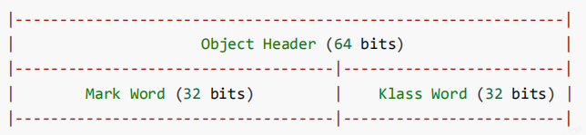

数组对象

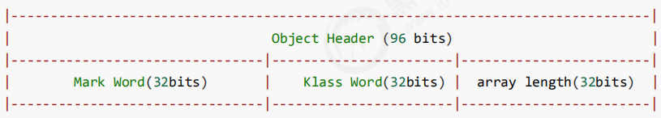

其中 Mark Word 结构为

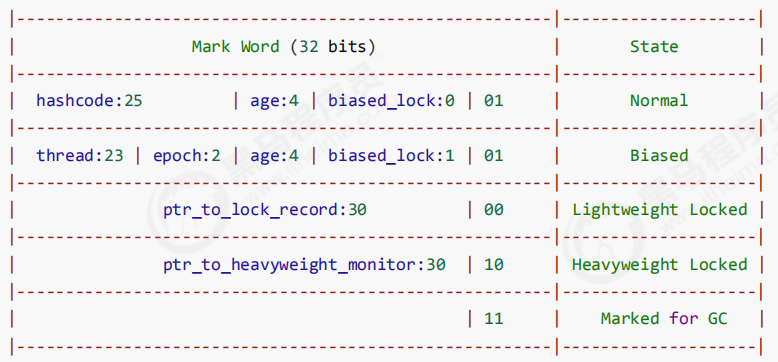

64 位虚拟机 Mark Word

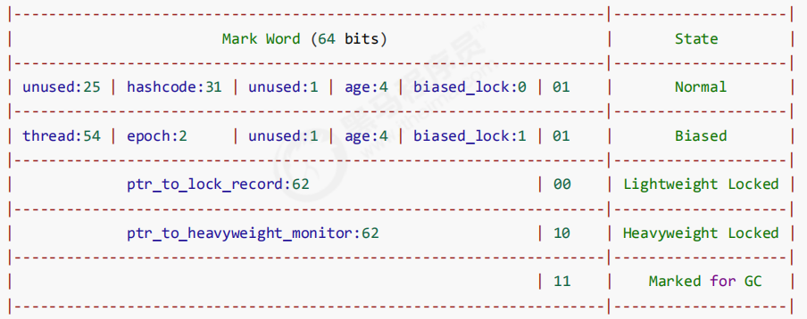

## 原理

Monitor 被翻译为**监视器（直译）**或**管程（操作系统）**

每个 `Java 对象`都可以关联一个 操作系统的`Monitor 对象`，如果使用 synchronized 给对象上锁（重量级）之后，该对象头的Mark Word 中就被设置指向 Monitor 对象的指针Monitor 结构如下

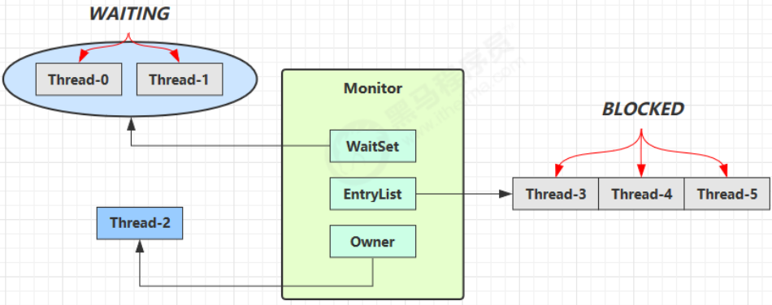

```java
synchronized(obj){
    
    // 临界代码区
    
}
```

```markdown
1. 刚开始 Monitor 中 Owner 为 null
2. 当 Thread-2 执行 synchronized(obj) 就会将 Monitor 的所有者 Owner 置为 Thread-2，Monitor中只能有一个 Owner
3. 在 Thread-2 上锁的过程中，如果 Thread-3，Thread-4，Thread-5 也来执行 synchronized(obj)，会先看看obj有没有和Monitor关联，Owner有没有主人，如果有就会进入EntryList BLOCKED
4. Thread-2 执行完同步代码块的内容，然后唤醒 EntryList 中等待的线程来竞争锁，竞争的时是非公平的
5. 图中 WaitSet 中的 Thread-0，Thread-1 是之前获得过锁，但条件不满足进入 WAITING 状态的线程

注意:
synchronized 必须是进入同一个对象的monitor才有上述的效果
不加synchronized的对象不会关联监视器，不遵从以上规则
```

## 字节码

```java
public class Main01 {
    static final Object lock = new Object();
    static int counter = 0;

    public static void main(String[] args) {
        synchronized (lock){
            counter++;
        }
    }
}
```

javap

```java
public static void main(java.lang.String[]);
	descriptor:([L后端/java/lang/String;)V
	flags:ACC_PUBLIC,ACC_STATIC
	Code:
		stack=2,locals=3,args_size=1
            0:getstatic #2 		// <- lock引用 （synchronized开始）
            3:dup				// 复制一份，存到slot 1中，为了后续释放锁
            4:astore_1 			// lock引用 -> slot 1
            5:monitorenter 		// 将 lock对象 MarkWord 置为 Monitor 指针，也就是将lock对象和monitor关联起来，这部分实现由C语言完成
            6:getstatic #3 		// <- i
            9:iconst_1 			// 准备常数 1
            10:iadd 			// +1
            11:putstatic #3 	// -> i
            14:aload_1 			// <- lock引用
            15:monitorexit 		// 将 lock对象 MarkWord 重置, 唤醒 EntryList
            16:goto 24
            19:astore_2 		// e -> slot 2
            20:aload_1 			// <- lock引用
            21:monitorexit 		// 将 lock对象 MarkWord 重置, 唤醒 EntryList
            22:aload_2 			// <- slot 2 (e)
            23:athrow 			// throw e
            24:return
        Exception table:
        	from  to   target type
             6    16 	19	  any
             19   22 	19	  any
        LineNumberTable:
            line 8:0
            line 9:6
            line 10:14
            line 11:24
        LocalVariableTable:
        	Start  Length  Slot  Name   Signature
        		0 	  25   0     args   [L后端/java/lang/String;
         StackMapTable: number_of_entries = 2
         	frame_type = 255 /* full_frame */
         		offset_delta = 19
         		locals = [ class "[L后端/java/lang/String;", class 后端/java/lang/Object ]
         		stack = [ class 后端/java/lang/Throwable ]
         	frame_type = 250 /* chop */
         		offset_delta = 4

```

## Synchronized进阶

```
无锁 - 偏向锁 - 轻量级锁 - 重量级锁
```

### 小故事

故事角色

```markdown
JVM
0x3074 - 线程
0x6099 - 线程
房间 - 对象
房间门上 - 防盗锁 - Monitor
房间门上 - 0x3074书包 - 轻量级锁
房间门上 - 刻上0x3074大名 - 偏向锁
批量重刻名 - 一个类的偏向锁撤销到达 20 阈值
不能刻名字 - 批量撤销该类对象的偏向锁，设置该类不可偏向
```

过程

```markdown
0x3074要使用房间保证计算不被其它人干扰（原子性），最初，他用的是防盗锁，当上下文切换时，锁住门。这样，即使他离开了，别人也进不了门，他的工作就是安全的。
但是，很多情况下没人跟他来竞争房间的使用权。0x6099是要用房间，但使用的时间上是错开的，0x3074白天用，0x6099晚上用。每次上锁太麻烦了，有没有更简单的办法呢？
0x3074和0x6099商量了一下，约定不锁门了，而是谁用房间，谁把自己的书包挂在门口，但他们的书包样式都一样，因此每次进门前得翻翻书包，看课本是谁的，如果是自己的，那么就可以进门，这样省的上锁解锁了。万一书包不是自己的，那么就在门外等，并通知对方下次用锁门的方式。后来，0x6099回老家了，很长一段时间都不会用这个房间。0x3074每次还是挂书包，翻书包，虽然比锁门省事了，但仍然觉得麻烦。
于是，0x3074干脆在门上刻上了自己的名字：【0x3074专属房间，其它人勿用】，下次来用房间时，只要名字还在，那么说明没人打扰，还是可以安全地使用房间。如果这期间有其它人要用这个房间，那么由使用者将0x3074刻的名字擦掉，升级为挂书包的方式。
同学们都放假回老家了，0x3074就膨胀了，在 20 个房间刻上了自己的名字，想进哪个进哪个。后来他自己放假回老家了，这时0x6099回来了（她也要用这些房间），结果就是得一个个地擦掉0x3074刻的名字，升级为挂书包的方式。JVM觉得这成本有点高，提出了一种批量重刻名的方法，他让0x6099不用挂书包了，可以直接在门上刻上自己的名字
后来，刻名的现象越来越频繁，JVM受不了了：算了，这些房间都不能刻名了，只能挂书包
```

### 底层实现

#### 轻量级锁00

轻量级锁的使用场景：如果一个对象虽然有多线程要加锁，但加锁的时间是错开的（也就是没有竞争），那么可以使用轻量级锁来优化。

轻量级锁对使用者是透明的，即语法仍然是` synchronized`假设有两个方法同步块，利用同一个对象加锁

```java
static final Object obj = new Object();
public static void method1() {
    synchronized( obj ) {
        // 同步块 A
        method2();
    }
}
public static void method2() {
    synchronized( obj ) {
        // 同步块 B
    }
}
```

#### 锁膨胀

如果在尝试加轻量级锁的过程中，CAS 操作无法成功，这时一种情况就是有其它线程为此对象加上了轻量级锁（有竞争），这时需要进行锁膨胀，将轻量级锁变为重量级锁。

```java
static Object obj = new Object();
public static void method1() {
	synchronized( obj ) {
 		// 同步块
	}
}
```


#### 自旋优化（重量级锁）

重量级锁竞争的时候，还可以使用自旋来进行优化，如果当前线程自旋成功（即这时候持锁线程已经退出了同步块，释放了锁），这时当前线程就可以避免阻塞。

自旋重试成功的情况

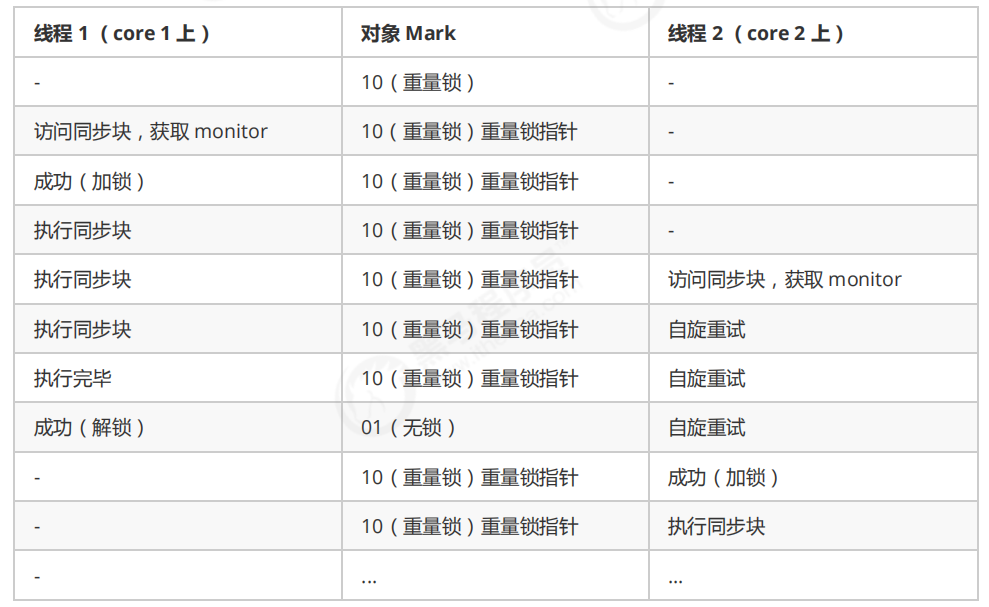

自旋重试失败的情况

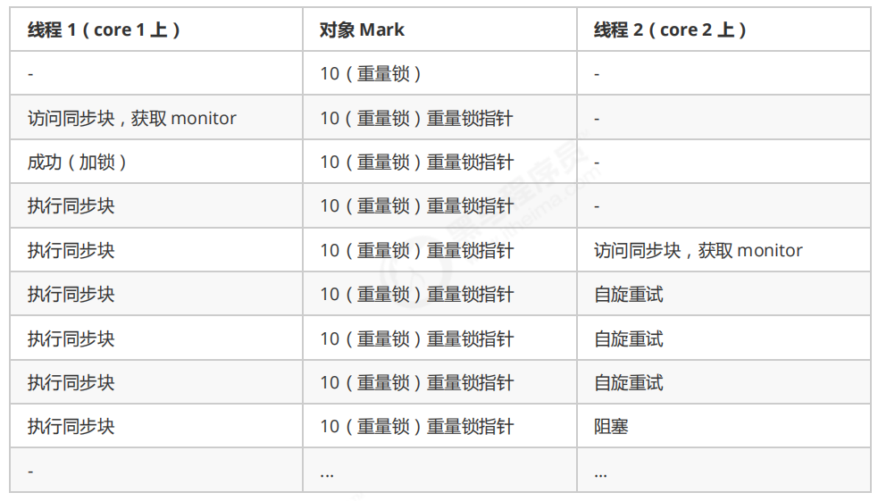

```java
1. 自旋会占用 CPU 时间，单核 CPU 自旋就是浪费，多核 CPU 自旋才能发挥优势。
2. 在 Java 6 之后自旋锁是自适应的，比如对象刚刚的一次自旋操作成功过，那么认为这次自旋成功的可能性会高，就多自旋几次；反之，就少自旋甚至不自旋，总之，比较智能。
3. Java 7 之后不能控制是否开启自旋功能
```

#### 偏向锁

轻量级锁在没有竞争时（就自己这个线程），每次重入仍然需要执行 CAS 操作。

Java 6 中引入了偏向锁来做进一步优化：只有第一次使用 CAS 将线程 ID 设置到对象的 Mark Word 头，之后发现这个线程 ID 是自己的就表示没有竞争，不用重新 CAS。以后只要不发生竞争，这个对象就归该线程所有。

例如：

```java
static final Object obj = new Object();
public static void m1() {
    synchronized (obj) {
        // 同步块 A
        m2();
    }
}
public static void m2() {
    synchronized (obj) {
        // 同步块 B
        m3();
    }
}
public static void m3() {
    synchronized (obj) {// 同步块 C
    }
}
```

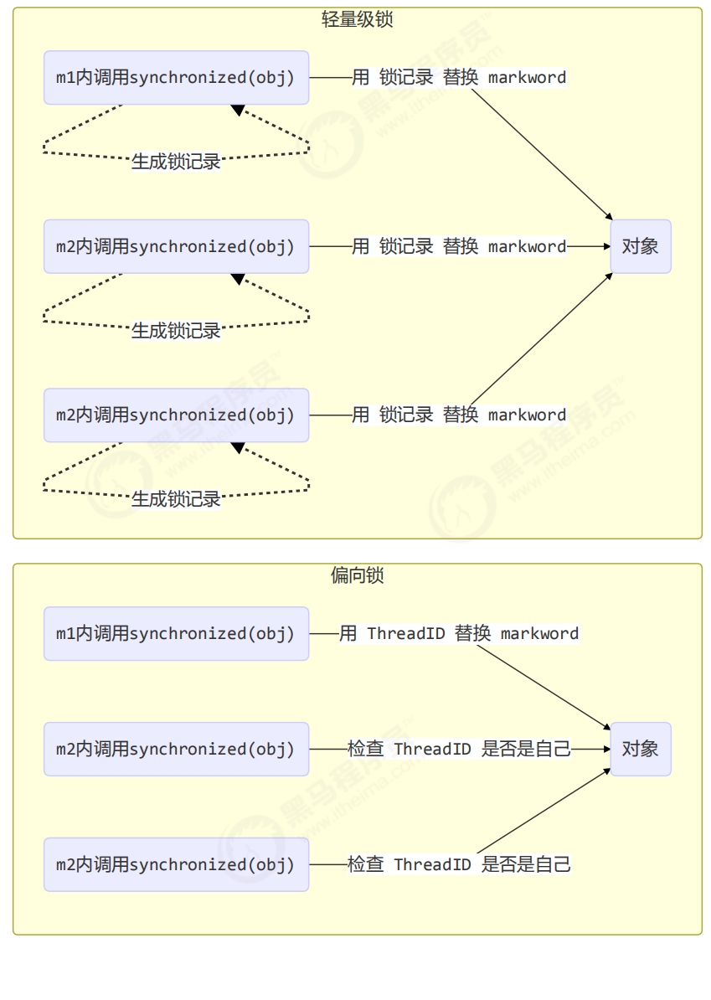


##### 偏向状态

回忆一下对象头格式

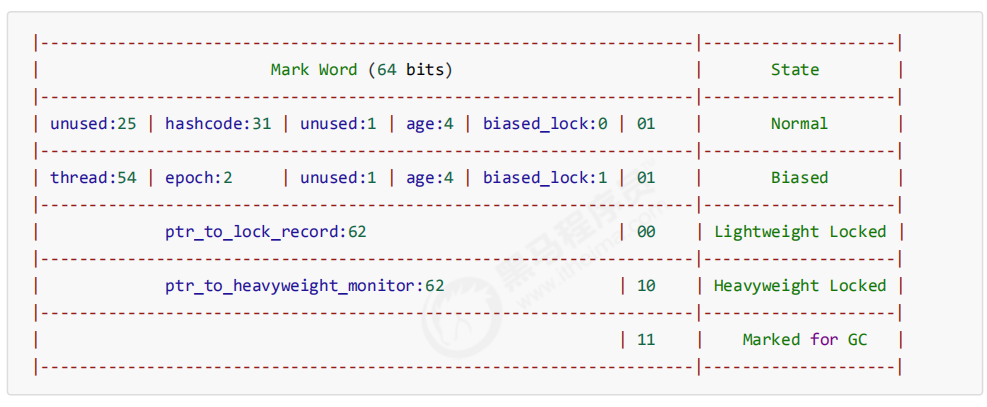

一个对象创建时：

```java
如果开启了偏向锁（默认开启），那么对象创建后，markword 值为 0x05 即最后 3 位为 101，这时它的thread、epoch、age 都为 0
偏向锁是默认是延迟的，不会在程序启动时立即生效，如果想避免延迟，可以加 VM 参数 -XX:BiasedLockingStartupDelay=0 来禁用延迟
如果没有开启偏向锁，那么对象创建后，markword 值为 0x01 即最后 3 位为 001，这时它的 hashcode、age 都为 0，第一次用到 hashcode 时才会赋值
```

1） 测试延迟特性

2） 测试偏向锁

```java
class Dog {}
```

利用 jol 第三方工具来查看对象头信息（注意这里我扩展了 jol 让它输出更为简洁）	64位虚拟机如下图：001表示无偏向锁，无锁

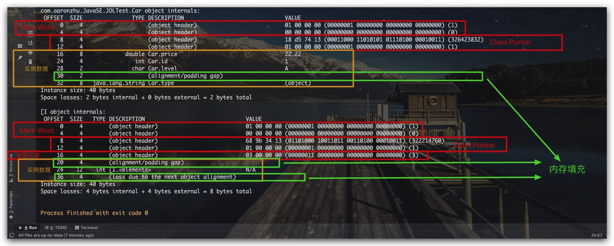

```xml
<dependency>
    <groupId>org.openjdk.jol</groupId>
    <artifactId>jol-core</artifactId>
    <version>0.9</version>
</dependency>
```

```java
// 添加虚拟机参数 -XX:BiasedLockingStartupDelay=0 
public static void main(String[] args) throws IOException {
    Dog d = new Dog();
    ClassLayout classLayout = ClassLayout.parseInstance(d);
    new Thread(() -> {
        log.debug("synchronized 前");
        System.out.println(classLayout.toPrintableSimple(true));
        synchronized (d) {
            log.debug("synchronized 中");
            System.out.println(classLayout.toPrintableSimple(true));
        }
        log.debug("synchronized 后");
        System.out.println(classLayout.toPrintableSimple(true));
    }, "t1").start();
}
```

输出

```
11:08:58.117 c.TestBiased [t1] - synchronized 前
00000000 00000000 00000000 00000000 00000000 00000000 00000000 00000101 
11:08:58.121 c.TestBiased [t1] - synchronized 中
00000000 00000000 00000000 00000000 00011111 11101011 11010000 00000101 
11:08:58.121 c.TestBiased [t1] - synchronized 后
00000000 00000000 00000000 00000000 00011111 11101011 11010000 00000101
```

```
注意
处于偏向锁的对象解锁后，线程 id 仍存储于对象头中
```

3）测试禁用

在上面测试代码运行时在添加 VM 参数 `-XX:-UseBiasedLocking` 禁用偏向锁

输出

```
11:13:10.018 c.TestBiased [t1] - synchronized 前
00000000 00000000 00000000 00000000 00000000 00000000 00000000 00000001 
11:13:10.021 c.TestBiased [t1] - synchronized 中
00000000 00000000 00000000 00000000 00100000 00010100 11110011 10001000 
11:13:10.021 c.TestBiased [t1] - synchronized 后
00000000 00000000 00000000 00000000 00000000 00000000 00000000 00000001
```

4) 测试 hashCode

正常状态对象一开始是没有 hashCode 的，第一次调用才生成。

当我们调用hashcode的时候，会被设置为正常状态，不会出现偏向锁，因为没有地方了，详见对象头格式图。

##### 撤销-调用 wait/notify

wait/notify是重量级锁的操作

#### 锁消除

```java
@Fork(1)
@BenchmarkMode(Mode.AverageTime)
@Warmup(iterations=3)
@Measurement(iterations=5)
@OutputTimeUnit(TimeUnit.NANOSECONDS)
public class MyBenchmark {
    static int x = 0;
    @Benchmark
    public void a() throws Exception {
        x++;
    }
    @Benchmark
    public void b() throws Exception {
        Object o = new Object();
        synchronized (o) {
            x++; }
    }
}
```

`java -jar benchmarks.jar`

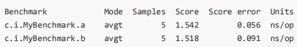

`java -XX:-EliminateLocks -jar benchmarks.jar`	取消锁消除

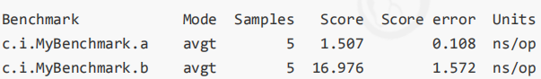

