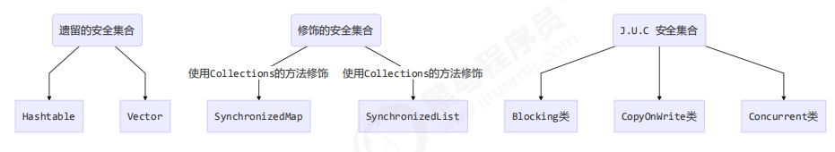

# 线程安全集合类



线程安全集合类可以分为三大类：

```ruby
遗留的线程安全集合如 Hashtable，Vector	为什么是遗留类呢，一来发布得早，并且put、get、add等方法都用的synchronized修饰的
使用 Collections 工具类装饰的线程安全集合，如：
    Collections.synchronizedCollection
    Collections.synchronizedList
    Collections.synchronizedMap
    Collections.synchronizedSet
    Collections.synchronizedNavigableMap
    Collections.synchronizedNavigableSet 
    Collections.synchronizedSortedMap
    Collections.synchronizedSortedSet
java.util.concurrent.*
```

重点介绍 java.util.concurrent.* 下的线程安全集合类，可以发现它们有规律，里面包含三类关键词：

```ruby
Blocking、CopyOnWrite、Concurrent
Blocking 大部分实现基于锁，并提供用来阻塞的方法
CopyOnWrite 之类容器修改开销相对较重
Concurrent 类型的容器
    内部很多操作使用 cas 优化，一般可以提供较高吞吐量
    弱一致性
        遍历时弱一致性，例如，当利用迭代器遍历时，如果容器发生修改，迭代器仍然可以继续进行遍
        历，这时内容是旧的
        求大小弱一致性，size 操作未必是 100% 准确
        读取弱一致性
```

>遍历时如果发生了修改，对于非安全容器来讲，使用 fail-fast 机制也就是让遍历立刻失败，抛出
>
>ConcurrentModifificationException，不再继续遍历