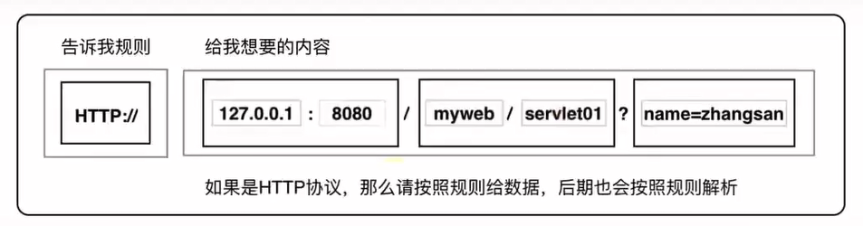

# HTTP协议

## 浏览器中的书写格式

服务器端资源需要通过浏览器进行，此时由浏览器将我们给出的请求解析为满足HTTP协议的格式并发出。我们发出的请求格式需要按照浏览器规定的格式来书写，在浏览器中书写格式如下:



当浏览器获取到信息以后，按照特定格式解析并发送即可。接收到服务器端给出的响应时，也按照HTTP协议进行解析获取到各个数据，最后按照特定格式展示给用户。

## HTTP协议的特点

1. 支持客户/服务器模式。

2. 简单快速：客户向服务器请求服务时，只需传送请求方法和路径。请求方法常用的有GET、POST。 每种方法规定了客户与服务器联系的类型不同。由于HTTP协议简单，使得HTTP服务器的程序规模小，因而通信速度很快。

3. 灵活：HTTP允许传输任意类型的数据对象。传输的类型由Content-Type加以标记。

4. 无连接：无连接是表示每次连接只处理一个请求。 服务器处理完客户的请求，并收到客户的应答后，即断开连接。采用这种方式可以节省传输时间。

   HTTP1.1版本后`支持可持续连接`。通过这种连接，就有可能在建立一个TCP连接后，发送请求并得到回应，然后发送更多的请求并得到更多的回应。通过把建立和释放TCP连接的开销分摊到多个请求上，则对于每个请求而言，由于TCP而造成的相对开销被大大地降低了。而且，还可以发送流水线请求也就是说在发送请求1之后的回应到来之前就可以发送请求2.也可以认为，一次连接发送多个请求，由客户机确认是否关闭连接，而服务器会认为这些请求分别来自不同的客户端。

5. 无状态：HTTP协议是无状态协议。无状态是指协议对于事务处理没有记忆能力。缺少状态意味着如果后续处理需要前面的信息，则它必须重传,这样可能导致每次连接传送的数据量增大。另一方面，在服务器不需要先前信息时它的应答就较快。

## HTTP之URL

HTTP （超文本传输协议）是一个基于请求与响应模式的、应用层的协议，常基于TCP的连接方式，绝大多数的Web开发，都是构建在HTTP协议之上的Web应用。
HTTP URL (URL是一种特殊类型的URI，包含了用于查找某个资源的足够的信息)的格式如下：

```
http://host[:port]/[abc_path]
```

```
http://IP(主机名/域名):端口/访问的资源路径
```

- http 表示要通过HTTP协议来定位网络资源
- host 表示合法的Internet主机域名或者 IP 地址
- port 指定一个端口号，为空则使用缺省端口80
- abs_path 指定请求资源的UR|；如果URL中没有给出abs_ path，那么当它作为请求URI时，必须以"/”的形式给出，通常这个工作浏览器自动帮我们完成。

## HTTP请求

HTTP请求由三部分组成，分别是：`请求行`、`请求头`、`请求正文（请求体）`。
通过chrome浏览器，F12 ——> Network查看。

### Get请求（没有请求体）


### Post请求


### 格式

```
请求行
请求头1
请求头2
...
请求空行
请求体
```

#### 请求行

请求行以一个方法符号开头，以空格分开，后面跟着请求的URI和协议的版本。
格式为： `Method Request-URI HTTP-Version CRLF`

```
Method表示请求方法
Request-URI是一个统一资源标识符;
HTTP-Version表示请求的HTTP协议版本
CRLF表示回车和换行
```


#### 请求头

```json
:authority: cm.bilibili.com
:method: POST
:path: /cm/api/fees/pc
:scheme: https
accept: application/json
accept-encoding: gzip, deflate, br
accept-language: zh-CN,zh;q=0.9,en;q=0.8,en-GB;q=0.7,en-US;q=0.6
content-length: 1775
content-type: application/json
cookie: _uuid=6D0A0A55-1813-337C-E519-A8023C3415DF40110infoc; buvid3=D66169F9-25B4-4AA4-8A87-8C799602D95353914infoc; blackside_state=1; rpdid=0zbfAGyP4I|IFgfdEY2|qoo|3w1JKJou; CURRENT_FNVAL=80; sid=bv7z0wes; DedeUserID=18675195; DedeUserID__ckMd5=ea9bd3422188ec9a; SESSDATA=8541b8a8%2C1622907265%2Ce48b6*c1; bili_jct=b6f0afd8f4127d3e1be9be20b86e7596; CURRENT_QUALITY=80; fingerprint3=5b16443b5a6c3adb3335bfa5e955dae7; fingerprint=9ea35407279845d21be64543a9ffc238; buivd_fp=D66169F9-25B4-4AA4-8A87-8C799602D95353914infoc; buvid_fp_plain=D66169F9-25B4-4AA4-8A87-8C799602D95353914infoc; fingerprint_s=66f9379d23d8c942e439b547bd93af84; PVID=1; bp_video_offset_18675195=520052709131022298
origin: https://www.bilibili.com
referer: https://www.bilibili.com/
sec-ch-ua: " Not A;Brand";v="99", "Chromium";v="90", "Microsoft Edge";v="90"
sec-ch-ua-mobile: ?0
sec-fetch-dest: empty
sec-fetch-mode: cors
sec-fetch-site: same-site
user-agent: Mozilla/5.0 (Windows NT 10.0; Win64; x64) AppleWebKit/537.36 (KHTML, like Gecko) Chrome/90.0.4430.85 Safari/537.36 Edg/90.0.818.49
```

## HTTP响应

在接收和解释请求消息后，服务器返回-个HTTP响应消息。HTTP 响应也是由三个部分组成，分别是：状态行、消息报头、响应正文。


### 格式

```
状态行
响应头1
响应头2
...
响应空行
响应体
```


## 消息头

HTTP消息由客户端到服务器的请求和服务器到客户端的响应组成。请求消息和响应消息都是由开始行(对于请求消息，开始行就是请求行，对于响应消息,开始行就是状态行)，消息报头(可选)，空行(只有CRLF的行)，消息正文(可选)组成。
每一个报头域都是由名字+":"+空格+值组成，消息报头域的名字是大小写无关的。

### 请求头

请求报头允许客户端向服务器端传递请求的附加信息以及客户端自身的信息。

- Referer：该请求头指明请求从哪里来。
  如果是地址栏中输入地址访问的都没有该请求头地址栏输入地址,通过请求可以看到，此时多了一个Referer的请求头，并且后面的值为该请求从哪里发出。比如：百度竞价，只能从百度来的才有效果，否则不算；通常用来做统计工作、防盗链。

### 响应头

响应报头允许服务器传递不能放在状态行中的附加响应信息，以及关于服务器的信息和对Request-URI所标识的资源进行下一步访问的信息。

- Location：
  - Location响应报头域用于重定向接受者到一一个新的位置。
  - Location响应报头域，常用在更换域名的时候。

```
response.sendRedirect("http://www.baidu.com");
```

- Refresh: 自动跳转(单位是秒)， 可以在页面通过meta标签实现，也可在后台实现。

```html
<meta http-equiv=" refresh" content="3 ;ur1=http: //www. baidu. com">
```


