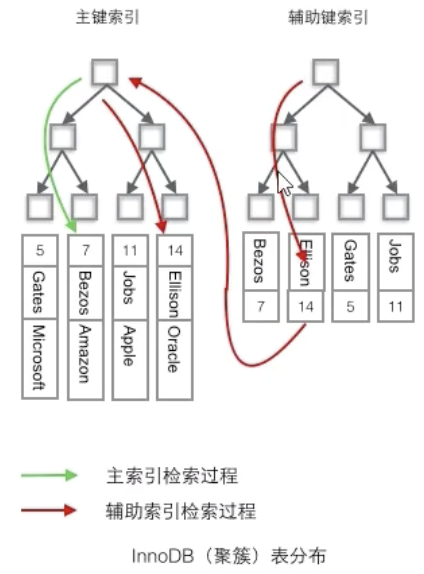

# 索引

## 数据结构

MySQL索引使用的数据结构主要有`BTree索引` 和 `哈希索引` 。

对于哈希索引来说，底层的数据结构就是哈希表，因此在绝大多数需求为单条记录查询的时候，可以选择哈希索引，查询性能最快；其余大部分场景，建议选择BTree索引。

```markdown
InnoDB: 
其数据文件本身就是索引文件。相比MyISAM，索引文件和数据文件是分离的，其表数据文件本身就是按B+Tree组织的一个索引结构，树的叶节点data域保存了完整的数据记录。这个索引的key是数据表的主键，因此InnoDB表数据文件本身就是主索引。这被称为“聚簇索引（或聚集索引）”。而其余的索引都作为辅助索引，辅助索引的data域存储相应记录主键的值而不是地址，这也是和MyISAM不同的地方。
在根据主索引搜索时，直接找到key所在的节点即可取出数据；在根据辅助索引查找时，则需要先取出主键的值，再走一遍主索引。 因此，在设计表的时候，不建议使用过长的字段作为主键，也不建议使用非单调的字段作为主键，这样会造成主索引频繁分裂。
```


## 聚簇索引和非聚餐索引

```markdown
# 聚簇索引：将数据存储和索引放在了一起，索引结构的叶子结点存放了 行 数据。
# 非聚簇索引/辅助索引：将数据与索引分开存储，索引结构的叶子节点指向了数据对应的位置	

```

> `注意`：在innodb中,在聚簇索引之上创建的索引称之为辅助索引,非聚簇索引都是辅助索引,像复合索引、前缀索引、唯一索引。辅助索引叶子结点存储的不再是行的物理位置，而是主键值，辅助索引访问数据总是需要`二次查找`。

非聚簇索引会先找到叶子结点的id，然后二次查找，根据id找到主键索引。


