# Kong

教程

https://blog.csdn.net/cry1049208942/article/details/105971198

https://www.jianshu.com/p/54d49faecce3

https://www.jianshu.com/p/9ff063b1f4c6

## 运行 kong

### 创建子网

```bash
docker network create kong-net
```

### 运行数据库

#### 创建postgersql数据库

```bash
docker run -d --name kong-database \
               --network=kong-net \
               -p 5432:5432 \
               -e "POSTGRES_USER=kong" \
               -e "POSTGRES_DB=kong" \
               -e "POSTGRES_PASSWORD=kong" \
               postgres:9.6
```

#### 数据库迁移

```bash
docker run --rm \
     --network=kong-net \
     -e "KONG_DATABASE=postgres" \
     -e "KONG_PG_HOST=kong-database" \
     -e "KONG_PG_PASSWORD=kong" \
     -e "KONG_CASSANDRA_CONTACT_POINTS=kong-database" \
     kong:1.5 kong migrations bootstrap
```

### 运行 kong

```bash
docker run -d --name kong \
     --network=kong-net \
     -e "KONG_DATABASE=postgres" \
     -e "KONG_PG_HOST=kong-database" \
     -e "KONG_PG_PASSWORD=kong" \
     -e "KONG_CASSANDRA_CONTACT_POINTS=kong-database" \
     -e "KONG_PROXY_ACCESS_LOG=/dev/stdout" \
     -e "KONG_ADMIN_ACCESS_LOG=/dev/stdout" \
     -e "KONG_PROXY_ERROR_LOG=/dev/stderr" \
     -e "KONG_ADMIN_ERROR_LOG=/dev/stderr" \
     -e "KONG_ADMIN_LISTEN=0.0.0.0:8001, 0.0.0.0:8444 ssl" \
     -p 8000:8000 \
     -p 8443:8443 \
     -p 8001:8001 \
     -p 8444:8444 \
     kong:1.5
```

### 运行 kong gui

#### 运行 kong-dashboard~

> 建议直接跳过，dashboard 可以运行，但是前端尽是报错，github上面的issue也没人处理，应该是不维护了。

```bash
docker run  --network=kong-net \
            --name kong-dashboard \
            -p 8080:8080 \
            -d pgbi/kong-dashboard \
            start --kong-url http://kong:8001 \
            --basic-auth user1=password1 
```

#### 运行 konga（kong可视化管理工具）

```bash
docker pull pantsel/konga

docker run -d \
-p 1337:1337 \
--network kong-net \
-e "TOKEN_SECRET=kongtoken" \
-e "DB_ADAPTER=postgres" \
-e "DB_HOST=kong-database" \
-e "DB_USER=kong"  \
-e "DB_PASSWORD=kong" \
 --name konga \
pantsel/konga
```

访问：http://192.168.28.118:1337/

> 汉化：https://hub.docker.com/r/jsonljd/konga-lang-plugin
>
> ```
> mkdir dockertmp                                   #创建一个临时目录
> cd dockertmp
> docker ps -a                                      #查找konga的容器id
> docker stop {konga容器id}                         #停止正在运行的容器
> docker cp {konga容器id}:/app/assets ./            #将容器的文件复制到本地 
> 
> docker pull jsonljd/konga-lang-plugin      #拉取语言插件镜像
> docker run -d --name konga-lang-plugin \
>  -v ./assets:/app/assets \
>  jsonljd/konga-lang-plugin                   #运行镜像，需要设置逻辑目录
> 
> docker cp ./assets {konga容器id}:/app      #覆盖成功后即可
> docker start {konga容器id}                 #重启容器
> ```

#### 完成

配置 Kong's admin API的连接，然后激活此链接

```
192.168.28.118:8001
```

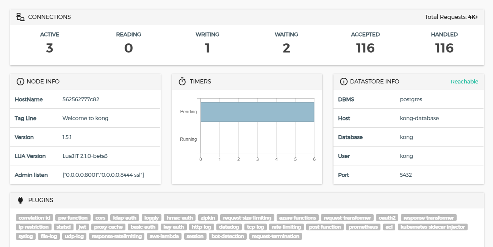


## 总结

```
docker start postgersql
docker start kong
docker start konga
```


## 服务使用

> 可以直接使用konga

博客：https://www.cnblogs.com/bhfdz/p/14303309.html

视频：[Rainbond 与 Kong API-Gateway 实践](https://www.bilibili.com/video/BV1zz411q7m7?from=search&seid=9381355276042576626)

### 1.添加服务

```shell
curl -i -X POST http://192.168.28.118:8001/services --data name=example_service --data url='http://mockbin.org'
```

举例

```bash
curl -i -X POST http://192.168.28.118:8001/services/superset/routes \
--data 'paths[]=/superset' \
 --data 'name=superset'
```


[http://mockbin.org](http://mockbin.org/) ，点进入你就知道是干啥的了！以下验证此服务

```shell
curl -i http://192.168.28.118:8001/services/example_service
```

### 2.添加路由

```shell
curl -i -X POST http://192.168.28.118:8001/services/example_service/routes \
--data 'paths[]=/mock' \
 --data 'name=mocking'
```


以下验证此服务

```shell
curl -i -X GET http://192.168.28.118:8000/mock
```

### 3.添加限流

```shell
curl -i -X POST http://192.168.28.118:8001/plugins \
--data "name=rate-limiting" \
--data "config.minute=5" \
--data "config.policy=local"
```

以下验证此服务，每分钟只能请求5次

```shell
curl -i -X GET http://192.168.28.118:8000/mock/request
```

超过5次，

```json
{
  "message":"API rate limit exceeded"
}
```

如下图


### 4.代理缓存

```shell
curl -i -X POST http://192.168.28.118:8001/plugins \
--data name=proxy-cache \
--data config.content_type="application/json" \
--data config.cache_ttl=30 \
--data config.strategy=memory
```

注意抓取请求头的变化（与教程有点出入，不太好使！）

```shell
curl -i -X GET http://192.168.28.118:8000/mock/request
```

删除缓存

```shell
curl -i -X DELETE http://192.168.28.118:8001/proxy-cache
```

### 5.身份验证

```shell
curl -X POST http://192.168.28.118:8001/routes/mocking/plugins \
--data name=key-auth
```

再次访问服务，HTTP/1.1 401 Unauthorized


设置使用者

```shell
curl -i -X POST -d "username=consumer&custom_id=consumer" http://192.168.28.118:8001/consumers/
```

创建凭据，对于此示例，将密钥设置为apikey。如果未输入任何密钥，则Kong将自动生成密钥。

```shell
curl -i -X POST http://192.168.28.118:8001/consumers/consumer/key-auth -d 'key=apikey'
```

返回结果如下：

```json
{
	"created_at": 1611110699,
	"id": "6695bd72-16e6-490d-b983-c141c39b5da8",
	"tags": null,
	"ttl": null,
	"key": "apikey",
	"consumer": {
		"id": "cbdec9e6-70aa-4166-9289-e1fe5737ab6e"
	}
}
```

再次访问服务，返回正常

```shell
curl -i http://192.168.28.118:8000/mock/request -H 'apikey:apikey'
```

### 6.禁用插件（可选）

```shell
curl -X GET http://192.168.28.118:8001/routes/mocking/plugins/
```

以下是返回的数据

```json
{
	"next": null,
	"data": [{
		"created_at": 1611109944,
		"id": "e488b6e6-6183-499c-b430-0aa676245ee5",
		"tags": null,
		"enabled": true,
		"protocols": ["grpc", "grpcs", "http", "https"],
		"name": "key-auth",
		"consumer": null,
		"service": null,
		"route": {
			"id": "ed6baf5a-5d32-4550-91d8-661fc3539e44"
		},
		"config": {
			"key_in_query": true,
			"key_names": ["apikey"],
			"key_in_header": true,
			"run_on_preflight": true,
			"anonymous": null,
			"hide_credentials": false,
			"key_in_body": false
		}
	}]
}
```

禁用此插件

```shell
curl -X PATCH http://192.168.28.118:8001/routes/mocking/plugins/e488b6e6-6183-499c-b430-0aa676245ee5 \
 --data "enabled=false"
```

### 7.负载均衡

配置上游服务

```shell
curl -X POST http://192.168.28.118:8001/upstreams \
 --data name=upstream
```

以前配置的服务指向上游

```shell
curl -X PATCH http://192.168.28.118:8001/services/example_service \
--data host='upstream'
```

向上游添加目标，***此处玩脱了容器卡住多次也不能添加成功***

```shell
curl -X POST http://192.168.28.118:8001/upstreams/upstream/targets \
--data target='mockbin.org:80'

curl -X POST http://192.168.28.118:8001/upstreams/upstream/targets \
--data target='httpbin.org:80'
```

浏览器中访问 http://192.168.28.118:8000/mock 进行验证


## Kong和Prometheus结合:star:

参考：http://blog.sunqiang.me/2019/12/24/kong-%E4%BD%BF%E7%94%A8prometheusgrafana%E8%BF%9B%E8%A1%8C%E7%9B%91%E6%8E%A7/

在Konga安装Promethus模板

http://luarocks.org/modules/kong/kong-prometheus-plugin

#### 添加 Kong 数据信息

在Promethus上添加配置

```
- targets: ['192.168.28.118:9090','192.168.28.118:8001']
```

#### 在konga中添加Prometheus插件

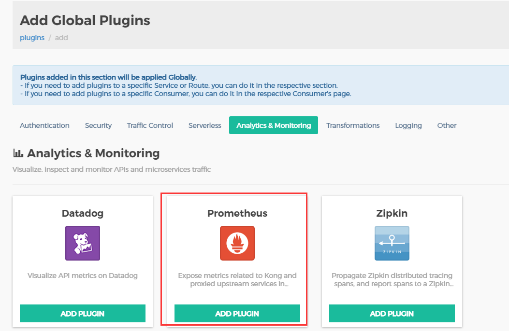

#### 打开kong的metrics支持

http://192.168.28.118:8001/metrics


#### 在 Grafana 管理界面添加数据源

“Configuration” => “Add data source” => “Prometheus” => “select”

输入普罗米修斯的地址

http://192.168.28.118:9090

#### 添加官方 Dashboard

1、登录 Grafana 后，点击左边的 “+” => “Create” => “Import”。
2、输入 `7424` ，7424 是 Kong 官方提供的与 Prometheus 插件配套的 Dashboard。
3、完成，调用 Kong 网关接口即可查看数据。


## 使用FastAPI服务

启动fastapi服务

> 我这边设置的fastapi是跑在8848端口的

在kong所在服务器上运行，下面的操作也可以在Konga上完成

```
curl -i -X POST http://192.168.28.118:8001/services/FastAPI/routes \
--data 'paths[]=/fastapi' \
 --data 'name=fastapi'
```

>此处的ip还是kong所在的ip
>
>services/{服务名称}/routes

访问

```
curl -i -X GET http://192.168.28.118:8000/fastapi
```

> 这里可以得到和直接访问8848一样的结果，只不过我们走了一遍网关，网关路由到了8848那边的服务。

现在可以使用Grafana来查看kong网关的情况，因为Prometheus那边会抓取kong的指数


# 总结版:star:

首先在konga上面services添加service，指定服务所在ip，端口。

然后使用路由

> `注意`：一个服务可以有多个路由，但是一个路由只能对应一个服务。
>
> 在下方Paths部分，我们可以添加多个路由list
>
> 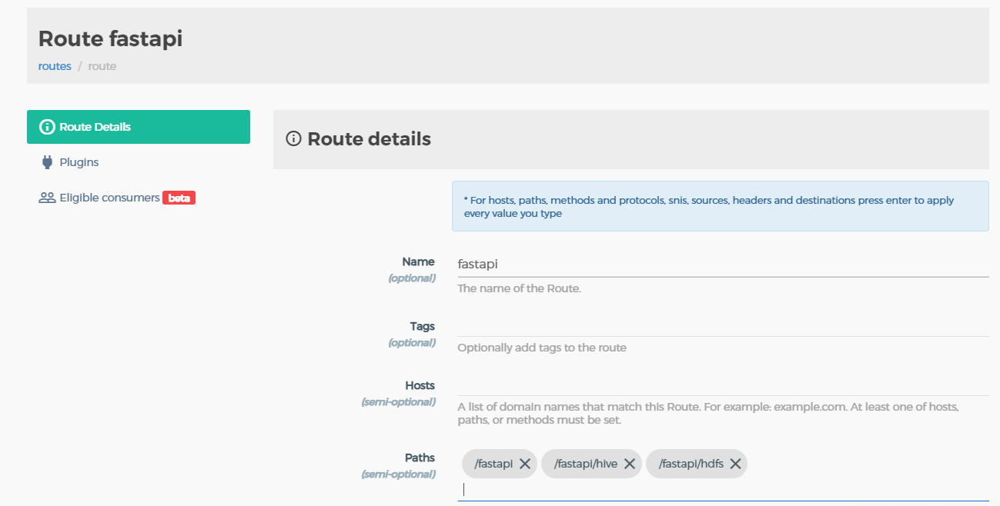

### superset

```
curl -i -X POST http://192.168.28.118:8001/services/superset/routes \
--data 'paths[]=/superset' \
 --data 'name=superset'
```

>此处的ip还是kong所在的ip
>
>services/{服务名称}/routes

http://192.168.28.118:8000/superset


### griffin

> path需要加上/health

```
curl -i -X POST http://192.168.28.118:8001/services/griffin/routes \
--data 'paths[]=/griffin' \
--data 'name=griffin'
```

http://192.168.28.118:8000/griffin

> 这里遇到问题，因为griffin是前后端分离的，而kong默认不支持前端。Nginx可以。
>
> kong必须要使用插件才能完成配置

### grafana

```
curl -i -X POST http://localhost:8001/services/grafana/routes \
--data 'paths[]=/grafana' \
 --data 'name=grafana'
```

http://192.168.28.118:8000/grafana

出问题：

>**If you're seeing this Grafana has failed to load its application files**
>
>\1. This could be caused by your reverse proxy settings.
>
>\2. If you host grafana under subpath make sure your grafana.ini root_url setting includes subpath. If not using a reverse proxy make sure to set serve_from_sub_path to true.
>
>\3. If you have a local dev build make sure you build frontend using: yarn start, yarn start:hot, or yarn build
>
>\4. Sometimes restarting grafana-server can help
>
>\5. Check if you are using a non-supported browser. For more information, refer to the list of [supported browsers](https://grafana.com/docs/grafana/latest/installation/requirements/#supported-web-browsers).

需要设置代理

# Kong压力测试

参考：https://github.com/40288668/gateway-pressure

[Wrk和Jmeter的差异](https://blog.csdn.net/chiboxi6938/article/details/88635614)


使用Jemeter做压测

下载：http://jmeter.apache.org/download_jmeter.cgi

点击`bin/jmeter.bat`

不成功就用管理员身份打开

`新建一个线程组`

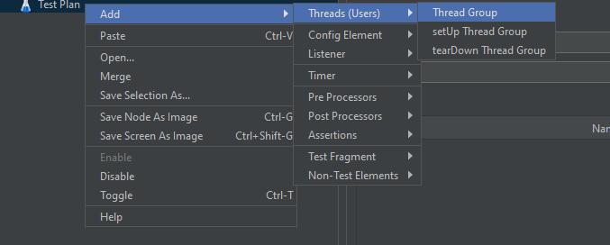

`设置线程组参数`。这里配置为：10个线程，同时启动，循环一次。

> 一个线程就相当于一个用户

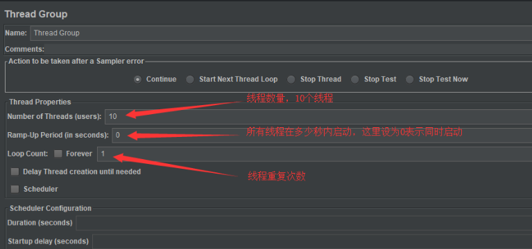

` 新增http请求默认值`。 在上一步创建的线程组上，新增http请求默认值，所有的请求都会使用设置的默认值，这设置协议为`http`，IP为`192.168.28.118`，端口为`8000`。

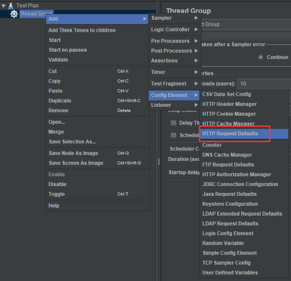

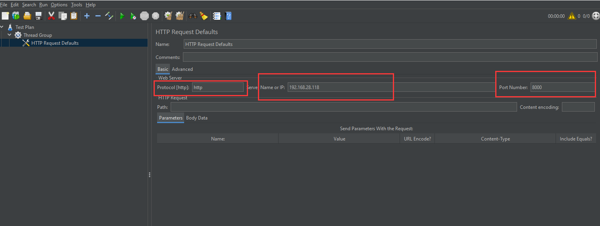

`添加要压测的http请求。`

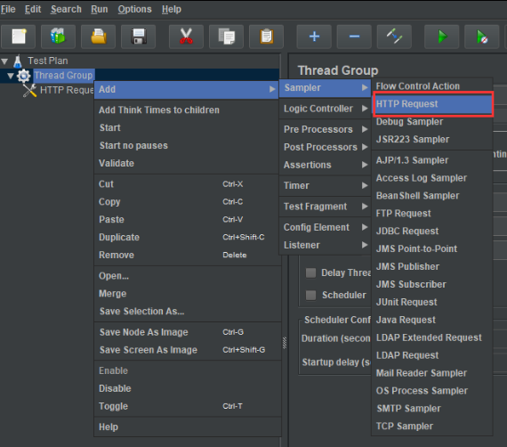

下图第一个红框内的协议、IP、端口不需要设置，会使用步骤c中设置的默认值，只需设置请求路径`Path`即可，这里填入`/fastapi`。

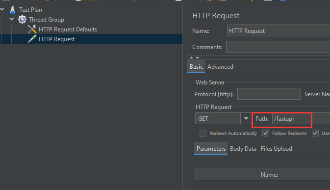

`新增监听器，用于查看压测结果`。这里添加三种：聚合报告、图形结果、用表格查看结果，区别在于结果展现形式不同。

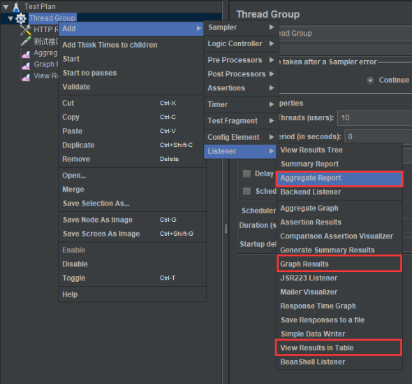

`点击运行按钮开始压测，并查看结果。`

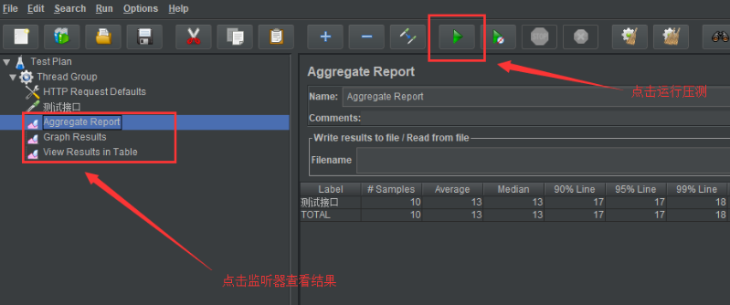


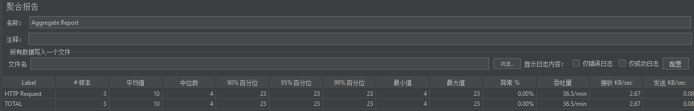

```
Label：每个 JMeter 的 element（例如 HTTP Request）都有一个 Name 属性，这里显示的就是 Name 属性的值

Samples：表示你这次测试中一共发出了多少个请求，如果模拟10个用户，每个用户迭代10次，那么这里显示100

Average：平均响应时间——默认情况下是单个 Request 的平均响应时间，当使用了 Transaction Controller 时，也可以以Transaction 为单位显示平均响应时间

Median：中位数，也就是 50％ 用户的响应时间

90% Line：90％ 用户的响应时间

Note：关于 50％ 和 90％ 并发用户数的含义，请参考下文

http://www.cnblogs.com/jackei/archive/2006/11/11/557972.html

Min：最小响应时间

Max：最大响应时间

Error%：本次测试中出现错误的请求的数量/请求的总数

Throughput：吞吐量——默认情况下表示每秒完成的请求数（Request per Second），当使用了 Transaction Controller 时，也可以表示类似 LoadRunner 的 Transaction per Second 数

KB/Sec：每秒从服务器端接收到的数据量，相当于LoadRunner中的Throughput/Sec
```


