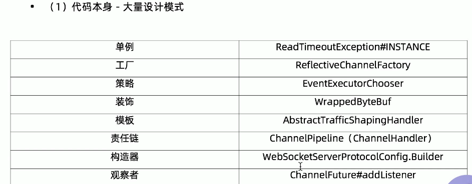

参考博客：[彻底理解Netty，这一篇文章就够了](https://blog.csdn.net/Y0Q2T57s/article/details/89324370?ops_request_misc=%257B%2522request%255Fid%2522%253A%2522161452015616780271545953%2522%252C%2522scm%2522%253A%252220140713.130102334..%2522%257D&request_id=161452015616780271545953&biz_id=0&utm_medium=distribute.pc_search_result.none-task-blog-2~all~top_click~default-1-89324370.first_rank_v2_pc_rank_v29&utm_term=netty&spm=1018.2226.3001.4187)

NIO并非Java独有，代表多路复用epoll（早期是select，linux中为epoll，mac中为kquue）

Netty是Java NIO基础上的封装

粘包/拆包

编码/解码