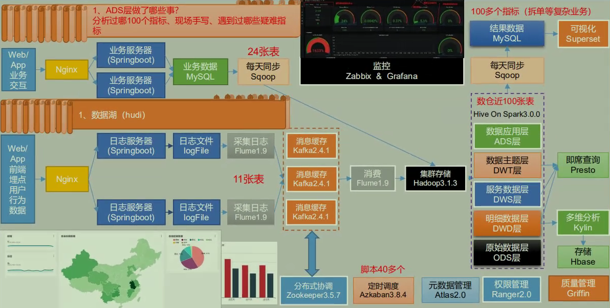

# 项目框架


## 技术选型

技术选型主要考虑因素：数据量大小、业务需求、行业内经验、技术成熟度、开发维护成本、总成本预算

### 数据采集传输

```markdown
- Flume：用户行为数据
- Kafka：吞吐量大、削峰
- Sqoop：业务数据
- DataX：业务数据-阿里
- Logstash：非大数据框架、ELK
```

### 数据存储

```markdown
- MySQL
- HDFS：海量数据
- HBase：与Kylin配合
- Redis：实时项目缓存
- MongoDB：爬虫
```

### 数据计算

```markdown
- Hive：
- Tez：
- Spark：
- Flink：实时计算
- Storm：实时计算，已淘汰
```

### 数据查询

```markdown
- Presto
- Kylin
- Druid
- Impala
```

### 数据可视化

```markdown
- Superset：可以直接连接MysSQL
- Echart
- DataV：阿里
```


## 项目流程设计



## 框架发行版本选型

推荐Apache

CDH开始收费

HDP开源但是不稳定


## 具体版本选型

| 框架      | 版本        |
| --------- | ----------- |
| Hadoop    | 3.1.1       |
| Zookeeper | 3.5.7       |
| MySQL     | 5.7.16      |
| Hive      | 3.1.2       |
| Flume     | 1.9.0       |
| Kafka     | 2.11-2.4.1  |
| Sqoop     | 1.4.6       |
| DataX     |             |
| Azkaban   | 3.84.4      |
| Spark     | 3.0.0       |
| Flink     | 1.12.3      |
| Hbase     | 2.0.5       |
| Kylin     | 3.0.1-3.1.2 |
| Atlas     | 2.0.0       |
| Solr      | 7.7.0       |


## 服务器选型

### 物理机

### 云主机


## 集群资源规划设计

### 测试集群服务器规划

 

整体原则

1. 资源均衡
2. 有依赖的服务需要在同一个节点，例如Azkanba的Executor调度hive或者sqoop，需要在一个节点

| 服务名称           | 子服务                | 服务器  | 服务器  | 服务器  |
| ------------------ | --------------------- | ------- | ------- | ------- |
|                    |                       | glong01 | glong02 | glong03 |
| HDFS               | NameNode              | √       |         |         |
|                    | DataNode              | √       | √       | √       |
|                    | SecondaryNameNode     |         |         | √       |
| Yarn               | NodeManager           | √       | √       | √       |
|                    | Resourcemanager       |         | √       |         |
| Zookeeper          | Zookeeper Server      | √       | √       | √       |
| Flume（采集日志）  | Flume                 | √       | √       |         |
| Kafka              | Kafka                 | √       | √       | √       |
| Flume（消费Kafka） | Flume                 |         |         | √       |
| Hive               | Hive                  | √       |         |         |
| MySQL              | MySQL                 | √       |         |         |
| Sqoop              | Sqoop                 | √       |         |         |
| Presto             | Coordinator           | √       |         |         |
|                    | Worker                |         | √       | √       |
| Azkaban            | AzkabanWebServer      | √       |         |         |
|                    | AzkabanExecutorServer | √       |         |         |
| Kylin              |                       | √       |         |         |
| Hbase              | HMaster               | √       |         |         |
|                    | HRegionServer         | √       | √       | √       |
| Superset           |                       | √       |         |         |
| Atlas              |                       | √       |         |         |
| Solr               | Jar                   | √       |         |         |
| 服务数总计         |                       | 18      | 8       | 8       |

