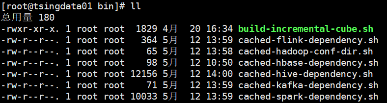
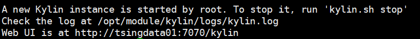

# Kylin部署

## 版本选型

```
3.0.2
```

## 安装

### 安装地址

官网地址：http://kylin.apache.org/cn/
官方文档：http://kylin.apache.org/cn/docs/
下载地址：http://kylin.apache.org/cn/download/

### 安装部署

1）下载并上传到/opt/software

2）解压

```
tar -zxvf apache-kylin-3.0.2-bin.tar.gz -C /opt/module/

cd /opt/module
mv apache-kylin-3.0.2-bin kylin
```

3）配置环境

```
vim /etc/profile
```

```
#hadoop
export HADOOP_HOME=/opt/module/hadoop-3.1.3
export PATH=$PATH:$HADOOP_HOME/bin

#hive
export HIVE_HOME=/opt/module/hive
export HIVE_CONF=/opt/module/hive/conf
export PATH=$PATH:$HIVE_HOME/bin

#hbase
export HBASE_HOME=/opt/module/hbase-2.0.5
export PATH=$PATH:$HBASE_HOME/bin

#kylin
export KYLIN_HOME=/opt/module/kylin
export PATH=$PATH:$KYLIN_HOME/bin
```

```
source /etc/profile
```


4）兼容性问题

由于/opt/module/spark/jars中的hive依赖版本与我们使用的hive冲突

```
[root@tsingdata01 jars]# ls -al | grep hive
-rw-r--r--.  1 tsing-data tsing-data   138464 9月   8 2020 hive-beeline-1.2.1.spark2.jar
-rw-r--r--.  1 tsing-data tsing-data    40817 9月   8 2020 hive-cli-1.2.1.spark2.jar
-rw-r--r--.  1 tsing-data tsing-data 11498852 9月   8 2020 hive-exec-1.2.1.spark2.jar
-rw-r--r--.  1 tsing-data tsing-data   100680 9月   8 2020 hive-jdbc-1.2.1.spark2.jar
-rw-r--r--.  1 tsing-data tsing-data  5505200 9月   8 2020 hive-metastore-1.2.1.spark2.jar
-rw-r--r--.  1 tsing-data tsing-data  1565700 9月   8 2020 orc-core-1.5.5-nohive.jar
-rw-r--r--.  1 tsing-data tsing-data   812313 9月   8 2020 orc-mapreduce-1.5.5-nohive.jar
-rw-r--r--.  1 tsing-data tsing-data  1358996 9月   8 2020 spark-hive_2.11-2.4.7.jar
-rw-r--r--.  1 tsing-data tsing-data  1815976 9月   8 2020 spark-hive-thriftserver_2.11-2.4.7.jar
```

需要通过修改脚本排除依赖冲突

```
cd /opt/module/kylin/bin
```

```
vim find-hive-dependency.sh
```

```sh
hive_lib=`find -L ${hive_lib_dir} -name '*.jar' ! -name '*druid*' ! -name '*jackson*' ! -name '*metastore*' !-name '*slf4j*' ! -name '*avatica*' ! -name '*calcite*' ! -name '*jackson-datatype-joda*' ! -name '*derby*' -printf '%p:' | sed 's/:$//'`
```

```
vim find-spark-dependency.sh
```

```sh
spark_dependency=`find -L $spark_home/jars -name '*.jar' ! -name '*jackson*' ! -name '*metastore*' ! -name '*slf4j*' ! -name '*calcite*' ! -name '*doc*' ! -name '*test*' ! -name '*sources*' ''-printf '%p:' | sed 's/:$//'`
```

如果是第二次启动，先删除缓存



5）启动

启动Kylin之前，需先启动Hadoop（hdfs, yarn, jobhistoryserver） 、Zookeeper、 Hbase

```
# 启动hadoop
hdp start

# 启动zk
zk.sh start

# 启动hbase
start-hbase.sh

# hive
nohup hive --service metastore &
hive

# 启动
kylin.sh start
```



说明启动成功了

访问：http://192.168.157.128:7070/kylin/

```
用户名	ADMIN
密码	KYLIN
```

> 注意：访问一定要将kylin加上

启动之后查看各个节点进程：

```
xcall jps 
```

```
--------------------- tsingdata01 ----------------
3360 JobHistoryServer(MR的历史服务，必须启动)
31425 HMaster
3282 NodeManager
3026 DataNode
53283 Jps
2886 NameNode
44007 RunJar
2728 QuorumPeerMain
31566 HRegionServer
--------------------- tsingdata02 ----------------
5040 HMaster
2864 ResourceManager
9729 Jps
2657 QuorumPeerMain
4946 HRegionServer
2979 NodeManager
2727 DataNode
--------------------- tsingdata03 ----------------
4688 HRegionServer
2900 NodeManager
9848 Jps
2636 QuorumPeerMain
2700 DataNode
2815 SecondaryNameNode
```

6）关闭

```
bin/kylin.sh stop
```

### 报错解决

[关于启动kylin报Failed to find metadata store by url: kylin_metadata@hbase的问题解决](https://www.cnblogs.com/harrymore/p/10882090.html)

