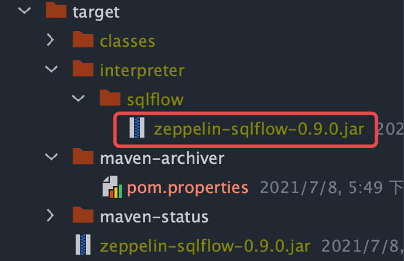

# Zeepelin集成SQLFlow

关于SQLFlow：https://www.yuque.com/kuangxiqiruogu/ff3ato/lfsvbg

zeppelin-sqlflow GitHub地址：https://github.com/sql-machine-learning/zeppelin-sqlflow

```
git clone https://github.com/sql-machine-learning/zeppelin-sqlflow
```

打包

```
mvn package
```



interpreter-setting.json

```json
[
  {
    "group": "sqlflow",
    "name": "sqlflow",
    "className": "org.apache.zeppelin.sqlflow.SQLFlowInterpreter",
    "properties": {
      "sqlflow.serverAddr": {
        "propertyName": "sqlflow.serverAddr",
        "defaultValue": "http://192.168.28.116:50051",
        "description": "SQLFlow 服务地址",
        "type": "string"
      },
      "mysql.username": {
        "propertyName": "mysql.username",
        "defaultValue": "root",
        "description": "MySQL用户名",
        "type": "string"
      },
      "mysql.password": {
        "propertyName": "mysql.password",
        "defaultValue": "root",
        "description": "MySQL密码",
        "type": "string"
      },
      "mysql.serverAddr": {
        "propertyName": "mysql.serverAddr",
        "defaultValue": "http://192.168.28.116:3306",
        "description": "MySQL服务地址",
        "type": "string"
      },
      "mysql.databaseName": {
        "propertyName": "mysql.databaseName",
        "defaultValue": "hue",
        "description": "MySQL数据库名",
        "type": "string"
      }
    },
    "editor": {
      "editOnDblClick": false,
      "completionSupport": false
    }
  }
]
```

```
cd ~/zeppelin-0.9.0-SNAPSHOT/bin/
./zeppelin-daemon.sh start
```

集成

https://github.com/sql-machine-learning/zeppelin-sqlflow/blob/develop/doc/OperationGuide.md

