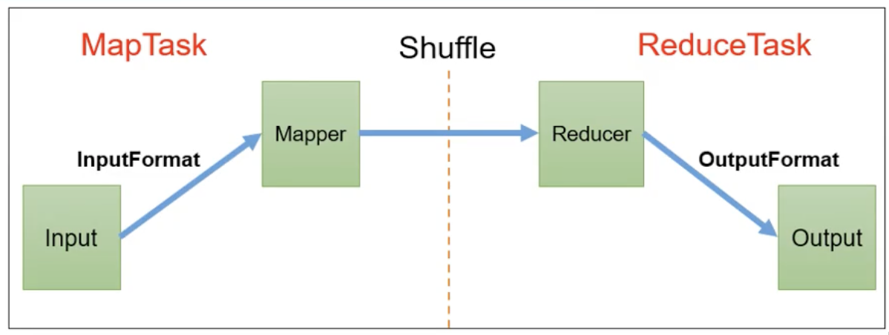

# MapReduce框架原理



## InputFormat 数据输入

### 数据切片与MapTask并行度决定机制

```
切片是逻辑存储
块是物理存储
```


```
1) 一个Job的Map阶段并行度由客户端在提交Job时的切片数决定
2) 每一个Split切片分配一个MapTask并行实例处理
3) 默认情况下，切片大小=BlockSize
4) 切片时不考虑数据集整体，而是逐个针对每一个文件单独切片
```

###  Job 提交流程源码和切片源码详解

###  FileInputFormat 切片机制

### TextInputFormat

### CombineTextInputFormat 切片机制	

### CombineTextInputFormat 案例实操

##  MapReduce 工作流程


## Shuffle 机制

### Partition 分区


### Combiner 合并

## OutputFormat 数据输出

### OutputFormat 接口实现类


## MapReduce 内核源码解析

### MapTask 工作机制


### ReduceTask 工作机制

### ReduceTask 并行度决定机制


## Join 应用