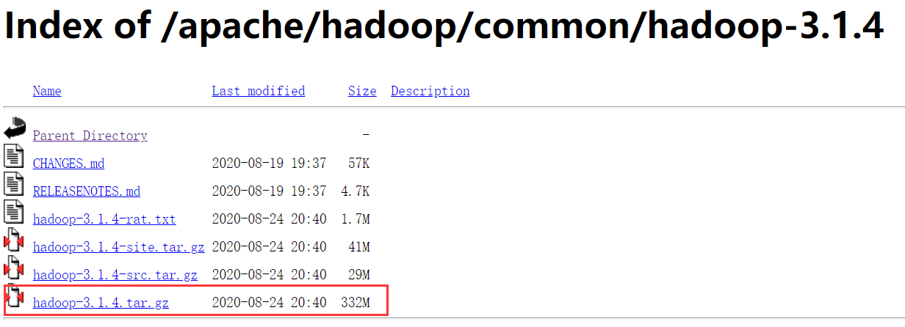
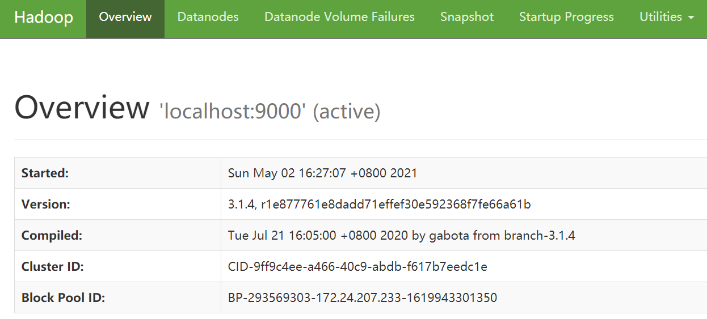

# Hadoop部署

官网：[Apache Hadoop](http://hadoop.apache.org/)

## 集群规划

| 机器    | NameNode | DataNode | SecondNameNode | ResouceManager | NodeManager |
| ------- | -------- | -------- | -------------- | -------------- | ----------- |
| glong01 | Y        | Y        |                |                | Y           |
| glong02 |          | Y        |                | Y              | Y           |
| glong03 |          | Y        | Y              |                | Y           |

## 安装

清华镜像：https://mirrors.tuna.tsinghua.edu.cn/apache/hadoop/common/

我这里用的版本为3.1.4



1、下载、解压、改名

```
cd /opt/software
wget https://mirrors.tuna.tsinghua.edu.cn/apache/hadoop/common/hadoop-3.1.4/hadoop-3.1.4.tar.gz

tar -zxvf hadoop-3.1.4.tar.gz -C /opt/module
mv hadoop-3.1.4 hadoop
```

2、修改环境

```
vim /etc/profile
```

```
# Hadoop
export HADOOP_HOME=/opt/module/hadoop
export PATH=$PATH:$HADOOP_HOME/bin:$HADOOP_HOME/sbin
```

```
source /etc/profile
```

3、测试

```
hadoop version
```


## 集群版

### 修改配置

> hadoop共需配置6个地方

```
cd /opt/module/hadoop/etc/hadoop
```

#### hadoop-env.sh

```
vim hadoop-env.sh
```

添加如下配置

```sh
export JAVA_HOME=/opt/module/jdk1.8.0_141

export HDFS_NAMENODE_USER=root
export HDFS_DATANODE_USER=root
export HDFS_SECONDARYNAMENODE_USER=root
export HDFS_ZKFC_USER=root
export HDFS_JOURNALNODE_USER=root
export YARN_RESOURCEMANAGER_USER=root
export YARN_NODEMANAGER_USER=root
```

#### core-site.xml

```xml
<?xml version="1.0" encoding="UTF-8"?>
<?xml-stylesheet type="text/xsl" href="configuration.xsl"?>
<!--
  Licensed under the Apache License, Version 2.0 (the "License");
  you may not use this file except in compliance with the License.
  You may obtain a copy of the License at

    http://www.apache.org/licenses/LICENSE-2.0

  Unless required by applicable law or agreed to in writing, software
  distributed under the License is distributed on an "AS IS" BASIS,
  WITHOUT WARRANTIES OR CONDITIONS OF ANY KIND, either express or implied.
  See the License for the specific language governing permissions and
  limitations under the License. See accompanying LICENSE file.
-->

<!-- Put site-specific property overrides in this file. -->

<configuration>

 <property>
        <name>fs.defaultFS</name>
        <value>hdfs://tsingdata01:8020</value>
    </property>
    <property>
        <name>hadoop.tmp.dir</name>
        <value>/opt/module/hadoop/data</value>
    </property>
    <property>
        <name>hadoop.proxyuser.root.hosts</name>
        <value>*</value>
    </property>
    <property>
        <name>hadoop.proxyuser.root.groups</name>
        <value>*</value>
    </property>
    <property>
        <name>hadoop.http.staticuser.user</name>
        <value>tsingdata</value>
    </property>
    <property>
        <name>dfs.permissions.enabled</name>
        <value>false</value>
    </property>
    <property>
        <name>io.compression.codecs</name>
        <value>
            org.apache.hadoop.io.compress.GzipCodec,
            org.apache.hadoop.io.compress.DefaultCodec,
            org.apache.hadoop.io.compress.BZip2Codec,
            org.apache.hadoop.io.compress.SnappyCodec,
            com.hadoop.compression.lzo.LzoCodec,
            com.hadoop.compression.lzo.LzopCodec
        </value>
    </property>

    <property>
        <name>io.compression.codec.lzo.class</name>
        <value>com.hadoop.compression.lzo.LzoCodec</value>
    </property>

</configuration>
```

#### hdfs-site.xml

```xml
<?xml version="1.0" encoding="UTF-8"?>
<?xml-stylesheet type="text/xsl" href="configuration.xsl"?>
<!--
  Licensed under the Apache License, Version 2.0 (the "License");
  you may not use this file except in compliance with the License.
  You may obtain a copy of the License at

    http://www.apache.org/licenses/LICENSE-2.0

  Unless required by applicable law or agreed to in writing, software
  distributed under the License is distributed on an "AS IS" BASIS,
  WITHOUT WARRANTIES OR CONDITIONS OF ANY KIND, either express or implied.
  See the License for the specific language governing permissions and
  limitations under the License. See accompanying LICENSE file.
-->

<!-- Put site-specific property overrides in this file. -->

<configuration>
<property>
    <name>dfs.namenode.name.dir</name>
    <value>/opt/module/hadoop/data/dfs/nn</value>
</property>
<property>
    <name>dfs.namenode.secondary.http-address</name>
    <value>tsingdata03:9868</value>
</property>
   <!-- datanode结点被指定要存储数据的本地文件系统路径 -->
<property>
   <name>dfs.datanode.data.dir</name>
   <value>/opt/module/hadoop/data/dfs/dn</value>
</property>

<!-- 测试环境指定HDFS副本的数量1 -->
<property>
    <name>dfs.replication</name>
    <value>3</value>
</property>


</configuration>
```

#### yarn-site.xml

```xml
<?xml version="1.0"?>
<!--
  Licensed under the Apache License, Version 2.0 (the "License");
  you may not use this file except in compliance with the License.
  You may obtain a copy of the License at

    http://www.apache.org/licenses/LICENSE-2.0

  Unless required by applicable law or agreed to in writing, software
  distributed under the License is distributed on an "AS IS" BASIS,
  WITHOUT WARRANTIES OR CONDITIONS OF ANY KIND, either express or implied.
  See the License for the specific language governing permissions and
  limitations under the License. See accompanying LICENSE file.
-->
<configuration>


<property>
        <name>yarn.nodemanager.aux-services</name>
        <value>mapreduce_shuffle</value>
    </property>
    <property>
        <name>yarn.resourcemanager.hostname</name>
        <value>tsingdata02</value>
</property>
<property>
        <name>yarn.nodemanager.env-whitelist</name>
        <value>JAVA_HOME,HADOOP_COMMON_HOME,HADOOP_HDFS_HOME,HADOOP_CONF_DIR,CLASSPATH_PREPEND_DISTCACHE,HADOOP_YARN_HOME,HADOOP_MAPRED_HOME</value>
    </property>
    <property>
        <name>yarn.scheduler.minimum-allocation-mb</name>
        <value>512</value>
    </property>
    <property>
        <name>yarn.scheduler.maximum-allocation-mb</name>
        <value>4096</value>
    </property>
    <property>
        <name>yarn.nodemanager.resource.memory-mb</name>
        <value>4096</value>
    </property>

<!--是否启动一个线程检查每个任务正使用的物理内存量，如果任务超出分配值，则直接将其杀掉，默认是true -->
<property>
   <name>yarn.nodemanager.pmem-check-enabled</name>
   <value>false</value>
</property>

<!--是否启动一个线程检查每个任务正使用的虚拟内存量，如果任务超出分配值，则直接将其杀掉，默认是true -->
<property>
   <name>yarn.nodemanager.vmem-check-enabled</name>
   <value>false</value>
</property>

</configuration>
```

#### mapred-site.xml

```xml
<?xml version="1.0"?>
<?xml-stylesheet type="text/xsl" href="configuration.xsl"?>
<!--
  Licensed under the Apache License, Version 2.0 (the "License");
  you may not use this file except in compliance with the License.
  You may obtain a copy of the License at

    http://www.apache.org/licenses/LICENSE-2.0

  Unless required by applicable law or agreed to in writing, software
  distributed under the License is distributed on an "AS IS" BASIS,
  WITHOUT WARRANTIES OR CONDITIONS OF ANY KIND, either express or implied.
  See the License for the specific language governing permissions and
  limitations under the License. See accompanying LICENSE file.
-->

<!-- Put site-specific property overrides in this file. -->

<configuration>

<property>
        <name>mapreduce.framework.name</name>
        <value>yarn</value>
    </property>

<!-- 历史服务器端地址 -->
<property>
    <name>mapreduce.jobhistory.address</name>
    <value>tsingdata01:10020</value>
</property>

<!-- 历史服务器web端地址 -->
<property>
    <name>mapreduce.jobhistory.webapp.address</name>
    <value>tsingdata01:19888</value>
</property>

</configuration>
```

#### workers

在`etc/hadoop/workers`种添加

```
tsingdata01
tsingdata02
tsingdata03
```

#### 最后：xsync脚本分发

该脚本在：xsync

分发配置文件到其他机器

```
xsync /opt/module/hadoop/etc/hadoop
```

### 格式化

> 如果集群是第一次启动，需要格式化 （只要格式化1次就行，一定不要再格式化！！！）NameNode（注意格式化之前，一定要先停止上次启动的所有 namenode 和 datanode 进程，然后再删除 data 和 log 数据）

```
 bin/hdfs namenode -format
```

### 启动

```
sbin/start-dfs.sh
```


## 伪分布式版

### 修改配置

如果只有一台服务器，只能先安装伪分布式啦。

#### hadoop-env.sh

```xml
export JAVA_HOME=/opt/module/jdk1.8.0_141
```

#### core-site.xml

在core-site.xml添加

```xml
    <property>
        <name>hadoop.tmp.dir</name>
        <value>file:/opt/module/hadoop/tmp</value>
        <description>Abase for other temporary directories.</description>
    </property>
    <property>
        <name>fs.defaultFS</name>
        <value>hdfs://localhost:9000</value>
    </property>
```

#### hdfs-site.xml

同样的，修改配置文件 hdfs-site.xml

```xml
    <property>
        <name>dfs.replication</name>
        <value>1</value>
    </property>
    <property>
        <name>dfs.namenode.name.dir</name>
        <value>file:/opt/module/hadoop/tmp/dfs/name</value>
    </property>
    <property>
        <name>dfs.datanode.data.dir</name>
        <value>file:/opt/module/hadoop/tmp/dfs/data</value>
    </property>
```

#### Hadoop配置文件说明

>Hadoop 的运行方式是由配置文件决定的（运行 Hadoop 时会读取配置文件），因此如果需要从伪分布式模式切换回非分布式模式，`需要删除 core-site.xml 中的配置项`。
>
>此外，伪分布式虽然只需要配置 fs.defaultFS 和 dfs.replication 就可以运行（官方教程如此），不过若没有配置 hadoop.tmp.dir 参数，则默认使用的临时目录为 /tmp/hadoo-hadoop，而这个目录在重启时有可能被系统清理掉，导致必须重新执行 format 才行。所以我们进行了设置，同时也指定 dfs.namenode.name.dir 和 dfs.datanode.data.dir，否则在接下来的步骤中可能会出错。

#### 配置master和slave连接

运行如下指令，并且一直回车

```
ssh-keygen -t rsa 
```

```
The key's randomart image is:
+---[RSA 2048]----+
|O.*Bo.           |
|+*+.o .          |
|.oo*.  . .       |
|..OE....= .      |
|oo B o.*S.       |
|oo= O +          |
| +.= *           |
|. . o o          |
| .   .           |
+----[SHA256]-----+
```

运行如下代码

```
cd /root/.ssh
cat id_rsa.pub >> authorized_keys
```

#### 执行 NameNode 的格式化

配置完成后，执行 NameNode 的格式化

```
cd /opt/module/hadoop
bin/hdfs namenode -format
```

成功的话，会看到 “successfully formatted” 的提示

### 启动

```
start-dfs.sh
```

查看jps

```
(base) [root@glong hadoop]# jps
26804 SecondaryNameNode
26344 NameNode
26506 DataNode
26971 Jps
```

访问http://ip:9870/

> 注意：因为我这里用到了阿里云服务器，所以要在阿里云那边修改安全组配置规则：[云服务器管理控制台 (aliyun.com)](https://ecs.console.aliyun.com/#/securityGroupDetail/region/cn-shanghai/groupId/sg-uf6b8ztry3ctegntf4r5/detail/intranetIngress)，开放端口9870（HDFS），8088（Yarn）



### 关闭

```
stop-dfs.sh
```

## Hadoop集群启动脚本hdp

> 启动Hadoop集群

```
cd ~/bin
touch hdp
vim hdp
```

```sh
#!/bin/bash

case $1 in
    "start" )
        /opt/module/hadoop-/sbin/start-dfs.sh

        ssh tsingdata02 /opt/module/hadoop-/sbin/start-yarn.sh

        /opt/module/hadoop-/bin/mapred --daemon start historyserver
     ;;
     "stop" )
        /opt/module/hadoop-/sbin/stop-dfs.sh

        ssh tsingdata02 /opt/module/hadoop-/sbin/stop-yarn.sh

        /opt/module/hadoop-/bin/mapred --daemon stop historyserver
     ;;
esac
```

```
chmod 777 hdp
```


# 参考教程

[Hadoop3.1.3安装教程_单机/伪分布式配置_Hadoop3.1.3/Ubuntu18.04(16.04)_厦大数据库实验室博客 (xmu.edu.cn)](http://dblab.xmu.edu.cn/blog/2441-2/)