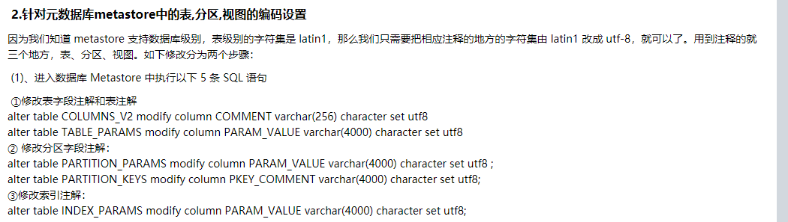

# Hive部署

```
vim /etc/profile
```

```
# Hive
export HIVE_HOME=/opt/module/hive
export PATH=$PATH:$HIVE_HOME/bin
```

```
source /etc/profile
```

解压安装

> 如果后续删除hive并重新安装，请记得先删除mysql中的metastore数据库。

```
tar -zxvf apache-hive-3.1.2-bin.tar.gz -C /opt/module
mv apache-hive-3.1.2-bin hive
```

下载`mysql-connector-java-5.1.48.tar.gz`

```
tar -zxvf mysql-connector-java-5.1.48.tar.gz
```

然后将`mysql-connector-java-5.1.48`中的`mysql-connector-java-5.1.48.jar`放入到hive/lib中

```
cp mysql-connector-java-5.1.48.jar /opt/module/hive/lib/

chmod 777 /opt/module/hive/lib/mysql-connector-java-5.1.48.jar
```


```
cd hive/conf
mv hive-env.sh.template hive-env.sh

# 解决日志Jar包冲突，进入opt/module/hive/lib目录←
mv log4j-slf4j-impl-2.10.0.jar log4j-slf4j-impl-2.10.0.jar.bak
```


```
vim hive-env.sh
# 添加
HADOOP_HOME=/opt/module/hadoop-3.1.3
export HIVE_CONF_DIR=/opt/module/hadoop-3.1.3/conf
```


```
vim hive-site.xml
```

> 特别要注意主机名`glong01`、`mysql用户名`、`mysql密码`，根据你自己实际情况来，一定要在mysql创建`metastore数据库`！

```xaml
<?xml version="1.0"?>
<?xml-stylesheet type="text/xsl" href="configuration.xsl"?>
<configuration>
    
       <!--hive 的元数据服务, 供spark SQL 使用-->
    <property>
        　　　　<name>hive.metastore.uris</name>
        　　　　<value>thrift://glong01:9083</value>
        　　　　<description>Thrift URI for the remote metastore. Used by metastore client to connect to remote metastore.</description>
        　　</property>
    <property>
        <name>javax.jdo.option.ConnectionURL</name>
        <value>jdbc:mysql://glong01:3306/metastore?useSSL=false</value>
    </property>

    <property>
        <name>javax.jdo.option.ConnectionDriverName</name>
        <value>com.mysql.jdbc.Driver</value>
    </property>

    <property>
        <name>javax.jdo.option.ConnectionUserName</name>
        <value>root</value>
    </property>

    <property>
        <name>javax.jdo.option.ConnectionPassword</name>
        <value>root</value>
    </property>

    <property>
        <name>hive.metastore.warehouse.dir</name>
        <value>/user/hive/warehouse</value>
    </property>

    <property>
        <name>hive.metastore.schema.verification</name>
        <value>false</value>
    </property>

    <property>
        <name>hive.server2.thrift.port</name>
        <value>10000</value>
    </property>

    <property>
        <name>hive.server2.thrift.bind.host</name>
        <value>glong01</value>
    </property>

    <property>
        <name>hive.metastore.event.db.notification.api.auth</name>
        <value>false</value>
    </property>
    
    <property>
        <name>hive.cli.print.header</name>
        <value>true</value>
    </property>

    <property>
        <name>hive.cli.print.current.db</name>
        <value>true</value>
    </property>
</configuration>
```

```
chmod 777 hive-site.xml
```

在 HDFS 上创建Hive所需路径，`/tmp/hive`和`/user/hive/warehouse` 两个目录并修改他们的同组权限可写。

```
hadoop fs -mkdir /tmp/hive
hadoop fs -mkdir -p /user/hive/warehouse
hadoop fs -chmod 777 /tmp/hive
hadoop fs -chmod 777 /user/hive/warehouse
```

访问：http://192.168.157.128:9870/explorer.html#/	查看

mysql创建`metastore`，这个metastore对应了hive-site.xml中的配置

```sql
create database metastore;

grant all privileges on *.* to 'root'@'localhost' identified by 'root';

#允许用户root从localhost的主机连接到mysql服务器，并使用root作为密码
grant all privileges on *.* to 'root'@'%' identified by 'root';

#root使用root密码从任何主机连接到mysql服务器
flush privileges;
```


查看数据库`metastore`的权限

```
SELECT host,user,Grant_priv,Super_priv FROM mysql.user;
+-----------+-----------+------------+------------+
| host      | user      | Grant_priv | Super_priv |
+-----------+-----------+------------+------------+
| %         | root      | Y          | Y          |
| localhost | mysql.sys | N          | N          |
| localhost | root      | N          | Y          |
+-----------+-----------+------------+------------+
```


复制lzo包

```
cp hadoop-lzo-0.4.20.jar ${HIVE_HOME}/lib
```


下面启动服务器

初始化元数据

```
schematool -initSchema -dbType mysql -verbose
```


成功了会在metestore数据库中建很多表

> `报错`：
>
> Exception in thread "main" java.lang.NoSuchMethodError: com.google.common.base.Preconditions.checkArgument(ZLjava/lang/String;Ljava/lang/Object;)V
>
> `解决方法`：
>
> 这是因为当时用的hive2.x，与hadoop3.x不兼容。下面方法不要使用，建议直接升级到hive3，因为即使解决了该问题，还会有新的问题出现。
>
> 删除hive中低版本的`guava-14.0.1.jar`包，将hadoop-3.1.3/share/hadoop/common/lib中的`guava-27.0-jre.jar`复制到hive的lib目录下即可。
>
> 
>
> ```
> cd hadoop-3.1.3/share/hadoop/common/lib
> cp guava-27.0-jre.jar /opt/module/hive/lib
> cd /opt/module/hive/lib
> rm -rf guava-14.0.1.jar
> ```

启动

```
nohup hive --service metastore &
nohup hive --service hiveserver2&   # 如果用datagrip等远程工具需要开启

hive
```

> show databases; `报错`：java.lang.RuntimeException: Error in configuring object
>
> 
>
> 原因是Hive的依赖库中缺少lzo的jar包。
>
> 解决办法：
>
> 把lzo的jar包放到${HIVE_HOME}/lib目录下。
>
> ```
> cp hadoop-lzo-0.4.20.jar ${HIVE_HOME}/lib
> ```

介绍一下常用的命令

```
打开默认数据库 
    hive> use default; 
显示 default 数据库中的表 
    hive> show tables; 
创建一张表 
    hive> create table student(id int, name string); 
显示数据库中有几张表
    hive> show tables; 
查看表的结构 
    hive> desc student; 
向表中插入数据 
    hive> insert into student values(1000,"ss"); 
查询表中数据 
    hive> select * from student; 
退出 hive 
    hive> quit;
```


# 中文乱码问题

[hive中解决中文乱码](https://www.cnblogs.com/DreamDrive/p/7469476.html)

