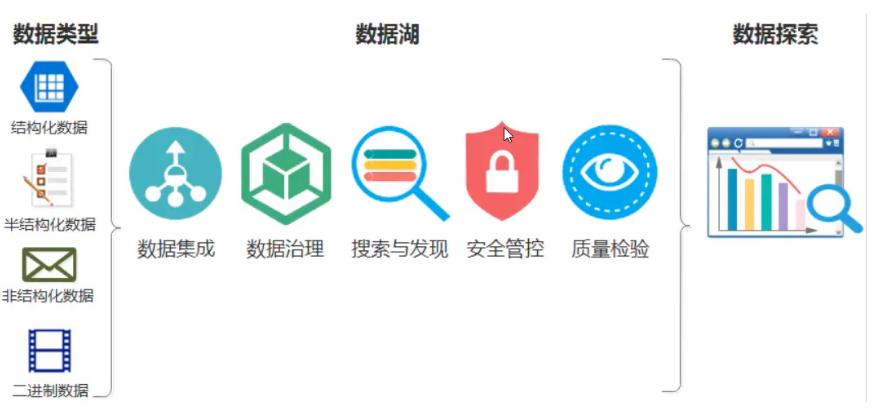
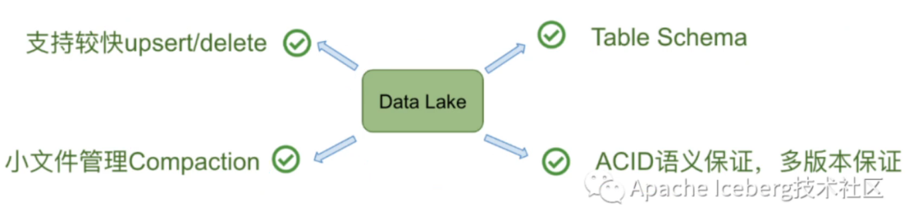
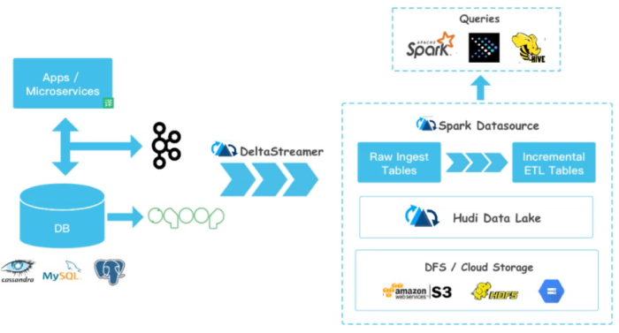

# 数据湖


官网：https://hudi.apache.org/

社区：https://gitee.com/poseidonand/hudi-resources?_from=gitee_search#https://mp.weixin.qq.com/s/TKFZYwPbGSKSo29EDeaPIw



```markdown
# 数据类型：

## 数仓、数据湖支持
1. 结构化数据：MySQL Oracle
2. 非结构化数据：xml Json 日志
## 数据湖支持
3. 非结构化数据：
4. 二进制数据：图像 视频 音频
```


## 数据湖特点




# Hudi介绍

Hudi将带来流式处理大数据，提供新数据集，同时比传统批处理效率高一个数据量级。




## Hudi特性

```markdown
1. 快速upsert,可插入索引

2. 以原子方式操作数据并具有回滚功能

3. 写入器之间的快照隔离

4. savepoint 用户数据恢复的保存点

5. 管理文件大小，使用统计数据布局.  spark写到hdfs会有小文件问题，而hudi会自动解决小文件问题

6. 数据行的异步压缩和柱状数据

7. 时间轴数据跟踪血统
```

