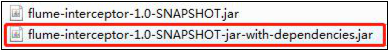

# 消费 Kafka 数据 Flume

## 集群规划

|                     | 服务器 | 服务器 | 服务器 |
| ------------------- | ------ | ------ | ------ |
| Flume（消费 Kafka） |        |        | Flume  |

## 项目经验之 Flume 组件选型


```markdown
1. FileChannel 和 MemoryChannel 区别
	MemoryChannel 传输数据速度更快，但因为数据保存在 JVM 的堆内存中，Agent 进程
挂掉会导致数据丢失，适用于对数据质量要求不高的需求。
	FileChannel 传输速度相对于 Memory 慢，但数据安全保障高，Agent 进程挂掉也可以从
失败中恢复数据。
	选型：
	金融类公司、对钱要求非常准确的公司通常会选择 FileChannel
	传输的是普通日志信息（京东内部一天丢 100 万-200 万条，这是非常正常的），通常
	选择 MemoryChannel。

2. FileChannel 优化
通过配置 dataDirs 指向多个路径，每个路径对应不同的硬盘，增大 Flume 吞吐量。
官方说明如下：
	Comma separated list of directories for storing log files. Using multiple directories on separate disks can improve file channel peformance

	checkpointDir 和 backupCheckpointDir 也尽量配置在不同硬盘对应的目录中， 保证checkpoint 坏掉后，可以快速使用 backupCheckpointDir 恢复数据

3. Sink：HDFS Sink
	（1）HDFS 存入大量小文件，有什么影响？
	元数据层面：每个小文件都有一份元数据，其中包括文件路径，文件名，所有者，所属组，权限，创建时间等，这些信息都保存在 Namenode 内存中。所以小文件过多，会占用Namenode 服务器大量内存，影响 Namenode 性能和使用寿命
	计算层面：默认情况下 MR 会对每个小文件启用一个 Map 任务计算，非常影响计算性能。同时也影响磁盘寻址时间。

	（2）HDFS 小文件处理
	官方默认的这三个参数配置写入 HDFS 后会产生小文件，hdfs.rollInterval、hdfs.rollSize、hdfs.rollCount
	基于以上 hdfs.rollInterval=3600，hdfs.rollSize=134217728，hdfs.rollCount =0 几个参数综合作用，效果如下：
	（1）文件在达到 128M 时会滚动生成新文件
	（2）文件创建超 3600 秒时会滚动生成新文件
```


## Flume 拦截器

```
	由于 Flume 默认会用 Linux 系统时间，作为输出到 HDFS 路径的时间。如果数据是 23:59
分产生的。Flume 消费 Kafka 里面的数据时，有可能已经是第二天了，那么这部门数据会被发往第二天的 HDFS 路径。我们希望的是根据日志里面的实际时间，发往 HDFS 的路径，
所以下面拦截器作用是获取日志中的实际时间。

	解决的思路：拦截 json 日志，通过 fastjson 框架解析 json，获取实际时间 ts。将获取的 ts 时间写入拦截器 header 头，header 的 key 必须是 timestamp，因为 Flume 框架会根据这个key 的值识别为时间，写入到 HDFS。


```

1）在 com.atguigu.flume.interceptor 包下创建 TimeStampInterceptor 类

```java
package com.atguigu.flume.interceptor;


import com.alibaba.fastjson.JSONObject; import org.apache.flume.Context; import org.apache.flume.Event;

import org.apache.flume.interceptor.Interceptor;


import java.nio.charset.StandardCharsets; import java.util.ArrayList; import java.util.List;

import java.util.Map;


public class TimeStampInterceptor implements Interceptor {


private ArrayList<Event> events = new ArrayList<>();


@Override

public void initialize() {


}


@Override

public Event intercept(Event event) {


Map<String, String> headers = event.getHeaders();

String log = new String(event.getBody(), StandardCharsets.UTF_8);

JSONObject jsonObject = JSONObject.parseObject(log);


String ts = jsonObject.getString("ts"); headers.put("timestamp", ts);

return event;
    }


@Override

public List<Event> intercept(List<Event> list) { events.clear();

for (Event event : list) {

events.add(intercept(event));

}


return events;

}


@Override

public void close() {


}


public static class Builder implements Interceptor.Builder { @Override

public Interceptor build() {
return new TimeStampInterceptor();

}


@Override

public void configure(Context context) { }

}

}
```

2）重新打包



3）需要先将打好的包放入到 glong01的/opt/module/flume/lib 文件夹下面。

```
ls | grep interceptor flume-interceptor-1.0-SNAPSHOT-jar-with-dependencies.jar

```

4）分发 Flume 到 glong02、glong03

```
xsync flume/
```

## 日志消费 Flume 配置

```

1）Flume 配置分析

```

2）Flume 的具体配置如下：

（1）在 glong03的/opt/module/flume/conf 目录下创建 kafka-flume-hdfs.conf 文件 

```
vim kafka-flume-hdfs.conf
```

在文件配置如下内容

```properties
##组件

a1.sources=r1
a1.channels=c1
a1.sinks=k1

## source1
a1.sources.r1.type = org.apache.flume.source.kafka.KafkaSource
a1.sources.r1.batchSize = 5000
a1.sources.r1.batchDurationMillis = 2000
a1.sources.r1.kafka.bootstrap.servers = hadoop102:9092,hadoop103:9092,hadoop104:9092 a1.sources.r1.kafka.topics=topic_log
a1.sources.r1.interceptors = i1
a1.sources.r1.interceptors.i1.type = com.atguigu.flume.interceptor.TimeStampInterceptor$Builder

## channel1
a1.channels.c1.type = file
a1.channels.c1.checkpointDir = /opt/module/flume/checkpoint/behavior1
a1.channels.c1.dataDirs = /opt/module/flume/data/behavior1/
a1.channels.c1.maxFileSize = 2146435071
a1.channels.c1.capacity = 1000000
a1.channels.c1.keep-alive = 6

## sink1
a1.sinks.k1.type = hdfs
a1.sinks.k1.hdfs.path = /origin_data/gmall/log/topic_log/%Y-%m-%d
a1.sinks.k1.hdfs.filePrefix = log-
a1.sinks.k1.hdfs.round = false
a1.sinks.k1.hdfs.rollInterval = 10
a1.sinks.k1.hdfs.rollSize = 134217728
a1.sinks.k1.hdfs.rollCount = 0

##控制输出文件是原生文件。
a1.sinks.k1.hdfs.fileType = CompressedStream
a1.sinks.k1.hdfs.codeC = lzop

##拼装
a1.sources.r1.channels = c1
a1.sinks.k1.channel= c1
```

## 日志消费 Flume 启动停止脚本

1）在/home/atguigu/bin 目录下创建脚本 f2.sh

```
vim f2.sh

```

在脚本中填写如下内容

```
#! /bin/bash

case $1 in
"start"){
for i in hadoop104
do
	echo " --------启动 $i 消费 flume-------"
    ssh $i "nohup /opt/module/flume/bin/flume-ng agent --conf-file 		/opt/module/flume/conf/kafka-flume-hdfs.conf --name a1 -Dflume.root.logger=INFO,LOGFILE >/opt/module/flume/log2.txt 2>&1 &"

done

};;

"stop"){

for i in hadoop104
do
	echo " --------停止 $i 消费 flume-------"
	ssh $i "ps -ef | grep kafka-flume-hdfs | grep -v grep |awk '{print \$2}' | xargs -n1 kill"

done
};;
esac


```

2）增加脚本执行权限

```
chmod u+x f2.sh
```

3）f2 集群启动脚本

```
f2.sh start
```


4）f2 集群停止脚本

```
f2.sh stop
```

