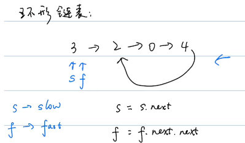

# 双指针

## 特点

```
两个指针解决一道题，是一种技巧！
```


| 类型       | 描述                                             | 适合场景 | 时间复杂度 |
| ---------- | ------------------------------------------------ | -------- | ---------- |
| 普通双指针 | 两个指针有时往同一个方向移动，有时往相反方向移动 |          |            |
| 对撞双指针 | 两个指针面对面移动，比如一个在头，一个在尾       | 有序数组 | O(N)       |
| 快慢双指针 | 慢指针 + 快指针                                  | 环形链表 |            |


### 快慢双指针



## 练习

### [剑指 Offer 18. 删除链表的节点](https://leetcode-cn.com/leetbook/read/illustration-of-algorithm/505fc7/)

给定单向链表的头指针和一个要删除的节点的值，定义一个函数删除该节点。

返回删除后的链表的头节点。

注意：此题对比原题有改动

示例 1:

```
输入: head = [4,5,1,9], val = 5
输出: [4,1,9]
解释: 给定你链表中值为 5 的第二个节点，那么在调用了你的函数之后，该链表应变为 4 -> 1 -> 9.
```

示例 2:

```
输入: head = [4,5,1,9], val = 1
输出: [4,5,9]
解释: 给定你链表中值为 1 的第三个节点，那么在调用了你的函数之后，该链表应变为 4 -> 5 -> 9.
```


说明：

- 题目保证链表中节点的值互不相同
- 若使用 C 或 C++ 语言，你不需要 `free` 或 `delete` 被删除的节点

题解：

> `快慢双指针`，如果head的val刚好就说要找到，那么丢掉头结点，返回head.next
>
> 如果不是，就用到pre和cur指针，pre负责记住cur。pre慢，cur快。cur会一直遍历移动，判断是否要删除。
>
> 当找到对应的val之后，那么让pre.next指向cur.next，也就是扔掉了cur这个节点

```java
class Solution {
    public ListNode deleteNode(ListNode head, int val) {
        if(head.val == val) return head.next;
        ListNode pre = head, cur = head.next;
        while(cur != null && cur.val != val) {
            pre = cur;
            cur = cur.next;
        }
        if(cur.val == val) pre.next = cur.next;
      	// if(cur != null) pre.next = cur.next;
        return head;
    }
}
```

### [剑指 Offer 21. 调整数组顺序使奇数位于偶数前面](https://leetcode-cn.com/leetbook/read/illustration-of-algorithm/5v8a6t/)

输入一个整数数组，实现一个函数来调整该数组中数字的顺序，使得所有奇数位于数组的前半部分，所有偶数位于数组的后半部分。

示例：

```
输入：nums = [1,2,3,4]
输出：[1,3,2,4] 
注：[3,1,2,4] 也是正确的答案之一。
```


提示：

1. `0 <= nums.length <= 50000`
2. `1 <= nums[i] <= 10000`

题解：

> 对撞双指针，一个找奇数，一个找偶数。当两个指针重合的时候，跳出循环。
>
> 对于`i`，他是负责奇数的，如果现在找到的是偶数，那么就等`j`那边出现奇数，准备和他调换吧！如果现在是奇数，那么往后遍历。

 $ x\&1 $ 位运算 `等价于` $x \% 2 $ 取余运算，即皆可用于判断数字奇偶性。

```java
class Solution {
    public int[] exchange(int[] nums) {
        int i = 0, j = nums.length - 1, tmp;
        while(i < j){
            while(i < j && (nums[i] & 1) == 1){
                i++;
            }
            while(i < j && (nums[j] & 1) == 0){
                j--;
            }
            tmp = nums[i];
            nums[i] = nums[j];
            nums[j] = tmp;
        }
        return nums;
    }
}
```


### [剑指 Offer 22. 链表中倒数第 k 个节点](https://leetcode-cn.com/leetbook/read/illustration-of-algorithm/58tl52/)

输入一个链表，输出该链表中倒数第k个节点。为了符合大多数人的习惯，本题从1开始计数，即链表的尾节点是倒数第1个节点。

例如，一个链表有 6 个节点，从头节点开始，它们的值依次是 `1、2、3、4、5、6`。这个链表的倒数第` 3` 个节点是值为` 4 `的节点。

示例：

```
给定一个链表: 1->2->3->4->5, 和 k = 2.

返回链表 4->5.
```

题解：

> 快慢指针，让快指针先走k步，然后快慢指针一起走，等到快指针指向null的时候，返回慢指针即可

```java
/**
 * Definition for singly-linked list.
 * public class ListNode {
 *     int val;
 *     ListNode next;
 *     ListNode(int x) { val = x; }
 * }
 */
class Solution {
    public ListNode getKthFromEnd(ListNode head, int k) {
        ListNode pre = head, cur = head;

        for(int i = 0; i < k; i++){
            cur = cur.next;
        }
        while(cur != null){
            pre = pre.next;
            cur = cur.next;
        }

        return pre;
    }
}
```

### 剑指 Offer 25/LeetCode21. 合并两个排序的链表

输入两个递增排序的链表，合并这两个链表并使新链表中的节点仍然是递增排序的。

示例1：

```
输入：1->2->4, 1->3->4
输出：1->1->2->3->4->4
```

限制：

- 0 <= 链表长度 <= 1000

注意：本题与主站 21 题相同：https://leetcode-cn.com/problems/merge-two-sorted-lists/

题解：

```java
class Solution {
    public ListNode mergeTwoLists(ListNode l1, ListNode l2) {
        ListNode dum = new ListNode(0), cur = dum;
        while(l1 != null && l2 != null){
            if(l1.val < l2.val){
                cur.next = l1;
                l1 = l1.next;
            }else{
                cur.next = l2;
                l2 = l2.next;
            }
            cur = cur.next;
        }
        cur.next = l1 != null ? l1 : l2;
        return dum.next;
    }
}
```


### 剑指 Offer 52/LeetCode160. 两个链表的第一个公共节点

输入两个链表，找出它们的第一个公共节点。

如下面的两个链表：


在节点 c1 开始相交。 

示例 1：


```
输入：intersectVal = 8, listA = [4,1,8,4,5], listB = [5,0,1,8,4,5], skipA = 2, skipB = 3
输出：Reference of the node with value = 8
输入解释：相交节点的值为 8 （注意，如果两个列表相交则不能为 0）。从各自的表头开始算起，链表 A 为 [4,1,8,4,5]，链表 B 为 [5,0,1,8,4,5]。在 A 中，相交节点前有 2 个节点；在 B 中，相交节点前有 3 个节点。
```


示例 2：

```
输入：intersectVal = 2, listA = [0,9,1,2,4], listB = [3,2,4], skipA = 3, skipB = 1
输出：Reference of the node with value = 2
输入解释：相交节点的值为 2 （注意，如果两个列表相交则不能为 0）。从各自的表头开始算起，链表 A 为 [0,9,1,2,4]，链表 B 为 [3,2,4]。在 A 中，相交节点前有 3 个节点；在 B 中，相交节点前有 1 个节点。
```


示例 3：

```
输入：intersectVal = 0, listA = [2,6,4], listB = [1,5], skipA = 3, skipB = 2
输出：null
输入解释：从各自的表头开始算起，链表 A 为 [2,6,4]，链表 B 为 [1,5]。由于这两个链表不相交，所以 intersectVal 必须为 0，而 skipA 和 skipB 可以是任意值。
解释：这两个链表不相交，因此返回 null。
```


注意：

- 如果两个链表没有交点，返回 null.
- 在返回结果后，两个链表仍须保持原有的结构。
- 可假定整个链表结构中没有循环。
- 程序尽量满足 O(n) 时间复杂度，且仅用 O(1) 内存。
- 本题与主站 160 题相同：https://leetcode-cn.com/problems/intersection-of-two-linked-lists/

题解：

>走到尽头见不到你，于是走过你来时的路，等到相遇时才发现，你也走过我来时的路。
>
>我来到你的城市，走过你来时的路。
>
>A，B是会变化的

```java
public class Solution {
    public ListNode getIntersectionNode(ListNode headA, ListNode headB) {
        A = headA, B = headB;

        while(A != B){
            A = A != null? A.next: headB;   // 一直走到尽头，再入轮回
            B = B != null? B.next: headA;
        }
    }
}
```


### 剑指 Offer 57. 和为 s 的两个数字

输入一个递增排序的数组和一个数字s，在数组中查找两个数，使得它们的和正好是s。如果有多对数字的和等于s，则输出任意一对即可。

示例 1：

```
输入：nums = [2,7,11,15], target = 9
输出：[2,7] 或者 [7,2]
```

示例 2：

```
输入：nums = [10,26,30,31,47,60], target = 40
输出：[10,30] 或者 [30,10]
```


限制：

- `1 <= nums.length <= 10^5`
- `1 <= nums[i] <= 10^6`

题解：

> 可以使用HashMap，时间复杂度为O(N)
>
> 使用对撞双指针，本质上就是二分查找法。

```java
class Solution {
    public int[] twoSum(int[] nums, int target) {
        int i = 0, j = nums.length - 1;
        while(i < j){
            int s = nums[i] + nums[j];
            if(s ==target){
                return new int[]{nums[i],nums[j]};
            }else if(s > target){
                j--;
            }else{
                i++;
            }
        }
        return new int[0];
    }
}
```

### 剑指 Offer 58 - I. 翻转单词顺序

输入一个英文句子，翻转句子中单词的顺序，但单词内字符的顺序不变。为简单起见，标点符号和普通字母一样处理。例如输入字符串"I am a student. "，则输出"student. a am I"。

 

示例 1：

```
输入: "the sky is blue"
输出: "blue is sky the"
```

示例 2：

```
输入: "  hello world!  "
输出: "world! hello"
解释: 输入字符串可以在前面或者后面包含多余的空格，但是反转后的字符不能包括。
```

示例 3：

```
输入: "a good   example"
输出: "example good a"
解释: 如果两个单词间有多余的空格，将反转后单词间的空格减少到只含一个。
```


说明：

- 无空格字符构成一个单词。
- 输入字符串可以在前面或者后面包含多余的空格，但是反转后的字符不能包括。
- 如果两个单词间有多余的空格，将反转后单词间的空格减少到只含一个。

注意：本题与主站 151 题相同：https://leetcode-cn.com/problems/reverse-words-in-a-string/

注意：此题对比原题有改动

题解：

```java
class Solution {
    public String reverseWords(String s) {
        s = s.trim();	// 删除首尾空格
        int i = s.length() - 1, j = i;	// 从后往前
        StringBuilder res = new StringBuilder();
        while(i >= 0){
            while(i >= 0 && s.charAt(i) != ' ') i--;
            res.append(s.substring(i + 1, j + 1) + ' ');
            while(i >= 0 && s.charAt(i) == ' ') i--;
            j = i;
        }
        return res.toString().trim();
    }
}
```


### LeetCode141

### LeeCode881