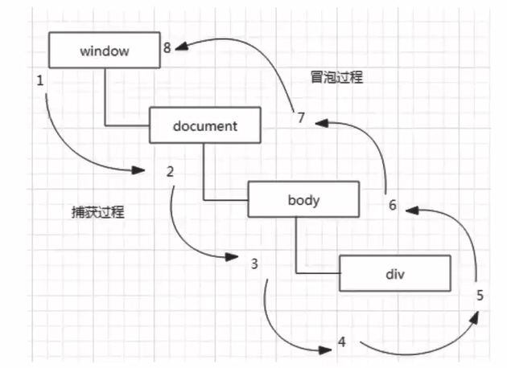

# 事件

## 事件中的名词

```
事件名
事件源
事件监听
事件处理
```


## 事件类型


## 事件流和事件模型

我们的事件最后都有一个特定的事件源， 暂且将事件源看做是HTML的某个元素，那么当一个HTML元素产生一个事件时，该事件会在元素节点与根节点之间按特定的`顺序传播`，路径所经过的节点都会受到该事件，这个传播过程称为`DOM事件流`。
**事件顺序**有两种类型：`事件捕获（从上到下）`和`事件冒泡（从下到上）`。
冒泡和捕获其实都是事件流的不同表现，这两者的产生是因为IE和Netscape两个大公司完全不同的事件流概念产生的。(事件流：是指页面接受事件的顺序) 。IE的事件流是事件冒泡，Netscape的事件流是事件捕获流。

### 事件冒泡

IE的事件流叫做事件冒泡，即事件开始时由最具体的元素接受,然后逐级向上传播到较为不具体的节点(文
档)。例如下面的：

```html
<!DOCTYPE html>
<html lang="en">
<head>
    <meta charset="UTF-8">
    <title>hello,js</title>
</head>
<body>
    <div id="myDiv">Click me</div>
</body>
</html>
```

如果点击了页面中的<div>元素，那么这个click事件会按照如下顺序传播：

```
1. <div>
2. <body>
3. <htm1>
4. document
```

也就是说，click事件首先在div元素上发生，而这个元素就是我们单击的元素。然后, click事件沿DOM树向上传播，在每一级节点上都会发生，直到传播到document对象。

所有现代浏览器都支持事件冒泡，但在具体实现上还是有一-些差别。

### 事件捕获

与事件冒泡相反。

### DOM事件流

"DOM2级事件“规定的事件流包括三个阶段：`事件捕获阶段`、`处于目标阶段`和`事件冒泡阶段`。首先发生的是事件捕获阶段，为截获事件提供了机会。然后是实际的目标接收到事件。最后一个阶段是冒泡阶段，可以在这个阶段对事件做出响应。



## 事件处理程序

`事件`就是用户或浏览器自身执行的某种动作。例如click、 load和mouseover都是事件的名字， 而响应某个事件的函数就叫做事件处理程序(或事件侦听器)。`事件处理程序的名字以"on"开头`，因此click事件的事件处理程序就是`onclick`，为事件指定处理程序的方式有好几种。

### HTML事件处理程序

某个元素支持的每种事件，都可以用一个与相应事件处理程序同名的HTML特性来指定。这个特性的值应该是能够执行的JavaScript代码：

```html
<input type="button" value="Press me" onclick="alert(' thanks');" />
```

这样做有一些`缺点`，例如耦合度过高，还可能存在时差问题（当用户点击按钮时，处理函数还未加载到，此时处理函数是单独写的一段js代码），而且在不同的浏览器上可能会有不同的效果。

### DOM0级事件处理程序

通过JavaScript指定事件处理程序的传统方式，就是将一个函数赋值给一个事件处理程序属性。这种方式被所有现代浏览器所支持。这种方式首先必须取得一个要操作的对象的引用， 每个元素都有自己的事件处理程序属性，这些属性通常全都小写，例如onclick，然后将这种属性的值设为一个函数，就可以指定事件处理程序了。例如：

```html
<script>
    var btn = document.getElementById(btn);
    btn.onclick = function(){
        console.log("DOM 0级事件处理程序");
    }
</script>
```


### DOM2级事件处理程序

“DOM2级事件”定义了两个方法，用于处理指定和删除事件处理程序的操作: `addEventListener()`和`removeEventListener()`。所有DOM节点都包含这两个方法，并且他们都接受3个参数：`要处理的事件名`、`作为事件处理程序的函数`和`一个布尔值`。最后这个布尔值参数如果是true，则表示在捕获阶段调用事件处理程序；如果是false则表示在冒泡阶段调用事件处理程序。

这种方式可以为同一个元素的同一个事件`添加多个处理函数`。还可删除事件处理函数，注意，在删除的时候，不能删除`匿名处理函数`。

### 比较

```
1. DOM0级事件处理程序
	将一个函数赋值给一个事件处理程序属性
	只能为同一个元素的同一一个事件设定一个事件程序(覆盖)

2. DOM2级事件处理程序
	可以为同一个元素的同一一个事件设定多个事件程序
```

## 常用事件