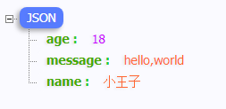

七米：https://www.bilibili.com/video/BV1gJ411p7xC

# Web本质

创建项目


```
https://goproxy.cn
```


`go.mod`保存了项目所有依赖信息


新建main文件

> 标准库：https://studygolang.com/pkgdoc

```go
package main

import (
	"fmt"
	"net/http"
)

// web开发就是一个请求对应一个响应
func sayHello(w http.ResponseWriter, r *http.Request) {
	_, _ = fmt.Fprintln(w, "<h1>Hello, Golang!</h1>")
}

func main() {
	http.HandleFunc("/hello", sayHello)
	err := http.ListenAndServe("127.0.0.1:9090", nil)
	if err != nil {
		fmt.Println("http serve failed, err:%v\n", err)
		return
	}
}
```


上面的<h1>Hello, Golang!</h1>是硬编码的

我们可以写到一个`hello.txt`文件中

```
<h1 style='color:orange'>Hello, Golang!</h1>
<h3>how are you?</h3>

<button id='b1'>点我</button>
<script>
document.getElementById('b1').onclick=function(){
    document.getElementById('i1').src='http://5b0988e595225.cdn.sohucs.com/images/20180920/c602cfd358a8466294d381296a6e15e7.jpeg'
}
</script>
```


```go
func sayHello(w http.ResponseWriter, r *http.Request) {
	b, _ := ioutil.ReadFile("./hello.txt")
	_, _ = fmt.Fprintln(w, string(b))
}
```

# Gin框架

官网：https://gin-gonic.com/

文档：https://gin-gonic.com/docs/

## Gin初识

下载安装

```
go get -u github.com/gin-gonic/gin
```

示例

```go
package main

import (
	"github.com/gin-gonic/gin"
)

func main() {
	r := gin.Default() // 返回默认的路由引擎

	// 指定用户使用GET请求访问/hello时，执行sayHello这个函数
	r.GET("/hello", sayHello)

	// 启动服务，默认为8080
	r.Run(":9090")	
}

func sayHello(c *gin.Context) {
	c.JSON(200, gin.H{
		"message": "Hello golang",
	})
}
```

> 顺便下载json-handle插件：http://jsonhandle.sinaapp.com/

RESTful风格

```go
// 不适用RESTful风格
r.GET("/create_book", ...)
r.GET("/update_book", ...)

r.GET("/remove_book", ...)	// 有的人删除
r.GET("/delete_book", ...)	// 有的人删除
r.GET("/shanchu_book", ...)	// 有的人删除

// 使用RESTful风格
r.GET("book", ...)
r.POST("book", ...)
r.PUT("book", ...)
r.DELETE("book", ...)
```

使用Postman

```go
package main

import (
	"github.com/gin-gonic/gin"
	"net/http"
)

func main() {
	r := gin.Default() // 返回默认的路由引擎

	// 指定用户使用GET请求访问/hello时，执行sayHello这个函数
	r.GET("/hello", sayHello)

	r.GET("/book", func(c *gin.Context) {
		c.JSON(200, gin.H{
			"method": "GET",
		})
	})

	r.POST("/book", func(c *gin.Context) {
		c.JSON(http.StatusOK, gin.H{
			"method": "POST",
		})
	})

	r.PUT("/book", func(c *gin.Context) {
		c.JSON(http.StatusOK, gin.H{
			"method": "PUT",
		})
	})
	r.DELETE("/book", func(c *gin.Context) {
		c.JSON(http.StatusOK, gin.H{
			"method": "DELETE",
		})
	})

	// 启动服务，默认为8080
	r.Run(":9090")
}

func sayHello(c *gin.Context) {
	c.JSON(200, gin.H{
		"message": "Hello golang",
	})
}
```

修改下图红色框，Send


## 模板

### template初识

新建项目

定义模板，新建`hello.tmpl`


`{{ . }}`

模板语法都包含在`{{ 和 }}`中间，其中` {{.}} `中的点表示当前对象。

定义模板

```html
<!doctype html>
<html lang="en">
<head>
    <meta charset="UTF-8">
    <meta name="viewport"
          content="width=device-width, user-scalable=no, initial-scale=1.0, maximum-scale=1.0, minimum-scale=1.0">
    <meta http-equiv="X-UA-Compatible" content="ie=edge">
    <title>Document</title>
</head>
<body>
    <p>hello, {{ . }} </p>
</body>
</html>
```


新建`main.go`

```go
package main

import (
	"fmt"
	"html/template"
	"net/http"
)

func main() {
	http.HandleFunc("/", sayHello)
	err := http.ListenAndServe(":9090", nil)
	if err != nil {
		fmt.Println("http server start failed, err:%v", err)
		return
	}
}

func sayHello(w http.ResponseWriter, r *http.Request) {
    // 1. 定义模板
	// 2. 解析模板
	t, err := template.ParseFiles("./hello.tmpl")		// 请勿刻舟求剑
	if err != nil {
		fmt.Println("Parse template failed, err:%v", err)
		return 
	}
	// 3. 渲染模板
	name := "小王子"
	err = t.Execute(w, name)
	if err != nil {
		fmt.Println("render template failed, err:%v", err)
		return
	}
}
```


```
go build
执行.exe
```


### go模板详解

`hello.tmpl`

```go
<!doctype html>
<html lang="en">
<head>
    <meta charset="UTF-8">
    <meta name="viewport"
          content="width=device-width, user-scalable=no, initial-scale=1.0, maximum-scale=1.0, minimum-scale=1.0">
    <meta http-equiv="X-UA-Compatible" content="ie=edge">
    <title>Document</title>
</head>
<body>
    <p>hello, {{ .Name }} </p>
    <p>年龄： {{ .Age }}</p>
    <p>性别： {{ .gender }}</p>
</body>
</html>
```

> 这里的.gender没有用的，因为小写是私有

结构体

```go
package main

import (
	"fmt"
	"html/template"
	"net/http"
)

type User struct {
	Name string
	gender string
	Age string
}

func main() {
	http.HandleFunc("/", sayHello)
	err := http.ListenAndServe(":9090", nil)
	if err != nil {
		fmt.Println("http server start failed, err:%v", err)
		return
	}
}

func sayHello(w http.ResponseWriter, r *http.Request) {
	// 2. 解析模板
	t, err := template.ParseFiles("./hello.tmpl")		// 请勿刻舟求剑
	if err != nil {
		fmt.Println("Parse template failed, err:%v", err)
		return 
	}
	// 3. 渲染模板
	u1 := User{
		Name:	"小王子",
		gender: "男",
		Age: "18",
	}
	name := u1
	err = t.Execute(w, name)
	if err != nil {
		fmt.Println("render template failed, err:%v", err)
		return
	}
}
```


### Gin框架模板渲染

```
模板定义

模板解析

模板渲染
```


`模板定义`	index.temp

```html
<!doctype html>
<html lang="en">
<head>
    <meta charset="UTF-8">
    <meta name="viewport"
          content="width=device-width, user-scalable=no, initial-scale=1.0, maximum-scale=1.0, minimum-scale=1.0">
    <meta http-equiv="X-UA-Compatible" content="ie=edge">
    <title>Document</title>
</head>
<body>
{{ .tittle }}

</body>
</html>
```

main.go

```go
package main

import (
	"github.com/gin-gonic/gin"
	"net/http"
)

func main() {
	r := gin.Default()
	r.LoadHTMLFiles("templates/index.temp")	// 2. 模板解析
	r.GET("/index", func(c *gin.Context) {
		c.HTML(http.StatusOK, "index.temp", gin.H{	// 3. 模板渲染
			"tittle": "glong.io",
		})
	})
	r.Run(":8080")	// 启动server
}
```

```
go build 
.exe
```

访问：http://127.0.0.1:8080/index

如果templates有多个文件夹，每个index.tmpl前后加上

```go
{{define "posts/index.temp"}}
<!doctype html>
<html lang="en">
<head>
    <meta charset="UTF-8">
    <meta name="viewport"
          content="width=device-width, user-scalable=no, initial-scale=1.0, maximum-scale=1.0, minimum-scale=1.0">
    <meta http-equiv="X-UA-Compatible" content="ie=edge">
    <title>Document</title>
</head>
<body>
{{ .tittle }}
</body>
</html>
{{end}}
```


```go
package main

import (
	"github.com/gin-gonic/gin"
	"net/http"
)

func main() {
	r := gin.Default()
	//r.LoadHTMLFiles("templates/index.temp")	// 2. 模板解析
	r.LoadHTMLGlob("templates/**/*")		// 通配符  **表示目录 ， *表示文件
	r.GET("/posts/index", func(c *gin.Context) {
		// HTTP请求
		c.HTML(http.StatusOK, "posts/index.temp", gin.H{	// 3. 模板渲染
			"tittle": "glong.io",
		})
	})

	r.GET("/users/index", func(c *gin.Context) {
		// HTTP请求
		c.HTML(http.StatusOK, "users/index.temp", gin.H{	// 3. 模板渲染
			"tittle": "users/glong.io",
		})
	})
	r.Run(":8080")	// 启动server
}
```


## 前后端分离

### gin框架返回json

> Json-Handle插件：http://jsonhandle.sinaapp.com/

```go
package main

import (
	"github.com/gin-gonic/gin"
	"net/http"
)

func main(){
	r := gin.Default()

	r.GET("/json", func(c *gin.Context) {
		// 方法1：使用map

		//data := map[string]interface{}{
		//	"name": "小王子",
		//	"message": "hello,world",
		//	"age": 18,
		//}

		// 方法2： H底层还是map
		data := gin.H{
			"name": "小王子",
			"message": "hello,world",
			"age": 18,
		}

		c.JSON(http.StatusOK, data)
	})

	// 方法3： 结构体，项目中用的多
   
	type msg struct{
        Name string `json:"name"` // `json:"name"`传小写给前端
		Message string
		Age int
	}

	r.GET("/another_json", func(c *gin.Context) {
		data := msg{
			"小王子",
			"Hello, golang",
			18,
		}
		c.JSON(http.StatusOK, data)
	})

	r.Run(":9090")
}
```

访问：http://localhost:9090/json

http://localhost:9090/another_json




### gin获取querystring参数

GET请求 URL `?` 后面的是querystring参数

方法1
```go
func main() {
	r := gin.Default()

	r.GET("/", func(c *gin.Context){
		// 获取浏览器那边发起的请求携带的 query string 参数
		name := c.Query("query")	// 通过Query获取请求中携带的querystring参数
		c.JSON(http.StatusOK, gin.H{
			"name": name,
		})
	})
	r.Run(":9000")
}
```

http://localhost:9000/?query=宋茜

```
{"name":"宋茜"}
```

方法2

```go
func main() {
	r := gin.Default()

	r.GET("/", func(c *gin.Context){
		// 获取浏览器那边发起的请求携带的 query string 参数
		//name := c.Query("query")	// 通过Query获取请求中携带的querystring参数
		name := c.DefaultQuery("query", "somebody")	// 取不到就用指定的默认值
		c.JSON(http.StatusOK, gin.H{
			"name": name,
		})
	})
	r.Run(":9000")
}
```

http://localhost:9000/?xxx

```
{"name":"somebody"}
```

方法3

```go
func main() {
	r := gin.Default()

	r.GET("/", func(c *gin.Context){
		// 获取浏览器那边发起的请求携带的 query string 参数
		//name := c.Query("query")	// 通过Query获取请求中携带的querystring参数
		//name := c.DefaultQuery("query", "somebody")	// 取不到就用指定的默认值
		name, ok := c.GetQuery("query")	// 取不到第二个参数就返回false
		if !ok {
			// 取不到
			name = "somebody"
		}
		c.JSON(http.StatusOK, gin.H{
			"name": name,
		})
	})
	r.Run(":9000")
}
```


#### 传多个参数（数量较少）

`key=value`格式，多个key-value用 `&` 连接

```go
func main() {
	r := gin.Default()

	r.GET("/", func(c *gin.Context){
		// 获取浏览器那边发起的请求携带的 query string 参数
		name := c.Query("query")	// 通过Query获取请求中携带的querystring参数
		age := c.Query("age")	// 通过Query获取请求中携带的querystring参数
		//name := c.DefaultQuery("query", "somebody")	// 取不到就用指定的默认值
		c.JSON(http.StatusOK, gin.H{
			"name": name,
			"age": age,
		})
	})
	r.Run(":9000")
}
```

http://localhost:9000/?query=宋茜&age=18

```
{"age":"18","name":"宋茜"}
```

### gin获取form参数

form表单通常使用POST

```go
func main() {
	r := gin.Default()
	r.LoadHTMLFiles("./login.html")

	r.GET("/login", func(c *gin.Context) {
		c.HTML(http.StatusOK, "login.html", nil)
	})

	r.Run(":9000")
}
```

创建login.html

```html
<body>
    <form action="/login" method="post" novalidate autocomplete="off">
        <div>
            <label for="username">username:</label>
            <input type="text" name="username" id="username">
        </div>

        <div>
            <label for="password">password:</label>
            <input type="text" name="password" id="password">
        </div>

        <input type="button" value="登录">
    </form>
</body>
```

访问：http://127.0.0.1:9000/login

> 注意：此时只是让后端渲染了页面，再点击也没用了
>
> 记住，一次请求对应了一个响应！！！

现在点击登录，后端来处理POST请求

```go
func main() {
	r := gin.Default()
	r.LoadHTMLFiles("./login.html", "./index.html")

	r.GET("/login", func(c *gin.Context) {
		c.HTML(http.StatusOK, "login.html", nil)
	})

	// login post
	r.POST("/login", func(c *gin.Context) {
		// 获取form表单提交的数据
		//username := c.PostForm("username")
		//password := c.PostForm("password")	// 取到就返回值，取不到就返回空字符串

		//username := c.DefaultPostForm("username", "somebody")
		//password := c.DefaultPostForm("xxx", "******")

		username, ok := c.GetPostForm("username")
		if !ok {
			username = "sb"
		}
		password, _ := c.GetPostForm("password")

		c.HTML(http.StatusOK, "index.html", gin.H{
			"Name": username,
			"Password": password,
		})
	})
	r.Run(":9000")
}
```

创建index.html

```html
<!DOCTYPE html>
<html lang="en">
<head>
    <meta charset="UTF-8">
    <title>index</title>
</head>
<body>
  <h1>hello, {{ .Name }}!</h1>
  <p>your password is {{ .Password }}</p>
</body>
</html>
```


### gin获取URI路径参数

```go
func main() {
	r := gin.Default()
	r.GET("/user/:name/:age", func(c *gin.Context) {
		name := c.Param("name")
		age := c.Param("age")
		c.JSON(http.StatusOK, gin.H{
			"name": name,
			"age": age,
		})
	})

	r.Run(":9000")
}
```

http://localhost:9000/user/小王子/18

### gin参数绑定

```go
type UserInfo struct {
   username string
   password string
}

func main() {
   r := gin.Default()

   r.GET("/user", func(c *gin.Context) {

      username := c.Query("username")
      password := c.Query("password")
      u := UserInfo{
         username: username,
         password: password,
      }
      fmt.Println("%#v\n", u)
      c.JSON(http.StatusOK, gin.H{
         "message" : "ok",
      })

   })
   r.Run(":9000")
}
```

http://localhost:9000/user?username=glong&password=123456

后台返回

```bash
[GIN] 2021/05/16 - 10:46:53 |?[97;42m 200 ?[0m|       861.1µs |             ::1 |?[97;44m GET     ?[0m "/user?username=glong&password=123456"
```

用gin提供的绑定方法

```go
type UserInfo struct {
	Username string `form:"username" json:"username"`
	Password string	`form:"password" json:"password"`
}

func main() {
	r := gin.Default()
	r.LoadHTMLFiles("./index.html")
	r.GET("/index", func(c *gin.Context) {
		c.HTML(http.StatusOK, "index.html", nil)
	})
	r.POST("/form", func(c *gin.Context) {

		var u UserInfo	// 申明一个UserInfo类型的变量
		// ShouldBind作用，通过反射找到结构体有哪些字段
		err := c.ShouldBind(&u)	// go语言是值传递，要想修改传进去的值，需要指针
		if err != nil {
			c.JSON(http.StatusBadRequest, gin.H{
				"error": err.Error(),
			})
		}else{
			fmt.Print("%#v\n", u)
			c.JSON(http.StatusOK, gin.H{
				"status": "ok",
			})
		}
	})
	r.Run(":9000")
}
```


index.html

```html
<body>
    <form action="/form" method="post"></form>
        用户名：
        <input type="text" name="username">
        密码：
        <input type="password" name="password">

        <input type="submit" value="提交">
</body>
```

http://localhost:9000/index


### gin文件上传

```html
<form action="/upload" method="post" enctype="multipart/form-data">
    <input type="file" name="f1">
    <input type="submit" name=""上传>
</form>
```


```go
func main() {
	r := gin.Default()
	r.LoadHTMLFiles("./index.html")
	r.GET("/index", func(c *gin.Context) {
		c.HTML(http.StatusOK, "index.html", nil)
	})

	r.POST("/upload", func(c *gin.Context) {
		// 从请求中读取未见
		f, err := c.FormFile("f1")
		if err != nil {
			c.JSON(http.StatusBadRequest, gin.H{
				"errpr": err.Error(),
			})
		}else {
			// 将读取的文件保存到本地（服务器本地）
			//dst := fmt.Sprintf("./%s", f.Filename)	// 拼接
			dst := path.Join("./", f.Filename)
			c.SaveUploadedFile(f, dst)
			c.JSON(http.StatusOK, gin.H{
				"status": "ok",
			})
		}
	})

	r.Run(":9000")
}
```

http://localhost:9000/index

> 多个文件，for循环

### gin文件下载

```html
<!DOCTYPE html>
<html lang="en">
<head>
    <meta charset="UTF-8">
    <title>溪云系统</title>
</head>
<body>

<div>
    <h1>你好，欢迎来到溪云系统</h1>
</div>


    <div>
        <h2>文件上传</h2>
        <form action="/upload" method="post" enctype="multipart/form-data">
            <input type="file" name="f1">
            <input type="submit" name="上传">
        </form>
    </div>

    <div>
        <h2>文件下载</h2>
        <form action="/download01" method="post" enctype="multipart/form-data">
            txt:
            <input type="submit" name="f2" value="下载">
        </form>

        <form action="/download02" method="post" enctype="multipart/form-data">
            pdf:
            <input type="submit" value="下载">
        </form>
    </div>


</body>
</html>
```


```go
func main() {
	r := gin.Default()
	r.LoadHTMLFiles("./index.html")
	r.GET("/index", func(c *gin.Context) {
		c.HTML(http.StatusOK, "index.html", nil)
	})

	r.POST("/upload", func(c *gin.Context) {
		// 从请求中读取未见
		f, err := c.FormFile("f1")
		if err != nil {
			c.JSON(http.StatusBadRequest, gin.H{
				"errpr": err.Error(),
			})
		}else {
			// 将读取的文件保存到本地（服务器本地）
			//dst := fmt.Sprintf("./%s", f.Filename)	// 拼接
			dst := path.Join("./", f.Filename)
			c.SaveUploadedFile(f, dst)
			c.JSON(http.StatusOK, gin.H{
				"status": "ok",
			})
		}
	})

    // 1.
	r.POST("/download01", func(c *gin.Context) {
		c.Writer.Header().Add("Content-Disposition", fmt.Sprintf("attachment; filename=%s", "file.txt"))
		//fmt.Sprintf("attachment; filename=%s", filename)对下载的文件重命名
		c.Writer.Header().Add("Content-Type", "application/octet-stream")
		c.File("./file.txt")


	})

    
	r.POST("/download02", func(c *gin.Context) {
		c.Writer.Header().Add("Content-Disposition", fmt.Sprintf("attachment; filename=%s", "main.go"))
		//fmt.Sprintf("attachment; filename=%s", filename)对下载的文件重命名
		c.Writer.Header().Add("Content-Type", "application/octet-stream")
		c.File("./main.go")
	})

	r.Run(":9000")
}
```


### gin请求重定向

# GORM

```
go get -u gorm.io/gorm
```


连接MySQL


# 小清单项目

```
create database bubble;
use babble;
show tables;
```


```go
package main

import (
	"github.com/gin-gonic/gin"
	"github.com/jinzhu/gorm"
	_ "github.com/jinzhu/gorm/dialects/mysql"
	"net/http"
)

var (
	DB *gorm.DB
)

// Tood model
type Todo struct {
	ID int `json:"id"`
	Title string `json:"title"`
	Status bool `json:"status"`
}

func initMySQL() (err error) {
	dsn := "root:root@tcp(127.0.0.1:3306)/bubble?charset=utf8mb4&parseTime=True&loc=Local"
	DB, err = gorm.Open("mysql", dsn)
	if err != nil{
		return
	}
	return DB.DB().Ping()
}

func main()  {

	// 创建数据库
	// sql:CREATE DATABASE bubble

	// 连接数据库
	err := initMySQL()
	if err != nil {
		panic(err)
	}
	defer DB.Close()	// 程序退出，关闭数据库
	// 模型绑定
	DB.AutoMigrate(&Todo{})

	r := gin.Default()

	// 告诉gin框架模板文件引用的静态文件去哪里找
	r.Static("/static", "static")
	// 告诉gin框架去哪里找到模板文件
	r.LoadHTMLGlob("templates/*")
	r.GET("/", func(c *gin.Context) {
		c.HTML(http.StatusOK, "index.html", nil)
	})

	// v1
	v1Group := r.Group("v1")

	{
		//待办事项
		//添加
		v1Group.POST("todo", func(c *gin.Context) {
			// 前端页面填写待办事项，点击提交，会发请求到这里
			// 1. 从请求中把数据拿出来
			var todo Todo
			c.BindJSON(&todo)
			// 2. 存入数据库
			//err = DB.Create(&todo).Error
			//if err != nil {
			//}
			if err = DB.Create(&todo).Error;err != nil{
				c.JSON(http.StatusOK, gin.H{"error": err.Error()})
			}else{
				c.JSON(http.StatusOK, todo)
			}
			// 3. 返回响应
		})
		//查看所有待办事项
		v1Group.GET("/todo", func(c *gin.Context) {

		})

		// 查看某一个待办事项
		v1Group.GET("todo/:id", func(c *gin.Context) {

		})

		//修改某一个待办事项
		v1Group.PUT("todo/:id", func(c *gin.Context) {

		})
		//删除某一个待办事项
		v1Group.DELETE("todo/:id", func(c *gin.Context) {

		})
	}

	r.Run(":8080")
}
```

