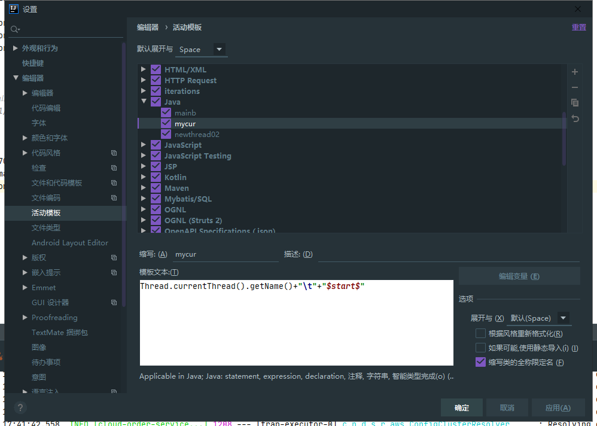

# 快捷键




## Windows

```
向上新增一行，并光标自动移入该行：Ctrl Alt Enter
向下新增一行，并光标自动移入该行：Shift Enter
```


## MacBook

IDEA 向上或向下新增一行，并光标移入

```
向上新增一行，并光标自动移入该行：option command Enter
向下新增一行，并光标自动移入该行：Shift Enter
```

