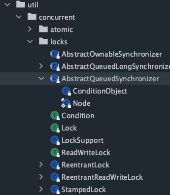

# AQS

抽象队列同步器


## [流程图](https://www.jianguoyun.com/p/DdqwVFAQ657yCBjl3tED)

## 前置知识

```markdown
# 公平锁和非公平锁
# 可重入锁
# LockSupport	
	- acquireQueued()方法会用到
# 自旋锁
# 数据结构之链表
# 设计模式之模板设计模式
```

## AQS是什么？

> 简单而言 ： AQS = state + CLH队列（变体为双向队列）

从ReentrantLock类开始

```java
public class AQSDemo {
    public static void main(String[] args) {
        ReentrantLock lock = new ReentrantLock();
    }
}
```

ReentrantLock里面有一个静态内部类Sync，继承了AbstractQueuedSynchronizer



上图为AbstractQueuedSynchronizer 在util的位置。

我们先从AQS的字面意思开始，抽丝剥茧。AbstractQueuedSynchronizer可被分为三部分，Abstract	/ Queued	/ Synchronizer

```markdown
# Abstract
	这是一个抽象类。符合模板设计模式，作为上帝视角的核心父类，给大家继承。
# Queued
	队列用于管理抢不到锁的线程管理
# Synchronizer同步器
	尝试在队列里面再次抢占锁。
	注意：同步器和同步不同，同步器是面向实现者，而同步即锁上面向使用者（API调用者）
```

## 基石

AQS：是用来构建锁或者其它同步器组件的`重量级基础框架及整个JUC体系的基石`，通过内置的CLH`(FIFO)队列`的变种来完成资源获取线程的排队工作，将每条将要去抢占资源的线程封装成一个Node节点来实现锁的分配，有一个`int类型变量`表示持有锁的状态(private volatile int state)，通过CAS完成对status值的修改(0表示没有，1表示阻塞)


### AQS为什么是JUC内容中最重要的基石？

(ReentrantLock | CountDownLatch | ReentrantReadWriteLock | Semaphore)

#### ReentrantLock


#### CountDownLatch


#### ReentrantReadWriteLock

#### Semaphore


## 同步器和锁的比较

锁，面向锁的使用者(定义了程序员和锁交互的使用层API，隐藏了实现细节，你调用即可)
同步器,面向锁的实现者(比如Java并发大神Douglee，提出统一规范并简化了锁的实现，屏蔽了同步状态管理、阻塞线程排队和通知、唤醒机制等。)

## 队列

> 海底捞餐位已满，门口的人怎么办呢？

加锁会导致阻塞、有阻塞就需要排队，实现排队必然需要`队列`。

抢到资源的线程直接使用处理业务逻辑，抢不到资源的必然涉及一种`排队等候机制`。抢占资源失败的线程继续去等待(类似银行业务办理窗口都满了， 暂时没有受理窗口的顾客只能去候客区排队等候)，但等候线程仍然保留获取锁的可能且获取锁流程仍在继续(候客区的顾客也在等着叫号，轮到了再去受理窗口办理业务)。


既然说到了排队等候机制，那么就一定会有某种队列形成，这样的队列是什么数据结构呢?

如果共享资源被占用，就需要一定的阻塞等待唤醒机制来保证锁分配。这个机制主要用的是`CLH队列的变体`实现的，将暂时获取不到锁的线程加入到队列中，这个队列就是AQS的抽象表现。它将请求共享资源的线程封装成队列的结点`(Node) `，通过CAS、自旋以及LockSuport.park()的方式，维护state变量的状态，使并发达到同步的控制效果。


*AQS使用一个`volatile的int类型的成员变量`来表示同步状态，通过内置的FIFO队列来完成资源获取的排队工作将每条要去抢占资源的线程封装成一个Node节点来实现锁的分配，通过CAS完成对State值的修改。*

AQS类似于HashMap，装的是Node结点，Node结点封装了没有抢占到资源的线程。

### AQS的Node

>队列中每个排队的个体就是一个Node


:warning:

> 通过源码可以知道，AQS的等待队列有`头尾指针head，tail`，每个Node结点也有`前后指针prev，next`。
>
> AQS有个int变量，state，Node也有个int类型变量，waitStatus。
>
> 一定不要混淆！


### AQS的state

每个节点中的“state”字段跟踪线程是否应该阻塞


### AQS同步队列的基本结构


## 从ReentranLock解读AQS源码

```java
public class AQSDemo {
    public static void main(String[] args) {
        ReentrantLock lock = new ReentrantLock();
        lock.lock();
        lock.unlock();
    }
}
```

ReentrantLock默认非公平锁，构造方法可知：

```java

		// 创建ReentrantLock一个实例。 这相当于使用ReentrantLock(false) 。
    public ReentrantLock() {
        sync = new NonfairSync();
    }
```

如果传入参数为true，那么为公平锁

```java
    public ReentrantLock(boolean fair) {
        sync = fair ? new FairSync() : new NonfairSync();
    }
```

都继承了静态内部类Sync

```java
static final class NonfairSync extends Sync{}

static final class FairSync extends Sync{}
```


我们再看看他们直接抢占锁的区别


### lock( )

#### CAS( )

```java
final void lock() {
    if (compareAndSetState(0, 1))
        setExclusiveOwnerThread(Thread.currentThread());
    else
        acquire(1);
}
```


### acquire( )

```java
public final void acquire(int arg) {
  	// 尝试获取，如果成功，则短路，后面的方法也不会执行。如果失败，则调用acquireQueued方法。
    if (!tryAcquire(arg) &&
        acquireQueued(addWaiter(Node.EXCLUSIVE), arg))
        selfInterrupt();
}
```

### tryAcquire(arg)

```java
// 标准的模板设计方法，必须实现否则抛出异常
protected boolean tryAcquire(int arg) {
    throw new UnsupportedOperationException();
}
```

nonfairTryAcquire就是其中一个实现方法。

```java
final boolean nonfairTryAcquire(int acquires) {
            final Thread current = Thread.currentThread();
            int c = getState();	// 得到AQS的state
            if (c == 0) {	// 为0说明该锁没有被占有。这是一种极端情况！B前脚刚刚进去，A后脚已经离开了
                if (compareAndSetState(0, acquires)) {
                    setExclusiveOwnerThread(current);
                    return true;	// !tryAcquire(arg)为false，短路
                }
            }
            else if (current == getExclusiveOwnerThread()) {	// 当前线程和持有锁的线程是同一个。这也是一种极端情况，A办理好事情，刚起身又坐回来。
                int nextc = c + acquires;
                if (nextc < 0) // overflow
                    throw new Error("Maximum lock count exceeded");
                setState(nextc);
                return true;	// !tryAcquire(arg)为false，短路
            }
            return false;	// !tryAcquire(arg)就为true，继续调用
        }
```


### acquireQueued(addWaiter(Node.EXCLUSIVE), arg))

假设上面的nonfairTryAcquire方法返回的是false，那么acquire方法的if语句就不会短路了，继续往前走，到acquireQueued。

现在将没有能够抢到锁的线程以Node结点的形式添加到队列中。

```java
public final void acquire(int arg) {
    if (!tryAcquire(arg) &&
        acquireQueued(addWaiter(Node.EXCLUSIVE), arg))	// EXCLUSIVE是Node结点的一个属性，mode模式。
        selfInterrupt();
}
```

#### addWaiter(Node.EXCLUSIVE)

```java
private Node addWaiter(Node mode) {
    Node node = new Node(Thread.currentThread(), mode);	// 对当前线程进行封装
    // Try the fast path of enq; backup to full enq on failure
    Node pred = tail;	// tail刚开始是指向null的
    if (pred != null) {	// B结点不会走这一步，但是C结点会，因为tail结点指向了B。
        node.prev = pred;
        if (compareAndSetTail(pred, node)) {
            pred.next = node;
            return node;
        }
    }
    enq(node);
    return node;
}
```

#### enq(final Node node)

```java
    private Node enq(final Node node) {
        for (;;) {
            Node t = tail;
            if (t == null) { // Must initialize
                if (compareAndSetHead(new Node()))	// 注意这里的new Node()，这是底层新建的哨兵结、dummy！不是没有抢占到锁的B结点！
                    tail = head;	// compareAndSetHead这一步已经让head指向了哨兵结点，tail也指向哨兵结点。
            } else {
                node.prev = t;	// B线程封装的Node结点的前指针，指向了t，而t又指向了哨兵结点。因此新来的Node也指向哨兵结点。
                if (compareAndSetTail(t, node)) {	// 尾指针指向了B结点
                    t.next = node;	// t指向的是哨兵结点，t.next就是哨兵结点的后指针，指向了B结点
                    return t;
                }
            }
        }
    }
```


#### acquireQueued( )

(会调用如下方法：`shouldParkAterFailedAcquire`和`parkAndCheckInterrupt` | setHead(node) )

```java
final boolean acquireQueued(final Node node, int arg) {
    boolean failed = true;
    try {
        boolean interrupted = false;
        for (;;) {
            final Node p = node.predecessor();
            if (p == head && tryAcquire(arg)) {	// B结点还想再抢一抢。
                setHead(node);
                p.next = null; // help GC
                failed = false;
                return interrupted;
            }
            if (shouldParkAfterFailedAcquire(p, node) &&
                parkAndCheckInterrupt())	// 到这里才算真正的入队！
                interrupted = true;
        }
    } finally {
        if (failed)
            cancelAcquire(node);
    }
}
```

##### shouldParkAfterFailedAcquire


##### parkAndCheckInterrupt

到这里parkAndCheckInterrupt才算真正的入队！


到此为止，B和C线程是彻彻底底的坐住了，不再乱蹦跶。


当我们执行下图中的③表示线程B或者C已经获取了permit了


#### setHead( )方法

代码执行完毕后,会出现如下图所示


B上位成功，原来的哨兵结点没有GCRoots指向，被GC回收。而原来的B结点作为新的哨兵结点。


### unlock( )获取permit

release | tryRelease | unparkSuccessor(h)


#### tryRelease()


#### unparkSuccessor( )

