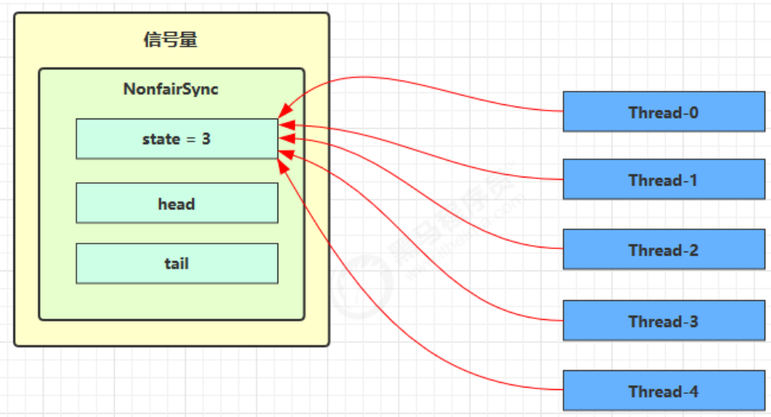
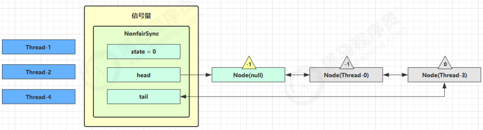
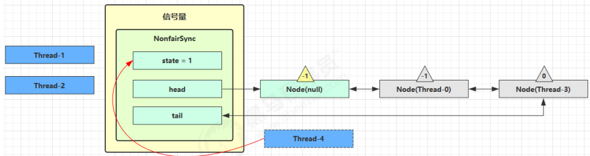
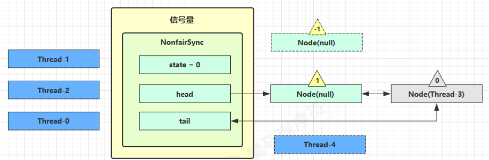

# 工具类

都是AQS的子类

```
Semaphore
CountdownLatch
CyclicBarrier
```

## Semaphore

### 基本概念

>秦灭六国，一统天下

```
[ˈsɛməˌfɔr] 信号量，用来限制能同时访问共享资源的线程上限。
限制的是线程的数量，而非共享资源的数量。
```

```
多个线程：多个车辆
共享资源：停车场的车位
Semaphore：门口公示牌，显示剩余车位100
```

```java
public static void main(String[] args) {
    // 1. 创建 semaphore 对象	，设置限制的最大许可为3
    Semaphore semaphore = new Semaphore(3);
    // 2. 10个线程同时运行
    for (int i = 0; i < 10; i++) {
        new Thread(() -> {
            // 3. 获取许可
            try {
                semaphore.acquire();
            } catch (InterruptedException e) {
                e.printStackTrace();
            }
            try {
                log.debug("running...");
                sleep(1);
                log.debug("end...");
            } finally {
                // 4. 释放许可
                semaphore.release();
            }
        }).start();
    }
}
```

### 应用

高并发

```
使用 Semaphore 限流，在访问高峰期时，让请求线程阻塞，高峰期过去再释放许可，当然它只适合限制单机线程数量，并且仅是限制线程数，而不是限制资源数（例如连接数，请对比 Tomcat LimitLatch 的实现）用 Semaphore 实现简单连接池，对比『享元模式』下的实现（用wait notify），性能和可读性显然更好，注意下面的实现中线程数和数据库连接数是相等的
```

### 原理

#### 加锁解锁流程

```
Semaphore 有点像一个停车场，permits 就好像停车位数量，当线程获得了 permits 就像是获得了停车位，然后停车场显示空余车位减一刚开始，permits（state）为 3，这时 5 个线程来获取资源
```



假设其中 Thread-1，Thread-2，Thread-4 cas 竞争成功，而 Thread-0 和 Thread-3 竞争失败，进入 AQS 队列park 阻塞



这时 Thread-4 释放了 permits，状态如下



接下来 Thread-0 竞争成功，permits 再次设置为 0，设置自己为 head 节点，断开原来的 head 节点，unpark 接下来的 Thread-3 节点，但由于 permits 是 0，因此 Thread-3 在尝试不成功后再次进入 park 状态



#### 源码


## CountdownLatch

### 基本概念

> 点火倒计时

```
用来进行线程同步协作，等待所有线程完成倒计时。
其中构造参数用来初始化等待计数值，await() 用来等待计数归零，countDown() 用来让计数减一
```

```java
public static void main(String[] args) throws InterruptedException {
    CountDownLatch latch = new CountDownLatch(3);
    new Thread(() -> {
        log.debug("begin...");
        sleep(1);
        latch.countDown();
        log.debug("end...{}", latch.getCount());
    }).start();
    new Thread(() -> {
        log.debug("begin...");
        sleep(2);
        latch.countDown();
        log.debug("end...{}", latch.getCount());
    }).start();
    new Thread(() -> {
        log.debug("begin...");
        sleep(1.5);
        latch.countDown();
        log.debug("end...{}", latch.getCount());
    }).start();
    log.debug("waiting...");
    latch.await();
    log.debug("wait end...");
}
```

### 原理


##  CyclicBarrier

### 基本概念

```
[ˈsaɪklɪk ˈbæriɚ] 循环栅栏，用来进行线程协作，等待线程满足某个计数。构造时设置『计数个数』，每个线程执行到某个需要“同步”的时刻调用 await() 方法进行等待，当等待的线程数满足『计数个数』时，继续执行
```

### 原理