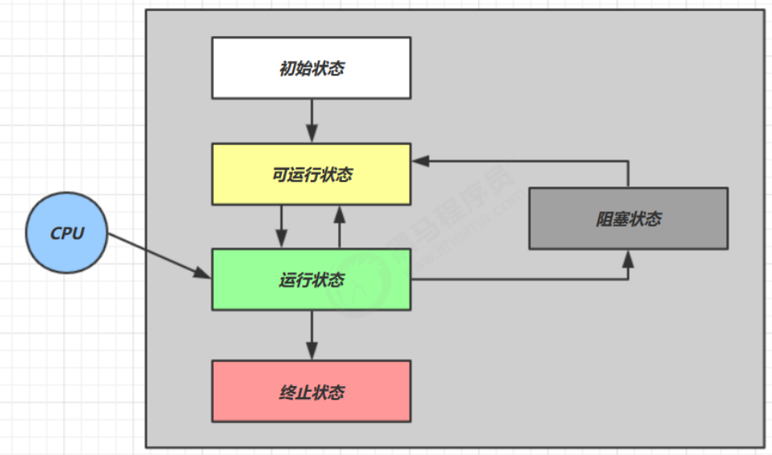

# 线程的状态

## 5种状态，操作系统层面



```
【初始状态】仅是在语言层面创建了线程对象，还未与操作系统线程关联
【可运行状态】（就绪状态）指该线程已经被创建（与操作系统线程关联），可以由 CPU 调度执行
【运行状态】指获取了 CPU 时间片运行中的状态
	当 CPU 时间片用完，会从【运行状态】转换至【可运行状态】，会导致线程的上下文切换
【阻塞状态】
	如果调用了阻塞 API，如 BIO 读写文件，这时该线程实际不会用到 CPU，会导致线程上下文切换，进入【阻塞状态】
	等 BIO 操作完毕，会由操作系统唤醒阻塞的线程，转换至【可运行状态】
	与【可运行状态】的区别是，对【阻塞状态】的线程来说只要它们一直不唤醒，调度器就一直不会考虑调度它们
【终止状态】表示线程已经执行完毕，生命周期已经结束，不会再转换为其它状态
```

## 6种状态，Java层面

```
这是从 Java API 层面来描述的
根据 Thread.State 枚举，分为六种状态
```


```
NEW 线程刚被创建，但是还没有调用 start() 方法
RUNNABLE 当调用了 start() 方法之后，注意，Java API 层面的 RUNNABLE 状态涵盖了 操作系统 层面的【可运行状态】、【运行状态】和【阻塞状态】（由于 BIO 导致的线程阻塞，在 Java 里无法区分，仍然认为是可运行）
BLOCKED ， WAITING ， TIMED_WAITING 都是 Java API 层面对【阻塞状态】的细分
TERMINATED 当线程代码运行结束
```

## 状态转换

假设有线程 `Thread t`

情况 1 NEW --> RUNNABLE

```
当调用 t.start() 方法时，由 NEW --> RUNNABLE
```

情况 2 RUNNABLE <--> WAITING

```
t 线程用 synchronized(obj) 获取了对象锁后
	调用 obj.wait() 方法时，t 线程从 RUNNABLE --> WAITING
	调用 obj.notify() ， obj.notifyAll() ， t.interrupt() 时
		竞争锁成功，t 线程从 WAITING --> RUNNABLE
		竞争锁失败，t 线程从 WAITING --> BLOCKED
```

情况 3 RUNNABLE <--> WAITING

```
当前线程调用 t.join() 方法时，当前线程从 RUNNABLE --> WAITING
	注意是当前线程在t 线程对象的监视器上等待
t 线程运行结束，或调用了当前线程的 interrupt() 时，当前线程从 WAITING --> RUNNABLE
```

情况 4 RUNNABLE <--> WAITING

```
当前线程调用 LockSupport.park() 方法会让当前线程从 RUNNABLE --> WAITING
调用 LockSupport.unpark(目标线程) 或调用了线程 的 interrupt() ，会让目标线程从 WAITING --> RUNNABLE
```

情况 5 RUNNABLE <--> TIMED_WAITING

```
t 线程用 synchronized(obj) 获取了对象锁后
	调用 obj.wait(long n) 方法时，t 线程从 RUNNABLE --> TIMED_WAITING
	t 线程等待时间超过了 n 毫秒，或调用 obj.notify() ， obj.notifyAll() ， t.interrupt() 时
		竞争锁成功，t 线程从 TIMED_WAITING --> RUNNABLE
		竞争锁失败，t 线程从 TIMED_WAITING --> BLOCKED
```

情况 6 RUNNABLE <--> TIMED_WAITING

```
当前线程调用 t.join(long n) 方法时，当前线程从 RUNNABLE --> TIMED_WAITING
	注意是当前线程在t 线程对象的监视器上等待
当前线程等待时间超过了 n 毫秒，或t 线程运行结束，或调用了当前线程的 interrupt() 时，当前线程从TIMED_WAITING --> RUNNABLE
```

情况 7 RUNNABLE <--> TIMED_WAITING

```
当前线程调用 Thread.sleep(long n) ，当前线程从 RUNNABLE --> TIMED_WAITING
当前线程等待时间超过了 n 毫秒，当前线程从 TIMED_WAITING --> RUNNABLE
```

情况 8 RUNNABLE <--> TIMED_WAITING

```
当前线程调用 LockSupport.parkNanos(long nanos) 或 LockSupport.parkUntil(long millis) 时，当前线程从 RUNNABLE --> TIMED_WAITING
调用 LockSupport.unpark(目标线程) 或调用了线程 的 interrupt() ，或是等待超时，会让目标线程从TIMED_WAITING--> RUNNABLE
```

情况 9 RUNNABLE <--> BLOCKED

```
t 线程用 synchronized(obj) 获取了对象锁时如果竞争失败，从 RUNNABLE --> BLOCKED
持 obj 锁线程的同步代码块执行完毕，会唤醒该对象上所有 BLOCKED 的线程重新竞争，如果其中 t 线程竞争成功，从 BLOCKED --> RUNNABLE ，其它失败的线程仍然 BLOCKED
```

情况 10 RUNNABLE <--> TERMINATED

```
当前线程所有代码运行完毕，进入 TERMINATED
```

