# 线程运行原理

## main单线程

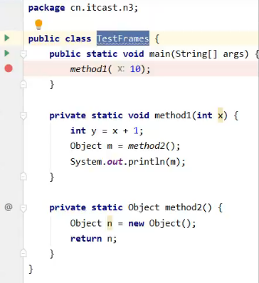

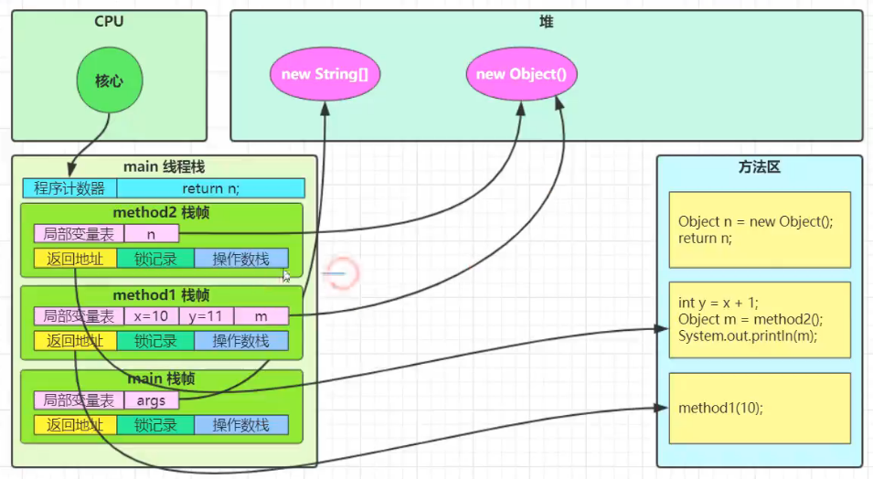

## 多线程

现在我们只有一个main线程

此时再加上一个线程

```java
public static void main(String[] args) {
    Thread t1 = new Thread(){
        @Override
        public void run() {
            method01(20);
        }
    };
    t1.setName("t1");
    t1.start();
    method01(10);
}

private static void method01(int x) {
    int y = x + 1;
    method02();
    System.out.println();
}

private static Object method02() {
    Object o = new Object();
    return o;
}
```

加断点

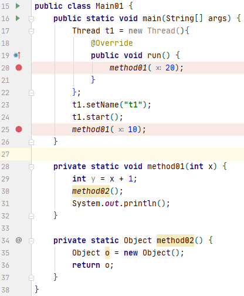

断点模式皆设置为Thread，然后debug

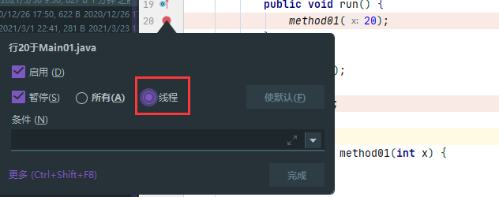

### 流程

1、调用main函数，main函数对应的栈帧被压入到栈中，局部变量表有args和t1，args引用了一个String[]类型的对象，t1引用了一个线程对象，这两个对象都在堆内存中。

```java
public static void main(String[] args)
```

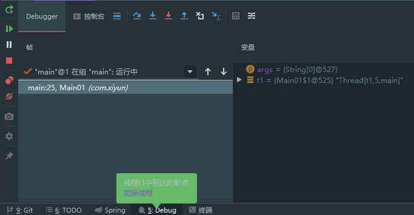

2、步入，调用method01函数，对应的栈帧压入栈中，局部变量表有个x，y。

```java
private static void method01(int x) {
    int y = x + 1;
    method02();
    System.out.println();
}
```


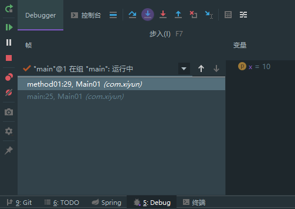

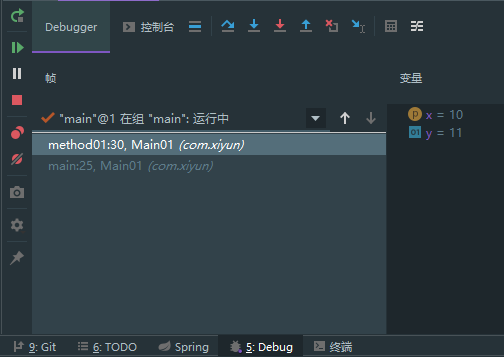

3、调用method2，局部变量表中有o，引用了一个堆内存中刚创建的Object对象。

```java
private static Object method02() {
    Object o = new Object();
    return o;
}
```

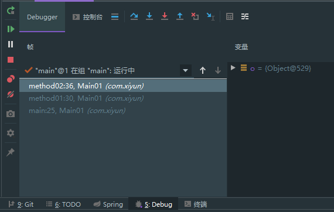

4、切换线程

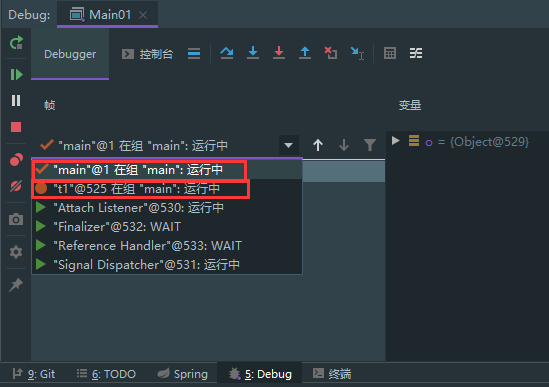

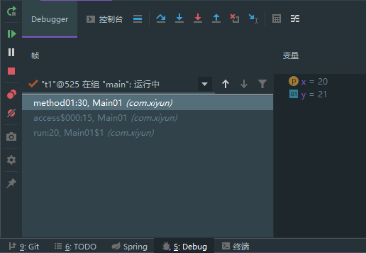

## 线程上下文切换（Thread Context Switch）

上下文切换由操作系统的任务调度器完成。

main线程因为某种原因让出了时间片，此时CPU开始执行t1线程的代码。原因如下：

```
1. 线程的 cpu 时间片用完
2. 垃圾回收
3. 有更高优先级的线程需要运行
4. 线程自己调用了 sleep、yield、wait、join、park、synchronized、lock 等方法
```

`当 Context Switch 发生时，需要由操作系统保存当前线程的状态，并恢复另一个线程的状态`，Java 中对应的概念就是程序计数器（Program Counter Register），它的作用是记住下一条 jvm 指令的执行地址，是线程私有的。

```
1. 状态包括程序计数器、虚拟机栈中每个栈帧的信息，如局部变量、操作数栈、返回地址等
2. Context Switch 频繁发生会影响性能
```

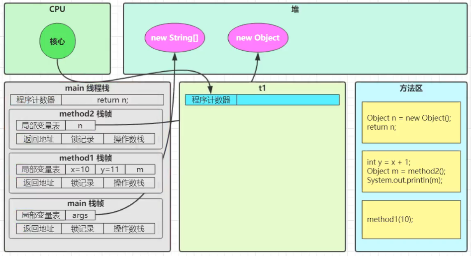

重新切换到了main线程

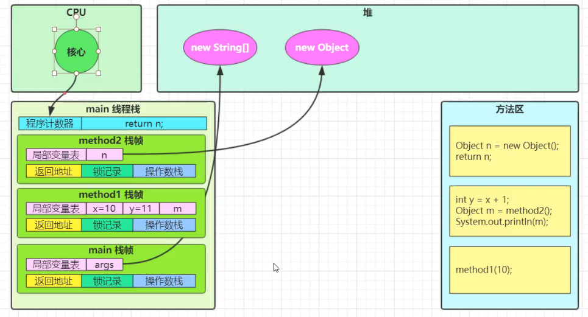