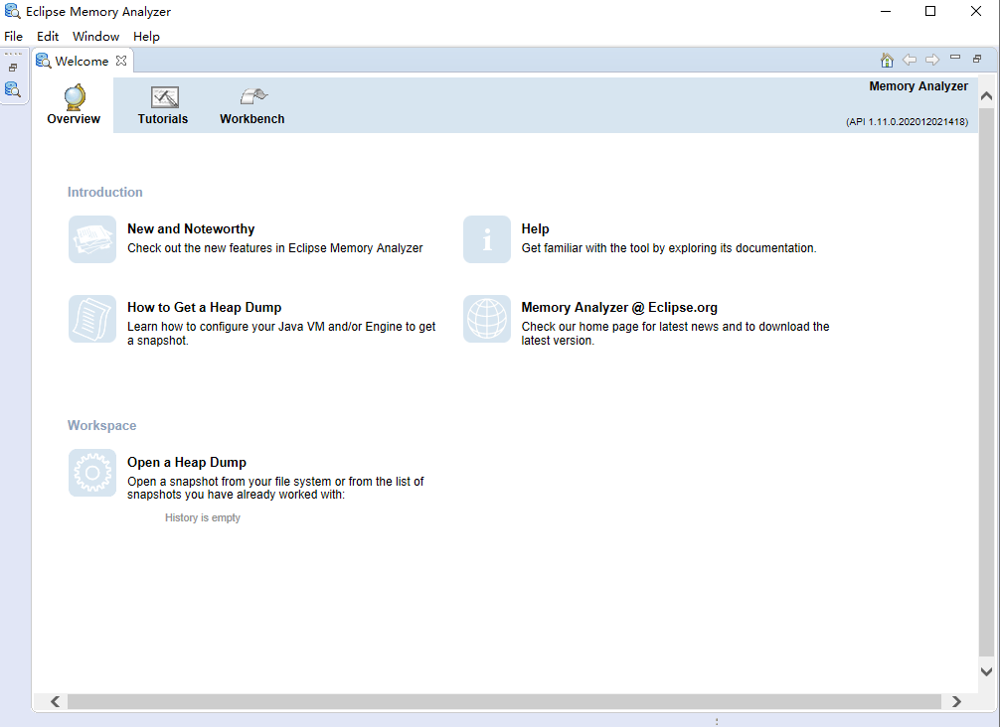
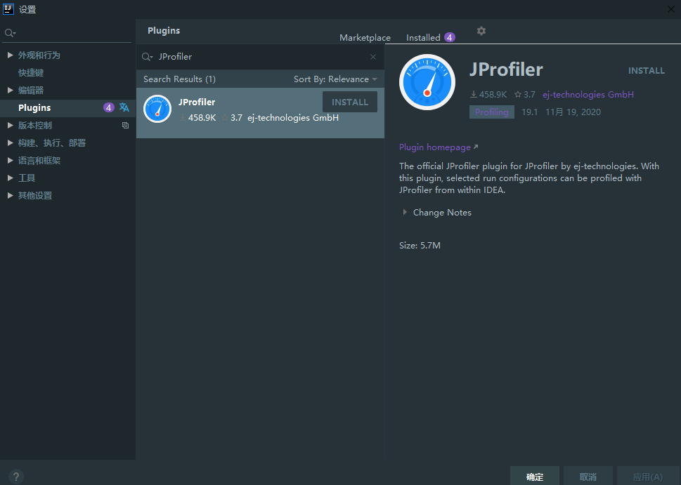
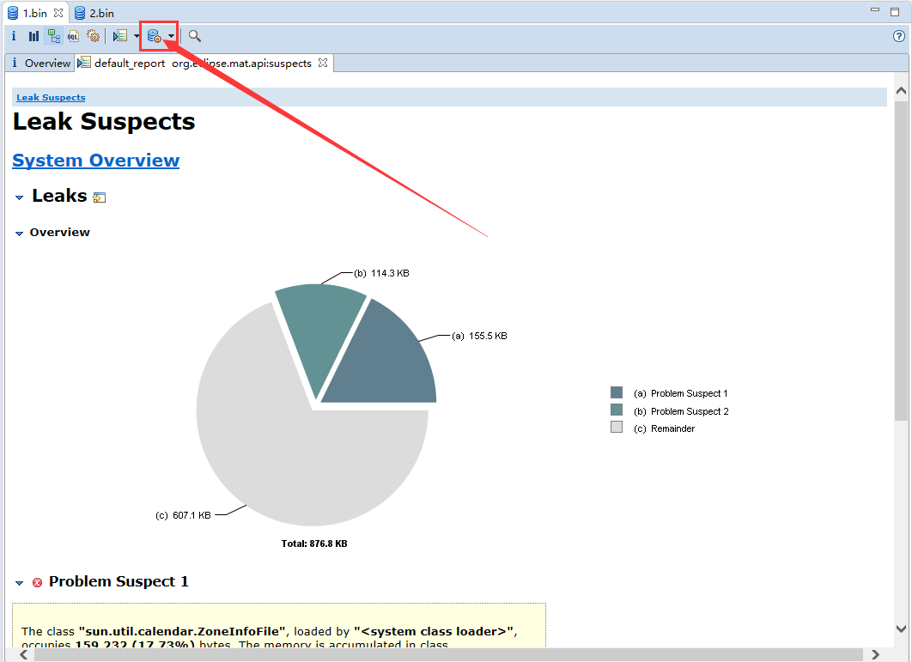
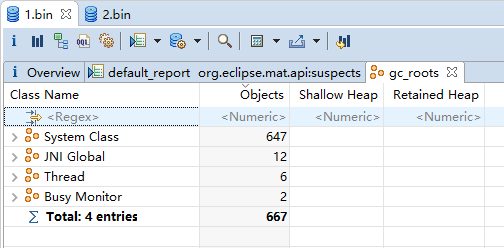
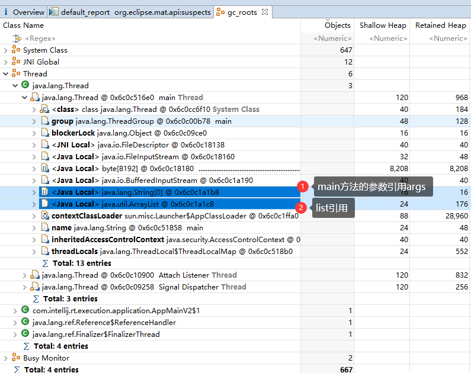
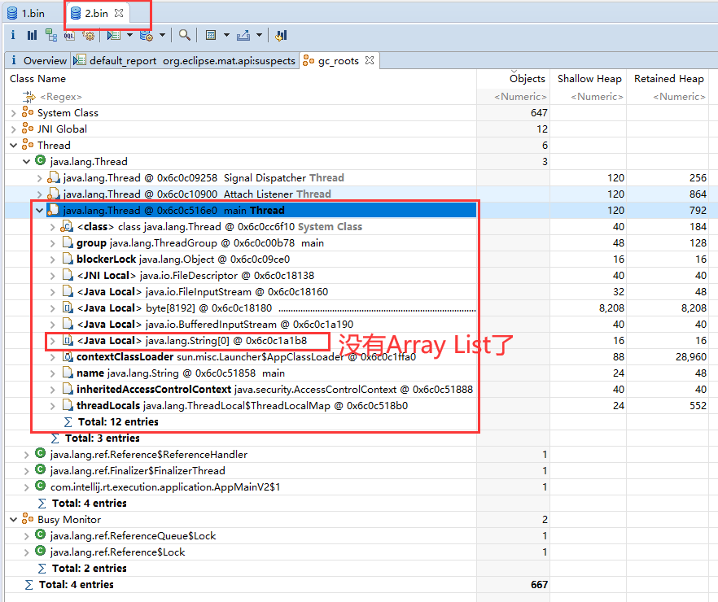
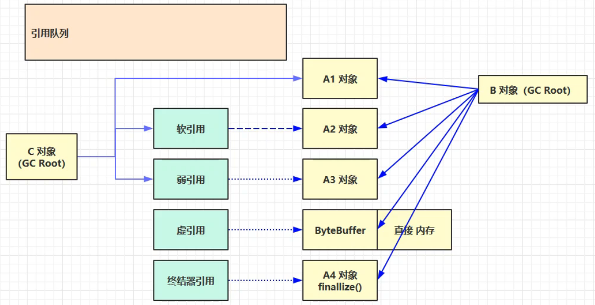

# 垃圾回收

## 可达性分析算法

```r
Java虚拟机中的垃圾回收器采用`可达性分析`来探索所有存活的对象。
扫描堆中的对象，看是否能够沿着GC Root对象为起点的引用链找到该对象，找不到，表示可以回收。
哪些对象可以作为 GC Root ?
```

### GC Root

选择以下任意工具都可以，我一般用第一个。

1. Java内存分析工具MAT(Memory Analyzer Tool)：http://www.eclipse.org/mat/downloads.php



1. IDEA的JProfiler插件



测试代码

```java
public static void main(String[] args) throws IOException {
    List<String> list = new ArrayList<>();
    list.add("a");
    list.add("b");
    System.out.println(1);
    System.in.read();

    list = null;
    System.out.println(2);
    System.in.read();
    System.out.println("end...");
}
```

运行第一次

使用`jps`和`jmap`工具

```r
jps
jmap -dump:format=b,live,file=1.bin	进程id

	-dump表示快照文件
    format表示格式
    b表示二进制
    live表示抓快照时只抓取存活对象，已经垃圾回收掉的就过滤掉了
    file表示存储文件，1.bin就是当前目录下的1.bin
```


再回车，运行第二次

使用MAT工具打开快照文件1.bin、2.bin

点击下图的图标，选中Java Basics/GC Roots





```r
1. System Class对象：BootStrap启动类加载器加载的对象
2. JVM虚拟机要调用操作系统方法，操作系统的方法在执行时引用的Java对象
3. Thread：活动线程，也是对象。
	另外线程在运行时总有一次次的方法调用，每次方法的调用会产生一个栈帧，栈帧内使用的东西可以作为GC Root。如当前活动栈帧的局部变量（引用）
4. Busy Monitor：Java对象中有同步锁机制，Synchronized对一个对象加了锁，被加锁的对象不能当成垃圾。如果被当成垃圾回收掉了，将来就没法解锁。
```

以Main Thread举例，main方法的args和list都在局部变量表中，会作为GC Root。



切换到`2.bin`，会发现没有Array List了，因为`list = null;`，list不再引用堆内存中的ArrayList对象。



## 引用



### 强引用

GCRoot直接引用的对象

### 软引用

GCRoot间接引用的对象，如果发生了垃圾回收，内存仍然不足时会对这一类对象进行回收。

### 弱引用

每发生一次垃圾回收，就会回收掉这种对象。

### 引用队列

### 虚引用

### 终结器引用


## 垃圾回收算法

### 标记-清除

### 标记-复制

### 标记-整理

### 分代理论

## 垃圾回收器

