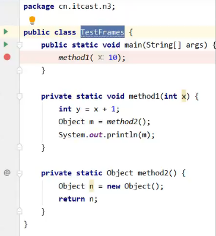
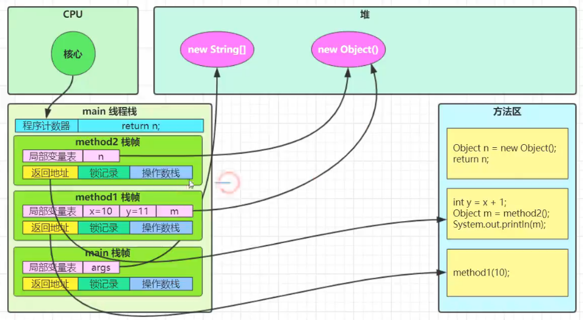
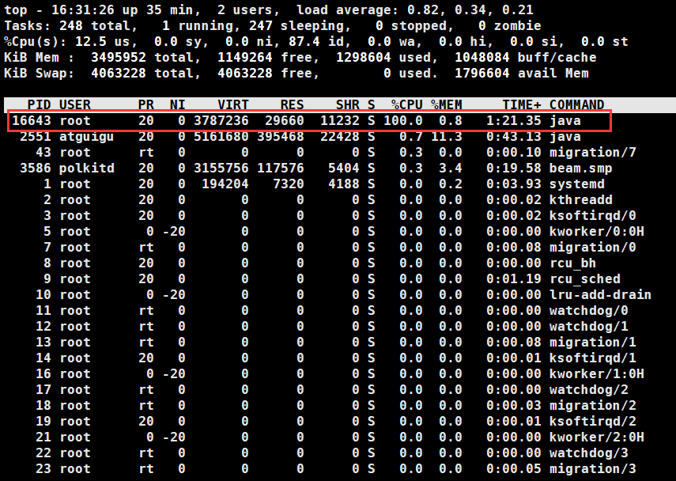
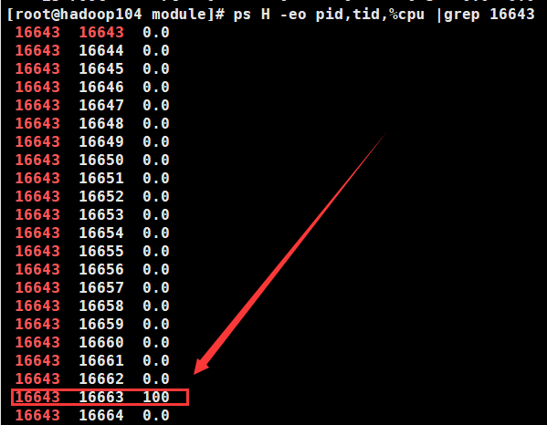

# Java内存区域





## 运行时数据区

Java虚拟机在执行Java程序的过程中会把它所管理的内存划分为若干个不同的数据区域。这些区域都有各自的用途，以及创建和销毁的时间，有的区域随着虚拟机进程的启动而存在，有些区域则依赖用户线程的启动和结束而建立和销毁。

| 区域       |          |          |
| ---------- | :------- | -------- |
| 程序计数器 | 线程私有 |          |
| 虚拟机栈   | 线程私有 |          |
| 本地方法栈 | 线程私有 |          |
| 堆         |          | 线程共享 |
| 方法区     |          | 线程共享 |

### 程序计数器

程序计数器（Program Counter Register）是一块较小的内存空间，它可以看作是当前线程所执行的字节码的`行号指示器`。**用来是纪录下一条要执行的jvm指令的地址**。

程序计数器是`线程私有，朝生夕灭的`。

由于Java虚拟机的多线程是通过线程轮流切换并分配处理器执行时间的方式来实现的，在任何一个确定的时刻，一个处理器（对于多核处理器来说是一个内核）都只会执行一条线程中的指令。因此，为了线程切换后能恢复到正确的执行位置，每条线程都需要有一个独立的程序计数器，各条线程之间计数器互不影响，独立存储。

如果线程正在执行的是一个Java方法，这个计数器记录的是正在执行的虚拟机字节码指令的地址；如果正在执行的是Native方法，这个计数器值则为空(Undefined)。此内存区域是唯一个在Java虛拟机规范中`没有规定任何OutOfMemoryError情况的区域`。

#### 问

程序计数器为什么是线程私有的？

一时刻，一处理器，处理一线程指令。线程切换后需要恢复到正确位置，所以每个线程需要独立的程序计数器。


### 虚拟机栈

虚拟机栈针对的是Java方法，其描述的是Java方法执行的内存模型：每个方法在执行的同时都会创建一个`栈帧`用于存储局部变量表、操作数栈、动态链接、方法出口等信息。每一个方法从调用直至执行完成的过程，就对应着一个栈帧在虚拟机栈中入栈到出栈的过程。 


#### 栈帧

```
局部变量表
操作数栈
动态链接
方法返回地址
附加信息
```

#### 局部变量表

```r
局部变量表存放了编译期可知的各种基本数据类型(boolean、 byte、 char、 short、 int、 float、 long、double)、对象引用(reference类型， 它不等同于对象本身，可能是一个指向对象起始地址的`引用指针`，也可能是指向一个代表对象的句柄或其他与此对象相关的位置)和returnAddress类型(指向了一条字节码指令的地址)
```


#### 操作数栈

用于存放计算的中间结果

#### 栈顶缓存技术

栈是放在内存中的，性能不高。将栈顶元素缓存至cpu的物理寄存器中，这样可以降低内存的频繁读写，提高执行引擎的性能。

#### 动态链接


#### 方法返回地址


#### 附加信息


#### 栈的相关问题

```r
1. 垃圾回收是否涉及栈内存？
2. 栈内存分配越大越好吗？
3. 方法内的局部变量是否线程安全？
	如果方法内局部变量没有逃离方法的作用访问，它是线程安全的
	如果是局部变量引用了对象，并逃离方法的作用范围，需要考虑线程安全
```


##### 栈内存溢出

```r
栈帧过多导致栈内存溢出
栈帧过大导致栈内存溢出
```

##### 线程运行诊断

###### 案例1：cpu占用过多:fire:，面试题：cpu占用过高怎么办？

vim CPU100%.java

```java
import java.util.concurrent.TimeUnit;

/**
 * @author 溪云
 * @verse 溪云初起日沉阁，山雨欲来风满楼。
 * @date Created in 2021/3/30 16:08
 */
public class CPU100% {
    public static void main(String[] args) {
        new Thread(() -> {
            System.out.println("1...");
            while (true){

            }
        },"t1").start();

        new Thread(() -> {
            System.out.println("2...");
            try {
                TimeUnit.MINUTES.sleep(30);
            } catch (InterruptedException e) {
                e.printStackTrace();
            }
        },"t2").start();
    }
}

```

后台挂起运行

```
javac CPU100%.java
java CPU100%
```

```r
1. 定位
	在 Linux 用 top 定位哪个`进程`对 cpu 的占用过高

2. ps H -eo pid,tid,%cpu | grep 进程id （用ps命令进一步定位是哪个`线程`引起的 cpu 占用过高）
	H是打印，pid是进程id，tid是线程id，%cpu是cpu信息，grep是过滤（不加的话进程太多）

3. jstack 进程 id
可以根据线程 id 找到有问题的线程，进一步定位到问题代码的源码行号。jstack的nid就是线程id，是16进制的，需要将问题线程id由10进制转换为16进制。
```





###### 案例2：程序运行很长时间没有结果

```r
可能是出现了死锁
```


#### 两种异常

- StackOverflowError：如果线程请求的栈深度大于虚拟机所允许的深度
- OutOfMemoryError：如果扩展时无法申请到足够的内存


### 本地方法栈

```r
本地方法栈与虚拟机栈很类似，只不过虚拟机栈是对Java方法进行服务的，而本地方法栈是对本地方法进行服务的，Java有时候不能和操作系统底层打交道，就需要一些c或者c++语言编写的本地方法和操作系统的api交互。

虚拟机规范没有特别指明，所以HotSpot将虚拟机栈和本地方法栈合二为一了。
```


### 堆

```r
Java堆是JVM管理的内存中最大的一块，也是所有线程`共享的`一块内存区域。

唯一目的：通过new关键字，存放对象实例。几乎所有对象都在这里分配内存。

为了更好的垃圾回收，Java堆中还可以细分为：新生代和老年代；再细致一点的有Eden空间、From Survivor空间、To Survivor空间等。

根据Java虚拟机规范的规定，Java堆 可以处于物理上不连续的内存空间中，`只要逻辑上是连续的即可`，就像我们的磁盘空间一样。在实现时，既可以实现成固定大小的，也可以是可扩展的，不过当前主流的虚拟机都是按照可扩展来实现的(通过`-Xmx`和`-Xms`控制)。如果在堆中没有内存完成实例分配，并且堆也无法再扩展时，将会抛出OutOfMemoryError异常。
```


### 方法区

用于`存储`已被虚拟机加载的`类信息、 常量、静态变量、即时编译器编译后的代码`等数据。虽然Java虚拟机规范把方法区描述为堆的一个逻辑部分，但是 

别名叫做Non-Heap（非堆），目的应该是与Java堆区分开来。

#### 常量池

以你好世界举例

```java
public class Hello(){
    public static void main(String[] args){
        System.out.println("你好世界");
    }
}
```

javap反编译

```r
public static void main(java.lang.String[]);
    descriptor: ([L后端/java/lang/String;)V
    flags: ACC_PUBLIC, ACC_STATIC
    Code:
      stack=2, locals=1, args_size=1
         0: getstatic     #2                  // Field 后端/java/lang/System.out:L后端/java/io/PrintStream;
         3: ldc           #3                  // String 你好世界
         5: invokevirtual #4                  // Method 后端/java/io/PrintStream.println:(L后端/java/lang/String;)V
         8: return
      LineNumberTable:
        line 18: 0
        line 19: 8
      LocalVariableTable:
        Start  Length  Slot  Name   Signature
            0       9     0  args   [L后端/java/lang/String;
```

细节

```r
1. getstatic得到某个类的静态成员变量，#2表示到常量池去找
    #2 = Fieldref           #21.#22        // 后端/java/lang/System.out:L后端/java/io/PrintStream;
    意思是找到一个java.lang包下的System类的out成员变量，这个out成员变量是PrintStream类型的。
2. ldc加载，找到一个引用地址
3. invokevirtual 调用虚方法，刚才我们找到了PrintStream类型的out成员变量，现在调用将这个成员变量引用的对象的方法，也就是println
```


#### 运行时常量池

上面我们看到的是常量池信息，但是运行时是要把常量池放到内存里面的，也就是运行时常量池。

方法区的一部分。

class文件中有一个常量池，用于`存放编译期`生成的各种字面量和符号引用，这部分内容将在类加载后进入方法区的运行时常量池中存放。 

#### StringTable


### 直接内存

```r
常见于 NIO 操作时，用于数据缓冲区
分配回收成本较高，但读写性能高
不受 JVM 内存回收管理
```

分配和回收原理

```r
使用了 Unsafe 对象完成直接内存的分配回收，并且回收需要主动调用 freeMemory 方法
ByteBuffer 的实现类内部，使用了 Cleaner （虚引用）来监测 ByteBuffer 对象，一旦 ByteBuffer 对象被垃圾回收，那么就会由 ReferenceHandler 线程通过 Cleaner 的 clean 方法调用 freeMemory 来释放直接内存
```

