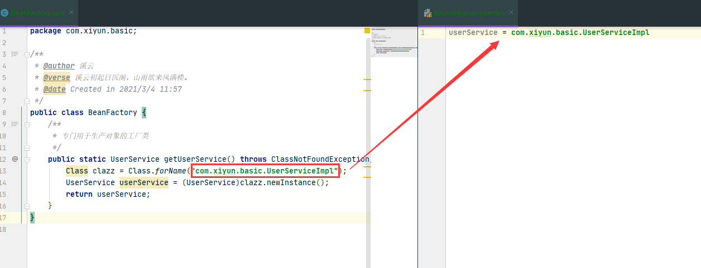
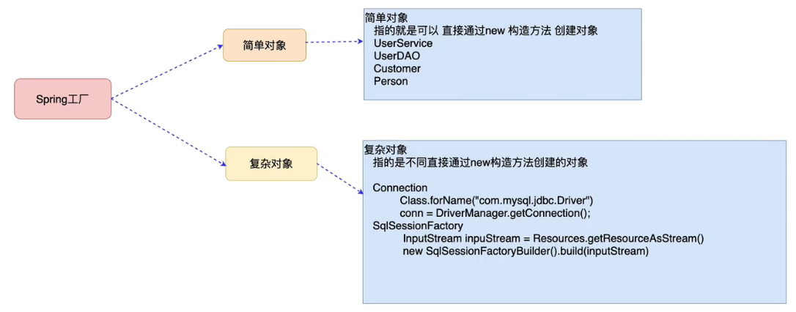
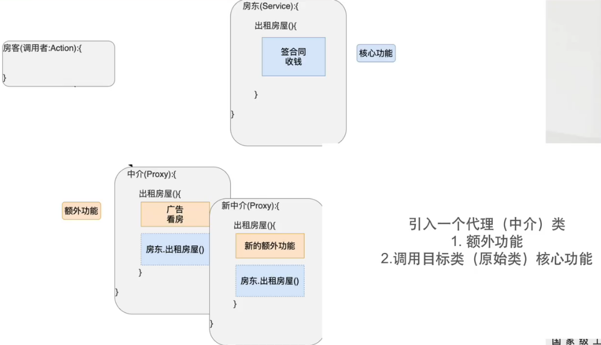
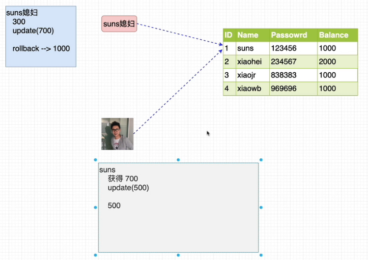
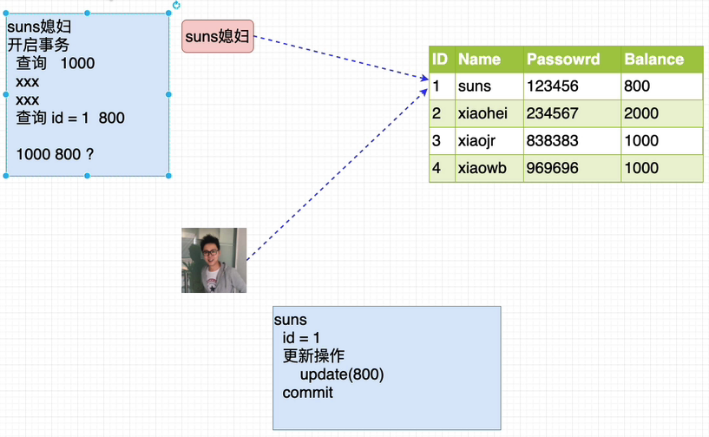
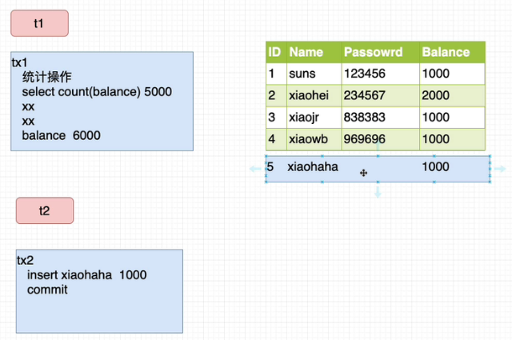
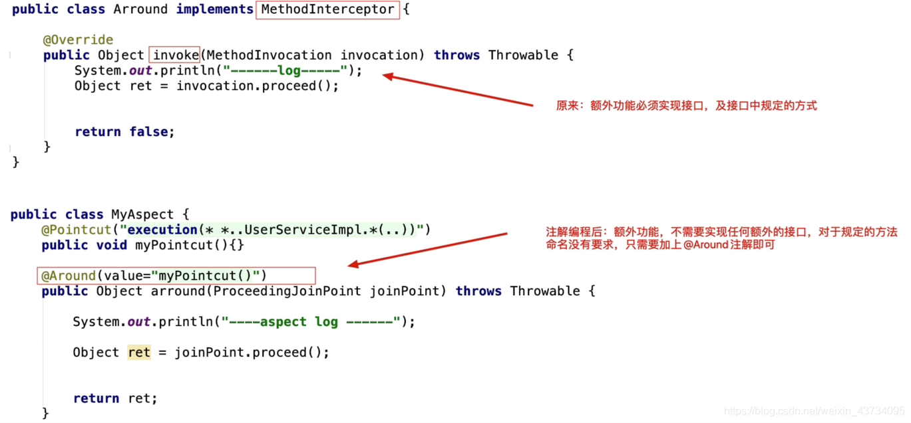

视频：https://www.bilibili.com/video/BV185411477k

# Spring

## 引言

### EJB（Enterprise Java Bean）

缺点：运行环境苛刻，代码 移植性差

总结：重量级框架

### spring

spring是一个轻量级javaEE解决方案，整合了多种优秀的设计模式

轻量级：运行环境没有额外的要求，代码移植性高

### 设计模式

在面向对象设计中，解决特定问题的经典代码

#### 工厂设计模式

过去

```java
// 每次有新的实现类都要修改其他的代码，耦合性高！
UserService userService = new UserServiceImpl();
UserService userService = new UserServiceImplNew();
```

##### 什么是工厂设计模式

```markdown
1.概念:通过工厂类，创建对象
	User user = new User();
	UserDAO userDAO = new UserDAOImpl();
2.好处:解耦合
	耦合:指定是代码间的强关联关系，-方的改变会影响到另一方
	问题:不利于代码维护
	简单:把接口的实现类，硬编码在程序中
		UserService userService = new UserServiceImp1();
```

##### 简单工厂模式

BeanFactory

第一次创建

```java
public class BeanFactory {
    /**
     * 专门用于生产对象的工厂类
     */
    public static UserService getUserService(){
        UserService userService = new UserServiceImpl();
        return userService;
    }
}
```

测试类

```java
// UserService userService = new UserServiceImpl();
UserService userService = BeanFactory.getUserService();	// 第一次解耦合
```


##### 反射工厂

现在BeanFactory工厂类中，仍然存在耦合，因为UserService userService = new UserServiceImpl();硬编码在了工厂类。需要修改。

回顾对象的创建方式：

```java
对象的创建方式：
    1.直接调用构造方法 创建对象 UserService userService = new UserServiceImpl();
    2.通过反射的形式 创建对象 解耦合
        Class clazz = Class.forName("com.xiyun.basic.UserServiceImpl");
		UserService userService = (UserService)clazz.newInstance();
```

反射工厂的实现

```java
public class BeanFactory {
    public static UserService getUserService() throws ClassNotFoundException, IllegalAccessException, InstantiationException {
        Class clazz = Class.forName("com.xiyun.basic.UserServiceImpl");
        UserService userService = (UserService)clazz.newInstance();
        return userService;
    }
}
```

反射可以解耦合，但是真的就解耦合了吗？

```java
我们还是传入了UserService实现类的全限定类名，"com.xiyun.basic.UserServiceImpl"
如果有朝一日对这个类名不满意了，想替换为新的类，那么这个全限定名也应该换成新的，如"com.xiyun.basic.UserServiceImplNew"
```

配置文件`application.properties`



```properties
# Properties 集合 存储 Properties文件的内容
# 特殊的Map key=String value=String
# Properties [userService = com.xiyun.xxx.UserServiceImpl]
# Properties.getProperty("userService")

userService = com.xiyun.basic.UserServiceImpl
```


~~~java
public class BeanFactory {
    private static Properties env = new Properties();
    // IO是系统级资源，避免重复性打开IO，最好程序启动的时候一次性读取，所以用静态代码块
    static{
        try {
            // 第一步 获取IO流
            InputStream inputStream = BeanFactory.class.getResourceAsStream("/application.properties");
            // 第二部 文件内容 封装 Properties集合中，key = userService value = com.xiyun.basic.UserServiceImpl
            env.load(inputStream);
            
            inputStream.close();
        } catch (IOException e) {
            e.printStackTrace();
        }
    }
    public static UserService getUserService() throws ClassNotFoundException, IllegalAccessException, InstantiationException {
        Class clazz = Class.forName(env.getProperty("userService"));	// 根据key得到value
        UserService userService = (UserService)clazz.newInstance();
        return userService;
    }
}
~~~

此时，BeanFactory工厂类还有耦合吗，还有类的影子吗？没有了，有的只是一个标识、一个名字而已。 

```java
Class clazz = Class.forName(env.getProperty("userService"));	// 根据key得到value
```

工厂类没有耦合了，那么其他地方呢？

```java
public class UserServiceImpl implements UserService{
    private UserDao userDao = new UserDaoImpl();
    @Override
    public void register(User user) {
        userDao.save(user);
    }

    @Override
    public void login(String name, String password) {
        userDao.queryUserByNameAndPassword(name, password);
    }
}
```

可以发现上面的UserServiceImpl出现了耦合，将UserDao的实现类硬编码在了程序中。

```java
private UserDao userDao = new UserDaoImpl();
```

此时在BeanFactory工厂类中，可以提供创建dao对象的方法

```java
    public static UserDao getUserDao() throws ClassNotFoundException, IllegalAccessException, InstantiationException {
        Class clazz = Class.forName(env.getProperty("userDao"));	// 修改application.properties的key value
        UserDao userDao = (UserDao)clazz.newInstance();
        return userDao;
    }
```

##### 通用工厂模式


```markdown
未来，如果我们每有一个对象要解耦合，就要在工厂中对应一个创建对象的方法，这可能会是成百上千的。
通过上图，我们可以观察到，这些方法其实是重复的、冗余的。
```

```java
public static Object getBean(String key) throws ClassNotFoundException, IllegalAccessException, InstantiationException {
    Class clazz = Class.forName(env.getProperty(key));
    Object o = clazz.newInstance();
    return o;
}
```

###### 通用工厂的使用方式

```markdown
1. 定义类型(类)
2. 通过配置文件的配置告知工厂(application.properties)
	key = value
3. 通过工厂获得类的对象
	Object o = BeanFactory.getBean("key")
```

##### 总结

```markdown
spring本质:
	工厂 ApplicationContext
	配置文件 applicationContext.xml
我们上面用的是:
    工厂 BeanFactory
    配置文件 application.properties
```


### spring核心api

ApplicationContext

作用：Spring提供的ApplicationContext这个工厂，用于对象的创建

好处：解耦合

ApplicationContext接口类型：

接口：屏蔽实现的差异 

非web环境：`ClassPathXmlApplicationContext(main,junit) `

web环境：`XmlWebApplicationContext`

**ApplicationContext是一个重量级资源**

- 工厂对象占用内存比较多，不会频繁的 创建对象，一个应用只会占用一个工厂对象。

- ApplicationContext工厂：一定是一个线程安全的（支持多线程并发访问）

名词解释

```markdown
Spring工厂创建的对象，叫做 bean 或者 Component
```


```java
@Test
public void test4() {
    ApplicationContext ctx = new ClassPathXmlApplicationContext("/applicationContext.xml");
    Person person = ctx.getBean("person", Person.class);
    System.out.println("person = " + person);
    

    //当前Spring的配置文件中 只能有一个<bean class是Person类型
    Person person = ctx.getBean(Person.class);
    System.out.println("person = " + person);
    

    //获取的是 Spring工厂配置文件中所有bean标签的id值  person person1
    String[] beanDefinitionNames = ctx.getBeanDefinitionNames();
    for (String beanDefinitionName : beanDefinitionNames) {
        System.out.println("beanDefinitionName = " + beanDefinitionName);
    }

    //根据类型获得Spring配置文件中对应的id值
    String[] beanNamesForType = ctx.getBeanNamesForType(Person.class);
    for (String id : beanNamesForType) {
        System.out.println("id = " + id);
    }

    //用于判断是否存在指定id值得bean,不能判断name值
    if (ctx.containsBeanDefinition("person")) {
        System.out.println("true = " + true);
    }else{
        System.out.println("false = " + false);
    }


    //用于判断是否存在指定id值得bean,也可以判断name值
    if (ctx.containsBean("p")) {
        System.out.println("true = " + true);
    }else{
        System.out.println("false = " + false);
    }
}
```

1. 只配置class属性

  ```xml
  <bean class="com.baizhiedu.basic.Person"/>
  a) 上述这种配置 有没有id值com.baizhiedu.basic.Person#0
  b) 应⽤场景： 如果这个bean只需要使一次，那么就可以省略id值
              如果这个bean会使用多次，或者被其他bean引用则需要设置id值
  
  ```

2. 配置name属性

作用：用于在Spring的配置文件中，为bean对象定义别名（小名）

相同：

```xml
1. ctx.getBean("id|name") -->object
2. <bean id="" class=""
	等效
   <bean name="" class=""
区别：别名可以定义多个,id可以定义多个
   <bean name="p1, p2" class=""
XML的id属性的值，命名要求：必须以字母开头 name属性的值，命名没有要求
但是目前XML文件没有这个限制了
3.containsBeanDefinition 只能判断id不能判断name
  containsBean 既能判断id也能判断name
```

反射的底层调用了对象自己的无参构造方法，即使构造方法是私有的，Spring工厂依然可以调用其构造方法。

### 思考？

问题：在未来的开发过程中，是不是所有的对象都交给Spring工厂来创建？

回答：理论上是的。但是有特例：`实体对象（entity）`是不会交给spring创建的，它是由持久层框架（如Mybatis）进行创建的。

## spring框架和日志框架整合

Spring与日志框架整合，日志框架就可以输出在控制台中，输出Spring框架运行过程中的一些重要信息

好处:便于了解Spring框架的运行过程，便于调试。

```java
默认
Spring1.2.3早期都是于commons-logging.jar
Spring5.x默认整合的日志框架
logback log4j2
Spring5.x整合log4j
1. 引入log4j jar包
2. 引入log4.properties配置文件
```

```java
//日志门面，取消spring默认的日志
<dependency>
    <groupId>org.slf4j</groupId>
    <artifactId>slf4j-log4j12</artifactId>
    <version>1.7.25</version>
</dependency>
<dependency>
    <groupId>log4j</groupId>
    <artifactId>log4j</artifactId>
    <version>1.2.17</version>
</dependency>
```

log4j.properties

```xml
# resources 文件夹根目录下
### 配置根
log4j.rootLogger = debug,console

### 日志输出到控制台显示
log4j.appender.console=org.apache.log4j.ConsoleAppender
log4j.appender.console.Target=System.out
log4j.appender.console.layout=org.apache.log4j.PatternLayout
log4j.appender.console.layout.ConversionPattern=%d{yyyy-MM-dd HH:mm:ss} %-5p %c{1}:%L - %m%n
```

## 注入（赋值）（injection）

通过Spring工厂及配置文件，为成员变量赋值。

原来

```java
person.setName("xiyun");
person.setId(10);
```

这种方式不好，会有耦合。

现在

```java
<bean id="person" class="com.xiyun.factory.Person">
    <property name="id" value="10"></property>
    <property name="name" value="xiyun"></property>
</bean>
```

注入好处：`解耦合`。

### 注入原理分析

Spring通过底层调用对象属性对应的set方法，完成成员变量的赋值，这种方式我们也称之为set注入。


## set方法注入详解

```markdown
针对不同类型的成员变量，在<property>标签中，需要嵌套其他标签
```

###### 1、String和8种基本数据类型

直接使用Value赋值

###### 2、数组类型

```java
<property name="emails">
    <list>
        <value>www</value>
        <value>ccc</value>
        <value>bbb</value>
    </list>
</property>
```

###### 3、Set标签赋值

```java
<set>
    <value>111</value>
    <value>222</value>
    <value>333</value>
    <value>111</value>
</set>
```

###### 4、map赋值

```java
注意： map -- entry -- key有特定的标签 <key></key>
                         值根据对应类型选择对应类型的标签
<map>
    <entry>
        <key><value>hello</value></key>
        <value>123</value>
    </entry>
</map>
```

###### 5、Properties类型

Properties是一种特殊的Map，他的key是String Value也是String类型

```java
<props>
    <prop key="k1">value1</prop>
    <prop key="k2">value2</prop>
</props>
```

###### 6、用户自定义类型

第一种方式：

-  为成员变量提供set get方法
- 配置文件中进行注入(赋值)

```xml
<bean id="userService" class="xxxx.UserServiceImpl">
<property name="userDAO">
	<bean class="xxx.UserDAOImpl"/>
</property>
</bean>
```

 第二种方式：
第一种赋值方式存在的问题：

- 配置文件代码冗余
- 被注入的对象userDao，多次创建，浪费JVM内存资源

```xml
<bean id="userDAO" class="xxx.UserDAOImpl"/>
<bean id="userService" class="xxx.UserServiceImpl">
	<property name="userDAO">
		<ref bean="userDAO"/>
	</property>
</bean>
```

##### set注入简化

```xml
<property name="name">
	<value>suns</value>
</property>

<property name="name" value="suns"/>
注意：value属性 只能简化 8种基本类型+String 注入标签
用户自定义类型
<property name="userDAO">
	<ref bean="userDAO"/>
</property>
<property name="userDAO" ref = "userDAO"></property>
```

利用p标签简化

```java
<bean id="person" class="com.gewei.factory.Person" p:name="个" p:id="19199">
```

##### 构造注入

注入：通过Spring的配置文件，为成员变量赋值

Set注入：Spring调用Set方法，通过配置文件，为成员变量赋值

构造注入：Spring调用构造方法，通过配置文件，为成员变量赋值

- 为对象提供有参构造方法

- spring配置文件设置

- ```xml
  <constructor-arg>
      <value>hello</value>
  </constructor-arg>
  <constructor-arg>
      <value>123</value>
  </constructor-arg>
  ```

##### 构造方法重载

参数不同时：根据控制<constructor-arg>的数量进行区分

参数相同时：通过在标签引入Type属性进行区分 <constructor-arg type = " ">

未来的实战中，应用set注入还是构造注入？
答案：set注入更多

1. 构造注入麻烦 (重载)
2. Spring框架底层 大量应用了set注入

## 控制反转IOC 和 依赖注入DI

##### 反转（转移）控制（IOC Inverse Of Control）

控制：对于成员变量赋值的控制权

控制反转：把对于成员变量赋值的控制权，从代码中反转（转移）到Spring工厂和配置文件中完成

优点：解耦合

底层实现：工厂模式

##### 依赖注入（Dependency Injection DI)

> 当我需要她，就是依赖她，依赖她，就可以注入（赋值）

注入：通过Spring的工厂及配置文件，对对象（bean，组件）的成员变量进行赋值

依赖注入：当一个类需要另一个类时，就意味着依赖，一旦出现依赖，就可以把另一个类作为本类的成员变量，最终通过Spring配置文件进行注入（赋值） 。

好处：解耦合


## Spring工厂创建复杂对象



##### 复杂对象

> 简单对象：指的是可以直接通过new（构造方法）创建对象

> 复杂对象：指的是不可以直接通过new构造方法创建的对象
>
> ​					Connection 
>
> ​					SqlSessionFactory

##### Spring工厂创建复杂对象的3种方式

##### FactoryBean接口

开发步骤：

- 实现FactoryBean接口
- Spring配置文件的配置

```java
public class MyFactoryBean implements FactoryBean {
    public Object getObject() throws Exception {
        //用于书写创建复杂方法的代码，并把复杂方法作为方法的返回值返回
        return null;
    }

    public Class<?> getObjectType() {
        //返回创建复杂对象的Class对象
        return null;
    }

    public boolean isSingleton() {
        //是否是单例模式
        return false;
    }
}
```

spring配置文件的配置

```java
如果Class中指定的类型 是FactoryBean接口的实现类，那么通过id值获得的是这个类所创建的复杂对象Connection
<bean id="conn" class="com.gewei.factory.MyFactoryBean"></bean>
```

细节：

- 如果就想要获得FactoryBean对象怎么办：ctx.getBean("&conn")获得的就是FactoryBean对象
- isSingleton方法 
  - 返回true只会创建一个复杂对象
  - 返回false每次都会创建一个对象
  - 根据对象的特点返回true（sqlSessionFactory）或者false（Connection）

通过注入的方式，解耦

```java
<bean id="conn" class="com.gewei.factorybean.MyFactoryBean">
    <property name="className" value="com.mysql.jdbc.Driver"/>
    <property name="url" value="jdbc:mysql://localhost:3306/mysql"/>
    <property name="username" value="root"/>
    <property name="password" value="root"/>
</bean>
```

接口回调
1. 为什么Spring规定FactoryBean接口实现 并且 getObject()?

2. ctx.getBean("conn") 获得是复杂对象 Connection，而没有 获得ConnectionFactoryBean(&)

  - Spring内部运行流程

  1、通过conn获得ConnectionFactoryBean类的对象 ，进而通过instanceof 判断出是FactoryBean接口的实现类

  2、Spring按照规定 getObject() --->Connection

  3、返回Connection

总结：

FactoryBean是Spring用于创建复杂类型对象的一种方式，也是Spring原生提供的，Spring在整合其他矿加时会大量使用FactoryBean

##### 实例工厂创建复杂对象

- 避免Spring框架的侵入
- 整合遗留系统

```java
public class FactoryBean {
    public Connection getConnection(){
        Connection connection = null;
        try {
            Class.forName("com.mysql.jdbc.Driver");
            connection = DriverManager.getConnection("jdbc:mysql://localhost:3306/mysql", "root", "root");
        } catch (ClassNotFoundException e) {
            e.printStackTrace();
        } catch (SQLException e) {
            e.printStackTrace();
        }
        return connection;
    }
}
```

```xml
<bean id="conn" class="com.gewei.factorybean.FactoryBean"></bean>
<bean id="conn2" factory-bean="conn" factory-method="getConnection"></bean>
```

##### 静态工厂

```java
<bean id="conn2" class="com.gewei.factorybean.StaticFactoryBean" factory-method="getConnection"></bean>
```

## Spring工厂创建对象的次数

##### spring工厂控制简单对象创建次数

默认为单例模式

```xml
<bean id="person" class="com.gewei.factory.Person" scope="prototype"></bean>
```

##### 为什么要控制对象的创建次数

最大的好处：节省不必要的内存浪费

什么样的对象只创建一次：sqlSessionFactory Dao Service （共用，线程安全）

什么样的对象需要多次创建：Connection SqlSession | Session

## 对象的生命周期

什么是声明周期：一个对象创建、存活、消亡的一个完整过程

为什么要学习对象的声明周期：

由Spring负责对象的创建、存活、销毁，了解生命周期，有利于使用好Spring为我们创建对象

##### 创建阶段

Spring工厂何时创建对象：

```
scope = singleton  Spring工厂创建的同时，会创建对象
```

```
scope = prototype Spring工厂会在获取对象的同时，创建对象 (ctx.getBean)
```

如果想在scope = singleton 模式下设置获取对象的同时创建对象 需要设置 `lazy-init="true"`

##### 初始化阶段

Spring工厂会在创建完对象后，调用对象的初始化方法，完成对象相应的初始化操作

- 初始化方法提供：程序员根据需求，提供初始化方法，最终完成初始化操作
- 初始化方法调用：Spring工厂进行调用

方式一：实现`InitializingBean` 接口实现它的方法

```java
public void afterPropertiesSet() throws Exception {

}
```

方式二：对象中提供一个普通方法

```xml
public void init(){

}

<bean id="prod" class="com.gewei.factory.Product" init-method="init"/>
```

如果一个对象即实现InitializingBean 同时又提供的 普通的初始化方法 顺序
1. InitializingBean
2. 普通初始方法

**注入一定发生在初始化之前**

什么叫初始化？

资料初始化：数据库， IO， 网络。。

##### 销毁阶段

Spring销毁对象前，会调用对象的销毁方法，完成销毁操作

- spring什么时候销毁所创建的对象
  - ctx.close()
- 销毁方法：程序员根据自己的需求，定义销毁方法，完成销毁操作
- 调用：Spring工厂调用

方式一：实现DisposableBean

方式二：定义一个方法，在配置文件中配置destroy-method=""

细节分析：**销毁方法只适用于scope为singleton模式下**

什么叫销毁操作：主要指的是资源的释放操作 io.close()  connetion.close()

## 配置文件参数化

什么是配置文件参数化：把Spring配置文件中需要经常修改的字符串信息，转移到一个更小的配置文件中，有利于Spring配置 文件的维护

1、Spring配置文件中存在需要经常修改的字符串？

​	存在，以数据库连接相关的参数为代表

2、经常变化的字符串，在Spring配置文件中，直接修改有什么影响

​	不利于项目的维护

3、转移到小的配置文件中(.properties)

​	利于维护

##### 配置文件参数的开发步骤

```xml
名字：随便
放置位置：随便
```

报错

```xml
java.sql.SQLException: Access denied for user 'Administrator'@'localhost'
将username改成user就好了 可能是username这个变量和系统的某个变量冲突了
```

## 自定义类型转换器

作用：Spring通过类型转换器把配置文件中字符串类型的数据，转换成对象成员变量对应的数据类型，进而完成了注入

原因：当Spring内部没有提供特定的类型转换器的时候，而程序员在应用的过程中还需要使用，那么程序员就需要自定义类型转换器

如何自定义一个类型转换器那：

1、实现convert接口

```java
//第一个参数是转换类型，第二个参数是目标参数
public class MyDateConvert implements Converter<String, Date>
```

如何在Spring中获取日期字符串那

```java
//直接就可以获取日期字符串
public Date convert(String s) {
    Date parse = null;
    try {
        SimpleDateFormat simpleDateFormat = new SimpleDateFormat("yyyy-MM-dd");
        parse = simpleDateFormat.parse(s);
    } catch (ParseException e) {
        e.printStackTrace();
    }
    return parse;
}
```

2、Spring配置文件进行注册

```xml
<!--    spring创建MyDateConvert类型对象-->
    <bean id="convert" class="com.gewei.convert.MyDateConvert"/>
<!--    注册类型转换器，这边id属性必须是conversionService，Spring自带的ConversionServiceFactoryBean-->
    <bean id="conversionService" class="org.springframework.context.support.ConversionServiceFactoryBean">
<!--        converters是Set属性-->
        <property name="converters">
            <set>
                <ref bean="convert"/>
            </set>
        </property>
    </bean>
```

一些细节：

- 日期格式可以在配置文件中定义，减小程序之间的耦合性

  - ```xml
    <bean id="convert" class="com.gewei.convert.MyDateConvert">
        <property name="pattern" value="yyyy-MM-dd"/>
    </bean>
    ```

- ConversionServiceFactoryBean对象的id必须是conversionService

- spring提供的默认日期转换器转换的格式为2020/05/23

## 后置处理Bean

BeanPostProcessor作用：对Spring工厂所创建的对象再加工。

```
程序员实现BeanPostProcessor规定接口中的方法

	Object postProcessBeforeInitialization(Object bean, String beanName)
	作用：Spring创建完对象后，并进行注入，可以运行Before方法进行加工
	获得Spring创建好的对象：通过方法的参数最终通过返回值交给Spring框架
	
	Object postProcessAfterInitialization(Object bean, String beanName)
	作用：Spring执行完对象初始化操作后，可以运行After方法进行加工
	获得Spring创建好的对象 ：通过方法的参数最终通过返回值交给Spring框架
	
	实战中：很少处理Spring的初始化方法：没有必要区分Before 和 After方法。只需要执行其中一个After方法即可
	
	注意：使用Before方法需要返回bean对象
		postProcessBeforeInitiallization
		return bean对象
```

两个步骤： 实现BeanPostProcessor接口

```java
public class MyPostProcessor implements BeanPostProcessor {
    public Object postProcessBeforeInitialization(Object bean, String beanName) throws BeansException {
        return bean;
    }

    public Object postProcessAfterInitialization(Object bean, String beanName) throws BeansException {
        Category category = (Category) bean;
        category.setName("tinting");
        return category;
    }
}
```

在Spring配置文件中配置

```xml
<bean id="beanPostProcessor" class="com.gewei.postProcessor.MyPostProcessor"></bean>
```

BeanPostProcessor会对Spring工厂中创建的所有对象进行加工

## AOP编程

AOP使用了23种设计模式中的静态代理设计模式。

### 为什么要使用代理设计模式？

#### 问题

- 在JavaEE分层开发中，哪个层次对我们最重要？

```
DAO ---> Service ---> Controller  
答案是Service 因为里面封装了我们想要实现的业务，用于 满足用户需求

Dao辅助Service，访问操作数据库
Controller对Service进行调用
```

- Service包含了哪些代码：

```markdown
Service层中 = `核心功能`（几十行 上百行代码）+ `额外功能`（附加功能）

1. 核心功能
	业务运算
	Dao调用
2. 额外功能
	1. 不属于核心业务
	2. 可有可无
	3. 代码量很小
	比如（事务，日志，性能）
		日志:记录 谁 + 时间 + 什么事 + 结果
		性能:计算核心业务开始的时间 -> 核心业务结束的时间
```

问题：额外功能写在`Service层`好不好？

​	从不同角度有不同的看法。

- Service层的`调用者`角度（Controller）：需要在Service层书写额外功能（比如事务）
- 软件`设计者`角度：Service不需要额外功能。

#### 现实世界的解决方案

现实世界如何解决上面的矛盾呢？

##### 租房场景




### 代理设计模式

#### 代理的概念

```markdown
通过代理类，为原始类（目标）增加额外的功能
好处：利于原始类（目标）的维护
```

#### 名词解释

```markdown
1. 目标类原始类
	指的是业务类(核心功能--> 业务运算DAO调用)
2. 目标方法，原始方法
	目标类(原始类)中的方法就是目标方法(原始方法)
3. 额外功能(附加功能)
	日志，事务，性能
```

#### 代理开发的核心要素

```markdown
代理类 = 目标类 + 额外功能  + 原始类实现相同的接口(为了2者的方法保持一致)
```

#### 编码

```java
//实现相同的接口
public class UserServiceProxy implements UserService {
	//创建原始对象
    private UserServiceImpl userService = new UserServiceImpl();
    public void register(User user) {
        //实现额外功能
        System.out.println("---------log--------");
        userService.register(user);

    }

    public boolean login(String name, String password) {
        System.out.println("---------log--------");
        return userService.login(name,password);
    }
}
```

测试类

```java
public class TestProxy {
    @Test
    public void test1(){
        UserServiceProxy userServiceProxy = new UserServiceProxy();

        userServiceProxy.register(new User());
        userServiceProxy.login("xiyun", "123456");

        System.out.println("------------------");

        OrderServiceProxy orderServiceProxy = new OrderServiceProxy();
        orderServiceProxy.showOrder();
    }
}
```

结果

```markdown
-----log------
核心功能，UserServiceImpl.register
-----log------
核心功能，UserServiceImpl.login
-----------------------------
-----log------
核心功能，OrderServiceImpl.showOrder
```


### 静态代理

每一个`原始类`都会手工编写一个`代理类`。

#### 静态代理存在的问题

```markdown
1. 静态类文件数目过多，如果有100个原始类，那么就需要100个代理类，不利于项目管理。
	UserServiceImpl userServiceProxy
	OrderServiceImpl OrderServiceProxy
	......			......
	......			......
	......			......
	
2. 额外功能的维护性非常非常差
	代理类中 额外功能修改复杂（麻烦）
```


### 动态代理模式

#### Spring动态代理的概念

```markdown
概念:通过代理类为原始类(目标类)增加额外功能
好处:利于原始类(目标类)的维护
```

#### 搭建开发环境

动态代理相关jar包

```xml
<dependency>
    <groupId>org.springframework</groupId>
    <artifactId>spring-aop</artifactId>
    <version>5.1.14.RELEASE</version>
</dependency>

<dependency>
    <groupId>org.aspectj</groupId>
    <artifactId>aspectjrt</artifactId>
    <version>1.8.8</version>
</dependency>

<dependency>
    <groupId>org.aspectj</groupId>
    <artifactId>aspectjweaver</artifactId>
    <version>1.8.3</version>
</dependency>
```

动态代理开发步骤：

1、创建原始对象（并在配置文件中设置）

```java
public class UserServiceImpl implements UserService{
    @Override
    public void register(User user) {
        System.out.println("核心功能，UserServiceImpl.register");
    }
    @Override
    public boolean login(String name, String password) {
        System.out.println("核心功能，UserServiceImpl.login");
        return false;
    }
}
```

```xml
<bean id="userService" class="com.xiyun.OrderServiceImpl"></bean>
```

2、额外功能

​		MethodBeforeAdvice接口

```markdown
额外的功能写在该接口的实现中，在方式方法执行前执行接口中的方法
```

```java
public class Before implements MethodBeforeAdvice {
    /*
    作用：需要把运行在原始方法执行之前运行的额外功能，书写在before方法中
     */
    @Override
    public void before(Method method, Object[] objects, Object o) throws Throwable {
        System.out.println("------method before advice log------");
    }
}
```

```xml
<bean id="before" class="com.xiyun.dynamic.Before"></bean>
```

3、定义切入点

```markdown
切入点:额外功能加入的位置

目的:由程序员根据自己的需要，决定额外功能加入给那个原始方法
register
login

简单的测试:所有方法都做为切入点，都加入额外的功能。
```

```xml
    <aop:config>
    <!-- 所有的方法，都作为切入点，加入额外功能login register-->
        <aop:pointcut id="pc" expression="execution(* *(..))"/>
    </aop:config>
```

4、组装（2，3整合）

```xml
	<!-- 表达的含义：所有的方法都加入before的额外功能-->
	<aop:advisor advice-ref="before" pointcut-ref="pc"/>
```

5、调用

```java
目的:获得Spring工厂创建的动态代理对象，并进行调用
ApplicationContext ctx = new ClassPathXmlApplicationContext("/applicationContext.xml");
注意:
    1. Spring的工厂通过原始对象的id值获取的对象为代理对象
	2. 获得代理对象后，可以通过声明接口类型，进行对象的存储
UserService userService = (UserService)ctx.getBean("userService");
userService.register();
userService.login("", "");
```


### 动态代理细节分析

Spring创建的代理类在哪那？

Spring框架在运行时，通过`动态字节码`技术，在JVM中创建的，在JVM内部，等程序结束后，会和虚拟机一起消失

什么是动态字节码技术：通过第三方动态字节码框架，在虚拟机中创建对应类的字节码，进而创建对象，当虚拟机结束，动态字节码跟着消失

**结论：**动态代理不需要创建类文件，都是Jvm在运行过程中创建的，所以不会造成静态代理类文件数量过多，影响项目管理问题

动态代理模式简化代理的开发：

- 在额外功能不改变的前提下，创建其他目标类（原始类）的代理对象时，只需要指定原始（目标）对象即可。

动态代理额外功能的维护性大大增强

**打开扩展，关闭修改**

### Spring动态代理详解

###### 额外功能详解

```java
// method:额外功能所增加给的那个原始方法
//Object[]:额外功能所增加给的那个原始方法的参数
//Object:额外功能所增加给的那个原始对象
public void before(Method method, Object[] objects, Object o) throws Throwable {
    
}
```

MethodInterceptor(方法拦截器)

MethodBefore：原始方法执行之前

MethodInterceptor：在方法执行之前和之后都可以使用（实战中使用更多）

```java
public class Arround implements
MethodInterceptor {
/*invoke方法的作用:额外功能书写在invoke额外功能原始方法之前原始方法之后原始方法执行之前 之后
确定：原始方法怎么运行
参数：MethodInvocation（Method):额外功能所增加给的那个原始方法
invocation.proceed() 
返回值：Object: 原始方法
额外功能运行在原始方法执行之前

*/
@Override
public Object invoke(MethodInvocation invocation) throws Throwable {
	System.out.println("-----额外功能 log----");
	Object ret = invocation.proceed();
	return ret;
	}
}
```

```java
public Object invoke(MethodInvocation invocation) throws Throwable {
	Object ret = null;
	try {
	
	ret = invocation.proceed();
	} catch (Throwable throwable){
	System.out.println("-----原始方法抛出异常 执⾏的额外功能 ----");
	throwable.printStackTrace();
	}
	return ret;
}
```

### 切入点详解

```xml
切入点决定额外功能的加入位置（方法）

<aop:pointcut id = "pc" expression = "execution(* *(..))">
execution() 切入点函数
* *(..) 切入点表达式
```

###### 切入点表达式

```java
//修饰符 返回值 方法名 参数表
public void add(int a, int b)
    
* --> 修饰符  返回值
* --> 方法名  
( ) --> 参数表
..  --> 对于参数没有要求  
```

定义login方法为切入点

```xml
execution(* login(..))
只在login方法上切入
```

定义login方法且login方法有两个字符串类型的参数作为切入点

```markdown
* execution(* login(String, String))
# 注意 对于一些引用变量，非java.long包中的内容,需要加入全限定类名
* register(com.gewei.register.User)
# ..可以和具体的参数连用
* login(String, ..)
```

**上面所写的切入点表达式最大的缺点是匹配不精准**

精准方法切入点限定：

```xml
//后面那个* 表示包、类名、参数
<aop:pointcut id="pc" expression="execution(* cn.gewei.proxy.UserServiceImpl.login(..))"/>
```

###### 类切入点

语法一：

```xml
<aop:pointcut id="pc" expression="execution(* cn.gewei.proxy.UserServiceImpl.*(..))"/>
```

语法二：

```markdown
# 忽略包
1. 类只存在一级包 com.UserServiceImpl
* *.UserServiceImple.*(..)
2. 类存在多级包  com.gewei.proxy.UserServiceImpl
* *..UserServiceImpl.*(..)
```

###### 包切入点

```markdown
# 指定包作为额外功能加入的位置，自然包中的所有类及其方法都会加入额外的功能
注意：	切入点包中所有的类，必须在Proxy包中，不能在proxy包的子包中
* com.gewei.proxy.*.*(..)
// proxy的子包中所有的类也被切入
* com.gewei.proxy..*.*(..)
```

在实战中更为应用广泛的是包切入点

### 切入点函数

作用：用于执行切入点表达式

1. `execution`

```markdown
# 最为重要的切入点函数，功能最全
* 执行方法切入点表达式，类切入点表达式，包切入点表达式

弊端：execution 执行切入点表达式，书写麻烦

# 注意：其他切入点函数 是简化execution书写复杂度，功能上完全一致
```

2. `args`

```markdown
# 作用：主要用于函数（方法参数)的匹配
例如：切入点为方法参数必须是两个字符串类型的参数
execution(* *(String, String))
args(String,String)
```

3. within

```markdown
# 作用：主要用于包、类切入点表达式的匹配

例如：切入点为UserServiceImpl这个类
execution(* *..UserServiceImpl.*(..))
within(*..UserServiceImpl)

execution(* com.gewei.proxy..*.*(..))
within(com.gewei.proxy..*)
# 其实也就是把execution中的修饰符和方法名简化了，只关注包
```

4. @Annotation

作用：为具有特殊注解的方法加入额外功能

```java
//注解所在位置
@Target(ElementType.METHOD)
//注解在什么时候执行 一般都是Runtime
@Retention(RetentionPolicy.RUNTIME)
public @interface Log {
}
```

```xml
<aop:pointcut id="pc" expression="@annotation(cn.gewei.dynamic.Log)"/>
```

5. 切入点函数的逻辑运算

指的是整合多个切入点函数一起配合工作，进而完成更为复杂的需求

- and操作

```markdown
案例：login同时参数为两个字符串
execution(* login(String, String))
execution(* login(..)) and args(String, String)
# 注意 与操作不可用于同种类型的切入点函数
```

- or操作

```
案例：register方法和login方法作为切入点
execution(* login(..)) or execution(* register(..))
```

### AOP编程的概念

AOP(Aspect Oriented Programing)面向切面编程  = spring动态代理开发

以切尔缅为基本单位进行程序开发，通过切面间的彼此调用，相互协同，完成程序的构建

切面 = 切入点+ 额外功能

OOP（Object Oriented Programing)面向对象编程

以对象为基本单位进行程序开发，通过对象间的彼此协同，相互协调，完成程序的构建

POP（Producer Oriented Programing)面向过程（方法，函数）编程

以过程为基本单位的程序开发，通过彼此间协同，相互调用，完成程序的构建

AOP：本质上就是 Spring动态代理开发，有益于原始类的维护

```markdown
# AOP不可能取代 OOP，它只是OOP的有意补充
```

###### AOP开发步骤

```markdown
1. 原始对象
2. 额外功能(MethodInterceptor)
3. 切入点
4. 组装切面(额外功能 + 切入点)
```

###### 切面名词解释

切面= 切入点 + 额外功能

几何学：面 = 点 + 相同的功能

###### AOP底层实现原理

1.核心问题

AOP如何创建字节代理类（动态字节码技术）

2 Spring是如何通过原石对象的ID值获取的代理对象那？

### 动态代理的创建


代理对象实现相同的接口

```java
public static void main(String[] args) {
    //创建原始对象
    UserService userService = new UserServiceImpl();
    //JDK创建动态代理
        Proxy.newProxyInstance(ClassLoader ,interfaces, invocationHandler)
}
```

```java
public interface InvocationHandler {
    //用于书写额外功能 额外功能：原始方法执行前后 抛出异常
    // 参数：Proxy 忽略掉，表示的是代理对象
    //method 额外功能所增加给的那个原始方法
    //Object[] args 原始方法的参数
    public Object invoke(Object proxy, Method method, Object[] args)
        throws Throwable;
}
```

```markdown
# interfaces：原始对象所实现的接口
userService.getClass().getInterfaces()
```

类加载器的作用：

- 通过类加载器把对应类的字节码加载到JVM中
- 通过类加载器创建class对象，进而创建这个类的对象

如何获得类加载器：每个类的.class文件 自动分配与之对应的ClassLoder

在动态代理创建的过程中，需要ClassLoader创建代理类的Class对象，可是动态代理类没有对应的.class文件，JVM也不会为其分配ClassLoader，但是又需要怎么办？（借用一个ClossLoader）

```markdown
# ClassLoader：完成代理类的创建
//创建代理类的class对象，进而完成代理类的创建  
```

```java
//注意：类加载器是借用来的 可以随表找一个借用
// 在JDK8.0之前 内部变量访问外部变量需要加final
public class JDKProxy {
    public static void main(String[] args) {
        final UserService  userService = new UserServiceImpl();
        InvocationHandler handler = new InvocationHandler() {
            public Object invoke(Object proxy, Method method, Object[] args) throws Throwable {
                System.out.println("-----login-------");
                //原方法运行
                Object obj = method.invoke(userService, args);
                return obj;
            }
        };
        UserService service = (UserService) Proxy.newProxyInstance(JDKProxy.class.getClassLoader(), userService.getClass().getInterfaces(), handler);
        service.login("gewei","hello");
        service.register(new User());
    }
}
```

###### CGlib动态代理

```markdown
# 对于一些没有实现接口的方法
public class UserServiceImpl(){
	login();
	register();
}
```

```markdown
# 代理类 继承你要代理的类
public clss Proxy extends UserServiceImpl(){
	login(){
	 	额外功能
	 	super.login();
	}
}
```

```java
public class TestCglib {
    public static void main(final String[] args) {
        //创建原始对象
       final UserService userService = new UserService();
    /*
        通过cglib方式创建动态代理对象
        Proxy.newProxyInstance(ClassLoader ,interfaces, invocationHandler)
        cglib同样也需要做这些：
        enhancer.setClassLoader();
        enhancer.setSuperclass();
        enhancer.setCallback(); -->MethodInterceptor(cglib包下)


     */
        Enhancer enhancer = new Enhancer();
        enhancer.setClassLoader(TestCglib.class.getClassLoader());
        enhancer.setSuperclass(userService.getClass());

        MethodInterceptor interceptor = new MethodInterceptor() {
            //等同于 InvocationHandler -- invoke
            public Object intercept(Object o, Method method, Object[] objects, MethodProxy methodProxy) throws Throwable {
                System.out.println("hello world");
                Object invoke = method.invoke(userService, args);
                return invoke;
            }
        };
        enhancer.setCallback(interceptor);
        UserService userServiceProxy = (UserService) enhancer.create();
        userServiceProxy.login();
        userServiceProxy.register();

    }

}
```

面试问AOP要把这两个动态代理回答出来

- 总结
  - JDK动态代理    Proxy.newProxyInstance() 	通过接口创建代理类
  - Cglib动态代理   Enhancer                                通过继承父类创建的代理类 

### Spring工厂加工代理对象

```java
public class ProxyBeanPostProcessor implements BeanPostProcessor {
    public Object postProcessBeforeInitialization(Object bean, String beanName) throws BeansException {
        return bean;
    }

    public Object postProcessAfterInitialization(Object bean, String beanName) throws BeansException {
        InvocationHandler handler = new InvocationHandler() {
            public Object invoke(Object proxy, Method method, Object[] args) throws Throwable {
                System.out.println("new ---log---");
                Object ret = method.invoke(bean, args);
                return ret;
            }
        };
        return  Proxy.newProxyInstance(ProxyBeanPostProcessor.class.getClassLoader(),bean.getClass().getInterfaces(),handler);

    }
}
```

###### 基于AspectJ注解的AOP编程

```java
//告知程序这是一个切面
@Aspect
public class Aspectj {
	//等同于MethodInterceptor joinpoint相当于invocation
    @Around("execution(* *(..))")
    public Object around(ProceedingJoinPoint joinPoint) throws Throwable {
        System.out.println("hello ByteJump");
        Object proceed = joinPoint.proceed();
        return proceed;

    }
}
```

```java
<bean id="Aspectj" class="cn.gewei.factory.Aspectj"></bean>
    //打开注解开发
<aop:aspectj-autoproxy/>
```

###### 切入点复用

```java
@Pointcut("execution(* *(..))")
public void pointcut(){}

@Around(value = "pointcut()")
```

默认情况下 AOP编程底层是基于JDK动态代理的开发方式

```xml
//将proxy-target-class设为true就是基于Cglib的开发模式
<aop:aspectj-autoproxy proxy-target-class="true"/>
```

**如何在原始类中调用代理类的方法**

在同一个业务类中，进行业务间的相互调用，只有最外层的方法，才是加入了额外功能（内部的方法，通过普通方法调用，都调用的是原始方法）。如果想让内层的方法也调用代理对象的方法，就要ApplicationContextAware获得工厂，进而获得代理对象

```java
public void register(User user) {
    System.out.println("UserService.register");
    //调用的是原始对象的login方法 ---> 核心功能 并不能满足需求
    this.login("hello","123");
}
```

```java
public class UserServiceImpl implements UserService, ApplicationContextAware {

    ApplicationContext ctx = null;
    public void login(String username, String password) {
        System.out.println("UserService.login");
    }

/*
            设计目的：代理对象的login方法 --->  额外功能+核心功能
            ApplicationContext ctx = new ClassPathXmlApplicationContext("/applicationContext2.xml");
            UserService userService = (UserService) ctx.getBean("userService");
            userService.login();

            Spring工厂重量级资源 一个应用中 应该只创建一个工厂
         */
    public void register(User user) {
        System.out.println("UserService.register");
        //调用的是原始对象的login方法 ---> 核心功能
        UserService userService = (UserService) ctx.getBean("userService");
        userService.login("hello","123");
    }

    @Override
    public void setApplicationContext(ApplicationContext applicationContext) throws BeansException {
        ctx = applicationContext;
    }
}
```

AOP知识总结

AOP编程概念（Spring动态代理开发），通过代理类为原始类增加额外的功能，好处：利于原始累的维护

## 持久层整合

Spring为什么要与持久层进行整合？

- JavaEE开发中需要持久层对数据库进行访问
- JDBC Hibernate Mybatis进行持久开发过程存在大量的代码冗余
- Spring基于模板的设计模式对于上述持久层进行了封装

Spring可以和哪些持久层进行整合

```markdown
  1. JDBC
  	|- JDBCTemplate
  2.Hibernate(JPA)
  	|- HibernateTemplate
  3.Mybatis
  	|- SqlSessionFactory MapperScannerConfigure
```

##### Spring与Mybatis进行整合

Mybatis开发步骤

1. 实体
2. 实体别名
3. 表
4. 创建DAO接口
5. 实现Mapper文件
6. 注册Mapper文件
7. Mybatis API调用

Mybatis在开发中存在的问题：配置繁琐，代码冗余

```markdown
- 实体 
# 实体别名  配置繁琐
- 表
- 创建DAO接口
- 实现Mapper文件
# 注册Mapper文件 配置繁琐
# Mybatis API调用 代码冗余
```

```java
public class TestMybatis {
    public static void main(String[] args) throws IOException {
 
        InputStream inputStream = Resources.getResourceAsStream("mybatis-config.xml");
        SqlSessionFactory sqlSessionFactory = new SqlSessionFactoryBuilder().build(inputStream);
        SqlSession sqlSession = sqlSessionFactory.openSession();
        UserDao mapper = sqlSession.getMapper(UserDao.class);
        User user = new User();
        user.setName("tingting");
        user.setPassword("1231412");
        mapper.save(user);
        sqlSession.commit();
    }
}
```

##### SqlSessionFactoryBean

```markdown
InputStream inputStream = Resources.getResourceAsStream("mybatis-config.xml");
SqlSessionFactory sqlSessionFactory = new SqlSessionFactoryBuilder().build(inputStream);
# 在Spring中SQLSessionFactoryBean封装了创建SqlSessionFactory的代码
只需要在配置文件中注入SqlSessionFactoryBean对象，就可以省略mybatis-config.xml代码
<bean id = "factory" class = "SqlSessionFactoryBean"
	<property name = "dataSource" />
    <property  name = "typeAliasesPackage" />
    com.gewei.entity 指定了所对应的包名，Spring就会自动创建 User Product匿名
    <property name = "mapperLocation" />
    通配的设置 *Mapper.xml --> UserDaoMapper.xml ProductDaoMaper.xml
</bean>
```

在Mybatis-config.xml文件中需要做三件事

- dataSource
- TypeAliases
- Mapper文件注册

```java
SqlSession sqlSession = sqlSessionFactory.openSession();
        UserDao mapper = sqlSession.getMapper(UserDao.class);
//这里通过配置MapperScannerConfig来设置
<bean id="scanner" class="MapperScannerConfigure">
    <property name = "sqlSessionFactoryBeanName" value="factory"/>
    <property name = "basePackage" -->设置Dao接口所在的包
 /bean>
最终：创建Dao对象
    注意：MapperScannerConfig所创建的DAO对象，他的Id值是接口，单词首字母小写
    UserDAO--> userDAO  ProductDAO --> ctx.getBean("id")
```

##### Spring 和Mybatis整合的开发步骤

配置文件的（applicationContext.xml)  

```xml
<!--    连接池-->
    <bean id="dateSource" class="com.alibaba.druid.pool.DruidDataSource">
        <property name="driverClassName" value="com.mysql.jdbc.Driver"/>
        <property name="url" value="jdbc:mysql://localhost:3306/mybatis?useSSL=false"/>
        <property name="username" value="root"/>
        <property name="password" value="root"/>
    </bean>
<!--    创建sqlSessionFactoryBean-->
    <bean name="sqlSessionFactoryBean" class="org.mybatis.spring.SqlSessionFactoryBean">
        <property name="dataSource" ref="dateSource"/>
        <property name="typeAliasesPackage" value="com.gewei.entity"/>
        <property name="mapperLocations">
            <list>
                <value>classpath:com/gewei/mapper/*Mapper.xml</value>
            </list>
        </property>
     </bean>
<!--    创建Dao对象 MapperScnnerConfig-->
    <bean id="scanner" class="org.mybatis.spring.mapper.MapperScannerConfigurer">
        <property name="sqlSessionFactoryBeanName" value="sqlSessionFactoryBean"/>
        <property name="basePackage" value="com.gewei.dao"/>
    </bean>
```

Spring与Mybatis整合细节

问题：Spring和Mybatis整合后，为什么DAO不提交事务，但是可以插入到数据库中？

```
本质上控制连接对象由Connection  => (连接池)DataSource
1.  Mybatis提供连接池对象 --> 创建Connection
Connection.setAutoCommit(false) -->创建了Connection
2. Durid (C3P0 DBCP) 作为连接池 -->创建了Connection
Connection.setAutoCommit(true) 默认自动提交事务，每执行一条sql，提交一次事务
```

答案：因为Spring和Mybatis整合时，引入了外部连接池对象，保持自动提交事务这个机制，不需要手工提交事务的操作

注意：在未来的实战中，还会手工控制事务（多条sql一起成功，一起失败），后续通过Spring通过事务控制解决这个问题

## Spring的事务处理

### 什么是事务

```markdown
保证业务操作完整性的一种数据库机制

事务的四个特点:A C I D

- A ：原子性
- C ：一致性
- I ：隔离性
- D ：持久性
```

### 如何控制事务

```markdown
JDBC:
	Connection.setAutoCommit(false)
	Connection.commit();
	Connection.rollback();
Mybatis:
	Mybatis自动开启事务
	sqlsession(Connection).commit()
	sqlsession(Connection).rollback()
# 结论：控制事务的底层，都是通过Connection对象完成的
```

### Spring控制事务的开发

**Spring是通过AOP的方式进行事务开发**

1. 原始对象

```java
public class UserServiceImpl(){
	private UserDAO userDAO;
	set, get
	1. 原始对象 --> 原始方法 --> 核心功能(业务处理 + Dao调用)
	2. Dao作为Service的成员变量，通过依赖注入的方式进行赋值
}
```

2. 额外功能

```java
1. MethodInterceptor
public Object invoke(MethodInvocation invocation){
	Object ret = null;
	try{
		Connection.setAutoCommit(false);
		ret = invocation.proceed()
		Connection.commit();
	}catch(Exception e){
		Connection.rollback();
	}
	return ret
}
2. @Aspect
   @Around
   
# spring封装了 DateSourceTransactionManager,进行事务管理但是我们需要为其注入连接（注入连接池DateSource）
```

3. 切入点

```markdown
@Transaction
事务的额外功能加给哪些业务方法

1. 类上：类中所有的方法都会加入事务
2. 方法上：这个方法会加入事务
```

4. 组装切面

```
切入点
额外功能

<tx:annotation-driven transction-manger="dataSourceTransactionManger"/>
```

```java
<bean id="userService" class="com.gewei.service.UserServiceImpl">
    <property name="dao" ref="userDao"/>
</bean>
<bean id="dateSourceTransactionManger" class="org.springframework.jdbc.datasource.DataSourceTransactionManager">
    <property name="dataSource" ref="dateSource"/>

</bean>
<tx:annotation-driven transaction-manager="dateSourceTransactionManger"/>
```

## Spring事务属性:star_of_david:

属性：描述物体特征的一系列值

事务属性：描述事务特征的一系列值

```markdown
# 隔离属性
# 传播属性
# 只读属性
# 超时属性 
# 异常属性
```

如何添加事务属性

```java
@Transactional(isolation = ,propagation = , readOnly = ,timeout = , rollbackFor = ,noRollbackFor = )
```

### 隔离属性

隔离属性的概念

```markdown
他表示了事务解决并发问题的特征

1. 什么是并发？
	多个事务，或者用户，在同一时间访问操作了同一数据
	
	同一时间：并不是说必须分毫不差，可能差0.00几秒。只是人无法察觉到这种细微差异。

2. 并发会产生哪些问题？
    - 脏读
    - 不可重复读
    - 幻影读

3. 并发问题如何解决？
	通过隔离属性解决，隔离属性中设置不同的值，解决并发处理过程中的问题
```

#### 脏读

```markdown
一个事务，读取了另一个事务没有提交的数据，会产生数据不一致的问题。

解决办法: 读已提交  `@Transactional(isolation = Isolation.READ_COMMITTED)`

READ_COMMITTED没有对表有额外限制，运行其他事务查询已经提交的数据
```



#### 不可重复读

```markdown
一个事务，多次读取相同的数据，但是读取结果不一致，会在本事务中产生数据不一致的问题

注意:  1 不是脏读  2 在一个事务中

解决方法：`@Transactional(isolation = Isolation.REPEATABLE_READ)`

REPEATABLE_READ本质: 一把行锁
```



#### 幻影读

```markdown
一个事务中，多次对整表进行查询统计，但是结果不一样，会在本事务中产生数据不一致的问题。

解决方法:`@Transactional(isolation = Isolation.SERIALIZABLE)`

本质:表锁
```



#### 总结

```java
并发安全：SERIALIZABLE>REPEATABLE_READ>READ_COMMITTED
运行效率：READ_COMMITTE>REPEATABLE_READ>SERIALIZABLE
```

数据库对隔离属性的支持

| 隔离属性的值                         | Mysql | Oracle |
| ------------------------------------ | ----- | ------ |
| isolation = Isolation.READ_COMMITTED | 可以  | 可以   |
| Isolation.REPEATABLE_READ            | 可以  | 不可以 |
| Isolation.SERIALIZABLE               | 可以  | 可以   |

Oracle不支持REPEATABLE_READ值，如何解决不可重复读

采用多版本的的方式，解决不可重复读的问题

###### 默认隔离属性

```markdown
ISOLATION_DEAFULT ：会调用不同数据库设置的隔离属性

Mysql：可重复读 
	SELECT @@tx_isolation	查询默认隔离属性的命令
Oracle：读已提交
```


- 隔离属性在实战中的建议：直接使用默认就好

```markdown
在未来的实战中，并发访问的几率很低

如果真的遇到并发问题，推荐使用乐观锁。
	Hibernate(JPA) Version                  
	Mybatis：	通过拦截器自定义开发
```

### 传播属性(propagation)


```markdown
传播属性的概念：描述了事务解决嵌套问题的特征

什么是事务的嵌套：它指的是一个大的事务中，包含若干个小的事务

问题：大事务中融入了很多小的事务，他们彼此影响，最终会导致外部大的事务，丧失了事务的原子性
```


| 传播属性的值 | 外部不存在事务 | 外部存在事务 |                      | 备注       |
| ------------ | -------------- | ------------ | -------------------- | ---------- |
| REQUIRED     | 开启新的事务   | 融入外部事务 | Propagation.REQUIRED | 增删改操作 |
| SUPPORTS     | 不开启事务     | 融入外部事务 | Propagation.SUPPORTS | 查询方法   |

Required是查询属性的默认值

查询：显示的指定传播属性为Supports

### 只读属性

针对于进行查询操作的方法，可以加入只读属性，提高运行效率

默认值为false

### 超时属性

当前事务访问数据时，有可能访问的数据被其他数据获取锁后加锁了，当前事务就必须要等待释放锁。

超时属性默认值为-1，最终由数据库指定（在开发中很少使用）

### 异常属性

```
Spring事务处理过程中
默认 对RuntimeException及其子类，采用的是回滚的机制
默认 对Exception及其子类，采用的是提交事务的机制
rollbackFor = java.lang.Exception Exception开启回滚
noRollbackFor = java.lang.RuntimeEexception 关闭回滚
建议:实战中使用默认就可以了

```

## Spring整合MVC框架

为什么要整合MVC

```markdown
# MVC框架提供了控制器（Controller）调用Service
  dao-> service->controller
# 请求响应的处理
# 接受请求参数
# 控制程序的运行流程
# 试图解析
```

Spring整合MVC的核心思路

1. 准备工厂

```markdown
# 1. Web开发过程中如何创建工厂
	ApplicationContext ctx = new ClassPathXmlApplicationContext("/applicationContext.xml");
							   WebXmlApplicationContext()
# 2.如何保证工厂唯一且被共用
	工厂存储在ServletContext这个作用域中，ServletContext.setAttritube("xxxx",ctx);
	唯一：ServletContext对象创建的同时执行new ClassPathXmlApplicationContext("/applicationContext.xml");
	ServletContextlistener在Servlet对象创建的同时，被调用（只会被调用一次），把创建Servlet工厂的代码，写在ServletContextListener中，也会只调用一次，最终工厂就保证了唯一性
# 总结
	在开发和创建工厂的过程中，既要创建工厂又要保证工厂的唯一和被大家所共用。
	
	spring中封装了ContextLoaderListener可以执行
    	ApplicationContext ctx = new ClassPathXmlApplicationContext("/applicationContext.xml");
    	ServletContext.setAttritube("xxxx",ctx);
```

使用方式

```xml
web.xml
<listener>
  <listener-class>org.springframework.web.context.ContextLoaderListener</listener-class>
</listener>
 
配置文件位置
<context-param>
    <param-name>contextConfigLocation</param-name>
    <param-value>classpath:applicationContext.xml</param-value>
  </context-param>      
```

代码整合

```
 依赖注入： 把Service对象注入整个控制器
```


#### Bean

出现个小问题：Person对象必须要有无参构造

```java
<bean id="person" class="com.gewei.bean.Person">
        <property name="name" value="gewei"></property>
        <property name="id" value="18"></property>

</bean>
```

```java
ApplicationContext applicationContext = new ClassPathXmlApplicationContext("beans.xml");
//可以用id或者类型
Person person = applicationContext.getBean(Person.class);
System.out.println(person);
```

#### Configuration

```java
@Configuration
public class MainConfig {

    @Bean
    public Person person2(){
        return new Person("tt",12);
    }
}
```

```java
ApplicationContext applicationContext = new AnnotationConfigApplicationContext(MainConfig.class);
Person person = applicationContext.getBean(Person.class);
System.out.println(person);
```

#### 包扫描

```java
<!--只要标注了@Controller @Service @Repository @Component都会被自动扫描加入容器中-->
<context:component-scan base-package="com.gewei"></context:component-scan>
```

```java
@Configuration
@ComponentScan(value="com.gewei")
public class MainConfig {

    @Bean
    public Person person2(){
        return new Person("tt",12);
    }
}
```

```java
@Service
public class BookService {
}
```

```java
@Repository
public class BookDao {
}
```

```java
@Repository
public class BookDao {
}
```

结果

```java
org.springframework.context.annotation.internalConfigurationAnnotationProcessor
org.springframework.context.annotation.internalAutowiredAnnotationProcessor
org.springframework.context.annotation.internalCommonAnnotationProcessor
org.springframework.context.event.internalEventListenerProcessor
org.springframework.context.event.internalEventListenerFactory
mainConfig
bookController
bookDao
bookService
person2
```

```java
//扫描的时候只包含哪些
ComponentScan.Filter[] includeFilters() default {};
//扫描的时候需要排除哪些
ComponentScan.Filter[] excludeFilters() default {};
```

```java
@ComponentScan(value = "com.gewei",excludeFilters = {@ComponentScan.Filter(type = FilterType.ANNOTATION,classes = Controller.class)})
```

```java
//@ComponentScan  value:指定要扫描的包
//excludeFilters = Filter[] ：指定扫描的时候按照什么规则排除那些组件
//includeFilters = Filter[] ：指定扫描的时候只需要包含哪些组件
//FilterType.ANNOTATION：按照注解
//FilterType.ASSIGNABLE_TYPE：按照给定的类型；
//FilterType.ASPECTJ：使用ASPECTJ表达式
//FilterType.REGEX：使用正则指定
//FilterType.CUSTOM：使用自定义规则
```

#### Scope

```java
Person per = applicationContext1.getBean(Person.class);
Person per2 = applicationContext1.getBean(Person.class);
System.out.println(per == per2);
//返回结果为true
	/**
	 * @Scope:调整作用域
	 * prototype：多实例的：ioc容器启动并不会去调用方法创建对象放在容器中。
	 * 					每次获取的时候才会调用方法创建对象；
	 * singleton：单实例的（默认值）：ioc容器启动会调用方法创建对象放到ioc容器中。
	 * 			以后每次获取就是直接从容器（map.get()）中拿，
	 * request：同一次请求创建一个实例
	 * session：同一个session创建一个实例
	 * 
	 * 懒加载：
	 * 		单实例bean：默认在容器启动的时候创建对象；
	 * 		懒加载：容器启动不创建对象。第一次使用(获取)Bean创建对象，并初始化；
	 * 
	 */
```

#### 懒加载

```java
//创建容器的时候不加载对象，只有获取对象的时候再加载
@Lazy
@Bean("person")
public Person person(){
   System.out.println("给容器中添加Person....");
   return new Person("张三", 25);
}
```

#### Conditional

按照一定的条件进行判断，满足条件向容器内注册Bean，源码中大量使用了这个注解

获取系统运行环境

```java
Environment environment = applicationContext1.getEnvironment();
String property = environment.getProperty("os.name");
System.out.println(property);
```

```java
/**
 * @Conditional({Condition}) ： 按照一定的条件进行判断，满足条件给容器中注册bean
 * 
 * 如果系统是windows，给容器中注册("bill")
 * 如果是linux系统，给容器中注册("linus")
 */

	@Conditional({WindowsCondition.class})
    @Bean("bill")
    public Person person01(){
        return new Person("Bill Gates",62);
    }

    @Conditional({LinuxCondition.class})
    @Bean("linus")
    public Person person02(){
        return new Person("linus", 48);
    }
```

判断是否为Window系统

```java
public class WindowsCondition implements Condition {
    /*ConditionContext：判断条件能使用的上下文环境
    AnnotatedTypeMetadata：注册信息
    */

    public boolean matches(ConditionContext context, AnnotatedTypeMetadata metadata) {
        //获取ioc使用的beanFactory
        ConfigurableListableBeanFactory beanFactory = context.getBeanFactory();
        //获取类加载器
        ClassLoader classLoader = context.getClassLoader();
        //获取当前环境信息
        Environment environment = context.getEnvironment();
        //获取bean的注册类
        BeanDefinitionRegistry registry = context.getRegistry();

        String property = environment.getProperty("os.name");
        if(property.contains("Windows")){
            return true;
        }
        return false;
    }
```

Conditional可以放在方法上也可以放在类上，放在类上表明，只有在满足情况下，类中的注册的Bean才能够生效

#### 给容器注册组

```java
/**
	 * 给容器中注册组件；
	 * 1）、包扫描+组件标注注解（@Controller/@Service/@Repository/@Component）[自己写的类]
	 * 2）、@Bean[导入的第三方包里面的组件]
	 * 3）、@Import[快速给容器中导入一个组件]
	 * 		1）、@Import(要导入到容器中的组件)；容器中就会自动注册这个组件，id默认是全类名
	 * 		2）、ImportSelector:返回需要导入的组件的全类名数组（这是一个接口，需要导入的组件实现这个接口）
	 * 		3）、ImportBeanDefinitionRegistrar:手动注册bean到容器中
	 * 4）、使用Spring提供的 FactoryBean（工厂Bean）;
	 * 		1）、默认获取到的是工厂bean调用getObject创建的对象
	 * 		2）、要获取工厂Bean本身，我们需要给id前面加一个&
	 * 			&colorFactoryBean
	 */
```

```java
public class ImportClass implements ImportSelector {
    //返回值，就是导入到容器中的组件全类名
    //AnnotationMetadata：当前标注@Import注解的类的所有注册信息
    public String[] selectImports(AnnotationMetadata importingClassMetadata) {
        return new String[]{"com.gewei.bean.Blue","com.gewei.bean.Yellow"};

    }
}
```

```java
public class MyImportBeanDefinitionRegistrar implements ImportBeanDefinitionRegistrar {

   /**
    * AnnotationMetadata：当前类的注解信息
    * BeanDefinitionRegistry:BeanDefinition注册类；
    *        把所有需要添加到容器中的bean；调用
    *        BeanDefinitionRegistry.registerBeanDefinition手工注册进来
    */
   @Override
   public void registerBeanDefinitions(AnnotationMetadata importingClassMetadata, BeanDefinitionRegistry registry) {
      
      boolean definition = registry.containsBeanDefinition("com.atguigu.bean.Red");
      boolean definition2 = registry.containsBeanDefinition("com.atguigu.bean.Blue");
      if(definition && definition2){
         //指定Bean定义信息；（Bean的类型，Bean。。。）
         RootBeanDefinition beanDefinition = new RootBeanDefinition(RainBow.class);
         //注册一个Bean，指定bean名
         registry.registerBeanDefinition("rainBow", beanDefinition);
      }
   }

}
```

```java
//创建一个Spring定义的FactoryBean
public class ColorFactoryBean implements FactoryBean<Color> {

   //返回一个Color对象，这个对象会添加到容器中
   @Override
   public Color getObject() throws Exception {
      // TODO Auto-generated method stub
      System.out.println("ColorFactoryBean...getObject...");
      return new Color();
   }

   @Override
   public Class<?> getObjectType() {
      // TODO Auto-generated method stub
      return Color.class;
   }

   //是单例？
   //true：这个bean是单实例，在容器中保存一份
   //false：多实例，每次获取都会创建一个新的bean；
   @Override
   public boolean isSingleton() {
      // TODO Auto-generated method stub
      return false;
   }

}
```

### 生命周期

```
/**
 * bean的生命周期：
 * 		bean创建---初始化----销毁的过程
 * 容器管理bean的生命周期；
 * 我们可以自定义初始化和销毁方法；容器在bean进行到当前生命周期的时候来调用我们自定义的初始化和销毁方法
 * 
 * 构造（对象创建）
 * 		单实例：在容器启动的时候创建对象
 * 		多实例：在每次获取的时候创建对象\
 * 
 * BeanPostProcessor.postProcessBeforeInitialization
 * 初始化：
 * 		对象创建完成，并赋值好，调用初始化方法。。。
 * BeanPostProcessor.postProcessAfterInitialization
 * 销毁：
 * 		单实例：容器关闭的时候
 * 		多实例：容器不会管理这个bean；容器不会调用销毁方法；
 * 
 * 
 * 遍历得到容器中所有的BeanPostProcessor；挨个执行beforeInitialization，
 * 一但返回null，跳出for循环，不会执行后面的BeanPostProcessor.postProcessorsBeforeInitialization
 * 
 * BeanPostProcessor原理
 * populateBean(beanName, mbd, instanceWrapper);给bean进行属性赋值
 * initializeBean
 * {
 * applyBeanPostProcessorsBeforeInitialization(wrappedBean, beanName);
 * invokeInitMethods(beanName, wrappedBean, mbd);执行自定义初始化
 * applyBeanPostProcessorsAfterInitialization(wrappedBean, beanName);
 *}
 * 
 * 
 * 
 * 1）、指定初始化和销毁方法；
 * 		通过@Bean指定init-method和destroy-method；
 * 2）、通过让Bean实现InitializingBean（定义初始化逻辑），
 * 				DisposableBean（定义销毁逻辑）;
 * 3）、可以使用JSR250；
 * 		@PostConstruct：在bean创建完成并且属性赋值完成；来执行初始化方法
 * 		@PreDestroy：在容器销毁bean之前通知我们进行清理工作
 * 4）、BeanPostProcessor【interface】：bean的后置处理器；
 * 		在bean初始化前后进行一些处理工作；
 * 		postProcessBeforeInitialization:在初始化之前工作
 * 		postProcessAfterInitialization:在初始化之后工作
 * 
 * Spring底层对 BeanPostProcessor 的使用；
 * 		bean赋值，注入其他组件，@Autowired，生命周期注解功能，@Async,xxx BeanPostProcessor;
 * 
 * @author lfy
 *
 */
```

```java
@Configuration
@ComponentScan("com.gewei.bean")
public class MainConfigLife {

    @Bean(initMethod = "init",destroyMethod = "destory")
    public Car car(){
        return new Car();
    }
}
```

```java
public class Car {
    public Car(){
        System.out.println("car");
    }
    public void init(){
        System.out.println("car ... init...");
    }

    public void destory(){
        System.out.println("car ... detory...");
    }

}
```

```java
@Component
public class Cat implements InitializingBean, DisposableBean {

    public Cat(){
        System.out.println("cat");
    }

    public void destroy() throws Exception {
        System.out.println("destroy");

    }

    public void afterPropertiesSet() throws Exception {
        System.out.println("init");
    }
}
```

```java
@Component
public class Dog {
    public Dog(){
        System.out.println("dog");
    }

    @PostConstruct
    public void init(){
        System.out.println("init");
    }

    @PreDestroy
    public void destroy(){
        System.out.println("destroy");
    }
}
```

### 属性赋值
###### @Value

- 基本数值
- 可以写SPEL #{ }
- 可以写${ }，取出配置文件中的值

```java
@Value("葛威")
private String name;
@Value("#{12+1}")
private Integer age;
@Value("${person.nickName}")
private String nickName;
```

导入配置文件

```java
//使用PropertySource读取外部配置文件的k保存到运行的环境变量中
@PropertySource(value = "classpath:/person.properties")
@Configuration
public class MainConfigOfPropertyValues {

    @Bean(value = "hh")
    public Person person(){
        return new Person();
    }

}
```

### 自动装配

```java
/**
 * 自动装配;
 *        Spring利用依赖注入（DI），完成对IOC容器中中各个组件的依赖关系赋值；
 * 
 * 1）、@Autowired：自动注入：
 *        1）、默认优先按照类型去容器中找对应的组件:applicationContext.getBean(BookDao.class);找到就赋值
 *        2）、如果找到多个相同类型的组件，再将属性的名称作为组件的id去容器中查找
 *                       applicationContext.getBean("bookDao")
 *        3）、@Qualifier("bookDao")：使用@Qualifier指定需要装配的组件的id，而不是使用属性名
 *        4）、自动装配默认一定要将属性赋值好，没有就会报错；
 *           可以使用@Autowired(required=false);
 *        5）、@Primary：让Spring进行自动装配的时候，默认使用首选的bean；
 *              也可以继续使用@Qualifier指定需要装配的bean的名字
 *        BookService{
 *           @Autowired
 *           BookDao  bookDao;
 *        }
 * 
 * 2）、Spring还支持使用@Resource(JSR250)和@Inject(JSR330)[java规范的注解]
 *        @Resource:
 *           可以和@Autowired一样实现自动装配功能；默认是按照组件名称进行装配的；
 *           没有能支持@Primary功能没有支持@Autowired（reqiured=false）;
 *        @Inject:
 *           需要导入javax.inject的包，和Autowired的功能一样。没有required=false的功能；
 *  @Autowired:Spring定义的； @Resource、@Inject都是java规范
 *     
 * AutowiredAnnotationBeanPostProcessor:解析完成自动装配功能；       
 * 
 * 3）、 @Autowired:构造器，参数，方法，属性；都是从容器中获取参数组件的值
 *        1）、[标注在方法位置]：@Bean+方法参数；参数从容器中获取;默认不写@Autowired效果是一样的；都能自动装配
 *        2）、[标在构造器上]：如果组件只有一个有参构造器，这个有参构造器的@Autowired可以省略，参数位置的组件还是可以自动从容器中获取
 *        3）、放在参数位置：
 * 
 * 4）、自定义组件想要使用Spring容器底层的一些组件（ApplicationContext，BeanFactory，xxx）；
 *        自定义组件实现xxxAware；在创建对象的时候，会调用接口规定的方法注入相关组件；Aware；
 *        把Spring底层一些组件注入到自定义的Bean中；
 *        xxxAware：功能使用xxxProcessor；
 *           ApplicationContextAware==》ApplicationContextAwareProcessor；
 *     
 *        
 * @author lfy
 *
 */
```

### AOP

AOP：指在程序运行期间动态的将某段代码切入到指定位置进行运行的编程方式【动态代理】

- 导入aop模块；Spring AOP：(spring-aspects)

- 定义一个业务逻辑类（MathCalculator）；在业务逻辑运行的时候将日志进行打印（方法之前、方法运行结束、方法出现异常，xxx）

- 定义一个日志切面类（LogAspects）：切面类里面的方法需要动态感知MathCalculator.div运行到哪里然后执行；

  - 前置通知(@Before)：logStart：在目标方法(div)运行之前运行
  - 后置通知(@After)：logEnd：在目标方法(div)运行结束之后运行（无论方法正常结束还是异常结束）
  - 返回通知(@AfterReturning)：logReturn：在目标方法(div)正常返回之后运行
  - 异常通知(@AfterThrowing)：logException：在目标方法(div)出现异常以后运行
  - 环绕通知(@Around)：动态代理，手动推进目标方法运行（joinPoint.procced()）

- 给切面类的目标方法标注何时何地运行（通知注解）；

- 将切面类和业务逻辑类（目标方法所在类）都加入到容器中;

- 必须告诉Spring哪个类是切面类(给切面类上加一个注解：@Aspect)

- 给配置类中加 @EnableAspectJAutoProxy 【开启基于注解的aop模式】

  - ```xml
    <aop:aspectj-autoproxy></aop:aspectj-autoproxy> 在配置文件中开启注解
    ```

测试

```java
    //1、不要自己创建对象
MathCalculator mathCalculator = new MathCalculator()
mathCalculator.div(1, 1);
```

```java
@Aspect
public class LogAspects {
   
   //抽取公共的切入点表达式
   //1、本类引用
   //2、其他的切面引用

   @Pointcut("execution(public int com.gewei.aop.MathCalculator.*(..))")
   public void pointCut(){};
   
   //@Before在目标方法之前切入；切入点表达式（指定在哪个方法切入）
   @Before("pointCut()")
   public void logStart(JoinPoint joinPoint){
      Object[] args = joinPoint.getArgs();
      System.out.println(""+joinPoint.getSignature().getName()+"运行。。。@Before:参数列表是：{"+Arrays.asList(args)+"}");
   }
   
   @After("com.gewei.aop.LogAspects.pointCut()")
   public void logEnd(JoinPoint joinPoint){
      System.out.println(""+joinPoint.getSignature().getName()+"结束。。。@After");
   }
   
   //JoinPoint一定要出现在参数表的第一位
   @AfterReturning(value="pointCut()",returning="result")
   public void logReturn(JoinPoint joinPoint,Object result){
      System.out.println(""+joinPoint.getSignature().getName()+"正常返回。。。@AfterReturning:运行结果：{"+result+"}");
   }
   
   @AfterThrowing(value="pointCut()",throwing="exception")
   public void logException(JoinPoint joinPoint,Exception exception){
      System.out.println(""+joinPoint.getSignature().getName()+"异常。。。异常信息：{"+exception+"}");
   }

}
```

三步：
*  1）、将业务逻辑组件和切面类都加入到容器中；告诉Spring哪个是切面类（@Aspect）
*  2）、在切面类上的每一个通知方法上标注通知注解，告诉Spring何时何地运行（切入点表达式）
*  3）、开启基于注解的aop模式；@EnableAspectJAutoProxy

###### AOP原理

```java
AOP原理：【看给容器中注册了什么组件，这个组件什么时候工作，这个组件的功能是什么？】
     @EnableAspectJAutoProxy；
  1、@EnableAspectJAutoProxy是什么？
     @Import(AspectJAutoProxyRegistrar.class)：给容器中导入AspectJAutoProxyRegistrar
        利用AspectJAutoProxyRegistrar自定义给容器中注册bean；BeanDefinetion
        internalAutoProxyCreator=AnnotationAwareAspectJAutoProxyCreator
 
     给容器中注册一个AnnotationAwareAspectJAutoProxyCreator；
 
 2、 AnnotationAwareAspectJAutoProxyCreator：
     AnnotationAwareAspectJAutoProxyCreator
        ->AspectJAwareAdvisorAutoProxyCreator
           ->AbstractAdvisorAutoProxyCreator
              ->AbstractAutoProxyCreator
                    implements SmartInstantiationAwareBeanPostProcessor, BeanFactoryAware
                 关注后置处理器（在bean初始化完成前后做事情）、自动装配BeanFactory
```


# 注解编程

### 什么是注解编程？

```markdown
在 类 或者 方法 上加入特定的注解（@xxx），完成特定功能的开发。
@Component
public class XXX{}
```

### 为什么要学习注解编程？

```markdown
注解开发方便，代码简单， 开发速度大大提高。
注解开发是 Spring 开发潮流
Spring 2.x 引入注解，Spring 3.x 完善注解，SpringBoot 普及、推广 注解编程。
```

### 注解的作用

- 替换 XML 这种配置形式，简化配置。
  
- 替换接口，实现调用双方的契约性。

- 通过注解的方式，在功能调用者和功能提供者之间达成契约，进而进行功能的调用。因为注解的应用的更为方便灵活，所以在现在的开发中，更推荐通过注解的方式完成。
  

### Spring 注解的发展历程

```markdown
Spring 2.x： 开始支持注解编程 @Component、@Service、@Scope…
	目的：提供的这些注解只是为了某些 XML 的配置，作为 XML 开发的有益补充。
Spring 3.x： @Configuration、@Bean…
	目的：彻底替换 XML，基于纯注解
Spring 4.x： SpringBoot 提倡使用注解进行开发

Spring 基于注解进行配置后，还能否解耦合呢？

在 Spring 框架应用注解时，如果对注解配置的内容不满意，可以通过 Spring 配置文件覆盖。
```

### Spring 基础注解（Spring 2.x）

这个阶段的注解，仅仅是简化 XML 的配置，并不能完全替代 XML。

### 对象创建相关注解

#### @Component

作用：替换原有 Spring 配置文件中的 `<bean>` 标签

- `id` 属性：在 `@Component` 中提供了默认的设置方式，首字母小写（UserDAO --> userDAO）
- `class` 属性：通过反射获得的 `class` 的内容
  

`@Component` 细节：

如何显式指定工厂创建对象的 id 值

```java
@Component("u")
```

Spring 配置文件覆盖注解配置内容

```java
applicationContext.xml
<bean id="user" class="com.yusael.bean.User">
	<property name="id" value="10"/>
</bean>
id值、class值 要和 注解 中配置的一样才会覆盖, 
否则 Spring 会创建新的对象。
```

#### @Repository、@Service、@Contoller

`@Repository`、`@Service`、`@Controller `都是 `@Component` 的 衍生注解。

本质上这些衍生注解就是 @Component，通过源码可以看见他们都使用了 @Component；

它们的存在是为了：更加准确的表达一个类型的作用。

```java
@Repository
public class UserDAO {}

@Service
public class UserService {}

@Controller
public class UserController {}
```

注意：Spring 整合 Mybatis 开发过程中，不使用 `@Repository`、`@Component`

#### @Scope

作用：控制简单对象创建次数
注意：不添加 `@Scope`，Spring 提供默认值 `singleton`

XML 配置：

```xml
<bean id="customer" class="com.yusael.Customer" scope="singleton | prototype"/>
```

注解：

```java
创建单例对象
@Component
@Scope("singleton")
public class Customer {}

创建多例对象
@Component
@Scope("prototype")
public class Customer {}
```

#### @Lazy

作用：延迟创建单实例对象
注意：一旦使用 `@Lazy` 注解后，Spring 会在使用这个对象的时候，再创建这个对象。

XML 配置：

```xml
<bean id="account" class="com.yusael.Account" lazy="true"/>
```

注解：

```java
@Component
@Lazy
public class Account {
    public Account() {
        System.out.println("Account.Account");
    }
}
```

### 注入（赋值）相关注解

#### 用户自定义类型 @Autowired


#### @Autowired 细节

`@Autowired` 注解 基于类型进行注入 [推荐]
注入对象的类型，必须与目标成员变量类型相同或者是其子类（实现类）

```java
@Autowired
private UserDAO userDAO;
```

`@Autowired`、`@Qualifier` 注解联合实现 基于名字进行注入 [了解]
注入对象的 id 值，必须与 @Qualifier 注解中设置的名字相同

```java
@Autowired
@Qualifier("userDAOImpl")
private UserDAO userDAO;
```

`@Autowired `注解放置位置

```markdown
- 放置在对应成员变量的 setter 方法上，调用 setter 方法赋值

- 直接放置在成员变量上，Spring 通过反射直接对成员变量进行赋值 [推荐]
```

JavaEE 规范中类似功能的注解

```markdown
- JSR250 提供的 `@Resource(name="userDAOImpl") `基于名字进行注入，
  	等价于` @Autowired` 与 `@Qualifier `联合实现的效果。
  	注意：`@Resource` 注解如果名字没有配对成功，会继续 按照 类型 进行注入。
  	
- JSR330 提供的` @Injection `作用与 `@Autowired `完全一样，一般用在 EJB3.0 中	
	EJB3.0已经黄了，所以这个注解用不到。
```


