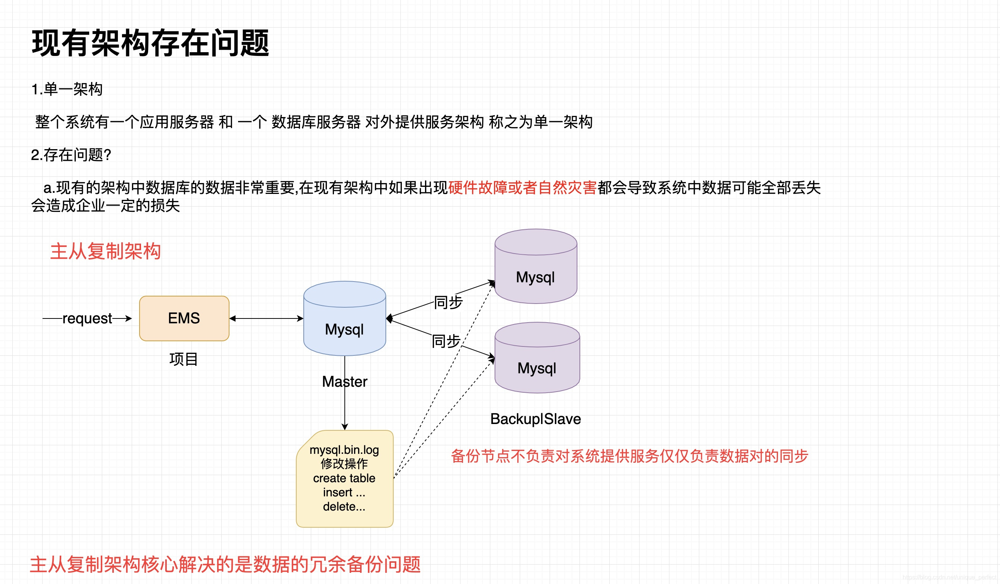
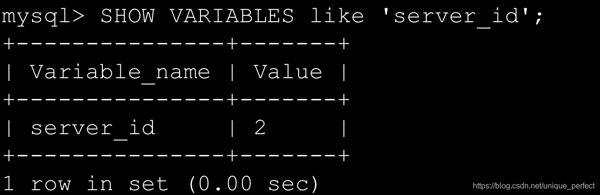
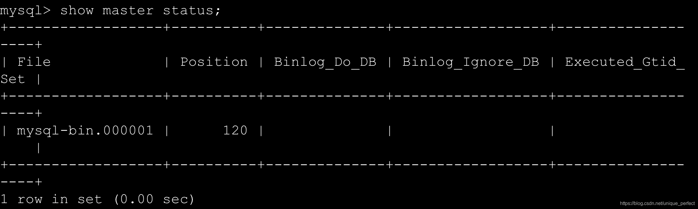
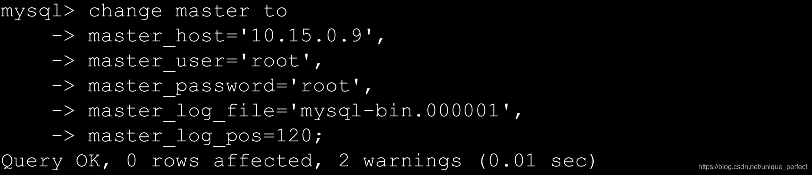

# MySQL主从复制

## 0.架构规划

	192.168.202.201    master  主节点
	192.168.202.202    slave   从节点

## 1.修改mysql的配置文件

	vim /etc/my.cnf

## 2.分别在配置文件中加入如下配置

	mysql(master):
		server-id=1
		log-bin=mysql-bin
		log-slave-updates
		slave-skip-errors=all
	
	msyql(slave):
		server-id=2
		log-bin=mysql-bin
		log-slave-updates
		slave-skip-errors=all
> 注意：两个机器的server-id不能一致，即必须唯一

## 3.重启mysql服务

	systemctl restart mysqld

## 4.登录mysql执行如下命令检测配置是否生效
	SHOW VARIABLES like 'server_id';

## 5.登录master节点执行如下命令

	show master status;

## 6.登录从节点执行如下命令:

	change master to 
	master_host='10.15.0.9',
	master_user='root',
	master_password='root',
	master_log_file='mysql-bin.000001',
	master_log_pos=120;

## 7.开启从节点

	start slave; 
	stop  slave;

## 8.查看从节点状态

	show slave status\G;
	
	************************** 1. row ***************************
	Slave_IO_State: Waiting for master to send event
	Master_Host: 10.15.0.9
	Master_User: root
	Master_Port: 3306
	Connect_Retry: 60
	Master_Log_File: mysql-bin.000001
	Read_Master_Log_Pos: 120
	Relay_Log_File: mysqld-relay-bin.000002
	Relay_Log_Pos: 283
	Relay_Master_Log_File: mysql-bin.000001
	Slave_IO_Running: Yes
	Slave_SQL_Running: Yes

>注意:
>	1.出现 Slave_IO_Running: Yes 和 Slave_SQL_Running: Yes 说名成功,
>	2.如果在搭建过程出现错误,可以查看查看错误日志文件 cat /var/log/mysqld.log

## 9.通过客户端工具进行测试

## 10.关闭主从复制(在从节点执行)
	stop slave;

>注意：
>
>如果出现Slave I/O: Fatal error: The slave I/O thread stops because master and slave have equal MySQL server UUIDs; these UUIDs must be different for replication to work. Error_code: 1593错误
>
>请执行如下命令，rm -rf /var/lib/mysql/auto.cnf 删除这个文件，之所以出现会出现这样的问题，是因为我的从库主机是克隆的主库所在的主机，所以auto.cnf文件中保存的UUID会出现重复.