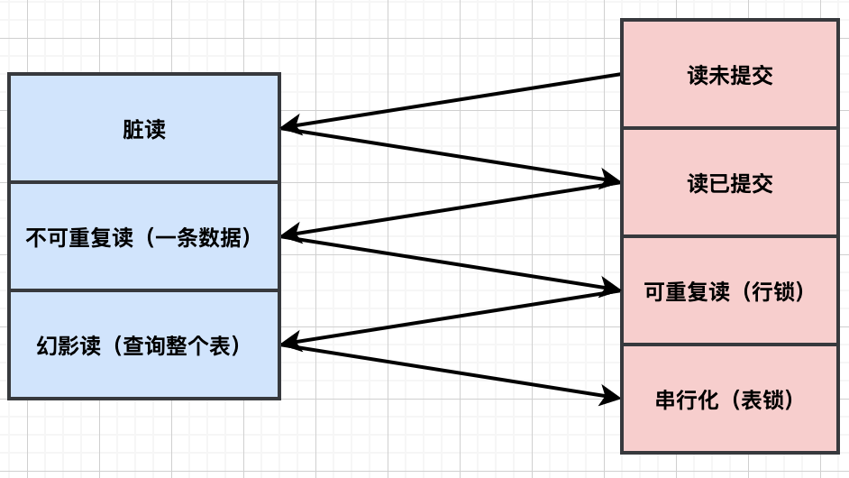

# 事务

- [百知孙帅](https://www.bilibili.com/video/BV185411477k?p=115)

事务就是保证业务操作完整性的数据库机制，执行的时候，要么都成功，如果有一个失败所有操作都回滚。

## 事务的四大特性:fire:

```markdown
1. Atomic：原子性，一个事务必须被视为不可分割的最小单元。事务的所有操作要么全部提交成功，要么全部失败回滚，对于一个事务来说，不可能只执行其中的一部分操作，这就是事务的原子性。回滚可以用回滚日志（Undo Log）来实现，回滚日志记录着事务所执行的修改操作，在回滚时反向执行这些修改操作即可。
2. Consistency：一致性，事务执行前后都保持一致性状态。就是一组SQL执行之前，数据必须是准确的，执行之后，数据也必须是准确的。
3. Isolation：隔离性
4. Durability：持久性，一旦事务提交，则其所做的修改将会永远保存到数据库中。即使系统发生崩溃，事务执行的结果也不能丢失。
```

## 如何控制事务

```markdown
JDBC:
    Connection.setAutoCommit(false);
    Connection.commit();
    Connection.rollback();
Mybatis:
    Mybatis自动开启事务
    sqlSession(Connection).commit();
    sqlSession(Connection).rollback();
结论:控制事务的底层都是Connection对象完成的。
```

## 事务属性​详解:fire:

### 隔离属性的概念

```markdown
概志：他描还了事务解决并发问题的特征
1.什么是并发
	多个事务(用户)在同一时间，访问操作了相同的数据
	同一时间: 0. 00几秒微小前微小后
2.并发会产生那些问题
		1.脏读
		2.不可重复读
		3.幻影读
3.并发问题如何解决
		通过隔离属性解决，隔离属性中设置不同的值，解决并发处理过程中的问题。
```

### 并发会产生的问题

1. [脏读](https://www.bilibili.com/video/BV185411477k?p=123&spm_id_from=pageDriver)

```
一个事务，读取了另一个事务中没有提交的数据。会在本事务中产生数据不一致的问题
解决方案：读已提交
```

2. [不可重复读](https://www.bilibili.com/video/BV185411477k?p=124&spm_id_from=pageDriver)

```markdonw
一个事务中，多次读取相同的数据，但是读取结果不一样，此时会影响后续事务操作（不知道基于哪个结果操作）。会在本事务中产生数据不一致的问题。
注意: 1.不是脏读  2.一个事务中
解决方案：可重复读，本质就是一把`行锁`
```

>可重复读也是MySQL的默认隔离界别，也就是默认都会买一把行锁

3. [幻影读](https://www.bilibili.com/video/BV185411477k?p=125&spm_id_from=pageDriver)

```markdown
一个事务中，多次对整表进行查询统计，但是结果不一样，此时会影响后续事务操作（不知道基于哪个结果操作）。会在本事务中产生数据不一致的问题
解决方案：串行化，本质就是一把 `表锁`
```



