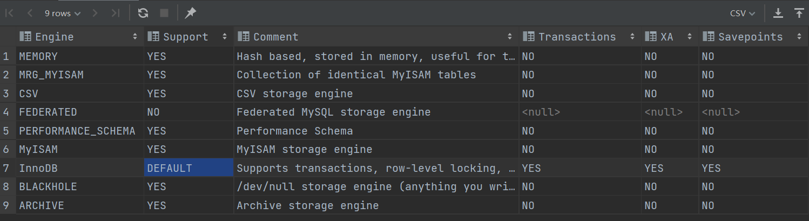

# MySQL存储引擎

查看MySQL提供的所有存储引擎

```sql
show engines；
```



如上图所示， MySQL 当前的`默认存储引擎`是InnoDB，并且在5.7版本所有的存储引擎中只有 InnoDB 是事务性存储引擎，也就是说`只有 InnoDB 支持事务`。

默认存储引擎

```sql
show variables like '%storage_engine%';
```


## InnoDB存储引擎

