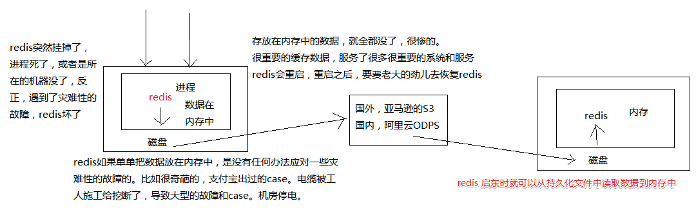
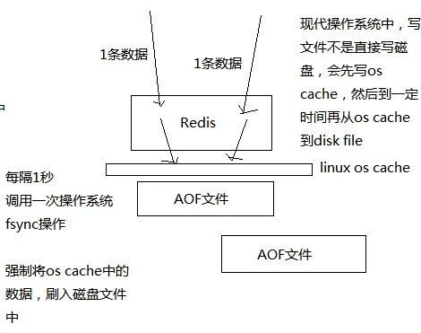
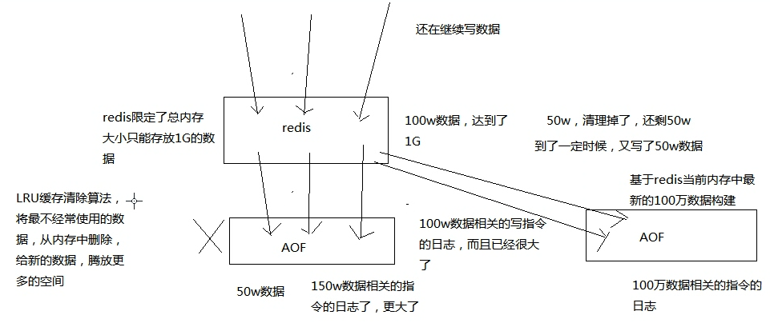

https://zq99299.github.io/note-book/cache-pdp/Redis/008.html


RDB是直接将数据库状态持久化到磁盘，AOF是将set等`命令`持久化到磁盘。重启Redis服务器之后，前者直接加载RDB文件，后者加载AOF文件的命令并执行恢复到之前的数据库状态。

## Redis 持久化机对于生产环境中的灾难恢复的意义

有的可能自己看过一些 Redis 的教程，所有的资料其实都会讲解 Redis 持久化，但是有个问题，我到目前为止，没有看到有人很仔细的去讲解，Redis 的持久化意义

比如 Redis 的持久化，RDB、AOF 区别，各自的特点是什么，适合什么场景？Redis 的企业级的持久化方案是什么，是用来跟哪些企业级的场景结合起来使用的？

基于这个原因本课程会着重讲解 Redis 持久化的意义

Redis 持久化的意义，在于故障恢复

比如你部署了一个 Redis，作为 cache 缓存，当然也可以保存一些较为重要的数据，如果没有持久化的话，Redis 遇到灾难性故障的时候，就会丢失所有的数据

如果通过持久化将数据存在磁盘上，然后可以定期同步和备份这些文件到一些云存储服务上去，那么就可以保证数据不丢失全部，还是可以恢复一部分数据回来的



## 图解分析 Redis 的 RDB 和 AOF 两种持久化机制的工作原理

我们已经知道对于一个企业级的 Redis 架构来说，持久化是不可减少的

>牢记企业级 Redis 集群架构是用来支撑海量数据、高并发、高可用
>
>持久化主要是做灾难恢复、数据恢复，也可以归类到高可用的一个环节里面去

比如你 Redis 整个挂了，Redis 就不可用了，你要做的事情是让 Redis 变得可用，尽快变得可用你会怎么做？

你会重启 Redis，尽快让它对外提供服务，但是就像上一讲说，如果你没做数据备份，这个时候 Redis 就算启动了，也不可用，数据没有了，如果这个时候大量的请求过来，缓存全部无法命中，在 Redis 里根本找不到数据，这个时候就死定了，缓存雪崩（后面会讲解）问题，所有请求没有在 Redis 命中，就会去 mysql 数据库这种数据源头中去找，一下子 mysql 承接高并发，然后就挂了

mysql 挂掉，你都没法去找数据恢复到 Redis 里面去，Redis 的数据从哪儿来？从 mysql 来，所以这个事情在大型互联网项目中是恐怖的

具体的完整的缓存雪崩的场景，还有企业级的解决方案，到后面讲

如果你把 Redis 的持久化做好，备份和恢复方案做到企业级的程度，那么即使你的 Redis 故障了，也可以通过备份数据，快速恢复，一旦恢复立即对外提供服务

Redis 的持久化跟高可用是有关系的，放在企业级 Redis 架构中去讲解

Redis 持久化的两种机制：RDB，AOF

### RDB

对 Redis 中的数据执行周期性的持久化，如下图


### AOF

每条写入命令作为日志，写入 AOF 文件中



为了保证性能，会先写入 os cache 中，然后定期强制执行 fsync 操作将数据刷入磁盘

它的原理：

因为每台单机 Redis 的数据量是受内存限制的，所以 AOF 文件不会无限增长且当数据超过内存限制的时候，会自动使用 LRU 算法将一部分数据淘汰掉

AOF 存放的是每条写入命令，所以会不断膨胀，当达到一定时候，会做 rewrite 操作

rewrite 操作：基于当时 Redis 内存中的数据，重新构造一个更小的 AOF 文件，然后删除旧的 AOF 文件




如上图，总结一下： AOF 不断被追加，内存中数据有最大限制会自动淘汰，当 AOF 中的数据大于内存中数据时，就会执行 rewrite 操作，生成新的 AOF 文件

AOF 机制对每条写入命令作为`日志`，以 append-only 的模式写入一个日志文件中，在 Redis 重启的时候，可以通过回放 AOF 日志中的写入指令来重新构建整个数据集

### 小结

通过 RDB 或 AOF，都可以将 Redis 内存中的数据给`持久化到磁盘`上面来，然后可以将这些数据`备份到`别的地方去，比如说`阿里云`，云服务

如果 Redis 挂了，服务器上的内存和磁盘上的数据都丢了，可以从云服务上拷贝回来之前的数据，放到指定的目录中，然后重新启动 Redis，Redis 就会自动根据持久化数据文件中的数据，去恢复内存中的数据，继续对外提供服务

如果同时使用 RDB 和 AOF 两种持久化机制，那么在 Redis 重启的时候，会使用 AOF 来重新构建数据，因为 AOF 中的数据更加完整

## Redis 的 RDB 和 AOF 两种持久化机制的优劣势对比

### RDB 持久化机制的优点

1. 适合做冷备

   RDB 会生成多个数据文件，每个数据文件都代表了某一个时刻中 Redis 的数据，这种多个数据文件的方式，非常适合做冷备，可以将这种完整的数据文件发送到一些远程的安全存储上去，如云上，以预定好的备份策略来定期备份 Redis 中的数据

2. 性能影响小

   能让 Redis 对外提供的读写服务不受影响，因为 Redis 主进程只需要 fork 一个子进程，让子进程执行磁盘 IO 操作来进行 RDB 持久化即可

3. 数据恢复快

   相对于 AOF 持久化机制来说，直接基于 RDB 数据文件来重启和恢复 Redis 进程，更加快速。

   因为 AOF，存放的指令日志，做数据恢复的时候，其实是要回放和执行所有的指令日志，来恢复出来内存中的所有数据的

   RDB 就是一份数据文件，恢复的时候，直接加载到内存中即可

RBD 做冷备的优点？

1. RDB 生成多个文件，每个文件都代表了某一个时刻的完整的数据快照
2. AOF 只有一个文件，但是你可以，每隔一定时间，去 copy 一份这个文件出来

那么 RDB 做冷备，优势在哪儿呢？由 Redis 去控制固定时长生成快照文件的事情，比较方便; 而 AOF，还需要自己写一些脚本去做这个事情，且在最坏的情况下，提供数据恢复的时候，速度比 AOF 快，所以 RDB 特别适合做冷备份，冷备

### RDB 持久化机制的缺点

1. 在故障时，数据丢得多

   一般来说，RDB 数据快照文件，都是每隔 5 分钟，或者更长时间生成一次，一旦 Redis 进程宕机，那么会丢失最近 5 分钟的数据（因为在内存中还未来得及导出到磁盘）

   这个问题也是 RDB 最大的缺点，就是不适合做第一优先的恢复方案，如果你依赖 RDB 做第一优先恢复方案，会导致数据丢失的比较多

2. 性能影响

   RDB 每次在 fork 子进程来执行 RDB 快照数据文件生成的时候，如果数据文件特别大，可能会导致对客户端提供的服务暂停数毫秒，或者甚至数秒。一般不要让 RDB 的间隔太长，否则每次生成的 RDB 文件太大了，对 Redis 本身的性能可能会有影响的

### AOF 持久化机制的优点

1. 在故障时，数据丢得少

   一般 AOF 会每隔 1 秒，通过一个后台线程执行一次 fsync 操作，保证 os cache 中的数据写入磁盘中，最多丢失 1 秒钟的数据

2. AOF 文件写入性能高

   AOF 日志文件以 append-only 模式写入，所以没有任何磁盘寻址的开销，写入性能非常高，而且文件不容易破损，即使文件尾部破损，也很容易修复(官方提供了一个修复工具)

3. rewrite 操作对 Redis 主线程影响较小

   AOF 日志文件即使过大的时候，出现后台重写操作，也不会影响客户端的读写。因为在 rewrite log 的时候，会对其中的数据进行压缩，创建出一份需要恢复数据的最小日志出来。再创建新日志文件的时候，老的日志文件还是照常写入。当新的 merge 后的日志文件 ready 的时候，再交换新老日志文件即可。

   关于这里我实在是没有想到要怎么去做，因为写入的是指令，那么知道当前内存中的存的是哪些指定的数据呢？

4. AOF 文件内容比较容易阅读

   这个特性非常适合做灾难性的误删除的紧急恢复。比如某人不小心用 flushall 命令清空了所有数据，只要这个时候后台 rewrite 还没有发生，那么就可以立即拷贝 AOF 文件，将最后一条 flushall 命令给删了，然后再将该 AOF 文件放回去，就可以通过恢复机制，自动恢复所有数据

### AOF 持久化机制的缺点

1. 日志文件稍大

   对于同一份数据来说，AOF 日志文件通常比 RDB 数据快照文件更大

2. 性能稍低

   AOF 开启后，支持的写 QPS 会比 RDB 支持的写 QPS 低，因为 AOF 一般会配置成每秒 fsync 一次日志文件，当然，每秒一次 fsync，性能也还是很高的

3. 发生过 BUG

   以前 AOF 发生过 bug，就是通过 AOF 记录的日志，进行数据恢复的时候，没有恢复一模一样的数据出来。所以说，类似 AOF 这种较为复杂的基于命令日志 /merge/ 回放的方式，比基于 RDB 每次持久化一份完整的数据快照文件的方式，更加脆弱一些，容易有 bug。不过 AOF 就是为了避免 rewrite 过程导致的 bug，因此每次 rewrite 并不是基于旧的指令日志进行 merge 的，而是基于当时内存中的数据进行指令的重新构建，这样健壮性会好很多。

   说 rewrite 非常复杂，因为是基于当时内存中已有数据进行构建指令达到压缩日志文件的目的，反正我是想不出来怎么实现的

4. 数据恢复较慢

   前面都说了，不适合做冷备，数据恢复基于指令稍慢

### RDB 和 AOF 到底该如何选择

1. 不要仅仅使用 RDB，因为那样会导致你丢失很多数据

2. 也不要仅仅使用 AOF，因为那样有两个问题

   第一，你通过 AOF 做冷备，没有 RDB 做冷备，来的恢复速度更快;

   第二，RDB 每次简单粗暴生成数据快照，更加健壮，可以避免 AOF 这种复杂的备份和恢复机制的 bug

3. 综合使用 AOF 和 RDB 两种持久化机制

   用 AOF 来保证数据不丢失，作为数据恢复的第一选择;

   用 RDB 来做不同程度的冷备，在 AOF 文件都丢失或损坏不可用的时候，还可以使用 RDB 来进行快速的数据恢复

   结论就是：都用，AOF 作为第一恢复方式，RDB 候补

## Redis 的 RDB 持久化配置以及数据恢复实验

### 如何配置 RDB 持久化机制

/etc/Redis/6379.conf

```
save 900 1
save 300 10
save 60 10000
```

以上内容是原始默认的配置，该功能叫做 SNAPSHOTTING（快照）

save <seconds> <changes>：当 n 秒后有 n 个 key 发生改变，就做一次快照备份

可以设置多个检查点，默认设置了 3 个检查点

### RDB 持久化机制的工作流程

1. Redis 根据配置自己尝试去生成 RDB 快照文件

2. fork 一个子进程出来

3. 子进程尝试将数据 dump 到临时的 RDB 快照文件中

4. 完成 RDB 快照文件的生成之后，就替换之前的旧的快照文件

   

   每次生成一个新的快照，都会覆盖之前的老快照，所以只会有一个 dump.RDB

### 基于 RDB 持久化机制的数据恢复实验

思路：

1. 保存几条数据
2. 关闭 Redis
3. 重启 Redis
4. 检查数据是否还在

下面使用命令来实验

```
Redis-cli
set k1 11
set k2 22
set k3 33
exit
Redis-cli shutdown

#启动 Redis

cd /etc/init.d/
./Redis_6379 start

#进入 cli 查看数据是否还存在

Redis-cli
get k1
get k2
```

实验证明数据还是存在的。

这里有一个争议点，因为是 Redis 自带的停止工具，是一种安全的退出模式，会将内存中的数据立即生成一份 RDB 快照文件，该文件存储在 /var/Redis/6379/dump.RDB 中

下面再来测试 2 种非安全的退出模式：

第一种

写入几条数据，然后直接 kill 掉 Redis 进程，启动后会发现数据丢失了

第二种

手动配置一个 save 5 1

写入几条数据，等待 5 秒钟，会发现自动进行了一次 dump RDB 快照

可通过查看 dump.RDB 文件更新时间确定

kill -9 Redis 进程

启动 Redis 查看数据

因为有 save 生效，所以数据都在；

> 在非正常退出 Redis 的时候，再次启动会报错
>
> [root@eshop-cache01 init.d]# ./Redis_6379 start /var/run/Redis_6379.pid exists, process is already running or crashed
>
> 由此可以看出来，当 Redis 启动的时候回生成一个 pid 文件，如果该文件存在则不能再次启动
>
> 这里只能先删除该 pid 文件后，才能启动 Redis 了

## Redis 的 AOF 持久化深入讲解各种操作和相关实验

### AOF 持久化的配置

AOF 持久化，默认是关闭的，RDB 是默认开启的

打开 AOF 持久化机制之后，Redis 每次接收到一条写命令，就会写入日志文件中，当然是先写入 os cache 的，然后每隔一定时间再 fsync 一下

/etc/Redis/6379.conf 中的 APPEND ONLY MODE 配置区。

appendonly yes 启用后 appendfsync 属性开始生效，有三个策略可选

- no：不主动执行fsync

  仅仅 Redis 负责将数据写入 os cache 就撒手不管了，然后后面 os 自己会时不时有自己的策略将数据刷入磁盘，不可控了

- always：每次写入一条数据就执行一次 fsync

  每次写入一条数据，立即将这个数据对应的写日志 fsync 到磁盘上去，性能非常非常差，吞吐量很低; 确保说 Redis 里的数据一条都不丢，那就只能这样了

- everysec：每隔一秒执行一次 fsync

  每秒将 os cache 中的数据 fsync 到磁盘，这个最常用的，生产环境一般都这么配置，性能很高，QPS 还是可以上万的

QPS 指每秒钟的请求数量。大概的举个例子 :

- mysql -> 是基于大量磁盘，1~2K QPS
- Redis -> 基于内存，磁盘做持久化，单机 QPS 一般来说上万没有问题

### AOF 持久化的数据恢复实验

1. 先仅仅打开 RDB，写入一些数据，然后 kill -9 杀掉 Redis 进程，接着重启 Redis，发现数据没了，因为 RDB 快照还没生成（上一节一节做过该实验）
2. 打开AOF的开关，启用 AOF 持久化
3. 写入一些数据，观察 AOF 文件中的日志内容
4. kill -9 杀掉 Redis 进程，重新启动 Redis 进程，发现数据被恢复回来了，就是从 AOF 文件中恢复回来的

Redis 进程启动的时候，直接就会从 appendonly.AOF 中加载所有的日志，把内存中的数据恢复回来

/var/Redis/6379 该路径下，是之前配置的路径

```
[root@eshop-cache01 6379]# cat appendonly.AOF
*2
$6
SELECT
$1
0
*3
$3
set
$6
mykey1
$4
123k
```

上面的内容是我写入了一条 set mykey1 123k 命令之后的。但是不太能看懂是什么

它们先被写入 os cache 的，1 秒后才 fsync 到磁盘中的

### AOF rewrite

Redis 中的数据其实有限的，很多数据可能会自动过期，可能会被用户删除，可能会被 Redis 用缓存清除的算法清理掉，总之 Redis 中的数据会不断淘汰掉旧的，就一部分常用的数据会被自动保留在 Redis 内存中

所以可能很多之前的已经被清理掉的数据，对应的写日志还停留在 AOF 中，AOF 日志文件就一个，会不断的膨胀，到很大很大

所以 AOF 会自动在后台每隔一定时间做 rewrite 操作，比如日志里已经存放了针对 100w 数据的写日志了; Redis 内存中只剩下 10 万; 基于内存中当前的 10 万数据构建一套最新的日志，到 AOF 中; 覆盖之前的老日志; 确保 AOF 日志文件不会过大，保持跟 Redis 内存数据量一致

Redis 2.4 之前，还需要手动，开发一些脚本 crontab 定时通过 BGREWRITEAOF 命令去执行 AOF rewrite，但是 Redis 2.4 之后，会自动进行 rewrite 操作

> AOF rewrite 有两个重要的配置参数

/etc/Redis/6379.conf

    auto-AOF-rewrite-percentage 100
    auto-AOF-rewrite-min-size 64mb

上面的配置意思是： 当 AOF 日志超过 64 m 且，上一次 AOF 之后的文件大小，比如是 60 m，那么当文件增长到 120 m 的时候，就会触发 rewrite 操作

auto-AOF-rewrite-percentage: 增长百分比，比上一次增长多少内容的时候就会触发 rewrite 操作
auto-AOF-rewrite-min-size：rewrite 操作的最小文件大小，超过该大小才会执行 rewrite 操作
rewrite 流程

1. Redis fork 一个子进程
2. 子进程基于当前内存中的数据，构建日志，开始往一个新的临时的 AOF 文件中写入日志
3. Redis 主进程，接收到 client 新的写操作之后，在内存中写入日志，同时新的日志也继续写入旧的 AOF 文件
4. 子进程写完新的日志文件之后，Redis 主进程将内存中的新日志再次追加到新的 AOF 文件中
5. 用新的日志文件替换掉旧的日志文件


下图对上面文字描述的演示

![img](data:image/png;base64,iVBORw0KGgoAAAANSUhEUgAAAY8AAAE+CAYAAAB1DJw3AAAWHUlEQVR4nO3dO3LiWqOG4U9/naFABy6PQIwAdeLI6c4gRElnDp05gRCyTh11YhgBjIByYDEXnQAEQojLAl3Wkt6nyrV3uzHGGOllXaC9OI5jAQBg4H913wAAgHuIBwDAGPEAABgjHgAAY8QDAGCMeAAAjBGPO3ieV/dNAIBaEQ8AgDHiAQAwRjwAAMaIBwDAGPEAABgjHgAAY8QDAGCMeAAAjBEPAIAx4gEAMEY8AADGiAcAwBjxAAAYIx4AAGPEAwBgjHgAAIwRDwCAMeIBADBGPAx5nqc4juu+GQBQK+IBADBGPAAAxogHAMAY8QAAGCMeAABjxAMAYIx4AACMEQ8AgDHiAQAwRjwAAMaIBwDAGPEAABgjHgAAY8QDAGCMeAAAjBEPAIAx4gEAMEY8AADGiAcAwBjxAAAYIx4AAGPEAwBgjHgAAIwRDwCAMeIBADBGPAAAxogHAMAY8QAAGCMeAABjxAMAYIx4AACMEQ8AgDHiAQAwRjwAAMaIBwDAGPEAABgjHgAAY8TDgOd5iuO47psBALUjHgAAY8QDAGCMeAAAjBEPAIAx4gEAMEY8AADGiAcAwBjxAAAYIx4AAGPEAwBgjHgAAIwRDwCAMeIBADBGPAAAxogHULTNRD3Pk+d56k02D1/dYujJGy4KuGFAcf6v7hsANMtCw24ojSPFo07dNwYoDSMPoEibH63l6/U34UCzEQ+gSNG3VnXfBqACxAMoyGLoyQtmklYKu548r6f9kkdqHST5yC5jLIaevN5Ei0lve5neRHkrJothcespwL2IB1CQ/jRWPB9I8jWOYsXxUqOOpMVQXjfU8zxWHO8+orHWQU4AVqGC77ftZZYjZSe/NpOegpk0mMdasqaCGhEPoFQLDYOZ/HGkaT/16c5If8e+VuGHjgcgA82PLpi+qqG64er0uoAaEA+gTJsfrSU9/zodJXR+PUta6yc9+PCf1M27nvW7ersIMeKADYgH4JDV51fuOghQNeIBlKnzS8+S1j+np/zNz1rSs3IGJaee37SMxvJXobq8YBAW4EWCQKn6+jP21Q27Gv6KD2sVu/WLwXypm5cvOiMtI6nXDeRprpiFD9SIeAAl64yWin8N5QWeZvvPbndkGS9fdEZazr/lBYG89VhRzo4soApeHMdx3TfCFZ7nibsLAFjzAADcgXgAAIwRDwCAMeIBADBGPAAAxogHAMAY8QAAGCMeAABjxAMAYMzJtyfxPK+V3xv24p0H0DZOxkOq/mDlrUlwDk8o0EZMWwEAjBEPAIAx4gEAMEY8AADGWhsPFjkB4H6tjUccxwQEAO7U2nhIBAQA7uXs6zyKkgSE13AAx3hi1SxFn+NaHw+JgADncEw0QxlPBFo9bZXGFBYA3I6RR0oVI5BsoHhmB8BFxCOjqICcG8UQCwBNQDxymASESABoI+JxRl5A8kJBJGAjNoCgbMTjjCQU6WBwMMIV7CBE2dhtdUYcx/sPwEXsIESZiMcNCAhcRUBQFuIBNBwBQRmIx40YfcBlSUCICIpCPICWSNbwCAiKQDyAliEgKALxAFqIgOBRxANoKQKCRxCP1tho0vPkDRf7zyyGnrzeRJsabxXqlQ0IMcGteIV5a230s677NiBPHSfw5HuyqxC3Ih6t1dFoGWtU982w0D0n7yJP+HWcwHkrE5giHkCG6UnU9ROv67cf9WDNw1LJesRi0tu+uCu9NrGZqLd7wdfJ3x2u4PD3nidv+HX2exy+dqFh6mtSyyNoKOvDkX2sX/k4PGY3mvSGOnkIL4bHj/nsn0++/e74Gy4O/5/30cK1Q+Jhs1Wo4Ptt++Ku5Ugdaftg737qNUreuDHSWKG62QMimGkwP7y541yhwtWlb7bQ0Au0Hkf7r3n5ad8B0SbWh0OSOiMtU29SmvsxH2wvO5hr2t9/oX6/rhXc8QwoHYlucvztrthPHR8n379liIfVBpofjgZJG03eZxrMlxp1ks91NPo7lr/61NdGkhYaBjP540jpL+1PI439C99q86O1pOdf+ytWf7QLFholOTFaH46rdjsIg7XG0eEEn+iM/mq8DoxH0J3RUnEcK7p4wIB42Mx/Ujf9582XPlfSLMgMmbuhVlrpO1JuBG7S+a1Xf3fdLRyCt0USDefDsZmo53UVPs8Vx+knU2kdjd4Gmv1bHKZxg5m0CtVNjp2jP+dMc2Wswu7plFUwK+EHtB/xcFB6Oir9kXniZWi7+yqOxvKTg4mINEozRhuStNHkv1DP89PRxon+dHuZ/vQwxeSPFaWnnPZ/nqqv3Vqg56kbrqRZsF/zkJi2SiMeLun80rOk9c+FU/rZy0T6vrjmkXz9bo55PpBWoT5YNG+E5oTjNkkAPK+nieEzoP50t5boSxrM92sendFSy7whTn96WJNsEeLhlL7+jH2twu7xPO5mot7+E329DKRV+N/RQbMYBro4uN5MNDw5ynw9dXMvDYe4Go5DALIfXYV507epnU/daaw4nuvuMcFuiljr992xdbwT8fJOr3ZocTwWGt4wx3n6NebPZIrUGS0Vjf3jA+c/6W9q+N6fxpoPVgq7h8v8e7myYN4Z6eU7NZ8brDWOzs0lwxWuhkNKRgB5H9vH8rnp29NRwG5h/eqax2F6avP1Kfm+pGc9rwP1Jl1NU98j2t6AAqeN3cOLBE0s/mmmZ80rOKH2p7HOHfKd0VLxlZeG96ex4mn2k8evKM9+j9yvgdNcDUexUu+msBjKe39SlN76nv6zJGmhj/BZr+O1Vt8vmk5fNOx9acPuwyOtGHnkv7gn0EwzBTnDz95uaHHydcFMOvM1xy/Ia9n4FXDBZqJeMNPg7XIENpN3rcd/9Hv/mb6my9/66h2O8aPF9Bt3ajVNK+Ih6WSIGUdj+RponhnypjdOJPu9D5f3t/vJr71oqW3jV8BGu23r2/+fqNfd7tC6dnhG3896O5mv3e1GPDtttd2p1SbtnbaKvrXKvo7igsVHKI0j/frw5F1aefbHmSEwgGJF+l5d3syxmfTUDaXx/FWf3Z4ULbXMm+vtTxX3s5/azt2yTf2y9ow8MjY/a2n1reiWCy+GCmYDvY06ZxfxklejXhsSA7jD0XtcBZr5r/p94UCLvrXd8NEfaRm/6bt7Zar5ypRzdufX6bRVC18XFTvI9GZHYz/WYJ76zDweSLHv+7Hkx+Mo9TcDxX76E9E49qXM1x9dezz2dXI9aA9HD6OrmvpztVEZv8sWTlttNOkFmg3m27WJxVDeblh7ui11oWE33G3Zy7cYdhVqrCi2f8Th8rZNAHZp2bTVQsPk/XCSVbP+VPH8WWH39PUbi+H2XWb/viZ/Ph3mBjMd7xNv4/AVQOu0Jx6zQJ4XSHnvh5ME5L+Jfo4+HR+9HUHeesf2rXEy73fDgjmAhmtPPHbb6s5u09u9P82vSm8UALipPfFoOdY7ABSphQvmWRtNet3Uv7I30Dy+Mum0+5f6tnyNIyapALSLFzv4dJRn0ea4z8rT1Pu2qT9XG5Xxu2TaCgBgjHgAAIwRDwCAMeIBADDGbisAZ3meV/dNgKWIRwuwawb34DGDS5i2AgAYIx4AAGNMW6FR8ubomX7Bo5j6PdX6eCQnGx4YzZD3e7xl0Zfff704Obun9fFIHrDpEwwP4ma55fdJYOoVxzEBcUzr45FIP2izJxIe0M33aGAYwT6OgLiFeOTIPnhdHpVwMBbn3P2Yvo+vjWD4XVxGQNxBPG5wblTCAxxZ1x4TTI9dR0DcQDwMERI8gvWX2xAQ+xGPB7BOgjIQmC0CYjfiUZAmrZPAfm0JDAGxF/EoCdNbqFtTAkNA7EQ8KkBIYCtXAkNA7ONsPJrwVtFV/QxNuK9QnyICU8RJn4DYxcl4NPXBU/SohAMNValqizIBsYeT8WgqprfQVEVOjxEQOxAPS7ENGG1jGhjeEqZexMMBbAMGti49qUK1iIeDmN5C2zFtVT/i4ThCgjZhqsoexKNB8kLCwYamYLRhF+LRYIxK0BSEwz7EoyUICVxFOOxEPFqIkMAFTLnajXi0HK8ngY0YbdiPeGCP15PABoTDDcQDZzG9hSoxTeUW4oGbEBKUidGGe4gHjLFOgiIRDjcRjwaq8mBknQSP4nHiJuKBQjG9BbQD8UBpCAnQXMQDlWCdBGgW4oHKsU4CuI94oHZMbwHuIR6wCiEB3EA8GqZJe+ZZJwHsRTzgBNZJALsQDziJ6S1UpUmj+SIRDziP6S2gesQDjcL0FlAN4oFGY3oLKAfxQGsQEqA4xAOtxDoJ8Bji0SDsCrkP6ySAOeIBZDC9BVxHPIALCAmQj3gAN2KdBDggHsAdWCdB2xEPoABMb6FtiAdQMEKCNiAeDcE2XTuxToKmIh5ARVgnQZMQD6AmTG/BZcQDsAAhgWuIB2AZ19dJWH9rB+IBWIx1EtiKeAAOcWF6K45jRh8tQDwAR7kQEjQX8WgAnuXBtnUSRh/NRzyAhmGdBFUgHkDD1TW9xeij2YgH0CK2TW/BXcQDaKkqprcYfTQX8QAgqX27t4jaY4gHgBNFhsTW0Yett8sVxMNxPPhRtiavkyQBSf4ftyMeAG527zqJzc/yk9tk6+2zFfEAcLd7p7dsfLZvc+BsRDxuwAOqGNyPzXYtJC5MET0akDZsNEgQjxvwjORx3H/t4vI6ya2Ry/5c1y7fNMTjRgTkftxv7XPpGbgLz87T6yDp/+Zdpq2IB4DC3PKMPW9UYtuJ2LXRUh2IhwFGH+a4v5rvkZGErY+NS9Nu2PJiW397FrPlhGjL7TjH9tuH+7kw9YRyMfK4AyOQ67h/msnWaSZUj3igcISjeYgGsv5X9w1wVXo7Hw4IRzPFcczvFUeIxwMICIC2YtrqQax/HHA/tBNPoNxR5PFJPFAIwtFu/O7tV3TkmbYqQB3TVzadrG26LQCqQTwKUkRAXBz+Ew6gnWqftnLxhHlJlQGx5b6z5XYUhRgC19UeD6l5B+ujb+l8y9fa8IzfhttQtKaFECgL01aWcWX7bxPDAeB2xKMEjwbA9oAQDgDEoyS2BcTzvEKuj3AAkCxZ82iqul9AWPQ7nxIOAAniYbFz8bl0EuetsgFUgXiU7NHRx61fX/a7njLqAJBGPCpQVkCqGmUQDgBZxKMiRa1/JMGo6oROOADkIR4OqfpETjgAnMNW3Qo9sv02+cd4bH79B4D2IB4VK+L1H1Vg1AHgEuJRA9tHEIQDwDXEoya2BoRwwB4bTXqevOHi8qUmPXmepysXq8xi6O3f0eHiR2+izfVr09DraXL9gpUjHtgjHLDCYrg7wXYVriTNgv0JtzfZ7GORfPynv4rjWNP+6VUll+1dO/vuv6d39L3OXV/2Ixsufxzt1ynzPqKxf//9YwniUSObRh+EA9boTxWN/eMT8Hwg+WP9HXUkHZ+cl7vPndro63OlwWCg1efXmWf5u9FNsNY4Sp/g53oOu2dGBwPNMzHIC5eJc1HyvEAzrRR280cvV6NYIuJRM5sCAtiiM1rq7bu7PTkuhvICab4c6Vwmci0+FK4GevnzJH8V6iNnWmsz+U/haqB5vNRxg/qaxnMNVqG6FcyHdUbLM6OUuQbyM2GLbwhn+YiHBeoOCKMO2GTS2z6rDmbSKuzKC2aSZgo8T5431Jd2n7+yhrD4N5MGL+p3fuvVl2b/shFY6CNcyR//Uf7Aoa8/Y1+a/ZMlyylWIR4tRzhgm9EyPpmuivbPtqf6rdS0Vfrv0yOTzUTvM2nw0pfU0e9XX5q9Hy88b360lq/X3+efvXd+v8rXWj+Gs0O5cUt9dMOV2RVaiHjcaDPppXZ9bPbPjh7bSXFQ5ujj0u4PSYa32d7dH0Bi8/WplQZ62Q0pthFY6fMr9cCNvnXbKXyl7yj952QUlHwMT0Ym9yyY5697nF/zqHt3GfF4wGB+5sExH5z9mku7P44CUvLuj+T7NWn3B5rh6DG9nbtSN3UMRN/XTvnb6SgNXg7TUbupq1X4cTjRd59026Pe11M3/efsgvn0zLSXmbx1j/ng/Hnm0UX6RxGPSl3f/RHH0e6gYfcH2unoJJqZtkoWiJ9/XVgoXvzTTDra4rvf9quZ9ksfnV96zo5GMrYjmGdd+nZF2Ux62+N7M1FvN5rpT+dSkHkymPr7OhGPKt24+0NSqbs/blnncHH3B5oi++LAb330khPoRj/r7Egg87Xvs8w6SfIRaexLs/fkCVhfL4PMaOTItQX1Im2fWPqvvzM7yvqaRmOtg20sNpOevI9fWs6loOaAEI8K3b77I1KQu/7x+O4PFshhu0mvq/B5rng/fH7Sn2Wkp/eeJpMPhXrV2TXuzZc+V9LgLW9bb0ejt4G0+lQy2OhPI439Wc6JeKGhF2iWem1JqTZf+lydWbzvjLTcTY1F3yv5T93da2HWCmpc+CAeD5gFZxaig9nphQ13f5xbQH9094ek3NvchN0faIbRMk6FI9HRaPlX+pydCcPW4iM8Wig/0X/RQCuF+2F/R6NlvD0RZ6ZnNc/s4DJguttq8/WplX8hitufTv9mh8B0Rsuc+6k6xOMBJgvm9+z+OL8Dy3z3R3J9Td79gQZJNowEs8NUzuJD4fP84npef3ptAbuvaXwap7xp2rzvs73c9QVy091WndHyEKrOSG+D7DG9O/YGb7JlZph/DKoSye6Pt8zuj1Bh+KHFaPdg7D7J1/roK5OAHE815e3+OP+ADmbbB7OpzmipeJT5SYae/r3Uv9MDDdefKo6np5/LPu7yPlez/jS+Gpe8Yyt7Hdkf3zaMPKrA7g8ADUM8Svf47o/D9JX57g/P83ThZScXb7druz8AVId4lK2g3R9xPN/OeRrs/nhoZ5WDuz8AVId4POCW3VZF7v4YzGNpFd60+yMbjjbs/gBQHS+uedO/K6872Ex66n6/7U6OG016XX2/nVk4XgzlvT8punOb3yW33F/ZyyyGnt6foosv4NtMeup+vp69zYvh9l1OTwzmjQqGK49Hm3CfuaHo3xPxcNC1+4z79H7cd+a4z9xQ9O+JaSsHXXoHXg5kAFUgHo7KCwjhAFAV4uGwdEAIB4AqEY8GIBwAqsbbkwB4WFn/CibsRTwaIP/9r4Bq8LhrJ6atHJYORpn/BjoAZBEPRzHSAFAn4uGgc+Fg9AGgKlaseXDCM3fpPuP+BFC22uPB1IuZW6ermNYCUCamrRxCEADYgng4wjQcrH8AKBPxcMC9Iw4CAqAsxMNyj05VERAAZSAeFitqjYOAACga8QAAGCMelip6ZxWjDwBFIh4WKmtLLgEBUBTiYZmyX8tBQAAUgXhYhBcBAnAF8WghRh8AHkU8LFH1qIOAAHgE8bBAXdNVBATAvYhHzVjnAOAi4lEjG8LB6APAPYhHTWwIR4KAADBFPCCJgAAwQzxqYNOoI42AALgV8aiYreEAABPEo0IuhIPRB4BbEI+KuBCOBAEBcA3xQC4CAuAS4lEBl0YdAHAL4lEyl8PB6APAOcSjRC6HI0FAAOQhHiVpQjgSBARAFvEoQZPCAQB5iAduwugDQBrxKFiTRx0EBECCeBSoyeFINP3nA3Ab4lEgTqwA2oJ4AACMEQ8AgLH/B1cM5Jb+u6pnAAAAAElFTkSuQmCC)

### AOF 破损文件的修复

如果 Redis 在 append 数据到 AOF 文件时，机器宕机了，可能会导致 AOF 文件破损

可以用 Redis-check-AOF --fix 命令来修复破损的 AOF 文件（该命令在 Redis 安装目录下）

    Redis-check-AOF --fix xxx.AOF

可以手动以破坏，然后执行修复：

1. 将 AOF 文件删除后两行数据
2. 然后使用 Redis-check-AOF 修复
3. 查看被修复的文件

修复的原理貌似就是删除掉破损的数据。因为 AOF 的内容变少了。

### AOF 和 RDB 同时工作

- 他们的自动执行是互斥的
- 如果 RDB 在执行 snapshotting，此时用户手动执行 BGREWRITEAOF 命令，那么等 RDB 快照生成之后，才会去执行 AOF rewrite
- 同时有 RDB snapshot 文件和 AOF 日志文件，那么 Redis 重启的时候，会优先使用 AOF 进行数据恢复，因为其中的日志更完整

### 最后一个小实验

在有 RDB 的 dump 和 AOF 的 appendonly 的同时，RDB 里也有部分数据，AOF 里也有部分数据，这个时候其实会发现，RDB 的数据不会恢复到内存中

1. 设置 RDB 5 秒保存一次，写入两条数据，等待 RDB 数据持久化后停止 Redis 进程
2. 这个时候 RDB 和 AOF 中的数据都是完整的
3. 我们模拟让 AOF 破损，然后 fix，有一条数据会被 fix 删除
4. 再次用 fix 的 AOF 文件去重启 Redis，发现数据只剩下一条了

同时存在的时候，会优先使用 AOF 文件恢复数据。

数据恢复完全是依赖于底层的磁盘的持久化的，如果 RDB 和 AOF 上都没有数据，那就没了

