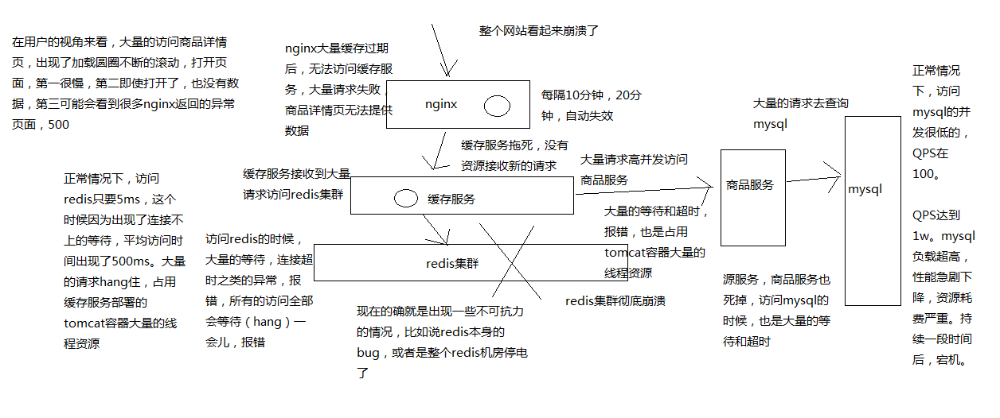
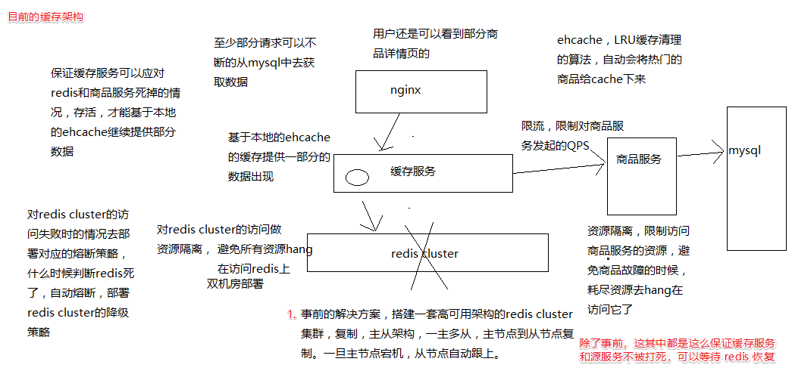
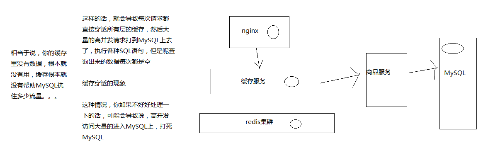

# 缓存雪崩

## 高并发场景下恐怖的缓存雪崩现象以及导致系统全盘崩溃的后果

### 什么是缓存雪崩？

简单说：由于缓存不可用，导致大量请求访问后端服务，可能 mysql 扛不住高并发而打死， 像滚雪球一样，影响越来越大，最后导致整个网站崩溃不可用

至于为什么会像滚雪球一样？整个与整个系统的架构有关； 比如在这之前讲解的知识点（本教程 001~060 章内容），根据这个背景来讲解下雪崩过程

1. redis 集群彻底崩溃：不可用
2. 缓存服务在请求 redis 时，会有大量的线程阻塞，占用资源
3. 超时请求失败之后，会去 mysql 查询原始数据，mysql 抗不住，被打死
4. 源头服务由于 mysql 被打死，对源服务的请求也被阻塞，占用资源
5. 缓存服务大量的资源全部耗费在访问 redis 和 源服务上；最后自己被拖死，无法提供服务
6. nginx 无法访问缓存服务，只能基于本地缓存提供服务，当缓存过期后，就耗费在访问缓存服务上
7. 最后整个网站崩溃，页面加载不出来任何数据

以下是这个流程的一个图解



### 行业真实的缓存雪崩经验和教训

某电商，之前就是出现过，整个缓存的集群彻底崩溃了，因为主要是集群本身的 bug，导致自己把自己给弄死了，虽然当时也是部署了双机房的，但是还是死了

该电商几乎所有的应用都是基于那个缓存集群去开发的，导致各种服务的线程资源全部被耗尽，然后用在了访问那个缓存集群时的等待、超时和报错上了；然后导致各种服务就没有资源对外提供服务

再加上各种降级措施也没做好，直接就是整体系统的全盘崩溃；导致网站就没法对外出售商品，导致了很大数额的经济的损失

## 缓存雪崩的基于事前+事中+事后三个层次的完美解决方案

相对来说，考虑的比较完善的一套方案，分为事前、事中、事后三个层次去思考再怎么来应对缓存雪崩的场景

对于解决方案，再次强调一下，这个需要有上下文的，本课程的方案基本上就是基于本课程的缓存架构方案来讲解的

通过下面的架构图，来分析具体的方案内容



### 事前解决方案

发生缓存雪崩之前，事情之前，怎么去避免 redis 彻底挂掉

1. redis本身的高可用性、复制、主从架构，操作主节点，读写，数据同步到从节点，一旦主节点挂掉，从节点跟上

2. 双机房部署，一套 redis cluster，部分机器在一个机房，另一部分机器在另外一个机房

3. 还有一种部署方式，两套 redis cluster，两套 redis cluster 之间做一个数据的同步，redis 集群是可以搭建成树状的结构的

   对于这种方式，没有明白怎么做数据同步？

   一旦说单个机房出了故障，至少说另外一个机房还能有些 redis 实例提供服务

### 事中解决方案

redis cluster 已经彻底崩溃了，已经开始大量的访问无法访问到 redis 了

#### ehcache 本地缓存

所做的多级缓存架构的作用上了 ，ehcache 的缓存应对零散的 redis 中数据被清除掉的现象，另外一个主要是预防 redis 彻底崩溃

多台机器上部署的缓存服务实例的内存中，还有一套 ehcache 的缓存，还能支撑一阵

#### 对 redis 访问的资源隔离

对 redis 访问使用 hystrix 进行隔离，防止自己资源大量阻塞在访问 redis 上

#### 对源服务访问的限流以及资源隔离

同上，防止自己资源大量阻塞在访问源服务上，同时 hystrix 在资源隔离时也做到了限流

### 事后解决方案

1. redis 数据可以恢复，之前讲解过各种备份机制，redis 数据备份和恢复，redis 重新启动起来
2. redis 数据彻底丢失了或者数据过旧，快速缓存预热，redis 重新启动起来

由于事中做了限流与隔离，缓存服务不会被打死，通过熔断策略 和 half-open 策略， 可以自动可以恢复对 redis 的访问，发现 redis 可以访问了，就自动恢复了

### 小结

基于 hystrix 的高可用服务这块技术之后，先讲解缓存服务如何设计成高可用的架构

缓存架构应对高并发下的缓存雪崩的解决方案，基于 hystrix 去做缓存服务的保护

要带着大家去实现的有什么东西？事前和事后不用了吧，事中 ehcache 本身也做好了

基于 hystrix 对 redis 的访问进行保护，对源服务的访问进行保护，讲解 hystrix 的时候， 也说过对源服务的访问怎么怎么进行这种高可用的保护

但是站的角度不同，源服务如果自己本身不知道什么原因出了故障，我们怎么去保护，调用商品服务的接口大量的报错、超时

总的来说就是：限流、资源隔离、降级 保证缓存服务不能死掉，同时快速恢复 redis cluster

## 基于 hystrix 完成对 redis 访问的资源隔离以避免缓存服务被拖垮

从本章开始，用几讲的时间，给咱们的 redis 访问这一块，加上保护措施，给商品服务的访问加上限流的保护措施（这里其实已经重复了，但是角度不一样，也就是场景不一样）

这里会使用之前的项目，就是有 storm 缓存预热的项目，那一套里面完成了之前的课程的知识点

redis 这一块，全都用 hystrix 的 command 进行封装，做资源隔离，确保 redis 的访问只能在固定的线程池内的资源来进行访问，哪怕是 redis 访问的很慢，有等待和超时也不要紧，只有少量额线程资源用来访问，缓存服务不会被拖垮

eshop-cache 项目中，对 redis 的操作有以下几个方法

```java
// cn.mrcode.cachepdp.eshop.cache.service.impl.CacheServiceImpl#
saveProductInfo2RedisCache
getProductInfoOfRedisCache
saveShopInfo2RedisCache
getShopInfoOfRedisCache
```

把这几个方法修改成 hystrix 调用方式

添加依赖：`compile 'com.netflix.hystrix:hystrix-core: 1.5.12'`

上面四个方法，这里只贴出来其中一对，因为逻辑真的非常简单。

SaveProductInfo2RedisCommand.java

```java
package cn.mrcode.cachepdp.eshop.cache.command;

import com.alibaba.fastjson.JSONObject;
import com.netflix.hystrix.HystrixCommand;
import com.netflix.hystrix.HystrixCommandGroupKey;

import cn.mrcode.cachepdp.eshop.cache.model.ProductInfo;
import redis.clients.jedis.JedisCluster;

/**
 * @author : zhuqiang
 * @date : 2019/6/23 15:07
 */
public class SaveProductInfo2RedisCommand extends HystrixCommand<Boolean> {
    private JedisCluster jedisCluster;
    private final ProductInfo productInfo;

    public SaveProductInfo2RedisCommand(ProductInfo productInfo) {
        super(Setter.withGroupKey(HystrixCommandGroupKey.Factory.asKey("SaveProductInfo2RedisCommand")));
        this.productInfo = productInfo;
    }

    @Override
    protected Boolean run() throws Exception {
        String key = "product_info_" + productInfo.getId();
        jedisCluster.set(key, JSONObject.toJSONString(productInfo));
        return true;
    }

    public JedisCluster getJedisCluster() {
        return jedisCluster;
    }

    public void setJedisCluster(JedisCluster jedisCluster) {
        this.jedisCluster = jedisCluster;
    }
}
```

调用处

```java
/**
 * 将商品信息保存到redis中
 */
public void saveProductInfo2RedisCache(ProductInfo productInfo) {
//        String key = "product_info_" + productInfo.getId();
//        jedisCluster.set(key, JSONObject.toJSONString(productInfo));
    SaveProductInfo2RedisCommand command = new SaveProductInfo2RedisCommand(productInfo);
    command.setJedisCluster(jedisCluster);
    command.execute();
}
```

GetProductInfoOfRedisCommand.java

```java
package cn.mrcode.cachepdp.eshop.cache.command;

import com.alibaba.fastjson.JSON;
import com.netflix.hystrix.HystrixCommand;
import com.netflix.hystrix.HystrixCommandGroupKey;

import cn.mrcode.cachepdp.eshop.cache.model.ProductInfo;
import redis.clients.jedis.JedisCluster;

/**
 * @author : zhuqiang
 * @date : 2019/6/23 15:17
 */
public class GetProductInfoOfRedisCommand extends HystrixCommand<ProductInfo> {
    private JedisCluster jedisCluster;
    private Long productId;

    public GetProductInfoOfRedisCommand(Long productId) {
        super(Setter.withGroupKey(HystrixCommandGroupKey.Factory.asKey("GetProductInfoOfRedisCommand")));
        this.productId = productId;
    }

    @Override
    protected ProductInfo run() throws Exception {
        String key = "product_info_" + productId;
        String json = jedisCluster.get(key);
        return JSON.parseObject(json, ProductInfo.class);
    }

    public JedisCluster getJedisCluster() {
        return jedisCluster;
    }

    public void setJedisCluster(JedisCluster jedisCluster) {
        this.jedisCluster = jedisCluster;
    }
}
```

调用处

```java
@Override
public ProductInfo getProductInfoOfRedisCache(Long productId) {
//        String key = "product_info_" + productId;
//        String json = jedisCluster.get(key);
//        return JSON.parseObject(json, ProductInfo.class);
    GetProductInfoOfRedisCommand command = new GetProductInfoOfRedisCommand(productId);
    command.setJedisCluster(jedisCluster);
    return command.execute();
}
```

启动项目后访问：`http://localhost:6002/getProductInfo?productId=1` 测试该方法的调用成功

可以看到只是把原有的逻辑放到 command 中去了，这里可以尝试使用 command 的注解，就不用这么麻烦的抽到类中了

## 为 redis 集群崩溃时的访问失败增加 fail silent 容错机制

上一节课，我们已经通过 hystrix command 对 redis的访问进行了资源隔离； 避免 redis 访问频繁失败或者频繁超时的时候，耗尽大量的 tomcat 容器的资源阻塞在 redis 的访问上，限定只有一部分线程资源可以用来访问 redis

如果 redis 集群彻底崩溃了，这个时候，可能 command 对 redis 的访问大量的报错和 timeout 超时， 就会触发熔断（短路）机制

那么熔断机制触发后，就会调用降级 fallback，这里使用 [fail silent 策略](https://zq99299.github.io/note-book/cache-pdp/hystrix/101.html#fail-silent)，直接返回 null

由于比较简单，只贴出其中一个 command 的降级

```java
@Override
protected ProductInfo getFallback() {
    return null;
}
    
```

这里为什么会选择返回 null？其实与这块架构代码实现有关。

```java
@RequestMapping("/getProductInfo")
@ResponseBody
public ProductInfo getProductInfo(Long productId) {
    ProductInfo productInfo = cacheService.getProductInfoOfRedisCache(productId);
    log.info("从 redis 中获取商品信息");
    if (productInfo == null) {
        productInfo = cacheService.getProductInfoFromLocalCache(productId);
        log.info("从 ehcache 中获取商品信息");
    }
    if (productInfo == null) {
        // 两级缓存中都获取不到数据，那么就需要从数据源重新拉取数据，重建缓存
        // 假设这里从数据库中获取的数据
        String productInfoJSON = "{\"id\": 1, \"name\": \"iphone7手机\", \"price\": 5599, \"pictureList\":\"a.jpg,b.jpg\", \"specification\": \"iphone7的规格\", \"service\": \"iphone7的售后服务\", \"color\": \"红色,白色,黑色\", \"size\": \"5.5\", \"shopId\": 1," +
                "\"modifyTime\":\"2019-05-13 22:00:00\"}";
        productInfo = JSONObject.parseObject(productInfoJSON, ProductInfo.class);
        rebuildCache.put(productInfo);
    }
    return productInfo;
}
```

从代码中可以看到：

1. 先从 redis 中获取商品信息
2. 如果没有获取到，则从 ehcache 中获取
3. 如果 ehcache 中没有获取到，则从源服务获取

这里的多级缓存架构导致使用 fail silent 返回 null 非常合适， 当 redis 崩溃之后，触发了降级策略，在调用处（也就是上面代码中）是感知不到的， 只会说发现缓存命中率直线下降，因为全部返回了 null

当后续 redis 恢复后，短路器被关闭，又可以正常访问 redis 了，全自动

## 为 redis 集群崩溃时的场景部署定制化的熔断策略

缓存雪崩的解决方案的事中解决方案：发生缓存雪崩的时候

当 redis 集群崩溃的时候，会怎样?

1. 首先大量的超时、等待、报错
2. 如果是短时间内报错，会直接走 fallback 降级，直接返回 null
3. 如果是大面积超时报错，就会开启短路器

这里就涉及到这几个参数的调整，不推荐使用默认值，需要根据业务场景和一定实际测试得出来的

- [timeout 超时](https://zq99299.github.io/note-book/cache-pdp/114.html#timeout-超时)
- [熔断策略](https://zq99299.github.io/note-book/cache-pdp/114.html#熔断策略)
- [有关配置代码](https://zq99299.github.io/note-book/cache-pdp/114.html#有关配置代码)
- [hystrix 配置默认值](https://zq99299.github.io/note-book/cache-pdp/114.html#hystrix-配置默认值)

### timeout 超时

```java
HystrixCommandProperties.Setter()
   .withExecutionTimeoutInMilliseconds(int value)
```


实际超时参数推荐先使用 hystrix dashboard 统计下 Tp99/95/90 ， 假设 TP99 在 100ms，设置为 100ms + 10ms 就可以了。 （在讲 hystrix 的时候，对于这个超时的计算感觉有点复杂，没有太搞明白）

配置超时的意义? 一旦 redis 出现了大面积故障，此时肯定访问耗时超过 100ms 以上，大量等待和超时， 此时超时的意义就有了，保证了不会让大量请求阻塞过长时间。在 hystrix 中超时就走 fallback 降级了

### 熔断策略

```java
HystrixCommandProperties.Setter()
  .withCircuitBreakerRequestVolumeThreshold()
```

在滑动窗口中（rolling window），最少有多少个请求（默认为 20），才出发短路

如果设置为 20，那么在一个 10秒 的滑动窗口内，如果只有 19 个请求，就算这 19个 请求都是异常的， 也不会出发短路器

这个滑动请求数量，也应该根据业务访问量来设置； 比如平时一般的时候，浏览也可以再每秒 QPS 100，10秒 的滑动窗口也就是 1000， 一般来说，就可以设置为 1000 左右，该值过大或过小都不太合适

举个例子：假如设置为 20 ，那么在晚上最低峰的时候，刚好是 30 ，而且刚好超时多了一些， 结果就直接给短路了

```java
HystrixCommandProperties.Setter()
  .withCircuitBreakerErrorThresholdPercentage(50)
```

这是异常请求量的百分比，当异常请求达到这个百分比时，就打开短路器，默认为 50 （也就是 50%）

同样，该值也需要根据业务场景来配置，比如 redis 真正崩溃了，那么肯定是百分百都超时异常了， 但是还有一种情况，可能是网络抖动导致短时间内超时，比如 10秒，1分钟 后就正常了

还有一种业务情况，金融类支付接口：这类接口可能就会设置得很低，因为对异常必须敏感， 可能就 10% 异常，就开启短路了，因为要求改接口必须稳定，不能容忍任何的延迟或是报错， 一旦有 10% 异常的话，基本上就可以认为这个接口已经出问题了，再继续提供服务的话， 有可能造成资金的错乱等问题，造成实际损失；

针对我们的缓存来说，对异常不是特别的敏感，这里设置为 80%

TIP

RequestVolumeThreshold 与 ErrorThresholdPercentage 是一个组合参数啊， 需要满足这两个条件才会触发，需要一起考虑

```text
HystrixCommandProperties.Setter()
  .withCircuitBreakerSleepWindowInMilliseconds()
```

在短路之后，需要在多长实际内直接 reject 请求？在这段时间之后，再重新 holf-open 状态， 尝试允许请求通过以及自动回复。默认值是 5000ms

同样，看场景。比如 redis 崩溃了，能在 5秒 内恢复吗？ 当然短路器开启与多方维度有关系，该值可以短一点，而且还有一个 holf-open 流程状态， 也不能太短，太短的话，也是没有任何意义的。

本列设置为 1 分钟

### 有关配置代码

```java
.andCommandPropertiesDefaults(
        HystrixCommandProperties.Setter()
                .withExecutionTimeoutInMilliseconds(100)
        .withCircuitBreakerRequestVolumeThreshold(20)
        .withCircuitBreakerErrorThresholdPercentage(80)
        .withCircuitBreakerSleepWindowInMilliseconds(1000 * 60)
)
```

### hystrix 配置默认值

在以下类中定义的

```java
com.netflix.hystrix.HystrixCommandProperties
```

## 基于 hystrix 限流完成源服务的过载保护以避免流量洪峰打死 MySQL

前面讲解了 redis 集群彻底崩溃的时候，对 redis本身做资源隔离、超时控制、熔断策略；

那么此时的流量肯定都会转义到源服务去（提供商品数据的商品服务），源服务中又直接查询 mysql， 如果此时有 QPS 10000 转移到 mysql 上？那么 mysql 可能就凶多吉少了。

本章就是要解决对商品服务这种源服务的访问和增加限流措施

hystr 的限流机制这里就不再复述了，难的还是在业务场景上， 那么这里线程池相关参数设置多大合适？

这个可以通过简单的计算一下：TP99 的商品访问能在 200ms 内响应，1个 线程每秒可以响应 5次， 假设我们一个缓存实例对这个商品服务的访问在每秒 150次。那么需要 30个线程，就可以满足需求；

另外一个，可以考虑在非正常情况下，比如网络短时间抖动，这时候 30 个线程 1 秒内肯定就处理不过来了， 这个时候就可以是适当的设置下等待队列的值。

重要

关于等待队列的值本人到现在都没有搞明白，需要怎么计算才算合适， 通过测试发现：假设 2秒 可以执行 1个 请求，我们设置超时时间为 3 秒，等待队列为 1个， 那么在 2 秒后，等待队列中的会释放出来执行，但是由于已经等待了 2 秒，他自身需要 2 秒才能响应， 这个时候其实第二个请求就会失败；如果是这样的话，那么我是不是就可以认为只要有等待队列，超时时间是否应该设置为双倍呢？

```java
.andThreadPoolPropertiesDefaults(
        HystrixThreadPoolProperties.Setter()
                .withCoreSize(30)
                .withMaxQueueSize(5)
)
```

业务代码如下，同样这里也只展示商品获取服务

```java
package cn.mrcode.cachepdp.eshop.cache.command;

import com.alibaba.fastjson.JSONObject;
import com.netflix.hystrix.HystrixCommand;
import com.netflix.hystrix.HystrixCommandGroupKey;
import com.netflix.hystrix.HystrixThreadPoolProperties;

import cn.mrcode.cachepdp.eshop.cache.model.ProductInfo;

/**
 * @author : zhuqiang
 * @date : 2019/6/23 15:17
 */
public class GetProductInfoOfMysqlCommand extends HystrixCommand<ProductInfo> {
    private Long productId;

    public GetProductInfoOfMysqlCommand(Long productId) {
        super(Setter.withGroupKey(HystrixCommandGroupKey.Factory.asKey("GetProductInfoOfMysqlCommand"))
                .andThreadPoolPropertiesDefaults(
                        HystrixThreadPoolProperties.Setter()
                                .withCoreSize(30)
                                .withMaxQueueSize(5)
                )
        );
        this.productId = productId;
    }

    @Override
    protected ProductInfo run() throws Exception {
        String productInfoJSON = "{\"id\": 1, \"name\": \"iphone7手机\", \"price\": 5599, \"pictureList\":\"a.jpg,b.jpg\", \"specification\": \"iphone7的规格\", \"service\": \"iphone7的售后服务\", \"color\": \"红色,白色,黑色\", \"size\": \"5.5\", \"shopId\": 1," +
                "\"modifyTime\":\"2019-05-13 22:00:00\"}";
        ProductInfo productInfo = JSONObject.parseObject(productInfoJSON, ProductInfo.class);
        return productInfo;
    }

    @Override
    protected ProductInfo getFallback() {
        // 至于降级怎么做，下一章节会讲解
        // 本人也希望能在下一章能讲解到稍微真实的一点场景处理
        // 业务在本缓存架构代码中，假定是能百分比获取到商品信息的，如果被 reject 了，那么该怎么办？
        return null;
    }
}
```


调用处

```java
@RequestMapping("/getProductInfo")
@ResponseBody
public ProductInfo getProductInfo(Long productId) {
    ProductInfo productInfo = cacheService.getProductInfoOfRedisCache(productId);
    log.info("从 redis 中获取商品信息");
    if (productInfo == null) {
        productInfo = cacheService.getProductInfoFromLocalCache(productId);
        log.info("从 ehcache 中获取商品信息");
    }
    if (productInfo == null) {
        // 两级缓存中都获取不到数据，那么就需要从数据源重新拉取数据，重建缓存
        // 假设这里从数据库中获取的数据
//            String productInfoJSON = "{\"id\": 1, \"name\": \"iphone7手机\", \"price\": 5599, \"pictureList\":\"a.jpg,b.jpg\", \"specification\": \"iphone7的规格\", \"service\": \"iphone7的售后服务\", \"color\": \"红色,白色,黑色\", \"size\": \"5.5\", \"shopId\": 1," +
//                    "\"modifyTime\":\"2019-05-13 22:00:00\"}";
//            productInfo = JSONObject.parseObject(productInfoJSON, ProductInfo.class);
        GetProductInfoOfMysqlCommand command = new GetProductInfoOfMysqlCommand(productId);
        productInfo = command.execute();
        rebuildCache.put(productInfo);
    }
    return productInfo;
}
 
```

## 为源头服务的限流场景增加 stubbed fallback 降级机制

我们上一讲讲到限流，计算了一下线程池的最大的大小，和这个等待队列，去限制了每秒钟最多能发送多少次请求到商品服务；避免大量的请求都发送到商品服务商去

限流过后，就会导致什么呢，比如 redis 集群崩溃了，雪崩，大量的请求涌入到商品服务调用的 command 中， 这个时候线程池肯定不够处理比预估并发量大的请求的，那么超出了处理能力的请求，就会被 reject 掉， 从而走 fallback 降级机制

这里再来理清楚一些前提：

1. 首先请求能到这里来，那么 nginx 本地缓存肯定失效了、redis 已经崩溃了、ehcache 中没有这条数据的缓存。
2. 只能从源头的商品服务里面去查询，但是被限流走了降级机制

所以本章重点就是降级机制怎么实现的问题。

这里根据自身的业务需求和场景来定，本章给出一个方案：多级降级策略

1. 第一级：走 hbase 查询

2. 第二级：走 stubbed 策略，也就是残缺策略

   疑问就是本人没有做过电商相关系统，在本课程背景中的代码中，只能拿到一个商品 id， 而且本地缓存又没有商品数据了，怎么做残缺策略呢？

由于之前讲过多级降级策略，这里也不示范了。而且还有 hbase，也不可能花很多时间来讲解。 这里介绍下 hbase 这种方案思路

### hbase 冷数据备份降级策略方案

hbase： 基于 hdfs 分布式存储基础之上，封装了一个系统，叫做 hbase，分布式在线存储，分布式 NoSQL数据库，里面可以放大量的冷数据。

由于是分布式 NoSQL数据库，只要运维还过得去，比 mysql 并发强太多。

什么叫冷数据备份？可以是把一天前、一周前的商品数据版本做一个快照存放在 Hbase 中

### 缓存雪崩回顾

到这里基本上缓存雪崩已经讲解完了

1. 事前

   redis 高可用性，redis cluster、sentinal、复制、主从，从->主，双机房部署

2. 事中

   ehcache 可以抗一抗，redis 挂掉之后的资源隔离、超时控制、熔断，商品服务的访问限流、多级降级，缓存服务在雪崩场景下存活下来，基于 ehcache 和存活的商品服务提供数据

3. 事后

   快速恢复 Redis，备份+恢复，快速的缓存预热的方案

# 缓存穿透

## 高并发场景下的缓存穿透导致 MySQL 压力倍增问题以及其解决方案



什么是缓存穿透？如上图所表述， 简单来说：一个 key 在所有缓存中都不存在，并且在 mysql 中也不存在，叫做缓存穿透

根源就在于不存在的 key，考虑一个场景，如果大量不存在的 key 穿透到 mysql，恐怖的事情就来了，很有可能 mysql 被打死

## 在缓存服务中开发缓存穿透的保护性机制

### 缓存穿透解决方案

我们的缓存穿透解决方案，其实非常简单：每次从源服务（商品服务）查询到的数据为空，就说明这个数据根本就不存在，需要往 redis 和 ehcache 等缓存中写入一条空数据。

另外再配合缓存变更监听推送事件，能让缓存中的空商品信息及时的被变更

### 代码中解决

GetProductInfoOfMysqlCommand

```java
@Override
protected ProductInfo run() throws Exception {
    // 假设 100 的 id 是数据库中不存在的
    // 这里返回一个空的
    // 这里只是模拟从 mysql 查询
    if (productId == 100) {
        ProductInfo productInfo = new ProductInfo();
        productInfo.setId(productId);
        return productInfo;
    }
    String productInfoJSON = "{\"id\": 1, \"name\": \"iphone7手机\", \"price\": 5599, \"pictureList\":\"a.jpg,b.jpg\", \"specification\": \"iphone7的规格\", \"service\": \"iphone7的售后服务\", \"color\": \"红色,白色,黑色\", \"size\": \"5.5\", \"shopId\": 1," +
            "\"modifyTime\":\"2019-05-13 22:00:00\"}";
    ProductInfo productInfo = JSONObject.parseObject(productInfoJSON, ProductInfo.class);
    return productInfo;
} 
```


经过尝试，访问正常，无任何报错；在本用例中其他的地方没有依赖获取到的商品进行计算什么的，所以这种缓存穿透基本上外面雾感知，只是在页面上展示时全是 null

## 高并发场景下的 nginx 缓存失效导致 redis 压力倍增问题以及解决方案

### 什么是缓存失效?

我们在 nginx 中设置本地缓存时，给了一个过期时间，比如是 10 分钟， 10 分钟后会自动过期，这个就叫做缓存失效

### 缓存失效的问题

比如同时来了 1000 个请求，10 分钟后会失效（**同时来，也是同时失效**）， 这就会导致大量的请求高并发到 redis 上去了，同时网络负载也会加重

### 缓存失效解决方案

解决的核心思路就是：让所有缓存的过期时间尽量保证不在同一时间失效，可以使用一个过期区间， 在这个区间内随机过期时间

## 在 nginx lua 脚本中开发缓存失效的保护性机制

```lua
-- 获取到之后，再设置到缓存中
math.randomseed(tostring(os.time()):reverse():sub(1, 7))
local expireTime = math.random(600, 1200)
cache_ngx:set(productCacheKey, productCache, expireTime)
```