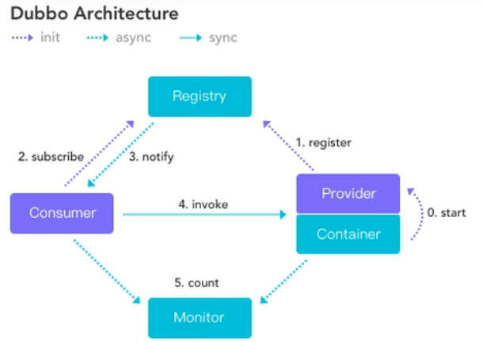

## 架构图

官网：https://dubbo.apache.org/zh/

服务注册中心：https://dubbo.apache.org/zh/docs/v2.7/user/references/registry/

## 整体设计

Nacos

启动，输入http://localhost:8848/nacos/

RPC原理

>一次完整的RPC调用流程(同步调用，异步另说)如下：
>
>1. 服务消费方(client) 调用以本地调用方式调用服务;
>2.  client stub接收到调用后负责将方法、参数等组装成能够进行网络传输的消息体;
>3. client stub找到服务地址，并将消息发送到服务端; 
>4.  server stub收到消息后进行解码;
>5. server stub根据解码结果调用本地的服务; 
>6. 本地服务执行并将结果返回给server stub;
>7. server stub将返回结果打包成消息并发送至消费方; 
>8. client stub接收到消息，并进行解码;
>9. 服务消费方得到最终结果。
>
>RPC框架的目标就是要2~8这些步骤都封装起来，这些细节对用户来说是透明的，不可见的。