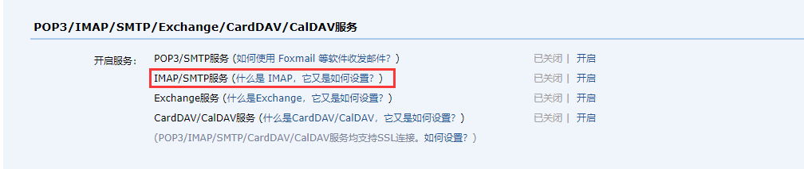

# [Davinci](https://github.com/edp963/davinci)

用户手册：https://edp963.github.io/davinci/

安装教程：https://edp963.github.io/davinci/docs/zh/1.1-deployment


在github下载release版本

解压改名

配置环境变量

```
export DAVINCI3_HOME=/opt/module/davinci
```

```
source /etc/profile
```

初始化数据库

修改 bin 目录下 initdb.sh 中要的数据库信息为要初始化的数据库，如 davinci0.3

```
mysql -P 3306 -h localhost -u root -proot davinci0.3 < $DAVINCI3_HOME/bin/davinci.sql
mysql -P 3306 -h 192.168.28.116 -u root -proot davinci0.3 < $DAVINCI3_HOME/bin/davinci.sql
```

运行脚本初始化数据库（注：由于 Davinci 系统数据库中包含存储过程，请务必在创建数据库时赋予执行权限）

```
sh bin/initdb.sh
```

> 这边我报错了，原因和解决方法：https://blog.csdn.net/ITWANGBOIT/article/details/100988597

配置application.yml，记得把redis启动起来（不用redis，就设置为false）

```yml
#  <<
#  Davinci
#  ==
#  Copyright (C) 2016 - 2019 EDP
#  ==
#  Licensed under the Apache License, Version 2.0 (the "License");
#  you may not use this file except in compliance with the License.
#  You may obtain a copy of the License at
#        http://www.apache.org/licenses/LICENSE-2.0
#   Unless required by applicable law or agreed to in writing, software
#   distributed under the License is distributed on an "AS IS" BASIS,
#   WITHOUT WARRANTIES OR CONDITIONS OF ANY KIND, either express or implied.
#   See the License for the specific language governing permissions and
#   limitations under the License.
#  >>


server:
  protocol: http
  address: 0.0.0.0
  port: 9001

  servlet:
    context-path: /

  # Used for mail and download services, can be empty, careful configuration
  # By default, 'server.address' and 'server.port' is used as the string value.
  # access:
  #  address:
  #  port:


## jwt is one of the important configuration of the application
## jwt config cannot be null or empty
jwtToken:
  secret: secret
  timeout: 1800000
  algorithm: HS512


## your datasource config
source:
  initial-size: 1
  min-idle: 1
  max-wait: 30000
  max-active: 10
  break-after-acquire-failure: true
  connection-error-retry-attempts: 1
  time-between-eviction-runs-millis: 2000
  min-evictable-idle-time-millis: 600000
  max-evictable-idle-time-millis: 900000
  test-while-idle: true
  test-on-borrow: false
  test-on-return: false
  validation-query: select 1
  validation-query-timeout: 10
  keep-alive: false
  filters: stat

  enable-query-log: false
  result-limit: 1000000


spring:
  mvc:
    async:
      request-timeout: 30s
  rest:
    proxy-host:
    proxy-port:
    proxy-ignore:


  ## davinci datasource config
  datasource:
    type: com.alibaba.druid.pool.DruidDataSource
    url: jdbc:mysql://localhost:3306/davinci0.3?useUnicode=true&characterEncoding=UTF-8&zeroDateTimeBehavior=convertToNull&allowMultiQueries=true
    username: root
    password: root
    driver-class-name: com.mysql.jdbc.Driver
    initial-size: 2
    min-idle: 1
    max-wait: 60000
    max-active: 10
    break-after-acquire-failure: true
    connection-error-retry-attempts: 1
    time-between-eviction-runs-millis: 2000
    min-evictable-idle-time-millis: 600000
    max-evictable-idle-time-millis: 900000
    test-while-idle: true
    test-on-borrow: false
    test-on-return: false
    validation-query: select 1
    validation-query-timeout: 10
    keep-alive: false
    filters: stat

  ## redis config
  ## please choose either of the two ways
  redis:
    isEnable: false

  ## standalone config
    host: 192.168.28.116
    port: 6379

  ## cluster config
  #  cluster:
  #       nodes:

    password:
    database: 0
    timeout: 1000
    jedis:
      pool:
        max-active: 8
        max-wait: 1
        max-idle: 8
        min-idle: 0

  ## mail is one of the important configuration of the application
  ## mail config cannot be null or empty
  ## some mailboxes need to be set separately password for the SMTP service)
  mail:
    host: smtp.qq.com
    port: 25
    username: 1344978030@qq.com
    fromAddress:
    password: fjikrlgxptznhgbb
    nickname: tsingdata

    properties:
      smtp:
        starttls:
          enable: true
          required: true
        auth: true
      mail:
        smtp:
          ssl:
            enable: false

  ldap:
    urls:
    username:
    password:
    base:
    domainName:    # domainName 指 企业邮箱后缀，如企业邮箱为：xxx@example.com，这里值为 '@example.com'

  security:
    oauth2:
      enable: false
#      client:
#        registration:
#          cas:
#            provider: cas
#            client-id: "xxxxx"
#            client-name: "Sign in with XXX"
#            client-secret: "xxxxx"
#            authorization-grant-type: authorization_code
#            client-authentication-method: post
#            redirect-uri-template: "{baseUrl}/login/oauth2/code/{registrationId}"
#            scope: userinfo
#        provider:
#          cas:
#            authorization-uri: https://cas.xxxxx.cn/cas/oauth2.0/authorize
#            token-uri: https://cas.xxxxx.cn/cas/oauth2.0/accessToken
#            user-info-uri: https://cas.xxxxx.cn/cas/oauth2.0/profile
#            user-name-attribute: id
#            userMapping:
#              email: "attributes.Email"
#              name: "attributes.CnName1"
#              avatar: "attributes.Avatar"

screenshot:
  default_browser: CHROME
  timeout_second: 600
  chromedriver_path: $your_chromedriver_path$
  remote_webdriver_url: $your_remote_webdriver_url$

data-auth-center:
  channels:
    - name:
      base-url:
      auth-code:

statistic:
  enable: true

  # You can use external elasticsearch storage [127.0.0.1:9300]
  elastic_urls:
  elastic_user:
  elastic_index_prefix:

  # You can also use external mysql storage
  mysql_url:
  mysql_username:
  mysql_password:

  # You can also use external kafka
  kafka.bootstrap.servers:
  kafka.topic:
  java.security.krb5.conf:
  java.security.keytab:
  java.security.principal:

encryption:
  maxEncryptSize: 1024
  type: Off # Off is to turn off encryption, to enable encryption, please select AES or RSA

```

在QQ邮箱开启




在bin目录下启动关闭服务

```
./start-server.sh
```

> 报错：2021-06-04 13:52:19.693  INFO 21731 --- [ost-startStop-1] o.a.catalina.core.AprLifecycleListener   : The APR based Apache Tomcat Native library which allows optimal performance in production environments was not found on the java.library.path: [/usr/java/packages/lib/amd64:/usr/lib64:/lib64:/lib:/usr/lib]
>
> 解决方法：https://blog.csdn.net/qq_38455201/article/details/80776446评论区
>
> yum install tomcat-native

访问：http://192.168.28.116:9001/

## Docker安装

https://www.cnblogs.com/llody/p/13024768.html

https://github.com/edp963/davinci-docker

```
git clone https://github.com/edp963/davinci-docker
```


```yml
version: '3.6'
services:
  davinci:
    environment:
      - TZ=Asia/Shanghai
      - SERVER_ADDRESS=0.0.0.0
      - SPRING_DATASOURCE_URL=jdbc:mysql://mysql:3306/davinci0.3?useUnicode=true&characterEncoding=UTF-8&zeroDateTimeBehavior=convertToNull&allowMultiQueries=true
      - SPRING_DATASOURCE_USERNAME=root
      - SPRING_DATASOURCE_PASSWORD=root
      - SPRING_DATASOURCE_TEST_ON_BORROW=true
      - SPRING_DATASOURCE_TIME_BETWEEN_EVICTION_RUNS_MILLIS=6000
      - SPRING_MAIL_HOST=smtp.qq.com
      - SPRING_MAIL_PORT=25
      - SPRING_MAIL_USERNAME=1344978030@qq.com
      - SPRING_MAIL_PASSWORD=这里自己配置，到邮箱设置
      - SPRING_MAIL_NICKNAME=tsingdata
      - SPRING_MAIL_PROPERTIES_MAIL_SMTP_SSL_ENABLE=true
      - SCREENSHOT_DEFAULT_BROWSER=CHROME
      - SCREENSHOT_TIMEOUT_SECOND=15
      - SCREENSHOT_REMOTE_WEBDRIVER_URL=http://chrome:4444/wd/hub
    image: "edp963/davinci:latest"
    ports:
      - 58080:8080
    command: ["./bin/docker-entrypoint.sh", "mysql:3306", "--", "start-server.sh"]
    restart: always
    volumes:
      - davinci_logs:/opt/davinci/logs
      - davinci_userfiles:/opt/davinci/userfiles
      - davinci_initdb:/initdb
      # 如果要使用更多数据源，请将驱动挂载到/opt/davinci/lib/下面，类似下面
      # - kylin-jdbc-2.6.3.jar.jar:/opt/davinci/lib/kylin-jdbc-2.6.3.jar.jar
      # - mssql-jdbc-7.0.0.jre8.jar:/opt/davinci/lib/mssql-jdbc-7.0.0.jre8.jar
  chrome:
    image: selenium/standalone-chrome
    shm_size: 2g
    environment:
      - TZ=Asia/Shanghai
  mysql:
    image: mysql:8
    restart: always
    environment:
      - MYSQL_ROOT_PASSWORD=root
      - MYSQL_DATABASE=davinci0.3
    volumes:
      - mysql_data:/var/lib/mysql
      - davinci_initdb:/docker-entrypoint-initdb.d:ro

volumes:
  davinci_userfiles:
  davinci_logs:
  davinci_initdb:
  mysql_data:
```

