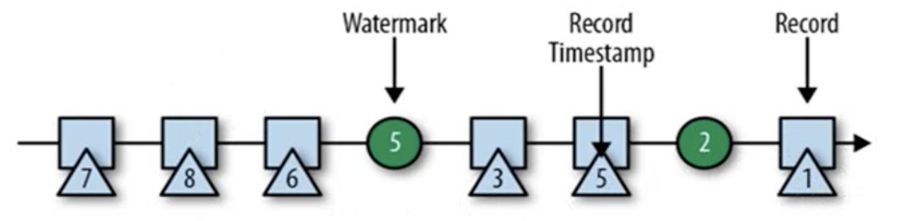

# Flink简单上手

## 批处理

创建maven项目，修改pom文件

添加依赖

```xml
    <dependencies>
        <dependency>
            <groupId>org.apache.flink</groupId>
            <artifactId>flink-java</artifactId>
            <version>1.3</version>
        </dependency>

        <dependency>
            <groupId>org.apache.flink</groupId>
            <artifactId>flink-streaming-java_2.12</artifactId>
            <version>1.3</version>
        </dependency>

        <dependency>
            <groupId>org.apache.flink</groupId>
            <artifactId>flink-clients_2.12</artifactId>
            <version>1.3</version>
        </dependency>
    </dependencies>
```

在Resource下面新建hello.txt

```
hello word
hello spark
hello scala
and you
```

新建WordCount类

```java
public class WordCount {

    public static void main(String[] args) throws Exception {
        // 创建环境

        ExecutionEnvironment env = ExecutionEnvironment.getExecutionEnvironment();

        // 文件路径
        String inputPath = "/Users/glong/project/bigdata/flink/src/main/resources/hello.txt";

        DataSource<String> inputDataSet = env.readTextFile(inputPath);

        // 对数据进行处理
        DataSet<Tuple2<String, Integer>> result = inputDataSet.flatMap(new MyFlatMapper())
                .groupBy(0) // 按照第一个位置对word分组
                .sum(1);// 将第二个位置上对数据求和

        result.print();
    }

  	// 上面的flatMap需要
    public static class MyFlatMapper implements FlatMapFunction<String, Tuple2<String, Integer>> {
        @Override
        public void flatMap(String value, Collector<Tuple2<String, Integer>> out) throws Exception {
            // 按照空格分词
            String[] words = value.split(" ");

            // 遍历，包成二元组输出
            for (String word : words) {
                out.collect(new Tuple2<>(word, 1));
            }
        }
    }
}
```

## 流处理

创建StreamWordCount

### 从文件中读取数据

```java
public class StreamWordCount {
    public static void main(String[] args) throws Exception {
        // 创建流处理执行环境
        StreamExecutionEnvironment env = StreamExecutionEnvironment.getExecutionEnvironment();

        String inputPath = "/Users/glong/project/bigdata/flink/src/main/resources/hello.txt";

        DataStream<String> inputDataStream = env.readTextFile(inputPath);

        // 基于数据流进行转换操作
        SingleOutputStreamOperator<Tuple2<String, Integer>> result = inputDataStream.flatMap(new WordCount.MyFlatMapper())
                .keyBy(0)
                .sum(1);

        result.print();

        // 执行任务
        env.execute();
    }
}
```

结果

```bash
3> (hello,1)
1> (scala,1)
3> (hello,2)
1> (spark,1)
3> (hello,3)
6> (word,1)
5> (you,1)
8> (and,1)
```

这就是==有状态==的流处理，来一个处理一次。另外前面的数字是线程（默认是本地机器的线程），可以使用如下API修改

```java
env.setParallelism(4);
```

### 从socket文本流读取数据

```java
public class StreamWordCount {
    public static void main(String[] args) throws Exception {
        // 创建流处理执行环境
        StreamExecutionEnvironment env = StreamExecutionEnvironment.getExecutionEnvironment();

        DataStream<String> inputDataStream = env.socketTextStream("localhost", 3000);

        // 基于数据流进行转换操作
        SingleOutputStreamOperator<Tuple2<String, Integer>> result = inputDataStream.flatMap(new WordCount.MyFlatMapper())
                .keyBy(0)
                .sum(1);

        // 打印结果
        result.print();

        // 执行任务
        env.execute();
    }
}

```

启动程序

打开Mac终端或者Windows的虚拟机

输入

```bash
nc -lk 3000
```


### 离生产环境更近一步

不再将host和port写死，使用Flink提供的parameter tool

```java
// 用parameter tool工具从程序启动参数中提取配置项
ParameterTool parameterTool = ParameterTool.fromArgs(args);
        String host = parameterTool.get("host");
        int port = parameterTool.getInt("port");
```

在Run的编辑配置，添加参数


再次运行main程序，然后在终端打开并输入

```bash
nc lk 3000
```

```
hello world glong
```


# Flink部署

## Standlone模式

略

## Yarn模式

# Flink运行时架构


# Flink流处理API

## 执行环境


## Source

### 集合

### 文本

### Kafka

引入官方依赖

```xml
        <dependency>
            <groupId>org.apache.flink</groupId>
            <artifactId>flink-connector-kafka_2.11</artifactId>
            <version>1.10.3</version>
        </dependency>
```


```java
// kafka 配置项
Properties properties = new Properties();
properties.setProperty("bootstrap.servers", "localhost:9092");
properties.setProperty("group.id", "consumer-group");
properties.setProperty("key.deserializer","org.apache.kafka.common.serialization.StringDeserializer");
properties.setProperty("value.deserializer","org.apache.kafka.common.serialization.StringDeserializer");
properties.setProperty("auto.offset.reset", "latest");
// 从 kafka 读取数据
DataStream<String> dataStream = env.addSource( new FlinkKafkaConsumer011<String>("sensor", new SimpleStringSchema(), properties));
```


## Transform转换算子

Flink最重要的部分

### 基本算子

> map：一个输入对应一个输出。将数据转换为POJO就用这种方式
>
> flapmap
>
> Filter

```java
public class Transfroming {
    public static void main(String[] args) throws Exception {
        StreamExecutionEnvironment env = StreamExecutionEnvironment.getExecutionEnvironment();

        DataStream<String> dataStream = env.socketTextStream("localhost", 7777);


//        // 1. 统计字符串长度，map算子 一个输入对应一个输出
//        DataStream<Integer> result = dataStream.map(new MapFunction<String, Integer>() {
//            @Override
//            public Integer map(String s) throws Exception {
//                return s.length();
//            }
//        });

//        // 2. wordcount， 使用flapmap算子，一个输入多个输出。
//        DataStream<Tuple2<String, Integer>> result = dataStream.flatMap(new FlatMapFunction<String, Tuple2<String, Integer>>() {
//            @Override
//            public void flatMap(String s, Collector<Tuple2<String, Integer>> collector) throws Exception {
//                String[] words = s.split(" ");
//                for (String word : words) {
//                    collector.collect(new Tuple2<>(word, 1));
//                }
//            }
//        });

        // 3. 过滤，要或者不要
        DataStream<String> result = dataStream.filter(new FilterFunction<String>() {
            @Override
            public boolean filter(String s) throws Exception {
                return s.startsWith("glong");
            }
        });


        result.print();

        env.execute();
    }
}
```


### 分组算子

#### KeyBy

将数据流的数据分到不同的分区，基于HashCode。

### 聚合算子

>聚合前必须分组！

#### 滚动聚合算子


```
1. sum
2. min
3. max
4. minBy
5. maxBy
```

#### Reduce聚合算子


## Sink

```java
addSink()	最通用
...
writeToSocket()
writeAsCsv()
```

官方提供的依赖

### Kafka

```xml
        <dependency>
            <groupId>org.apache.flink</groupId>
            <artifactId>flink-connector-kafka_2.11</artifactId>
            <version>1.10.3</version>
        </dependency>
```

将Kafka的一个topic（记为1）作为Flink的Source，Flink实时读取数据，然后Sink到Kafka的另一个topic（记为2）。

此时对topic1的生产者输入数据，那么topic2的消费者会得到数据。

### Redis

```xml
<dependency> 
    <groupId>org.apache.bahir</groupId> 
    <artifactId>flink-connector-redis_2.11</artifactId> 
    <version>1.0</version>
</dependency>
```


```java
public class Sink_Redis {
    public static void main(String[] args) throws Exception {

        StreamExecutionEnvironment env = StreamExecutionEnvironment.getExecutionEnvironment();

        DataStream<String> dataStream = env.readTextFile("/Users/glong/project/bigdata/flink/src/main/resources/hello.txt");

        FlinkJedisPoolConfig config = new FlinkJedisPoolConfig.Builder()
                .setHost("localhost")
                .setPort(6379)
                .build(); // 构造方法是稀有的，这个类使用的创造者模式

        dataStream.addSink(new RedisSink<>(config, new MyRedisMapper()))

        env.execute();
    }

    // 自定义RedisMapper
    private static class MyRedisMapper implements RedisMapper<SensorReading> {
        // 定义保存数据到Redis的命令
        @Override
        public RedisCommandDescription getCommandDescription() {
            return new RedisCommandDescription(RedisCommand.HSET, "sensot_temp");
        }

        @Override
        public String getKeyFromData(Object data) {
            return data.getId();
        }

        @Override
        public String getValueFromData(Object data) {
            return data.getTemperature.toString();
        }
    }
}
```


### ElasticSearch


# Flink window API


## window 概念


## window 类型

### `时间`窗口（Time Window）

- 滚动时间窗口
- 滑动时间窗口
- 会话窗口

#### 滚动窗口（Tumbling Windows）

英文名在源码里会见到


- 将数据依据固定的窗口长度对数据进行切分 
- 时间对齐，窗口长度固定，没有重叠。表现为头连尾，尾连头。**8:00 ~ 9:00   9:00 ~ 10:00**
- 另外区间按照左闭右开的原则划分`[	)`。

#### 滑动窗口（Sliding Windows） 


- 滑动窗口是滚动窗口的`更广义`的一种形式，滑动窗口由固定的窗口长度和`滑动间隔`组成
- 窗口长度固定，可以有`重叠`。不再是头连尾，尾连头。**8:00 ~ 9:00   8:30 ~ 9:30** 

#### 会话窗口（Session Windows） 


- 由一系列事件组合一个指定时间长度的 timeout 间隙组成，也就是一段时间没有接收到新数据就会生成新的窗口。如果超过`session gap 会话间隔`，那么前面的窗口关闭，下一个窗口开启。
- 特点：时间无对齐


### `计数`窗口（Count Window） 

#### 滚动计数窗口

#### 滑动计数窗口


## window API

- 窗口分配器——`window()`方法

- 我们可以用`.window()`来定义一个窗口，然后基于这个window去做一些聚合或者其他处理操作。

  **注意`window()`方法必须在keyBy之后才能使用**。

- Flink提供了更加简单的`.timeWindow()`和`.countWindow()`方法，用于定义时间窗口和计数窗口。

```java
DataStream<Tuple2<String,Double>> minTempPerWindowStream = 
  datastream
  .map(new MyMapper())
  .keyBy(data -> data.f0)
  .timeWindow(Time.seconds(15))	// 就一个参数，滚动窗口。内部帮我们判断过
  .minBy(1);
```

### 窗口分配器(window assigner)

- `window()`方法接收的输入参数是一个WindowAssigner
- WindowAssigner负责将每条输入的数据分发到正确的window中
- Flink提供了通用的`WindowAssigner`
  - 滚动窗口（tumbling window）
  - 滑动窗口（sliding window）
  - 会话窗口（session window）
  - **全局窗口（global window）**

### 创建不同类型的窗口

- 滚动时间窗口（tumbling time window）

  `.timeWindow(Time.seconds(15))`

- 滑动时间窗口（sliding time window）

  `.timeWindow(Time.seconds(15),Time.seconds(5))`

- 会话窗口（session window）

  `.window(EventTimeSessionWindows.withGap(Time.minutes(10)))`

- 滚动计数窗口（tumbling count window）

  `.countWindow(5)`

- 滑动计数窗口（sliding count window）

  `.countWindow(10,2)`

DataStream的`windowAll()`类似分区的global操作，这个操作是non-parallel的(并行度强行为1)，所有的数据都会被传递到同一个算子operator上，官方建议如果非必要就不要用这个API

### TimeWindow

 TimeWindow将指定时间范围内的所有数据组成一个window，一次对一个window里面的所有数据进行计算。

#### 滚动窗口

 Flink默认的时间窗口根据ProcessingTime进行窗口的划分，将Flink获取到的数据根据进入Flink的时间划分到不同的窗口中。

```java
DataStream<Tuple2<String, Double>> minTempPerWindowStream = dataStream 
  .map(new MapFunction<SensorReading, Tuple2<String, Double>>() { 
    @Override 
    public Tuple2<String, Double> map(SensorReading value) throws Exception {
      return new Tuple2<>(value.getId(), value.getTemperature()); 
    } 
  }) 
  .keyBy(data -> data.f0) 
  .timeWindow( Time.seconds(15) ) 
  .minBy(1);
```

 时间间隔可以通过`Time.milliseconds(x)`，`Time.seconds(x)`，`Time.minutes(x)`等其中的一个来指定。

#### 滑动窗口

 滑动窗口和滚动窗口的函数名是完全一致的，只是在传参数时需要传入两个参数，一个是window_size，一个是sliding_size。

 下面代码中的sliding_size设置为了5s，也就是说，每5s就计算输出结果一次，每一次计算的window范围是15s内的所有元素。

```java
DataStream<SensorReading> minTempPerWindowStream = dataStream 
  .keyBy(SensorReading::getId) 
  .timeWindow( Time.seconds(15), Time.seconds(5) ) 
  .minBy("temperature");
```

 时间间隔可以通过`Time.milliseconds(x)`，`Time.seconds(x)`，`Time.minutes(x)`等其中的一个来指定。

### CountWindow

 CountWindow根据窗口中相同key元素的数量来触发执行，执行时只计算元素数量达到窗口大小的key对应的结果。

 **注意：CountWindow的window_size指的是相同Key的元素的个数，不是输入的所有元素的总数。**

#### 滚动窗口

 默认的CountWindow是一个滚动窗口，只需要指定窗口大小即可，**当元素数量达到窗口大小时，就会触发窗口的执行**。

```java
DataStream<SensorReading> minTempPerWindowStream = dataStream 
  .keyBy(SensorReading::getId) 
  .countWindow( 5 ) 
  .minBy("temperature");
```

#### 滑动窗口

 滑动窗口和滚动窗口的函数名是完全一致的，只是在传参数时需要传入两个参数，一个是window_size，一个是sliding_size。

 下面代码中的sliding_size设置为了2，也就是说，每收到两个相同key的数据就计算一次，每一次计算的window范围是10个元素。

```java
DataStream<SensorReading> minTempPerWindowStream = dataStream 
  .keyBy(SensorReading::getId) 
  .countWindow( 10, 2 ) 
  .minBy("temperature");
```

### 窗口函数 window function

上面我们已经收集到了数据了，那么肯定要对这些数据做处理啊。

window function 定义了`对窗口中收集的数据做的计算操作`，主要可以分为两类：

- 增量聚合函数（incremental aggregation functions）
- 全窗口函数（full window functions）

#### 1. 增量聚合函数

- **每条数据到来就进行计算**，保持一个简单的状态，比如sum求和操作就是一个简单状态。（来一条处理、聚合一条，`但是不输出`，到窗口临界位置才输出）
- 典型的增量聚合函数有ReduceFunction, AggregateFunction。

#### 2. 全窗口函数

- **先把窗口所有数据收集起来，等到计算的时候会遍历所有数据**。（来一个放一个，窗口临界位置才遍历且计算、输出），类似于`批处理`。
- ProcessWindowFunction，WindowFunction。

#### 3.两者优缺点

- 增量聚合函数性能更好
- 全窗口函数能够联系上下文，使用场景更多
- 两者应当是结合使用最优。

### 其它可选API

> [Flink-Window概述 | Window类型 | TimeWindow、CountWindow、SessionWindow、WindowFunction](https://blog.csdn.net/qq_40180229/article/details/106359443)

- `.trigger()` ——触发器

  定义window 什么时候关闭，触发计算并输出结果

- `.evitor()` ——移除器

  定义移除某些数据的逻辑

- `.allowedLateness()` ——允许处理迟到的数据

- `.sideOutputLateData()` ——将迟到的数据放入侧输出流

- `.getSideOutput()` ——获取侧输出流


### 代码测试

> [Flink之Window的使用（2）：时间窗口](https://www.cnblogs.com/yangshibiao/p/1413362html)

1. 测试滚动时间窗口的**增量聚合函数**

   增量聚合函数，特点即每次数据过来都处理，但是**到了窗口临界才输出结果**。

   - 编写java代码

     ```java
     package apitest.window;
     
     import apitest.beans.SensorReading;
     import org.apache.flink.api.common.functions.AggregateFunction;
     import org.apache.flink.streaming.api.datastream.DataStream;
     import org.apache.flink.streaming.api.environment.StreamExecutionEnvironment;
     import org.apache.flink.streaming.api.windowing.assigners.TumblingProcessingTimeWindows;
     import org.apache.flink.streaming.api.windowing.time.Time;
     
     /**
      * @author : Ashiamd email: ashiamd@foxmail.com
      * @date : 2021/2/1 7:14 PM
      */
     public class WindowTest1_TimeWindow {
       public static void main(String[] args) throws Exception {
     
         // 创建执行环境
         StreamExecutionEnvironment env = StreamExecutionEnvironment.getExecutionEnvironment();
     
         // 并行度设置1，方便看结果
         env.setParallelism(1);
     
         //        // 从文件读取数据
         //        DataStream<String> dataStream = env.readTextFile("/tmp/Flink_Tutorial/src/main/resources/sensor.txt");
     
         // 从socket文本流获取数据
         DataStream<String> inputStream = env.socketTextStream("localhost", 7777);
     
         // 转换成SensorReading类型
         DataStream<SensorReading> dataStream = inputStream.map(line -> {
           String[] fields = line.split(",");
           return new SensorReading(fields[0], new Long(fields[1]), new Double(fields[2]));
         });
     
         // 开窗测试
     
         // 1. 增量聚合函数 (这里简单统计每个key组里传感器信息的总数)
         DataStream<Integer> resultStream = dataStream.keyBy("id")
           //                .countWindow(10, 2);
           //                .window(EventTimeSessionWindows.withGap(Time.minutes(1)));
           //                .window(TumblingProcessingTimeWindows.of(Time.seconds(15)))
           //                .timeWindow(Time.seconds(15)) // 已经不建议使用@Deprecated
           .window(TumblingProcessingTimeWindows.of(Time.seconds(15)))
           .aggregate(new AggregateFunction<SensorReading, Integer, Integer>() {
     
             // 新建的累加器
             @Override
             public Integer createAccumulator() {
               return 0;
             }
     
             // 每个数据在上次的基础上累加
             @Override
             public Integer add(SensorReading value, Integer accumulator) {
               return accumulator + 1;
             }
     
             // 返回结果值
             @Override
             public Integer getResult(Integer accumulator) {
               return accumulator;
             }
     
             // 分区合并结果(TimeWindow一般用不到，SessionWindow可能需要考虑合并)
             @Override
             public Integer merge(Integer a, Integer b) {
               return a + b;
             }
           });
     
         resultStream.print("result");
     
         env.execute();
       }
     }
     ```

   - 本地开启socket服务

     ```shell
     nc -lk 7777
     ```

   - 启动Flink程序，在socket窗口输入数据

     - 输入(下面用“换行”区分每个15s内的输入，实际输入时无换行)

       ```none
       sensor_1,1547718199,35.8
       sensor_6,1547718201,15.4
       
       sensor_7,1547718202,6.7
       sensor_10,1547718205,31
       sensor_1,1547718207,36.3
       sensor_1,1547718209,32.8
       
       sensor_1,1547718212,31
       ```

     - 输出（下面用“换行”区分每个15s内的输出，实际输出无换行）

       *因为代码实现每15s一个window，所以"sensor_1"中间一组才累计2，最初一次不累计，最后一次也是另外的window，重新从1计数。*

       ```none
       result> 1
       result> 1
       
       result> 1
       result> 1
       result> 2
       
       result> 1
       ```

2. 测试滚动时间窗口的**全窗口函数**

   全窗口函数，特点即数据过来先不处理，等到窗口临界再遍历、计算、输出结果。

   - 编写java测试代码

     ```java
     package apitest.window;
     
     import apitest.beans.SensorReading;
     import org.apache.commons.collections.IteratorUtils;
     import org.apache.flink.api.common.functions.AggregateFunction;
     import org.apache.flink.api.java.tuple.Tuple;
     import org.apache.flink.api.java.tuple.Tuple3;
     import org.apache.flink.streaming.api.datastream.DataStream;
     import org.apache.flink.streaming.api.datastream.SingleOutputStreamOperator;
     import org.apache.flink.streaming.api.environment.StreamExecutionEnvironment;
     import org.apache.flink.streaming.api.functions.windowing.WindowFunction;
     import org.apache.flink.streaming.api.windowing.assigners.TumblingProcessingTimeWindows;
     import org.apache.flink.streaming.api.windowing.time.Time;
     import org.apache.flink.streaming.api.windowing.windows.TimeWindow;
     import org.apache.flink.util.Collector;
     
     /**
      * @author : Ashiamd email: ashiamd@foxmail.com
      * @date : 2021/2/1 7:14 PM
      */
     public class WindowTest1_TimeWindow {
         public static void main(String[] args) throws Exception {
     
             // 创建执行环境
             StreamExecutionEnvironment env = StreamExecutionEnvironment.getExecutionEnvironment();
     
             // 并行度设置1，方便看结果
             env.setParallelism(1);
     
     //        // 从文件读取数据
     //        DataStream<String> dataStream = env.readTextFile("/tmp/Flink_Tutorial/src/main/resources/sensor.txt");
     
             // 从socket文本流获取数据
             DataStream<String> inputStream = env.socketTextStream("localhost", 7777);
     
             // 转换成SensorReading类型
             DataStream<SensorReading> dataStream = inputStream.map(line -> {
                 String[] fields = line.split(",");
                 return new SensorReading(fields[0], new Long(fields[1]), new Double(fields[2]));
             });
     
             // 2. 全窗口函数 （WindowFunction和ProcessWindowFunction，后者更全面）
             SingleOutputStreamOperator<Tuple3<String, Long, Integer>> resultStream2 = dataStream.keyBy(SensorReading::getId)
                     .window(TumblingProcessingTimeWindows.of(Time.seconds(15)))
     //                .process(new ProcessWindowFunction<SensorReading, Object, Tuple, TimeWindow>() {
     //                })
                     .apply(new WindowFunction<SensorReading, Tuple3<String, Long, Integer>, String, TimeWindow>() {
                         @Override
                         public void apply(String s, TimeWindow window, Iterable<SensorReading> input, Collector<Tuple3<String, Long, Integer>> out) throws Exception {
                             String id = s;
                             long windowEnd = window.getEnd();
                             int count = IteratorUtils.toList(input.iterator()).size();
                             out.collect(new Tuple3<>(id, windowEnd, count));
                         }
                     });
     
             resultStream2.print("result2");
     
             env.execute();
         }
     }
     ```

   - 启动本地socket

     ```shell
     nc -lk 7777
     ```

   - 在本地socket输入，查看Flink输出结果

     - 输入（以“空行”表示每个15s时间窗口内的输入，实际没有“空行”）

       ```none
       sensor_1,1547718199,35.8
       sensor_6,1547718201,15.4
       
       sensor_7,1547718202,6.7
       sensor_10,1547718205,31
       sensor_1,1547718207,36.3
       sensor_1,1547718209,32.8
       ```

     - 输出（以“空行”表示每个15s时间窗口内的输入，实际没有“空行”）

       *这里每个window都是分开计算的，所以第一个window里的sensor_1和第二个window里的sensor_1并没有累计。*

       ```none
       result2> (sensor_1,1612190820000,1)
       result2> (sensor_6,1612190820000,1)
       
       result2> (sensor_7,1612190835000,1)
       result2> (sensor_1,1612190835000,2)
       result2> (sensor_10,1612190835000,1)
       ```

3. 测试滑动计数窗口的**增量聚合函数**

   滑动窗口，当窗口不足设置的大小时，会先按照步长输出。

   eg：窗口大小10，步长2，那么前5次输出时，窗口内的元素个数分别是（2，4，6，8，10），再往后就是10个为一个窗口了。

   - 编写java代码：

     这里获取每个窗口里的温度平均值

     ```java
     package apitest.window;
     
     import apitest.beans.SensorReading;
     import org.apache.flink.api.common.functions.AggregateFunction;
     import org.apache.flink.api.java.tuple.Tuple2;
     import org.apache.flink.streaming.api.datastream.DataStream;
     import org.apache.flink.streaming.api.environment.StreamExecutionEnvironment;
     
     /**
      * @author : Ashiamd email: ashiamd@foxmail.com
      * @date : 2021/2/1 11:03 PM
      */
     public class WindowTest2_CountWindow {
       public static void main(String[] args) throws Exception {
     
         // 创建执行环境
         StreamExecutionEnvironment env = StreamExecutionEnvironment.getExecutionEnvironment();
     
         // 并行度设置1，方便看结果
         env.setParallelism(1);
     
         // 从socket文本流获取数据
         DataStream<String> inputStream = env.socketTextStream("localhost", 7777);
     
         // 转换成SensorReading类型
         DataStream<SensorReading> dataStream = inputStream.map(line -> {
           String[] fields = line.split(",");
           return new SensorReading(fields[0], new Long(fields[1]), new Double(fields[2]));
         });
     
         DataStream<Double> resultStream = dataStream.keyBy(SensorReading::getId)
           .countWindow(10, 2)
           .aggregate(new MyAvgFunc());
     
         resultStream.print("result");
     
         env.execute();
       }
     
       public static class MyAvgFunc implements AggregateFunction<SensorReading, Tuple2<Double, Integer>, Double> {
     
         @Override
         public Tuple2<Double, Integer> createAccumulator() {
           return new Tuple2<>(0.0, 0);
         }
     
         @Override
         public Tuple2<Double, Integer> add(SensorReading value, Tuple2<Double, Integer> accumulator) {
           // 温度累加求和，当前统计的温度个数+1
           return new Tuple2<>(accumulator.f0 + value.getTemperature(), accumulator.f1 + 1);
         }
     
         @Override
         public Double getResult(Tuple2<Double, Integer> accumulator) {
           return accumulator.f0 / accumulator.f1;
         }
     
         @Override
         public Tuple2<Double, Integer> merge(Tuple2<Double, Integer> a, Tuple2<Double, Integer> b) {
           return new Tuple2<>(a.f0 + b.f0, a.f1 + b.f1);
         }
       }
     }
     ```

   - 启动socket服务

     ```shell
     nc -lk 7777
     ```

   - 本地socket输入，Flink控制台查看输出结果

     - 输入

       这里为了方便，就只输入同一个keyBy组的数据`sensor_1`

       ```none
       sensor_1,1547718199,1
       sensor_1,1547718199,2
       sensor_1,1547718199,3
       sensor_1,1547718199,4
       sensor_1,1547718199,5
       sensor_1,1547718199,6
       sensor_1,1547718199,7
       sensor_1,1547718199,8
       sensor_1,1547718199,9
       sensor_1,1547718199,10
       sensor_1,1547718199,11
       sensor_1,1547718199,12
       sensor_1,1547718199,13
       sensor_1,1547718199,14
       ```

     - 输出

       输入时，会发现，每次到达一个窗口步长（这里为2），就会计算得出一次结果。

       第一次计算前2个数的平均值

       第二次计算前4个数的平均值

       第三次计算前6个数的平均值

       第四次计算前8个数的平均值

       第五次计算前10个数的平均值

       **第六次计算前最近10个数的平均值**

       **第七次计算前最近10个数的平均值**

       ```none
       result> 1.5
       result> 2.5
       result> 3.5
       result> 4.5
       result> 5.5
       result> 5
       result> 5
       ```

4. 其他可选API代码片段

   ```java
   // 3. 其他可选API
   OutputTag<SensorReading> outputTag = new OutputTag<SensorReading>("late") {
   };
   
   SingleOutputStreamOperator<SensorReading> sumStream = dataStream.keyBy("id")
     .timeWindow(Time.seconds(15))
     //                .trigger() // 触发器，一般不使用 
     //                .evictor() // 移除器，一般不使用
     .allowedLateness(Time.minutes(1)) // 允许1分钟内的迟到数据<=比如数据产生时间在窗口范围内，但是要处理的时候已经超过窗口时间了
     .sideOutputLateData(outputTag) // 侧输出流，迟到超过1分钟的数据，收集于此
     .sum("temperature"); // 侧输出流 对 温度信息 求和。
   
   // 之后可以再用别的程序，把侧输出流的信息和前面窗口的信息聚合。（可以把侧输出流理解为用来批处理来补救处理超时数据）
   ```

# 时间语义和Watermark

## 1 Flink中的时间语义


- **Event Time：事件创建时间；**
- Ingestion Time：数据进入Flink的时间；
- Processing Time：执行操作算子的本地系统时间，与机器相关；

 *Event Time是事件创建的时间。它通常由事件中的时间戳描述，例如采集的日志数据中，每一条日志都会记录自己的生成时间，Flink通过时间戳分配器访问事件时间戳。*

**用星球大战举例**


星球大战第一步火热，炒作IP，还会拍前传。

- 不同的时间语义有不同的应用场合
- **我们往往更关心事件事件（Event Time）**


这里假设玩游戏，两分钟内如果过5关就有奖励。用户坐地铁玩游戏，进入隧道前已经过3关，在隧道中又过了2关。但是信号不好，后两关通关的信息，等到出隧道的时候（8:23:20）才正式到达服务器。

 如果为了用户体验，那么应该按照Event Time处理信息，保证用户获得游戏奖励。

- Event Time可以从日志数据的时间戳（timestamp）中提取

  ```shell
  2017-11-02 18:27:15.624 INFO Fail over to rm
  ```

## 2 EventTime的引入

 **在Flink的流式处理中，绝大部分的业务都会使用eventTime**，一般只在eventTime无法使用时，才会被迫使用ProcessingTime或者IngestionTime。

 *（虽然默认环境里使用的就是ProcessingTime，使用EventTime需要另外设置）*

 如果要使用EventTime，那么需要引入EventTime的时间属性，引入方式如下所示：

```java
StreamExecutionEnvironment env = StreamExecutionEnvironment.getExecutionEnvironment();
// 从调用时刻开始给env创建的每一个stream追加时间特征
env.setStreamTimeCharacteristic(TimeCharacteristic.EventTime);
```

**注：具体的时间，还需要从数据中提取时间戳。**

## 3 Watermark 水位线

Watermark是可以理解为一种`延迟触发机制`，例如：`“我数3下，1、2、2.5、2.8、2.9、2.99、3”`

> [Flink流计算编程--watermark（水位线）简介](https://blog.csdn.net/lmalds/article/details/52704170) <= 不错的文章，建议阅读

### 3.1 概念

- Flink对于迟到数据有三层保障，先来后到的保障顺序是：
  - WaterMark => 约等于放宽窗口标准
  - allowedLateness => 允许迟到（ProcessingTime超时，但是EventTime没超时）
  - sideOutputLateData => 超过迟到时间，另外捕获，之后可以自己批处理合并先前的数据

我们知道，流处理从事件产生，到流经source，再到operator，中间是有一个过程和时间的，虽然大部分情况下，流到operator的数据都是按照事件产生的时间顺序来的，但是也不排除由于网络、分布式等原因，`导致乱序的产生`，所谓乱序，就是指Flink接收到的事件的先后顺序不是严格按照事件的Event Time顺序排列的。


那么此时出现一个问题，一旦出现乱序，如果只根据eventTime决定window的运行，我们不能明确数据是否全部到位，但又不能无限期的等下去，此时`必须要有个机制来保证一个特定的时间后，必须触发window去进行计算了`，这个特别的机制，就是`Watermark`。


- 当Flink以**Event Time模式**处理数据流时，它会根据**数据里的时间戳**来处理基于时间的算子。

  （比如5s一个窗口，那么理想情况下，遇到时间戳是5s的数据时，就认为[0,5s)时间段的桶bucket就可以关闭了。）

- 实际由于网络、分布式传输处理等原因，会导致乱序数据的产生

- 乱序数据会导致窗口计算不准确

  （如果按照前面说法，获取到5s时间戳的数据，但是2s，3s乱序数据还没到，理论上不应该关闭桶）

**Watermark**

- 怎样避免乱序数据带来的计算不正确？
- 遇到一个时间戳达到了窗口关闭时间，不应该立即触发窗口计算，而是等待一段时间，等迟到的数据来了再关闭窗口

1. Watermark是一种衡量Event Time进展的机制，可以设定延迟触发

2. Watermark是用于处理乱序事件的，而正确的处理乱序事件，通常用Watermark机制结合window来实现

3. 数据流中的Watermark用于表示”timestamp小于Watermark的数据，都已经到达了“，因此，window的执行也是由Watermark触发的。

4. Watermark可以理解成一个`延迟触发机制`，我们可以设置Watermark的延时时长t，每次系统会校验已经到达的数据中最大的maxEventTime，然后认定eventTime小于maxEventTime - t的所有数据都已经到达，**如果有窗口的停止时间等于maxEventTime – t，那么这个窗口被触发执行。**

   `Watermark = maxEventTime - 延迟时间 t`

5. watermark 用来让程序自己平衡延迟和结果正确性

*watermark可以理解为把原本的窗口标准稍微放宽了一点。（比如原本5s，设置延迟时间=2s，那么实际等到7s的数据到达时，才认为是[0,5）的桶需要关闭了）*

有序流的Watermarker如下图所示：（延迟时间设置为0s）

*此时以5s一个窗口，那么EventTime=5s的元素到达时，关闭第一个窗口，下图即W(5)，W(10)同理。*


乱序流的Watermarker如下图所示：（延迟时间设置为2s）

*乱序流，所以可能出现EventTime前后顺序不一致的情况，这里延迟时间设置2s，第一个窗口则为`5s+2s`，当EventTime=7s的数据到达时，关闭第一个窗口。第二个窗口则是`5\*2+2=12s`，当12s这个EventTime的数据到达时，关闭第二个窗口。*


 当Flink接收到数据时，会按照一定的规则去生成Watermark，这条Watermark就等于当前所有到达数据中的maxEventTime-延迟时长，也就是说，**Watermark是基于数据携带的时间戳生成的**，一旦Watermark比当前未触发的窗口的停止时间要晚，那么就会触发相应窗口的执行。

 **由于event time是由数据携带的，因此，如果运行过程中无法获取新的数据，那么没有被触发的窗口将永远都不被触发**。

 上图中，我们设置的允许最大延迟到达时间为2s，所以时间戳为7s的事件对应的Watermark是5s，时间戳为12s的事件的Watermark是10s，如果我们的窗口1是`1s~5s`，窗口2是`6s~10s`，那么时间戳为7s的事件到达时的Watermarker恰好触发窗口1，时间戳为12s的事件到达时的Watermark恰好触发窗口2。

 **Watermark 就是触发前一窗口的“关窗时间”，一旦触发关门那么以当前时刻为准在窗口范围内的所有所有数据都会收入窗中。**

 **只要没有达到水位那么不管现实中的时间推进了多久都不会触发关窗。**

### 3.2 Watermark的特点



- watermark 是一条特殊的数据记录
- **watermark 必须单调递增**，以确保任务的事件时间时钟在向前推进，而不是在后退
- watermark 与数据的时间戳相关

### 3.3 Watermark的传递


1. 图一，当前Task有四个上游Task给自己传输WaterMark信息，通过比较，只取当前最小值作为自己的本地Event-time clock，上图中，当前Task[0,2)的桶就可关闭了，因为所有上游中2s最小，能保证2s的WaterMark是准确的（所有上游Watermark都已经>=2s)。这时候将Watermark=2广播到当前Task的下游。
2. 图二，上游的Watermark持续变动，此时Watermark=3成为新的最小值，更新本地Task的event-time clock，同时将最新的Watermark=3广播到下游
3. 图三，上游的Watermark虽然更新了，但是当前最小值还是3，所以不更新event-time clock，也不需要广播到下游
4. 图四，和图二同理，更新本地event-time clock，同时向下游广播最新的Watermark=4

### 3.4 Watermark的引入

 watermark的引入很简单，对于乱序数据，最常见的引用方式如下：

```scala
dataStream.assignTimestampsAndWatermarks( new BoundedOutOfOrdernessTimestampExtractor<SensorReading>(Time.milliseconds(1000)) {
  @Override
  public long extractTimestamp(element: SensorReading): Long = { 
    return element.getTimestamp() * 1000L;
  } 
});
```

 **Event Time的使用一定要指定数据源中的时间戳。否则程序无法知道事件的事件时间是什么(数据源里的数据没有时间戳的话，就只能使用Processing Time了)**。

 我们看到上面的例子中创建了一个看起来有点复杂的类，这个类实现的其实就是分配时间戳的接口。Flink暴露了TimestampAssigner接口供我们实现，使我们可以自定义如何从事件数据中抽取时间戳。

```java
StreamExecutionEnvironment env = StreamExecutionEnvironment.getExecutionEnvironment();
// 设置事件时间语义 env.setStreamTimeCharacteristic(TimeCharacteristic.EventTime);
DataStream<SensorReading> dataStream = env.addSource(new SensorSource()) .assignTimestampsAndWatermarks(new MyAssigner());
```

MyAssigner有两种类型

- AssignerWithPeriodicWatermarks
- AssignerWithPunctuatedWatermarks

以上两个接口都继承自TimestampAssigner。

#### [TimestampAssigner](https://ashiamd.github.io/docsify-notes/#/study/BigData/Flink/尚硅谷Flink入门到实战-学习笔记?id=timestampassigner)

##### [AssignerWithPeriodicWatermarks](https://ashiamd.github.io/docsify-notes/#/study/BigData/Flink/尚硅谷Flink入门到实战-学习笔记?id=assignerwithperiodicwatermarks)

- 周期性的生成 watermark：系统会周期性的将 watermark 插入到流中
- 默认周期是200毫秒，可以使用 `ExecutionConfig.setAutoWatermarkInterval()` 方法进行设置
- **升序和前面乱序的处理 BoundedOutOfOrderness ，都是基于周期性 watermark 的**。

##### [AssignerWithPunctuatedWatermarks](https://ashiamd.github.io/docsify-notes/#/study/BigData/Flink/尚硅谷Flink入门到实战-学习笔记?id=assignerwithpunctuatedwatermarks)

- 没有时间周期规律，可打断的生成 watermark（即可实现每次获取数据都更新watermark）

### 3.5 Watermark的设定

- 在Flink中，Watermark由应用程序开发人员生成，这通常需要对相应的领域有一定的了解
- 如果Watermark设置的延迟太久，收到结果的速度可能就会很慢，解决办法是在水位线到达之前输出一个近似结果
- 如果Watermark到达得太早，则可能收到错误结果，不过Flink处理迟到数据的机制可以解决这个问题

 *一般大数据场景都是考虑高并发情况，所以一般使用周期性生成Watermark的方式，避免频繁地生成Watermark。*

------

**注：一般认为Watermark的设置代码，在里Source步骤越近的地方越合适。**

### 3.6 测试代码

测试Watermark和迟到数据

java代码（旧版Flink），新版的代码我暂时不打算折腾，之后用上再说吧。

**这里设置的Watermark的延时时间是2s，实际一般设置和window大小一致。**

```java
public class WindowTest3_EventTimeWindow {
  public static void main(String[] args) throws Exception {
    StreamExecutionEnvironment env = StreamExecutionEnvironment.getExecutionEnvironment();

    // Flink1.X 已经默认就是使用EventTime了，所以不需要这行代码
    //        env.setStreamTimeCharacteristic(TimeCharacteristic.EventTime);
    env.getConfig().setAutoWatermarkInterval(100);

    // socket文本流
    DataStream<String> inputStream = env.socketTextStream("localhost", 7777);

    // 转换成SensorReading类型，分配时间戳和watermark
    DataStream<SensorReading> dataStream = inputStream.map(line -> {
      String[] fields = line.split(",");
      return new SensorReading(fields[0], new Long(fields[1]), new Double(fields[2]));
    })
      //              
      //                // 旧版 (新版官方推荐用assignTimestampsAndWatermarks(WatermarkStrategy) )
      // 升序数据设置事件时间和watermark
      //.assignTimestampsAndWatermarks(new AscendingTimestampExtractor<SensorReading>() {
      //  @Override
      //  public long extractAscendingTimestamp(SensorReading element) {
      //    return element.getTimestamp() * 1000L;
      //  }
      //})
      
      // 旧版 (新版官方推荐用assignTimestampsAndWatermarks(WatermarkStrategy) )
      // 乱序数据设置时间戳和watermark
      .assignTimestampsAndWatermarks(new BoundedOutOfOrdernessTimestampExtractor<SensorReading>(Time.seconds(2)) {
        @Override
        public long extractTimestamp(SensorReading element) {
          return element.getTimestamp() * 1000L;
        }
      });

    OutputTag<SensorReading> outputTag = new OutputTag<SensorReading>("late") {
    };

    // 基于事件时间的开窗聚合，统计15秒内温度的最小值
    SingleOutputStreamOperator<SensorReading> minTempStream = dataStream.keyBy("id")
      .timeWindow(Time.seconds(15))
      .allowedLateness(Time.minutes(1))
      .sideOutputLateData(outputTag)
      .minBy("temperature");

    minTempStream.print("minTemp");
    minTempStream.getSideOutput(outputTag).print("late");

    env.execute();
  }
}
```

#### 并行任务Watermark传递测试

在前面代码的基础上，修改执行环境并行度为4，进行测试

```java
public class WindowTest3_EventTimeWindow {
  public static void main(String[] args) throws Exception {
    StreamExecutionEnvironment env = StreamExecutionEnvironment.getExecutionEnvironment();

    env.setParallelism(4);

    env.setStreamTimeCharacteristic(TimeCharacteristic.EventTime);
    env.getConfig().setAutoWatermarkInterval(100);

    // socket文本流
    DataStream<String> inputStream = env.socketTextStream("localhost", 7777);

    // 转换成SensorReading类型，分配时间戳和watermark
    DataStream<SensorReading> dataStream = inputStream.map(line -> {
      String[] fields = line.split(",");
      return new SensorReading(fields[0], new Long(fields[1]), new Double(fields[2]));
    })
      
      // 乱序数据设置时间戳和watermark
      .assignTimestampsAndWatermarks(new BoundedOutOfOrdernessTimestampExtractor<SensorReading>(Time.seconds(2)) {
        @Override
        public long extractTimestamp(SensorReading element) {
          return element.getTimestamp() * 1000L;
        }
      });

    OutputTag<SensorReading> outputTag = new OutputTag<SensorReading>("late") {
    };

    // 基于事件时间的开窗聚合，统计15秒内温度的最小值
    SingleOutputStreamOperator<SensorReading> minTempStream = dataStream.keyBy("id")
      .timeWindow(Time.seconds(15))
      .allowedLateness(Time.minutes(1))
      .sideOutputLateData(outputTag)
      .minBy("temperature");

    minTempStream.print("minTemp");
    minTempStream.getSideOutput(outputTag).print("late");

    env.execute();
  }
}
```

启动本地socket，输入数据，查看结果

```shell
nc -lk 7777
```

输入：

```shell
sensor_1,1547718199,35.8
sensor_6,1547718201,15.4
sensor_7,1547718202,6.7
sensor_10,1547718205,31
sensor_1,1547718207,36.3
sensor_1,1547718211,34
sensor_1,1547718212,31.9
sensor_1,1547718212,31.9
sensor_1,1547718212,31.9
sensor_1,1547718212,31.9
```

输出

*注意：上面输入全部输入后，才突然有下面4条输出！*

```shell
minTemp:2> SensorReading{id='sensor_10', timestamp=1547718205, temperature=31}
minTemp:3> SensorReading{id='sensor_1', timestamp=1547718199, temperature=35.8}
minTemp:4> SensorReading{id='sensor_7', timestamp=1547718202, temperature=6.7}
minTemp:3> SensorReading{id='sensor_6', timestamp=1547718201, temperature=15.4}
```

##### 分析

1. **计算窗口起始位置Start和结束位置End**

   从`TumblingProcessingTimeWindows`类里的`assignWindows`方法，我们可以得知窗口的起点计算方法如下： $$ 窗口起点start = timestamp - (timestamp -offset+WindowSize) % WindowSize $$ 由于我们没有设置offset，所以这里`start=第一个数据的时间戳1547718199-(1547718199-0+15)%15=1547718195`

   计算得到窗口初始位置为`Start = 1547718195`，那么这个窗口理论上本应该在1547718195+15的位置关闭，也就是`End=1547718210`

   ```java
   @Override
   public Collection<TimeWindow> assignWindows(
     Object element, long timestamp, WindowAssignerContext context) {
     final long now = context.getCurrentProcessingTime();
     if (staggerOffset == null) {
       staggerOffset =
         windowStagger.getStaggerOffset(context.getCurrentProcessingTime(), size);
     }
     long start =
       TimeWindow.getWindowStartWithOffset(
       now, (globalOffset + staggerOffset) % size, size);
     return Collections.singletonList(new TimeWindow(start, start + size));
   }
   
   // 跟踪 getWindowStartWithOffset 方法得到TimeWindow的方法
   public static long getWindowStartWithOffset(long timestamp, long offset, long windowSize) {
     return timestamp - (timestamp - offset + windowSize) % windowSize;
   }
   ```

2. **计算修正后的Window输出结果的时间**

   测试代码中Watermark设置的`maxOutOfOrderness`最大乱序程度是2s，所以实际获取到End+2s的时间戳数据时（达到Watermark），才认为Window需要输出计算的结果（不关闭，因为设置了允许迟到1min）

   **所以实际应该是1547718212的数据到来时才触发Window输出计算结果。**

   ```java
   .assignTimestampsAndWatermarks(new BoundedOutOfOrdernessTimestampExtractor<SensorReading>(Time.seconds(2)) {
     @Override
     public long extractTimestamp(SensorReading element) {
       return element.getTimestamp() * 1000L;
     }
   });
   
   
   // BoundedOutOfOrdernessTimestampExtractor.java
   public BoundedOutOfOrdernessTimestampExtractor(Time maxOutOfOrderness) {
     if (maxOutOfOrderness.toMilliseconds() < 0) {
       throw new RuntimeException(
         "Tried to set the maximum allowed "
         + "lateness to "
         + maxOutOfOrderness
         + ". This parameter cannot be negative.");
     }
     this.maxOutOfOrderness = maxOutOfOrderness.toMilliseconds();
     this.currentMaxTimestamp = Long.MIN_VALUE + this.maxOutOfOrderness;
   }
   @Override
   public final Watermark getCurrentWatermark() {
     // this guarantees that the watermark never goes backwards.
     long potentialWM = currentMaxTimestamp - maxOutOfOrderness;
     if (potentialWM >= lastEmittedWatermark) {
       lastEmittedWatermark = potentialWM;
     }
     return new Watermark(lastEmittedWatermark);
   }
   ```

3. 为什么上面输入中，最后连续四条相同输入，才触发Window输出结果？

   - **Watermark会向子任务广播**
     - 我们在map才设置Watermark，map根据Rebalance轮询方式分配数据。所以前4个输入分别到4个slot中，4个slot计算得出的Watermark不同（分别是1547718199-2，1547718201-2，1547718202-2，1547718205-2）
   - **Watermark传递时，会选择当前接收到的最小一个作为自己的Watermark**
     - 前4次输入中，有些map子任务还没有接收到数据，所以其下游的keyBy后的slot里watermark就是`Long.MIN_VALUE`（因为4个上游的Watermark广播最小值就是默认的`Long.MIN_VALUE`）
     - 并行度4，在最后4个相同的输入，使得Rebalance到4个map子任务的数据的`currentMaxTimestamp`都是1547718212，经过`getCurrentWatermark()`的计算（`currentMaxTimestamp-maxOutOfOrderness`），4个子任务都计算得到watermark=1547718210，4个map子任务向4个keyBy子任务广播`watermark=1547718210`，使得keyBy子任务们获取到4个上游的Watermark最小值就是1547718210，然后4个KeyBy子任务都更新自己的Watermark为1547718210。
   - **根据Watermark的定义，我们认为>=Watermark的数据都已经到达。由于此时watermark >= 窗口End，所以Window输出计算结果（4个子任务，4个结果）。**

### 3.7 窗口起始点和偏移量

> [flink-Window Assingers(窗口分配器)中offset偏移量](https://juejin.cn/post/6844904110941011976)

 时间偏移一个很大的用处是用来调准非0时区的窗口，例如:在中国你需要指定一个8小时的时间偏移。

#  Flink状态管理

> [Flink_Flink中的状态](https://blog.csdn.net/dongkang123456/article/details/108430338)
>
> [Flink状态管理详解：Keyed State和Operator List State深度解析](https://zhuanlan.zhihu.com/p/104171679) <= 不错的文章，建议阅读

- 算子状态（Operator State）
- 键控状态（Keyed State）
- 状态后端（State Backends）

## 1 状态概述


- 由一个任务维护，并且用来计算某个结果的所有数据，都属于这个任务的状态
- 可以认为任务状态就是一个本地变量，可以被任务的业务逻辑访问
- **Flink 会进行状态管理，包括状态一致性、故障处理以及高效存储和访问，以便于开发人员可以专注于应用程序的逻辑**

------

- **在Flink中，状态始终与特定算子相关联**
- 为了使运行时的Flink了解算子的状态，算子需要预先注册其状态

**总的来说，有两种类型的状态：**

- 算子状态（Operator State）
  - 算子状态的作用范围限定为**算子任务**（也就是不能跨任务访问）
- 键控状态（Keyed State）
  - 根据输入数据流中定义的键（key）来维护和访问

## 2 算子状态 Operator State


- 算子状态的作用范围限定为算子任务，同一并行任务所处理的所有数据都可以访问到相同的状态。
- 状态对于**同一任务**而言是共享的。（**不能跨slot**）
- 状态算子不能由相同或不同算子的另一个任务访问。

### 算子状态数据结构

- 列表状态(List state)
  - 将状态表示为一组数据的列表
- 联合列表状态(Union list state)
  - 也将状态表示未数据的列表。它与常规列表状态的区别在于，在发生故障时，或者从保存点(savepoint)启动应用程序时如何恢复
- 广播状态(Broadcast state)
  - 如果一个算子有多项任务，而它的每项任务状态又都相同，那么这种特殊情况最适合应用广播状态

### 测试代码

实际一般用算子状态比较少，一般还是键控状态用得多一点。

```java
package apitest.state;

import apitest.beans.SensorReading;
import org.apache.flink.api.common.functions.MapFunction;
import org.apache.flink.streaming.api.checkpoint.ListCheckpointed;
import org.apache.flink.streaming.api.datastream.DataStream;
import org.apache.flink.streaming.api.datastream.SingleOutputStreamOperator;
import org.apache.flink.streaming.api.environment.StreamExecutionEnvironment;

import java.util.Collections;
import java.util.List;

/**
 * @author : Ashiamd email: ashiamd@foxmail.com
 * @date : 2021/2/2 4:05 AM
 */
public class StateTest1_OperatorState {

  public static void main(String[] args) throws Exception {
    StreamExecutionEnvironment env = StreamExecutionEnvironment.getExecutionEnvironment();
    env.setParallelism(1);

    // socket文本流
    DataStream<String> inputStream = env.socketTextStream("localhost", 7777);

    // 转换成SensorReading类型
    DataStream<SensorReading> dataStream = inputStream.map(line -> {
      String[] fields = line.split(",");
      return new SensorReading(fields[0], new Long(fields[1]), new Double(fields[2]));
    });

    // 定义一个有状态的map操作，统计当前分区数据个数
    SingleOutputStreamOperator<Integer> resultStream = dataStream.map(new MyCountMapper());

    resultStream.print();

    env.execute();
  }

  // 自定义MapFunction
  public static class MyCountMapper implements MapFunction<SensorReading, Integer>, ListCheckpointed<Integer> {
    // 定义一个本地变量，作为算子状态
    private Integer count = 0;

    @Override
    public Integer map(SensorReading value) throws Exception {
      count++;
      return count;
    }

    @Override
    public List<Integer> snapshotState(long checkpointId, long timestamp) throws Exception {
      return Collections.singletonList(count);
    }

    @Override
    public void restoreState(List<Integer> state) throws Exception {
      for (Integer num : state) {
        count += num;
      }
    }
  }
}
```

输入(本地开启socket后输入)

```shell
sensor_1,1547718199,35.8
sensor_1,1547718199,35.8
sensor_1,1547718199,35.8
sensor_1,1547718199,35.8
sensor_1,1547718199,35.8
```

输出

```shell
1
2
3
4
5
```

## 3 键控状态 Keyed State


- 键控状态是根据输入数据流中定义的键（key）来维护和访问的。
- **Flink 为每个key维护一个状态实例，并将具有相同键的所有数据，都分区到同一个算子任务中，这个任务会维护和处理这个key对应的状态。**
- **当任务处理一条数据时，他会自动将状态的访问范围限定为当前数据的key**。

### 键控状态数据结构

- 值状态(value state)
  - 将状态表示为单个的值
- 列表状态(List state)
  - 将状态表示为一组数据的列表
- 映射状态(Map state)
  - 将状态表示为一组key-value对
- **聚合状态(Reducing state & Aggregating State)**
  - 将状态表示为一个用于聚合操作的列表

### [测试代码](https://ashiamd.github.io/docsify-notes/#/study/BigData/Flink/尚硅谷Flink入门到实战-学习笔记?id=测试代码-1)


*注：声明一个键控状态，一般在算子的open()中声明，因为运行时才能获取上下文信息*

- java测试代码

  ```java
  package apitest.state;
  
  import apitest.beans.SensorReading;
  import org.apache.flink.api.common.functions.RichMapFunction;
  import org.apache.flink.api.common.state.*;
  import org.apache.flink.configuration.Configuration;
  import org.apache.flink.streaming.api.datastream.DataStream;
  import org.apache.flink.streaming.api.environment.StreamExecutionEnvironment;
  
  /**
   * @author : Ashiamd email: ashiamd@foxmail.com
   * @date : 2021/2/2 5:41 PM
   */
  public class StateTest2_KeyedState {
  
    public static void main(String[] args) throws Exception {
      // 创建执行环境
      StreamExecutionEnvironment env = StreamExecutionEnvironment.getExecutionEnvironment();
      // 设置并行度 = 1
      env.setParallelism(1);
      // 从本地socket读取数据
      DataStream<String> inputStream = env.socketTextStream("localhost", 7777);
  
      // 转换成SensorReading类型
      DataStream<SensorReading> dataStream = inputStream.map(line -> {
        String[] fields = line.split(",");
        return new SensorReading(fields[0], new Long(fields[1]), new Double(fields[2]));
      });
  
      // 使用自定义map方法，里面使用 我们自定义的Keyed State
      DataStream<Integer> resultStream = dataStream
        .keyBy(SensorReading::getId)
        .map(new MyMapper());
  
      resultStream.print("result");
      env.execute();
    }
  
    // 自定义map富函数，测试 键控状态
    public static class MyMapper extends RichMapFunction<SensorReading,Integer>{
  
      //        Exception in thread "main" java.lang.IllegalStateException: The runtime context has not been initialized.
      //        ValueState<Integer> valueState = getRuntimeContext().getState(new ValueStateDescriptor<Integer>("my-int", Integer.class));
  
      private ValueState<Integer> valueState;
  
  
      // 其它类型状态的声明
      private ListState<String> myListState;
      private MapState<String, Double> myMapState;
      private ReducingState<SensorReading> myReducingState;
  
      @Override
      public void open(Configuration parameters) throws Exception {
        valueState = getRuntimeContext().getState(new ValueStateDescriptor<Integer>("my-int", Integer.class));
  
        myListState = getRuntimeContext().getListState(new ListStateDescriptor<String>("my-list", String.class));
        myMapState = getRuntimeContext().getMapState(new MapStateDescriptor<String, Double>("my-map", String.class, Double.class));
        //            myReducingState = getRuntimeContext().getReducingState(new ReducingStateDescriptor<SensorReading>())
  
      }
  
      // 这里就简单的统计每个 传感器的 信息数量
      @Override
      public Integer map(SensorReading value) throws Exception {
        // 其它状态API调用
        // list state
        for(String str: myListState.get()){
          System.out.println(str);
        }
        myListState.add("hello");
        // map state
        myMapState.get("1");
        myMapState.put("2", 3);
        myMapState.remove("2");
        // reducing state
        //            myReducingState.add(value);
  
        myMapState.clear();
  
  
        Integer count = valueState.value();
        // 第一次获取是null，需要判断
        count = count==null?0:count;
        ++count;
        valueState.update(count);
        return count;
      }
    }
  }
  ```

### [场景测试](https://ashiamd.github.io/docsify-notes/#/study/BigData/Flink/尚硅谷Flink入门到实战-学习笔记?id=场景测试)

假设做一个温度报警，如果一个传感器前后温差超过10度就报警。这里使用键控状态Keyed State + flatMap来实现

- java代码

  ```java
  package apitest.state;
  
  import apitest.beans.SensorReading;
  import org.apache.flink.api.common.functions.RichFlatMapFunction;
  import org.apache.flink.api.common.state.ValueState;
  import org.apache.flink.api.common.state.ValueStateDescriptor;
  import org.apache.flink.api.java.tuple.Tuple3;
  import org.apache.flink.configuration.Configuration;
  import org.apache.flink.streaming.api.datastream.DataStream;
  import org.apache.flink.streaming.api.datastream.SingleOutputStreamOperator;
  import org.apache.flink.streaming.api.environment.StreamExecutionEnvironment;
  import org.apache.flink.util.Collector;
  
  /**
   * @author : Ashiamd email: ashiamd@foxmail.com
   * @date : 2021/2/2 6:37 PM
   */
  public class StateTest3_KeyedStateApplicationCase {
  
    public static void main(String[] args) throws Exception {
      // 创建执行环境
      StreamExecutionEnvironment env = StreamExecutionEnvironment.getExecutionEnvironment();
      // 设置并行度 = 1
      env.setParallelism(1);
      // 从socket获取数据
      DataStream<String> inputStream = env.socketTextStream("localhost", 7777);
      // 转换为SensorReading类型
      DataStream<SensorReading> dataStream = inputStream.map(line -> {
        String[] fields = line.split(",");
        return new SensorReading(fields[0], new Long(fields[1]), new Double(fields[2]));
      });
  
      SingleOutputStreamOperator<Tuple3<String, Double, Double>> resultStream = dataStream.keyBy(SensorReading::getId).flatMap(new MyFlatMapper(0));
  
      resultStream.print();
  
      env.execute();
    }
  
    // 如果 传感器温度 前后差距超过指定温度(这里指定0),就报警
    public static class MyFlatMapper extends RichFlatMapFunction<SensorReading, Tuple3<String, Double, Double>> {
  
      // 报警的温差阈值
      private final Double threshold;
  
      // 记录上一次的温度
      ValueState<Double> lastTemperature;
  
      public MyFlatMapper(Double threshold) {
        this.threshold = threshold;
      }
  
      @Override
      public void open(Configuration parameters) throws Exception {
        // 从运行时上下文中获取keyedState
        lastTemperature = getRuntimeContext().getState(new ValueStateDescriptor<Double>("last-temp", Double.class));
      }
  
      @Override
      public void close() throws Exception {
        // 手动释放资源
        lastTemperature.clear();
      }
  
      @Override
      public void flatMap(SensorReading value, Collector<Tuple3<String, Double, Double>> out) throws Exception {
        Double lastTemp = lastTemperature.value();
        Double curTemp = value.getTemperature();
  
        // 如果不为空，判断是否温差超过阈值，超过则报警
        if (lastTemp != null) {
          if (Math.abs(curTemp - lastTemp) >= threshold) {
            out.collect(new Tuple3<>(value.getId(), lastTemp, curTemp));
          }
        }
  
        // 更新保存的"上一次温度"
        lastTemperature.update(curTemp);
      }
    }
  }
  ```

- 启动socket

  ```shell
  nc -lk 7777
  ```

- 输入数据，查看结果

  - 输入

    ```shell
    sensor_1,1547718199,35.8
    sensor_1,1547718199,32.4
    sensor_1,1547718199,42.4
    sensor_10,1547718205,52.6   
    sensor_10,1547718205,22.5
    sensor_7,1547718202,6.7
    sensor_7,1547718202,9
    sensor_1,1547718207,36.3
    sensor_7,1547718202,19
    sensor_7,1547718202,30
    ```

  - 输出

    *中间没有输出（sensor_7,9,19)，应该是double浮点数计算精度问题，不管它*

    ```shell
    (sensor_1,32.4,42.4)
    (sensor_10,52.6,22.5)
    (sensor_7,19,30.0)
    ```

## 4 状态后端 State Backends

> [Flink_Flink中的状态](https://blog.csdn.net/dongkang123456/article/details/108430338)

### [4.1 概述](https://ashiamd.github.io/docsify-notes/#/study/BigData/Flink/尚硅谷Flink入门到实战-学习笔记?id=_841-概述)

- 每传入一条数据，有状态的算子任务都会读取和更新状态。
- 由于有效的状态访问对于处理数据的低延迟至关重要，因此每个并行任务都会在本地维护其状态，以确保快速的状态访问。
- 状态的存储、访问以及维护，由一个可插入的组件决定，这个组件就叫做**状态后端( state backend)**
- **状态后端主要负责两件事：本地状态管理，以及将检查点(checkPoint)状态写入远程存储**

### [4.2 选择一个状态后端](https://ashiamd.github.io/docsify-notes/#/study/BigData/Flink/尚硅谷Flink入门到实战-学习笔记?id=_842-选择一个状态后端)

- MemoryStateBackend
  - 内存级的状态后端，会将键控状态作为内存中的对象进行管理，将它们存储在TaskManager的JVM堆上，而将checkpoint存储在JobManager的内存中
  - 特点：快速、低延迟，但不稳定
- FsStateBackend（默认）
  - 将checkpoint存到远程的持久化文件系统（FileSystem）上，而对于本地状态，跟MemoryStateBackend一样，也会存在TaskManager的JVM堆上
  - 同时拥有内存级的本地访问速度，和更好的容错保证
- RocksDBStateBackend
  - 将所有状态序列化后，存入本地的RocksDB中存储

### [4.3 配置文件](https://ashiamd.github.io/docsify-notes/#/study/BigData/Flink/尚硅谷Flink入门到实战-学习笔记?id=_843-配置文件)

```
flink-conf.yaml
#==============================================================================
# Fault tolerance and checkpointing
#==============================================================================

# The backend that will be used to store operator state checkpoints if
# checkpointing is enabled.
#
# Supported backends are 'jobmanager', 'filesystem', 'rocksdb', or the
# <class-name-of-factory>.
#
# state.backend: filesystem
上面这个就是默认的checkpoint存在filesystem


# Directory for checkpoints filesystem, when using any of the default bundled
# state backends.
#
# state.checkpoints.dir: hdfs://namenode-host:port/flink-checkpoints

# Default target directory for savepoints, optional.
#
# state.savepoints.dir: hdfs://namenode-host:port/flink-savepoints

# Flag to enable/disable incremental checkpoints for backends that
# support incremental checkpoints (like the RocksDB state backend). 
#
# state.backend.incremental: false

# The failover strategy, i.e., how the job computation recovers from task failures.
# Only restart tasks that may have been affected by the task failure, which typically includes
# downstream tasks and potentially upstream tasks if their produced data is no longer available for consumption.

jobmanager.execution.failover-strategy: region

上面这个region指，多个并行度的任务要是有个挂掉了，只重启那个任务所属的region（可能含有多个子任务），而不需要重启整个Flink程序
```

### [4.4 样例代码](https://ashiamd.github.io/docsify-notes/#/study/BigData/Flink/尚硅谷Flink入门到实战-学习笔记?id=_844-样例代码)

- 其中使用RocksDBStateBackend需要另外加入pom依赖

  ```xml
  <!-- RocksDBStateBackend -->
  <dependency>
    <groupId>org.apache.flink</groupId>
    <artifactId>flink-statebackend-rocksdb_${scala.binary.version}</artifactId>
    <version>${flink.version}</version>
  </dependency>
  ```

- java代码

  ```java
  package apitest.state;
  
  import apitest.beans.SensorReading;
  import org.apache.flink.api.common.restartstrategy.RestartStrategies;
  import org.apache.flink.api.common.time.Time;
  import org.apache.flink.contrib.streaming.state.RocksDBStateBackend;
  import org.apache.flink.runtime.state.filesystem.FsStateBackend;
  import org.apache.flink.runtime.state.memory.MemoryStateBackend;
  import org.apache.flink.streaming.api.CheckpointingMode;
  import org.apache.flink.streaming.api.datastream.DataStream;
  import org.apache.flink.streaming.api.environment.StreamExecutionEnvironment;
  
  /**
   * @author : Ashiamd email: ashiamd@foxmail.com
   * @date : 2021/2/2 11:35 PM
   */
  public class StateTest4_FaultTolerance {
      public static void main(String[] args) throws Exception {
          StreamExecutionEnvironment env = StreamExecutionEnvironment.getExecutionEnvironment();
          env.setParallelism(1);
  
          // 1. 状态后端配置
          env.setStateBackend(new MemoryStateBackend());
          env.setStateBackend(new FsStateBackend("checkpointDataUri"));
          // 这个需要另外导入依赖
          env.setStateBackend(new RocksDBStateBackend("checkpointDataUri"));
  
          // socket文本流
          DataStream<String> inputStream = env.socketTextStream("localhost", 7777);
  
          // 转换成SensorReading类型
          DataStream<SensorReading> dataStream = inputStream.map(line -> {
              String[] fields = line.split(",");
              return new SensorReading(fields[0], new Long(fields[1]), new Double(fields[2]));
          });
  
          dataStream.print();
          env.execute();
      }
  }
  ```

# ProcessFunction API(底层API)

 我们之前学习的**转换算子**是无法访问事件的时间戳信息和水位线信息的。而这在一些应用场景下，极为重要。例如MapFunction这样的map转换算子就无法访问时间戳或者当前事件的事件时间。

 基于此，DataStream API提供了一系列的Low-Level转换算子。可以**访问时间戳**、**watermark**以及**注册定时事件**。还可以输出**特定的一些事件**，例如超时事件等。Process Function用来构建事件驱动的应用以及实现自定义的业务逻辑(使用之前的window函数和转换算子无法实现)。例如，FlinkSQL就是使用Process Function实现的。

Flink提供了8个Process Function：

- ProcessFunction
- KeyedProcessFunction
- CoProcessFunction
- ProcessJoinFunction
- BroadcastProcessFunction
- KeyedBroadcastProcessFunction
- ProcessWindowFunction
- ProcessAllWindowFunction

## 1 KeyedProcessFunction

 这个是相对比较常用的ProcessFunction，根据名字就可以知道是用在keyedStream上的。

 KeyedProcessFunction用来操作KeyedStream。KeyedProcessFunction会处理流的每一个元素，输出为0个、1个或者多个元素。所有的Process Function都继承自RichFunction接口，所以都有`open()`、`close()`和`getRuntimeContext()`等方法。而`KeyedProcessFunction<K, I, O>`还额外提供了两个方法:

- `processElement(I value, Context ctx, Collector<O> out)`，流中的每一个元素都会调用这个方法，调用结果将会放在Collector数据类型中输出。Context可以访问元素的时间戳，元素的 key ，以及TimerService 时间服务。 Context 还可以将结果输出到别的流(side outputs)。
- `onTimer(long timestamp, OnTimerContext ctx, Collector<O> out)`，是一个回调函数。当之前注册的定时器触发时调用。参数timestamp 为定时器所设定的触发的时间戳。Collector 为输出结果的集合。OnTimerContext和processElement的Context 参数一样，提供了上下文的一些信息，例如定时器触发的时间信息(事件时间或者处理时间)。

### [测试代码](https://ashiamd.github.io/docsify-notes/#/study/BigData/Flink/尚硅谷Flink入门到实战-学习笔记?id=测试代码-2)

设置一个获取数据后第5s给出提示信息的定时器。

```java
package processfunction;

import apitest.beans.SensorReading;
import org.apache.flink.api.common.state.ValueState;
import org.apache.flink.api.common.state.ValueStateDescriptor;
import org.apache.flink.api.java.tuple.Tuple;
import org.apache.flink.configuration.Configuration;
import org.apache.flink.streaming.api.datastream.DataStream;
import org.apache.flink.streaming.api.environment.StreamExecutionEnvironment;
import org.apache.flink.streaming.api.functions.KeyedProcessFunction;
import org.apache.flink.util.Collector;

/**
 * @author : Ashiamd email: ashiamd@foxmail.com
 * @date : 2021/2/3 12:30 AM
 */
public class ProcessTest1_KeyedProcessFunction {
  public static void main(String[] args) throws Exception{
    StreamExecutionEnvironment env = StreamExecutionEnvironment.getExecutionEnvironment();
    env.setParallelism(1);

    // socket文本流
    DataStream<String> inputStream = env.socketTextStream("localhost", 7777);

    // 转换成SensorReading类型
    DataStream<SensorReading> dataStream = inputStream.map(line -> {
      String[] fields = line.split(",");
      return new SensorReading(fields[0], new Long(fields[1]), new Double(fields[2]));
    });

    // 测试KeyedProcessFunction，先分组然后自定义处理
    dataStream.keyBy("id")
      .process( new MyProcess() )
      .print();

    env.execute();
  }

  // 实现自定义的处理函数
  public static class MyProcess extends KeyedProcessFunction<Tuple, SensorReading, Integer> {
    ValueState<Long> tsTimerState;

    @Override
    public void open(Configuration parameters) throws Exception {
      tsTimerState =  getRuntimeContext().getState(new ValueStateDescriptor<Long>("ts-timer", Long.class));
    }

    @Override
    public void processElement(SensorReading value, Context ctx, Collector<Integer> out) throws Exception {
      out.collect(value.getId().length());

      // context
      // Timestamp of the element currently being processed or timestamp of a firing timer.
      ctx.timestamp();
      // Get key of the element being processed.
      ctx.getCurrentKey();
      //            ctx.output();
      ctx.timerService().currentProcessingTime();
      ctx.timerService().currentWatermark();
      // 在5处理时间的5秒延迟后触发
      ctx.timerService().registerProcessingTimeTimer( ctx.timerService().currentProcessingTime() + 5000L);
      tsTimerState.update(ctx.timerService().currentProcessingTime() + 1000L);
      //            ctx.timerService().registerEventTimeTimer((value.getTimestamp() + 10) * 1000L);
      // 删除指定时间触发的定时器
      //            ctx.timerService().deleteProcessingTimeTimer(tsTimerState.value());
    }

    @Override
    public void onTimer(long timestamp, OnTimerContext ctx, Collector<Integer> out) throws Exception {
      System.out.println(timestamp + " 定时器触发");
      ctx.getCurrentKey();
      //            ctx.output();
      ctx.timeDomain();
    }

    @Override
    public void close() throws Exception {
      tsTimerState.clear();
    }
  }
}
```

启动本地socket

```shell
nc -lk 7777
```

输入

```shell
sensor_1,1547718207,36.3
```

输出

```shell
8
1612283803911 定时器触发
```

## 2 TimerService和定时器(Timers)

 Context 和OnTimerContext 所持有的TimerService 对象拥有以下方法：

- `long currentProcessingTime()` 返回当前处理时间
- `long currentWatermark()` 返回当前watermark 的时间戳
- `void registerProcessingTimeTimer( long timestamp)` 会注册当前key的processing time的定时器。当processing time 到达定时时间时，触发timer。
- **`void registerEventTimeTimer(long timestamp)` 会注册当前key 的event time 定时器。当Watermark水位线大于等于定时器注册的时间时，触发定时器执行回调函数。**
- `void deleteProcessingTimeTimer(long timestamp)` 删除之前注册处理时间定时器。如果没有这个时间戳的定时器，则不执行。
- `void deleteEventTimeTimer(long timestamp)` 删除之前注册的事件时间定时器，如果没有此时间戳的定时器，则不执行。

 **当定时器timer 触发时，会执行回调函数onTimer()。注意定时器timer 只能在keyed streams 上面使用。**

### [测试代码](https://ashiamd.github.io/docsify-notes/#/study/BigData/Flink/尚硅谷Flink入门到实战-学习笔记?id=测试代码-3)

下面举个例子说明KeyedProcessFunction 如何操作KeyedStream。

需求：监控温度传感器的温度值，如果温度值在10 秒钟之内(processing time)连续上升，则报警。

- java代码

  ```java
  package processfunction;
  
  import apitest.beans.SensorReading;
  import org.apache.flink.api.common.state.ValueState;
  import org.apache.flink.api.common.state.ValueStateDescriptor;
  import org.apache.flink.api.common.time.Time;
  import org.apache.flink.configuration.Configuration;
  import org.apache.flink.streaming.api.datastream.DataStream;
  import org.apache.flink.streaming.api.environment.StreamExecutionEnvironment;
  import org.apache.flink.streaming.api.functions.KeyedProcessFunction;
  import org.apache.flink.util.Collector;
  
  /**
   * @author : Ashiamd email: ashiamd@foxmail.com
   * @date : 2021/2/3 1:02 AM
   */
  public class ProcessTest2_ApplicationCase {
  
    public static void main(String[] args) throws Exception {
      // 创建执行环境
      StreamExecutionEnvironment env = StreamExecutionEnvironment.getExecutionEnvironment();
      // 设置并行度为1
      env.setParallelism(1);
      // 从socket中获取数据
      DataStream<String> inputStream = env.socketTextStream("localhost", 7777);
      // 转换数据为SensorReading类型
      DataStream<SensorReading> sensorReadingStream = inputStream.map(line -> {
        String[] fields = line.split(",");
        return new SensorReading(fields[0], new Long(fields[1]), new Double(fields[2]));
      });
      // 如果存在连续10s内温度持续上升的情况，则报警
      sensorReadingStream.keyBy(SensorReading::getId)
        .process(new TempConsIncreWarning(Time.seconds(10).toMilliseconds()))
        .print();
      env.execute();
    }
  
    // 如果存在连续10s内温度持续上升的情况，则报警
    public static class TempConsIncreWarning extends KeyedProcessFunction<String, SensorReading, String> {
  
      public TempConsIncreWarning(Long interval) {
        this.interval = interval;
      }
  
      // 报警的时间间隔(如果在interval时间内温度持续上升，则报警)
      private Long interval;
  
      // 上一个温度值
      private ValueState<Double> lastTemperature;
      // 最近一次定时器的触发时间(报警时间)
      private ValueState<Long> recentTimerTimeStamp;
  
      @Override
      public void open(Configuration parameters) throws Exception {
        lastTemperature = getRuntimeContext().getState(new ValueStateDescriptor<Double>("lastTemperature", Double.class));
        recentTimerTimeStamp = getRuntimeContext().getState(new ValueStateDescriptor<Long>("recentTimerTimeStamp", Long.class));
      }
  
      @Override
      public void close() throws Exception {
        lastTemperature.clear();
        recentTimerTimeStamp.clear();
      }
  
      @Override
      public void processElement(SensorReading value, Context ctx, Collector<String> out) throws Exception {
        // 当前温度值
        double curTemp = value.getTemperature();
        // 上一次温度(没有则设置为当前温度)
        double lastTemp = lastTemperature.value() != null ? lastTemperature.value() : curTemp;
        // 计时器状态值(时间戳)
        Long timerTimestamp = recentTimerTimeStamp.value();
  
        // 如果 当前温度 > 上次温度 并且 没有设置报警计时器，则设置
        if (curTemp > lastTemp && null == timerTimestamp) {
          long warningTimestamp = ctx.timerService().currentProcessingTime() + interval;
          ctx.timerService().registerProcessingTimeTimer(warningTimestamp);
          recentTimerTimeStamp.update(warningTimestamp);
        }
        // 如果 当前温度 < 上次温度，且 设置了报警计时器，则清空计时器
        else if (curTemp <= lastTemp && timerTimestamp != null) {
          ctx.timerService().deleteProcessingTimeTimer(timerTimestamp);
          recentTimerTimeStamp.clear();
        }
        // 更新保存的温度值
        lastTemperature.update(curTemp);
      }
  
      // 定时器任务
      @Override
      public void onTimer(long timestamp, OnTimerContext ctx, Collector<String> out) throws Exception {
        // 触发报警，并且清除 定时器状态值
        out.collect("传感器" + ctx.getCurrentKey() + "温度值连续" + interval + "ms上升");
        recentTimerTimeStamp.clear();
      }
    }
  }
  ```

- 启动本地socket，之后输入数据

  ```shell
  nc -lk 7777
  ```

  - 输入

    ```shell
    sensor_1,1547718199,35.8
    sensor_1,1547718199,34.1
    sensor_1,1547718199,34.2
    sensor_1,1547718199,35.1
    sensor_6,1547718201,15.4
    sensor_7,1547718202,6.7
    sensor_10,1547718205,31
    sensor_10,1547718205,39  
    sensor_6,1547718201,18  
    sensor_7,1547718202,1
    ```

  - 输出

    ```shell
    传感器sensor_1温度值连续10000ms上升
    传感器sensor_10温度值连续10000ms上升
    传感器sensor_6温度值连续10000ms上升
    传感器sensor_7温度值连续10000ms上升
    ```

## 3 侧输出流（SideOutput）

- **一个数据可以被多个window包含，只有其不被任何window包含的时候(包含该数据的所有window都关闭之后)，才会被丢到侧输出流。**
- **简言之，如果一个数据被丢到侧输出流，那么所有包含该数据的window都由于已经超过了"允许的迟到时间"而关闭了，进而新来的迟到数据只能被丢到侧输出流！**

------

- 大部分的DataStream API 的算子的输出是单一输出，也就是某种数据类型的流。除了split 算子，可以将一条流分成多条流，这些流的数据类型也都相同。
- **processfunction 的side outputs 功能可以产生多条流，并且这些流的数据类型可以不一样。**
- 一个side output 可以定义为OutputTag[X]对象，X 是输出流的数据类型。
- processfunction 可以通过Context 对象发射一个事件到一个或者多个side outputs。

### [测试代码](https://ashiamd.github.io/docsify-notes/#/study/BigData/Flink/尚硅谷Flink入门到实战-学习笔记?id=测试代码-4)

场景：温度>=30放入高温流输出，反之放入低温流输出

- java代码

  ```java
  package processfunction;
  
  import apitest.beans.SensorReading;
  import org.apache.flink.streaming.api.datastream.DataStream;
  import org.apache.flink.streaming.api.datastream.SingleOutputStreamOperator;
  import org.apache.flink.streaming.api.environment.StreamExecutionEnvironment;
  import org.apache.flink.streaming.api.functions.ProcessFunction;
  import org.apache.flink.util.Collector;
  import org.apache.flink.util.OutputTag;
  
  /**
   * @author : Ashiamd email: ashiamd@foxmail.com
   * @date : 2021/2/3 2:07 AM
   */
  public class ProcessTest3_SideOuptCase {
    public static void main(String[] args) throws Exception {
      // 创建执行环境
      StreamExecutionEnvironment env = StreamExecutionEnvironment.getExecutionEnvironment();
      // 设置并行度 = 1
      env.setParallelism(1);
      // 从本地socket读取数据
      DataStream<String> inputStream = env.socketTextStream("localhost", 7777);
      // 转换成SensorReading类型
      DataStream<SensorReading> dataStream = inputStream.map(line -> {
        String[] fields = line.split(",");
        return new SensorReading(fields[0], new Long(fields[1]), new Double(fields[2]));
      });
  
      // 定义一个OutputTag，用来表示侧输出流低温流
      // An OutputTag must always be an anonymous inner class
      // so that Flink can derive a TypeInformation for the generic type parameter.
      OutputTag<SensorReading> lowTempTag = new OutputTag<SensorReading>("lowTemp"){};
  
      // 测试ProcessFunction，自定义侧输出流实现分流操作
      SingleOutputStreamOperator<SensorReading> highTempStream = dataStream.process(new ProcessFunction<SensorReading, SensorReading>() {
        @Override
        public void processElement(SensorReading value, Context ctx, Collector<SensorReading> out) throws Exception {
          // 判断温度，大于30度，高温流输出到主流；小于低温流输出到侧输出流
          if (value.getTemperature() > 30) {
            out.collect(value);
          } else {
            ctx.output(lowTempTag, value);
          }
        }
      });
  
      highTempStream.print("high-temp");
      highTempStream.getSideOutput(lowTempTag).print("low-temp");
  
      env.execute();
    }
  }
  ```

- 本地启动socket

  - 输入

    ```shell
    sensor_1,1547718199,35.8
    sensor_6,1547718201,15.4
    sensor_7,1547718202,6.7
    sensor_10,1547718205,31
    ```

  - 输出

    ```shell
    high-temp> SensorReading{id='sensor_1', timestamp=1547718199, temperature=35.8}
    low-temp> SensorReading{id='sensor_6', timestamp=1547718201, temperature=15.4}
    low-temp> SensorReading{id='sensor_7', timestamp=1547718202, temperature=6.7}
    high-temp> SensorReading{id='sensor_10', timestamp=1547718205, temperature=31}
    ```

## 4 CoProcessFunction

- 对于两条输入流，DataStream API 提供了CoProcessFunction 这样的low-level操作。CoProcessFunction 提供了操作每一个输入流的方法: `processElement1()`和`processElement2()`。
- **类似于ProcessFunction，这两种方法都通过Context 对象来调用**。这个Context对象可以访问事件数据，定时器时间戳，TimerService，以及side outputs。
- **CoProcessFunction 也提供了onTimer()回调函数**。

# 容错机制

> [Flink-容错机制 | 一致性检查点 | 检查点到恢复状态过程 | Flink检查点算法(Chandy-Lamport) | 算法操作解析 | 保存点简介](https://blog.csdn.net/qq_40180229/article/details/106433621)

## 1 一致性检查点(checkpoint)


- Flink 故障恢复机制的核心，就是应用状态的一致性检查点

- 有状态流应用的一致检查点，其实就是**所有任务的状态**，在某个时间点的一份拷贝（一份快照）；**这个时间点，应该是所有任务都恰好处理完一个相同的输入数据的时候**

  *(5这个数据虽然进了奇数流但是偶数流也应该做快照，因为属于同一个相同数据，只是没有被他处理)*

  *（这里根据奇偶性分流，偶数流求偶数和，奇数流求奇数和，5这里明显已经被sum_odd（1+3+5）处理了，且sum_even不需要处理该数据，因为前面已经判断该数据不需要到sum_even流，相当于所有任务都已经处理完source的数据5了。）*

- 在JobManager中也有个Chechpoint的指针，指向了仓库的状态快照的一个拓扑图，为以后的数据故障恢复做准备

## 2 从检查点恢复状态


- 在执行流应用程序期间，Flink 会定期保存状态的一致检查点

- 如果发生故障， Flink 将会使用最近的检查点来一致恢复应用程序的状态，并重新启动处理流程

  （**如图中所示，7这个数据被source读到了，准备传给奇数流时，奇数流宕机了，数据传输发生中断**）


- 遇到故障之后，第一步就是重启应用

  (**重启后，起初流都是空的**)


- 第二步是从 checkpoint 中读取状态，将状态重置

  *(**读取在远程仓库**(Storage，这里的仓库指状态后端保存数据指定的三种方式之一)**保存的状态**)*

- 从检查点重新启动应用程序后，其内部状态与检查点完成时的状态完全相同


- 第三步：开始消费并处理检查点到发生故障之间的所有数据

- **这种检查点的保存和恢复机制可以为应用程序状态提供“精确一次”（exactly-once）的一致性，因为所有算子都会保存检查点并恢复其所有状态，这样一来所有的输入流就都会被重置到检查点完成时的位置**

  *（这里要求source源也能记录状态，回退到读取数据7的状态，kafka有相应的偏移指针能完成该操作）*

## 3 Flink检查点算法

### [概述](https://ashiamd.github.io/docsify-notes/#/study/BigData/Flink/尚硅谷Flink入门到实战-学习笔记?id=概述)

**checkpoint和Watermark一样，都会以广播的形式告诉所有下游。**

------

- 一种简单的想法

  暂停应用，保存状态到检查点，再重新恢复应用（当然Flink 不是采用这种简单粗暴的方式）

- Flink的改进实现

  - 基于Chandy-Lamport算法的分布式快照
  - 将检查点的保存和数据处理分离开，不暂停整个应用

  （就是每个任务单独拍摄自己的快照到内存，之后再到jobManager整合）

------

- 检查点分界线（Checkpoint Barrier）
  - Flink的检查点算法用到了一种称为分界线（barrier）的特殊数据形式，用来把一条流上数据按照不同的检查点分开
  - **分界线之前到来的数据导致的状态更改，都会被包含在当前分界线所属的检查点中；而基于分界线之后的数据导致的所有更改，就会被包含在之后的检查点中**

### [具体讲解](https://ashiamd.github.io/docsify-notes/#/study/BigData/Flink/尚硅谷Flink入门到实战-学习笔记?id=具体讲解)


- 现在是一个有两个输入流的应用程序，用并行的两个 Source 任务来读取
- 两条自然数数据流，蓝色数据流已经输出完`蓝3`了，黄色数据流输出完`黄4`了
- 在Souce端 Source1 接收到了数据`蓝3` 正在往下游发向一个数据`蓝2 和 蓝3`； Source2 接受到了数据`黄4`，且往下游发送数据`黄4`
- 偶数流已经处理完`黄2` 所以后面显示为2， 奇数流处理完`蓝1 和 黄1 黄3` 所以为5，并分别往下游发送每次聚合后的结果给Sink


- **JobManager 会向每个 source 任务发送一条带有新检查点 ID 的消息**，通过这种方式来启动检查点

  *（这个带有新检查点ID的东西为**barrier**，由图中三角型表示，数值2只是ID）*


- 数据源将它们的状态写入检查点，并发出一个检查点barrier
- 状态后端在状态存入检查点之后，会返回通知给source任务，source任务就会向JobManager确认检查点完成

 *上图，在Source端接受到barrier后，将自己此身的3 和 4 的数据的状态写入检查点，且向JobManager发送checkpoint成功的消息，然后向下游分别发出一个检查点 barrier*

 *可以看出在Source接受barrier时，数据流也在不断的处理，不会进行中断*

 *此时的偶数流已经处理完`蓝2`变成了4，但是还没处理到`黄4`，只是下游sink发送了一个数据4，而奇数流已经处理完`蓝3`变成了8（黄1+蓝1+黄3+蓝3），并向下游sink发送了8*

 *此时检查点barrier都还未到Sum_odd奇数流和Sum_even偶数流*


- **分界线对齐：barrier向下游传递，sum任务会等待所有输入分区的barrier到达**
- **对于barrier已经达到的分区，继续到达的数据会被缓存**
- **而barrier尚未到达的分区，数据会被正常处理**

 *此时蓝色流的barrier先一步抵达了偶数流，黄色的barrier还未到，但是因为数据的不中断一直处理，此时的先到的蓝色的barrier会将此时的偶数流的数据4进行缓存处理，流接着处理接下来的数据等待着黄色的barrier的到来，而黄色barrier之前的数据将会对缓存的数据相加*

 *这次处理的总结：**分界线对齐**：**barrier 向下游传递，sum 任务会等待所有输入分区的 barrier 到达，对于barrier已经到达的分区，继续到达的数据会被缓存。而barrier尚未到达的分区，数据会被正常处理***


- **当收到所有输入分区的 barrier 时，任务就将其状态保存到状态后端的检查点中，然后将 barrier 继续向下游转发**

 *当蓝色的barrier和黄色的barrier(所有分区的)都到达后，进行状态保存到远程仓库，**然后对JobManager发送消息，说自己的检查点保存完毕了***

 *此时的偶数流和奇数流都为8*


- 向下游转发检查点 barrier 后，任务继续正常的数据处理


- **Sink 任务向 JobManager 确认状态保存到 checkpoint 完毕**
- **当所有任务都确认已成功将状态保存到检查点时，检查点就真正完成了**

## 4 保存点(Savepoints)

**CheckPoint为自动保存，SavePoint为手动保存**

- Flink还提供了可以自定义的镜像保存功能，就是保存点（save points）
- 原则上，创建保存点使用的算法与检查点完全相同，因此保存点可以认为就是具有一些额外元数据的检查点
- Flink不会自动创建保存点，因此用户（或者外部调度程序）必须明确地触发创建操作
- 保存点是一个强大的功能。除了故障恢复外，保存点可以用于：有计划的手动备份、更新应用程序、版本迁移、暂停和重启程序，等等

## 5 检查点和重启策略配置

- java样例代码

  ```java
  package apitest.state;
  
  import apitest.beans.SensorReading;
  import org.apache.flink.api.common.restartstrategy.RestartStrategies;
  import org.apache.flink.api.common.time.Time;
  import org.apache.flink.contrib.streaming.state.RocksDBStateBackend;
  import org.apache.flink.runtime.state.filesystem.FsStateBackend;
  import org.apache.flink.runtime.state.memory.MemoryStateBackend;
  import org.apache.flink.streaming.api.CheckpointingMode;
  import org.apache.flink.streaming.api.datastream.DataStream;
  import org.apache.flink.streaming.api.environment.StreamExecutionEnvironment;
  
  /**
   * @author : Ashiamd email: ashiamd@foxmail.com
   * @date : 2021/2/2 11:35 PM
   */
  public class StateTest4_FaultTolerance {
    public static void main(String[] args) throws Exception {
      StreamExecutionEnvironment env = StreamExecutionEnvironment.getExecutionEnvironment();
      env.setParallelism(1);
  
      // 1. 状态后端配置
      env.setStateBackend(new MemoryStateBackend());
      env.setStateBackend(new FsStateBackend(""));
      // 这个需要另外导入依赖
      env.setStateBackend(new RocksDBStateBackend(""));
  
      // 2. 检查点配置 (每300ms让jobManager进行一次checkpoint检查)
      env.enableCheckpointing(300);
  
      // 高级选项
      env.getCheckpointConfig().setCheckpointingMode(CheckpointingMode.EXACTLY_ONCE);
      //Checkpoint的处理超时时间
      env.getCheckpointConfig().setCheckpointTimeout(60000L);
      // 最大允许同时处理几个Checkpoint(比如上一个处理到一半，这里又收到一个待处理的Checkpoint事件)
      env.getCheckpointConfig().setMaxConcurrentCheckpoints(2);
      // 与上面setMaxConcurrentCheckpoints(2) 冲突，这个时间间隔是 当前checkpoint的处理完成时间与接收最新一个checkpoint之间的时间间隔
      env.getCheckpointConfig().setMinPauseBetweenCheckpoints(100L);
      // 如果同时开启了savepoint且有更新的备份，是否倾向于使用更老的自动备份checkpoint来恢复，默认false
      env.getCheckpointConfig().setPreferCheckpointForRecovery(true);
      // 最多能容忍几次checkpoint处理失败（默认0，即checkpoint处理失败，就当作程序执行异常）
      env.getCheckpointConfig().setTolerableCheckpointFailureNumber(0);
  
      // 3. 重启策略配置
      // 固定延迟重启(最多尝试3次，每次间隔10s)
      env.setRestartStrategy(RestartStrategies.fixedDelayRestart(3, 10000L));
      // 失败率重启(在10分钟内最多尝试3次，每次至少间隔1分钟)
      env.setRestartStrategy(RestartStrategies.failureRateRestart(3, Time.minutes(10), Time.minutes(1)));
  
      // socket文本流
      DataStream<String> inputStream = env.socketTextStream("localhost", 7777);
  
      // 转换成SensorReading类型
      DataStream<SensorReading> dataStream = inputStream.map(line -> {
        String[] fields = line.split(",");
        return new SensorReading(fields[0], new Long(fields[1]), new Double(fields[2]));
      });
  
      dataStream.print();
      env.execute();
    }
  }
  ```

## 6 状态一致性

> [Flink-状态一致性 | 状态一致性分类 | 端到端状态一致性 | 幂等写入 | 事务写入 | WAL | 2PC](https://blog.csdn.net/qq_40180229/article/details/106445029)

### [6.1 概述](https://ashiamd.github.io/docsify-notes/#/study/BigData/Flink/尚硅谷Flink入门到实战-学习笔记?id=_1061-概述)


- 有状态的流处理，内部每个算子任务都可以有自己的状态
- 对于流处理器内部来说，所谓的状态一致性，其实就是我们所说的计算结果要保证准确。
- 一条数据不应该丢失，也不应该重复计算
- 在遇到故障时可以恢复状态，恢复以后的重新计算，结果应该也是完全正确的。

### [6.2 分类](https://ashiamd.github.io/docsify-notes/#/study/BigData/Flink/尚硅谷Flink入门到实战-学习笔记?id=_1062-分类)

 **Flink的一个重大价值在于，它既保证了exactly-once，也具有低延迟和高吞吐的处理能力。**

1. AT-MOST-ONCE（最多一次） 当任务故障时，最简单的做法是什么都不干，既不恢复丢失的状态，也不重播丢失的数据。At-most-once 语义的含义是最多处理一次事件。

   *这其实是没有正确性保障的委婉说法——故障发生之后，计算结果可能丢失。类似的比如网络协议的udp。*

2. AT-LEAST-ONCE（至少一次） 在大多数的真实应用场景，我们希望不丢失事件。这种类型的保障称为 at-least-once，意思是所有的事件都得到了处理，而一些事件还可能被处理多次。

   *这表示计数结果可能大于正确值，但绝不会小于正确值。也就是说，计数程序在发生故障后可能多算，但是绝不会少算。*

3. EXACTLY-ONCE（精确一次） **恰好处理一次是最严格的保证，也是最难实现的。恰好处理一次语义不仅仅意味着没有事件丢失，还意味着针对每一个数据，内部状态仅仅更新一次。**

   *这指的是系统保证在发生故障后得到的计数结果与正确值一致。*

### [6.3 一致性检查点(Checkpoints)](https://ashiamd.github.io/docsify-notes/#/study/BigData/Flink/尚硅谷Flink入门到实战-学习笔记?id=_1063-一致性检查点checkpoints)

- Flink使用了一种轻量级快照机制——检查点（checkpoint）来保证exactly-once语义
- 有状态流应用的一致检查点，其实就是：所有任务的状态，在某个时间点的一份备份（一份快照）。而这个时间点，应该是所有任务都恰好处理完一个相同的输入数据的时间。
- 应用状态的一致检查点，是Flink故障恢复机制的核心

#### [端到端(end-to-end)状态一致性](https://ashiamd.github.io/docsify-notes/#/study/BigData/Flink/尚硅谷Flink入门到实战-学习笔记?id=端到端end-to-end状态一致性)

- 目前我们看到的一致性保证都是由流处理器实现的，也就是说都是在Flink流处理器内部保证的；而在真实应用中，流处理应用除了流处理器以外还包含了数据源（例如Kafka）和输出到持久化系统
- 端到端的一致性保证，意味着结果的正确性贯穿了整个流处理应用的始终；每一个组件都保证了它自己的一致性
- **整个端到端的一致性级别取决于所有组件中一致性最弱的组件**

#### [端到端 exactly-once](https://ashiamd.github.io/docsify-notes/#/study/BigData/Flink/尚硅谷Flink入门到实战-学习笔记?id=端到端-exactly-once)

- 内部保证——checkpoint
- source端——可重设数据的读取位置
- sink端——从故障恢复时，数据不会重复写入外部系统
  - 幂等写入
  - 事务写入

##### [幂等写入](https://ashiamd.github.io/docsify-notes/#/study/BigData/Flink/尚硅谷Flink入门到实战-学习笔记?id=幂等写入)

- 所谓幂等操作，是说一个操作，可以重复执行很多次，但只导致一次结果更改，也就是说，后面再重复执行就不起作用了。

  *（中间可能会存在不正确的情况，只能保证最后结果正确。比如5=>10=>15=>5=>10=>15，虽然最后是恢复到了15，但是中间有个恢复的过程，如果这个过程能够被读取，就会出问题。）*


##### [事务写入](https://ashiamd.github.io/docsify-notes/#/study/BigData/Flink/尚硅谷Flink入门到实战-学习笔记?id=事务写入)

- 事务（Transaction）

  - 应用程序中一系列严密的操作，所有操作必须成功完成，否则在每个操作中所作的所有更改都会被撤销
  - 具有原子性：一个事务中的一系列的操作要么全部成功，要么一个都不做

- 实现思想

  **构建的事务对应着checkpoint，等到checkpoint真正完成的时候，才把所有对应的结果写入sink系统中**。

- 实现方式

  - 预习日志
  - 两阶段提交

###### [预写日志(Write-Ahead-Log，WAL)](https://ashiamd.github.io/docsify-notes/#/study/BigData/Flink/尚硅谷Flink入门到实战-学习笔记?id=预写日志write-ahead-log，wal)

- 把结果数据先当成状态保存，然后在收到checkpoint完成的通知时，一次性写入sink系统
- 简单易于实现，由于数据提前在状态后端中做了缓存，所以无论什么sink系统，都能用这种方式一批搞定
- DataStream API提供了一个模版类：GenericWriteAheadSink，来实现这种事务性sink

###### [两阶段提交(Two-Phase-Commit，2PC)](https://ashiamd.github.io/docsify-notes/#/study/BigData/Flink/尚硅谷Flink入门到实战-学习笔记?id=两阶段提交two-phase-commit，2pc)

- 对于每个checkpoint，sink任务会启动一个事务，并将接下来所有接收到的数据添加到事务里
- 然后将这些数据写入外部sink系统，但不提交它们——这时只是"预提交"
- **这种方式真正实现了exactly-once，它需要一个提供事务支持的外部sink系统**。Flink提供了TwoPhaseCommitSinkFunction接口

#### [不同Source和Sink的一致性保证](https://ashiamd.github.io/docsify-notes/#/study/BigData/Flink/尚硅谷Flink入门到实战-学习笔记?id=不同source和sink的一致性保证)


## 7 Flink+Kafka 端到端状态一致性的保证

> [Flink-状态一致性 | 状态一致性分类 | 端到端状态一致性 | 幂等写入 | 事务写入 | WAL | 2PC](https://blog.csdn.net/qq_40180229/article/details/106445029)

- 内部——利用checkpoint机制，把状态存盘，发生故障的时候可以恢复，保证内部的状态一致性
- source——kafka consumer作为source，可以将偏移量保存下来，如果后续任务出现了故障，恢复的时候可以由连接器重制偏移量，重新消费数据，保证一致性
- sink——kafka producer作为sink，采用两阶段提交sink，需要实现一个TwoPhaseCommitSinkFunction

### [Exactly-once 两阶段提交](https://ashiamd.github.io/docsify-notes/#/study/BigData/Flink/尚硅谷Flink入门到实战-学习笔记?id=exactly-once-两阶段提交)


- JobManager 协调各个 TaskManager 进行 checkpoint 存储
- checkpoint保存在 StateBackend中，默认StateBackend是内存级的，也可以改为文件级的进行持久化保存


- 当 checkpoint 启动时，JobManager 会将检查点分界线（barrier）注入数据流
- barrier会在算子间传递下去


- 每个算子会对当前的状态做个快照，保存到状态后端
- checkpoint 机制可以保证内部的状态一致性


- 每个内部的 transform 任务遇到 barrier 时，都会把状态存到 checkpoint 里

- sink 任务首先把数据写入外部 kafka，**这些数据都属于预提交的事务**；**遇到 barrier 时，把状态保存到状态后端，并开启新的预提交事务**

  *(barrier之前的数据还是在之前的事务中没关闭事务，遇到barrier后的数据另外新开启一个事务)*


- 当所有算子任务的快照完成，也就是这次的 checkpoint 完成时，JobManager 会向所有任务发通知，确认这次 checkpoint 完成
- sink 任务收到确认通知，正式提交之前的事务，kafka 中未确认数据改为“已确认”

### Exactly-once 两阶段提交步骤总结

1. 第一条数据来了之后，开启一个 kafka 的事务（transaction），正常写入 kafka 分区日志但标记为未提交，这就是“预提交”
2. jobmanager 触发 checkpoint 操作，barrier 从 source 开始向下传递，遇到 barrier 的算子将状态存入状态后端，并通知 jobmanager
3. sink 连接器收到 barrier，保存当前状态，存入 checkpoint，通知 jobmanager，并开启下一阶段的事务，用于提交下个检查点的数据
4. jobmanager 收到所有任务的通知，发出确认信息，表示 checkpoint 完成
5. sink 任务收到 jobmanager 的确认信息，正式提交这段时间的数据
6. 外部kafka关闭事务，提交的数据可以正常消费了。

