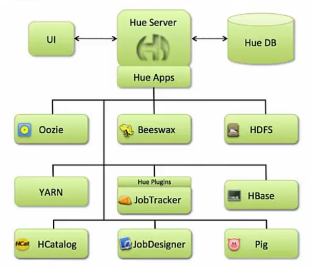

# Hue介绍

官网：https://gethue.com/

## Hue 是什么

`HUE`——Hadoop User Experience

Hue是一个开源的` Apache Hadoop UI `系统，由 Cloudera Desktop 演化而来，最后Cloudera公司将其贡献给Apache基金会的Hadoop社区，它是基于 Python Web 框架 `Django `实现的。

通过使用 Hue ，可以在浏览器端的Web控制台上与Hadoop集群进行交互，来分析处理数据，例如操作`HDFS`上的数据，运行 `MapReduce Job`，执行`Hive`的SQL语句，浏览`HBase`数据库等等。

## Hue 能做什么

访问 `HDFS` 和文件浏览

通过 web 调试和开发` hive` 以及数据结果展示

查询 solr 和结果展示，报表生成

通过 web 调试和开发 impala 交互式 SQL Query

spark 调试和开发

Pig 开发和调试

oozie 任务的开发，监控，和工作流协调调度

`Hbase `数据查询和修改，数据展示

`Hive `的元数据(metastore)查询

MapReduce任务进度查看，日志追踪

创建和提交MapReduce,Streaming,Java job任务

Sqoop2 的开发和调试

`Zookeeper `的浏览和编辑

数据库(MySQL,PostGres, SQlite,Oracle) 的查询和展示

## Hue的架构

Hue是一个友好的界面集成框架，可以集成各种大量的大数据体系软件框架，通过一个界面就可以做到查看以及执行所有的框架。Hue提供的这些功能相比 Hadoop 生态各组件提供的界面更加`友好`，`但是一些需要 debug 的场景`可能还是要使用`原生系统`才能更加深入的找到错误的原因。

