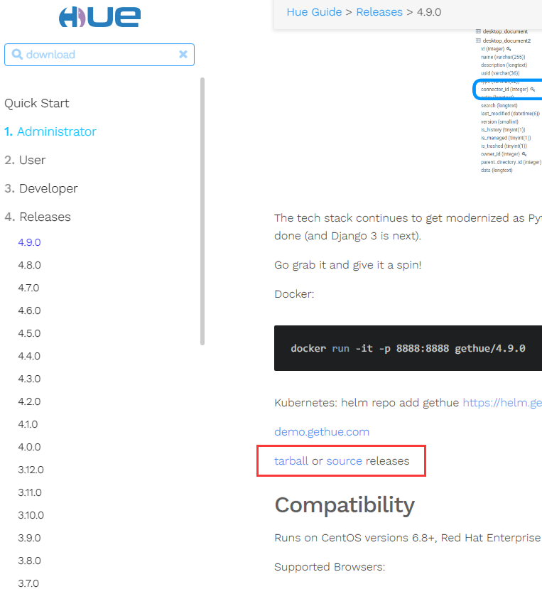

# Hue安装与使用

https://www.jianshu.com/p/a80ec32afb27

下载tar包




```
tar zxvf hue-4.9.0.tgz -C /opt/module
```


```
cd /opt/modulehue-4.9.0
```

编译

```
make install
```

Hue 初始化配置

cd ../conf

```
vim hue.ini 
```


## Docker安装

```
docker run -it -p 8888:8888 gethue/hue:latest
```

