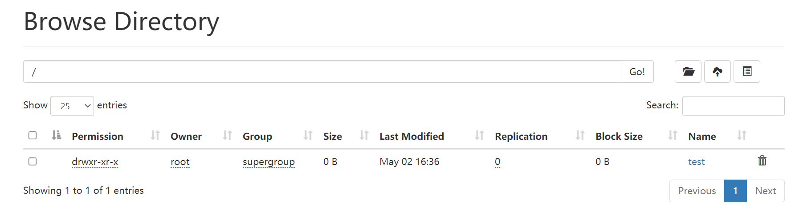

# Hadoop操作

```
hadoop help
```

```
(base) [root@glong hadoop]# hadoop help
Usage: hadoop [OPTIONS] SUBCOMMAND [SUBCOMMAND OPTIONS]
 or    hadoop [OPTIONS] CLASSNAME [CLASSNAME OPTIONS]
  where CLASSNAME is a user-provided Java class

  OPTIONS is none or any of:

buildpaths                       attempt to add class files from build tree
--config dir                     Hadoop config directory
--debug                          turn on shell script debug mode
--help                           usage information
hostnames list[,of,host,names]   hosts to use in slave mode
hosts filename                   list of hosts to use in slave mode
loglevel level                   set the log4j level for this command
workers                          turn on worker mode

  SUBCOMMAND is one of:


    Admin Commands:

daemonlog     get/set the log level for each daemon

    Client Commands:

checknative   check native Hadoop and compression libraries availability
classpath     prints the class path needed to get the Hadoop jar and the required libraries
conftest      validate configuration XML files
credential    interact with credential providers
dtutil        operations related to delegation tokens
envvars       display computed Hadoop environment variables
fs            run a generic filesystem user client
jar <jar>     run a jar file. NOTE: please use "yarn jar" to launch YARN applications, not
              this command.
jnipath       prints the java.library.path
kdiag         Diagnose Kerberos Problems
kerbname      show auth_to_local principal conversion
key           manage keys via the KeyProvider
trace         view and modify Hadoop tracing settings
version       print the version

SUBCOMMAND may print help when invoked w/o parameters or with -h.
```

从help中可以看到，ps参数是文件系统的用户客户端，后面的命令操作和linux类似

创建文件夹

```
hadoop fs -mkdir /test
```

查看

```
hadoop fs -ls /
```

删除

```
hadoop fs -rm -r /test
```

当然我们也可以选择使用

http://ip:9870/explorer.html#/从可视化角度进行创建、查看、删除操作。



