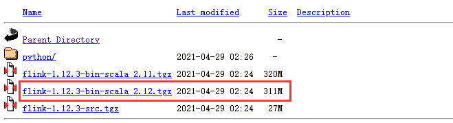
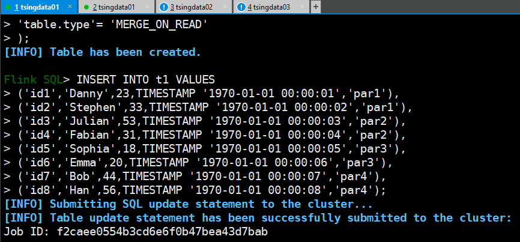

# Hudi安装

视频参考：https://www.bilibili.com/video/BV1fy4y1x7nH?from=search&seid=9178314101807252200

## 版本

```
0.8.0
```

## 安装环境准备

```
Hadoop 3.1.3集群
Flink  1.12.3
Spark  2.4.7
```

## Hudi编译

```
https://github.com/apache/hudi
```


```
cd /opt/module/
git clone https://hub.fastgit.org/apache/hudi.git && cd hudi
```

默认是用 scala-2.11 编译的 如果用的是 flink1.12.2-2.12 版本，可以自己编译成scala-2.12版本的。

window环境下注释掉

```xml
<module>hudi-integ-test</module>
<module>packaging/hudi-integ-test-bundle</module>
```

修改pom，添加

```xml
 <repository>
     <id>maven-ali</id>
     <url>http://maven.aliyun.com/nexus/content/groups/public//</url>
     <releases>
         <enabled>true</enabled>
     </releases>
     <snapshots>
         <enabled>true</enabled>
         <updatePolicy>always</updatePolicy>
         <checksumPolicy>fail</checksumPolicy>
     </snapshots>
</repository>
```

打包

```
mvn clean package -DskipTests -Dscala-2.12
```

包的路径在

```
packaging/hudi-flink-bundle/target/hudi-flink-bundle_2.11-0.8.0.jar
```

或者直接下载官方提供的jar包：https://repo.maven.apache.org/maven2/org/apache/hudi/hudi-flink-bundle_2.12/0.8.0/hudi-flink-bundle_2.12-0.8.0.jar

# Spark on Hudi

[Apache Hudi集成Spark SQL抢先体验](https://www.cnblogs.com/leesf456/p/14802281.html)

# Flink on Hudi

参考：[重磅！解锁Apache Flink读写Apache Hudi新姿势](https://zhuanlan.zhihu.com/p/364026320)

下载 Flink 1.12.3 ：https://mirrors.tuna.tsinghua.edu.cn/apache/flink/

也可以用中科大的镜像站



## Batch写

### 环境启动

启动Hadoop集群


启动` flink-sql `客户端，提前把 `hudi-flink-bundle_2.12-0.8.0.jar`（我这里使用 flink scala 2.12 版本。）

如果是 scala2.11 版本需要编译成 `hudi-flink-bundle_2.11-0.8.0.jar `拷贝到 $FLINK_HOME/lib 目录下

```
cd flink-1.12.3/

vim /etc/profile

export HADOOP_CLASSPATH=`$HADOOP_HOME/bin/hadoop classpath`

source /etc/profile
```


```
# Start the flink standalone cluster

./bin/sql-client.sh embedded

# 创建hdfs文件
hadoop fs -mkdir -p /hudi/t1

./bin/sql-client.sh embedded -j /opt/module/hudi/hudi-flink-bundle_2.12-0.8.0.jar shell
```

### 创建表结构

```sql
CREATE TABLE t1(
  uuid VARCHAR(20),
  name VARCHAR(10),
  age INT,
  ts TIMESTAMP(3),
`partition` VARCHAR(20)
)
PARTITIONED BY (`partition`)
WITH (
'connector'= 'hudi',
'path'= 'hdfs://192.168.28.116:8/hudi/t1',
'table.type'= 'MERGE_ON_READ'
);
```

###  插入数据

```sql
INSERT INTO t1 VALUES
('id1','Danny',23,TIMESTAMP '1970-01-01 00:00:01','par1'),
('id2','Stephen',33,TIMESTAMP '1970-01-01 00:00:02','par1'),
('id3','Julian',53,TIMESTAMP '1970-01-01 00:00:03','par2'),
('id4','Fabian',31,TIMESTAMP '1970-01-01 00:00:04','par2'),
('id5','Sophia',18,TIMESTAMP '1970-01-01 00:00:05','par3'),
('id6','Emma',20,TIMESTAMP '1970-01-01 00:00:06','par3'),
('id7','Bob',44,TIMESTAMP '1970-01-01 00:00:07','par4'),
('id8','Han',56,TIMESTAMP '1970-01-01 00:00:08','par4');
```



> 使用编译的0.9.0jar包遇到的bug

```
Exception in thread "main" org.apache.flink.table.client.SqlClientException: Unexpected exception. This is a bug. Please consider filing an issue.
	at org.apache.flink.table.client.SqlClient.main(SqlClient.java:215)
Caused by: java.lang.RuntimeException: Error running SQL job.
	at org.apache.flink.table.client.gateway.local.LocalExecutor.lambda$executeUpdateInternal$4(LocalExecutor.java:514)
	at org.apache.flink.table.client.gateway.local.ExecutionContext.wrapClassLoader(ExecutionContext.java:256)
	at org.apache.flink.table.client.gateway.local.LocalExecutor.executeUpdateInternal(LocalExecutor.java:507)
	at org.apache.flink.table.client.gateway.local.LocalExecutor.executeUpdate(LocalExecutor.java:428)
	at org.apache.flink.table.client.cli.CliClient.callInsert(CliClient.java:690)
	at org.apache.flink.table.client.cli.CliClient.callCommand(CliClient.java:327)
	at java.util.Optional.ifPresent(Optional.java:159)
	at org.apache.flink.table.client.cli.CliClient.open(CliClient.java:214)
	at org.apache.flink.table.client.SqlClient.openCli(SqlClient.java:144)
	at org.apache.flink.table.client.SqlClient.start(SqlClient.java:115)
	at org.apache.flink.table.client.SqlClient.main(SqlClient.java:201)
Caused by: java.util.concurrent.ExecutionException: org.apache.flink.runtime.client.JobSubmissionException: Failed to submit JobGraph.
	at java.util.concurrent.CompletableFuture.reportGet(CompletableFuture.java:357)
	at java.util.concurrent.CompletableFuture.get(CompletableFuture.java:1895)
	at org.apache.flink.table.client.gateway.local.LocalExecutor.lambda$executeUpdateInternal$4(LocalExecutor.java:511)
	... 10 more
Caused by: org.apache.flink.runtime.client.JobSubmissionException: Failed to submit JobGraph.
	at org.apache.flink.client.program.rest.RestClusterClient.lambda$submitJob$7(RestClusterClient.java:400)
	at java.util.concurrent.CompletableFuture.uniExceptionally(CompletableFuture.java:870)
	at java.util.concurrent.CompletableFuture$UniExceptionally.tryFire(CompletableFuture.java:852)
	at java.util.concurrent.CompletableFuture.postComplete(CompletableFuture.java:474)
	at java.util.concurrent.CompletableFuture.completeExceptionally(CompletableFuture.java:1977)
	at org.apache.flink.runtime.concurrent.FutureUtils.lambda$retryOperationWithDelay$9(FutureUtils.java:390)
	at java.util.concurrent.CompletableFuture.uniWhenComplete(CompletableFuture.java:760)
	at java.util.concurrent.CompletableFuture$UniWhenComplete.tryFire(CompletableFuture.java:736)
	at java.util.concurrent.CompletableFuture.postComplete(CompletableFuture.java:474)
	at java.util.concurrent.CompletableFuture.completeExceptionally(CompletableFuture.java:1977)
	at org.apache.flink.runtime.rest.RestClient.lambda$submitRequest$1(RestClient.java:430)
	at org.apache.flink.shaded.netty4.io.netty.util.concurrent.DefaultPromise.notifyListener0(DefaultPromise.java:577)
	at org.apache.flink.shaded.netty4.io.netty.util.concurrent.DefaultPromise.notifyListeners0(DefaultPromise.java:570)
	at org.apache.flink.shaded.netty4.io.netty.util.concurrent.DefaultPromise.notifyListenersNow(DefaultPromise.java:549)
	at org.apache.flink.shaded.netty4.io.netty.util.concurrent.DefaultPromise.notifyListeners(DefaultPromise.java:490)
	at org.apache.flink.shaded.netty4.io.netty.util.concurrent.DefaultPromise.setValue0(DefaultPromise.java:615)
	at org.apache.flink.shaded.netty4.io.netty.util.concurrent.DefaultPromise.setFailure0(DefaultPromise.java:608)
	at org.apache.flink.shaded.netty4.io.netty.util.concurrent.DefaultPromise.tryFailure(DefaultPromise.java:117)
	at org.apache.flink.shaded.netty4.io.netty.channel.nio.AbstractNioChannel$AbstractNioUnsafe.fulfillConnectPromise(AbstractNioChannel.java:321)
	at org.apache.flink.shaded.netty4.io.netty.channel.nio.AbstractNioChannel$AbstractNioUnsafe.finishConnect(AbstractNioChannel.java:337)
	at org.apache.flink.shaded.netty4.io.netty.channel.nio.NioEventLoop.processSelectedKey(NioEventLoop.java:702)
	at org.apache.flink.shaded.netty4.io.netty.channel.nio.NioEventLoop.processSelectedKeysOptimized(NioEventLoop.java:650)
	at org.apache.flink.shaded.netty4.io.netty.channel.nio.NioEventLoop.processSelectedKeys(NioEventLoop.java:576)
	at org.apache.flink.shaded.netty4.io.netty.channel.nio.NioEventLoop.run(NioEventLoop.java:493)
	at org.apache.flink.shaded.netty4.io.netty.util.concurrent.SingleThreadEventExecutor$4.run(SingleThreadEventExecutor.java:989)
	at org.apache.flink.shaded.netty4.io.netty.util.internal.ThreadExecutorMap$2.run(ThreadExecutorMap.java:74)
	at java.lang.Thread.run(Thread.java:748)
Caused by: org.apache.flink.runtime.concurrent.FutureUtils$RetryException: Could not complete the operation. Number of retries has been exhausted.
	at org.apache.flink.runtime.concurrent.FutureUtils.lambda$retryOperationWithDelay$9(FutureUtils.java:386)
	... 21 more
Caused by: java.util.concurrent.CompletionException: org.apache.flink.shaded.netty4.io.netty.channel.AbstractChannel$AnnotatedConnectException: 拒绝连接: localhost/127.0.0.1:8081
	at java.util.concurrent.CompletableFuture.encodeThrowable(CompletableFuture.java:292)
	at java.util.concurrent.CompletableFuture.completeThrowable(CompletableFuture.java:308)
	at java.util.concurrent.CompletableFuture.uniCompose(CompletableFuture.java:943)
	at java.util.concurrent.CompletableFuture$UniCompose.tryFire(CompletableFuture.java:926)
	... 19 more
Caused by: org.apache.flink.shaded.netty4.io.netty.channel.AbstractChannel$AnnotatedConnectException: 拒绝连接: localhost/127.0.0.1:8081
Caused by: java.net.ConnectException: 拒绝连接
	at sun.nio.ch.SocketChannelImpl.checkConnect(Native Method)
	at sun.nio.ch.SocketChannelImpl.finishConnect(SocketChannelImpl.java:717)
	at org.apache.flink.shaded.netty4.io.netty.channel.socket.nio.NioSocketChannel.doFinishConnect(NioSocketChannel.java:330)
	at org.apache.flink.shaded.netty4.io.netty.channel.nio.AbstractNioChannel$AbstractNioUnsafe.finishConnect(AbstractNioChannel.java:334)
	at org.apache.flink.shaded.netty4.io.netty.channel.nio.NioEventLoop.processSelectedKey(NioEventLoop.java:702)
	at org.apache.flink.shaded.netty4.io.netty.channel.nio.NioEventLoop.processSelectedKeysOptimized(NioEventLoop.java:650)
	at org.apache.flink.shaded.netty4.io.netty.channel.nio.NioEventLoop.processSelectedKeys(NioEventLoop.java:576)
	at org.apache.flink.shaded.netty4.io.netty.channel.nio.NioEventLoop.run(NioEventLoop.java:493)
	at org.apache.flink.shaded.netty4.io.netty.util.concurrent.SingleThreadEventExecutor$4.run(SingleThreadEventExecutor.java:989)
	at org.apache.flink.shaded.netty4.io.netty.util.internal.ThreadExecutorMap$2.run(ThreadExecutorMap.java:74)
	at java.lang.Thread.run(Thread.java:748)

Shutting down the session...
done.
```


### 查询数据 

设置查询模式为tableau

```sql
-- sets up the result mode to tableau to show the results directly in the CLI
set execution.result-mode=tableau;
```


### 更新数据 

```sql
INSERT INTO t1 VALUES ('id1','Danny',24,TIMESTAMP '1970-01-01 00:00:01','par1');
```

```sql
select * from t1;
```

id1的数据age由23变为了24

## Streaming读 

### 创建表结构

```sql
CREATE TABLE t1(
  uuid VARCHAR(20),
  name VARCHAR(10),
  age INT,
  ts TIMESTAMP(3),
`partition` VARCHAR(20)
)
PARTITIONED BY (`partition`)
WITH (
'connector'= 'hudi',
'path'= 'hdfs:///hudi/t1',
'table.type'= 'MERGE_ON_READ',
'read.streaming.enabled'= 'true',  
'read.streaming.start-commit'= '20210401134557',
'read.streaming.check-interval'= '4'
);
```

> 说明：这里将 `read.streaming.enabled` 设置为 true，表明通过 streaming 的方式读取表数据； `read.streaming.check-interval` 指定了 source 监控新的 commits 的间隔为 4s； `table.type` 设置表类型为 `MERGE_ON_READ`。

### 查询数据

流表t1表中的数据就是刚刚批模式写入的数据

```sql
select * from t1;
```

### 插入数据 

使用批模式插入一条数据

```sql
insert into t1 values ('id9','test',27,TIMESTAMP '1970-01-01 00:00:01','par5');
```

### 查询数据

几秒后在流表中可以读取到一条新增的数据（前面插入的一条数据）

```sql
select * from t1;
```


