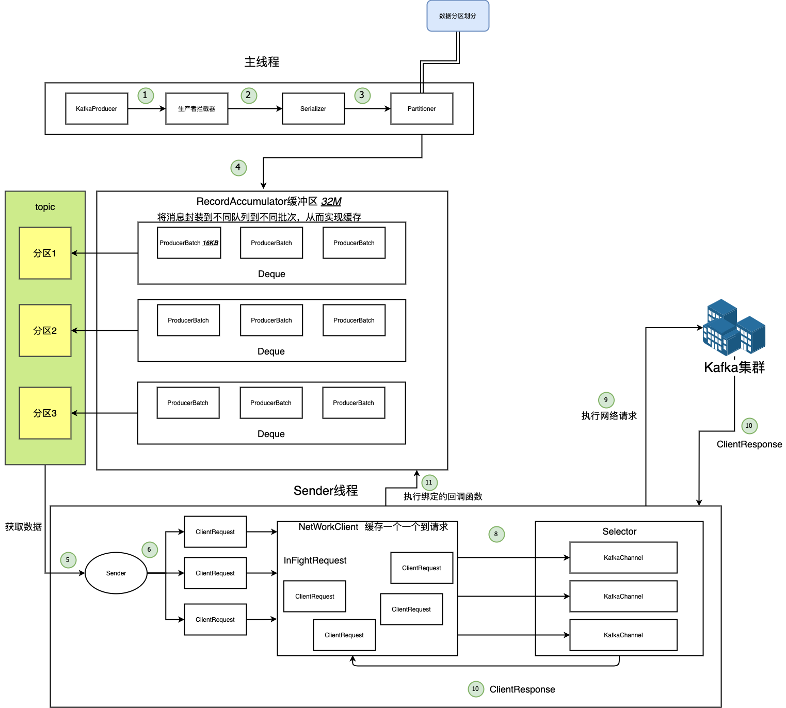
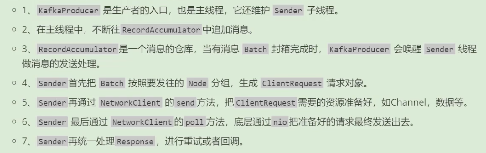
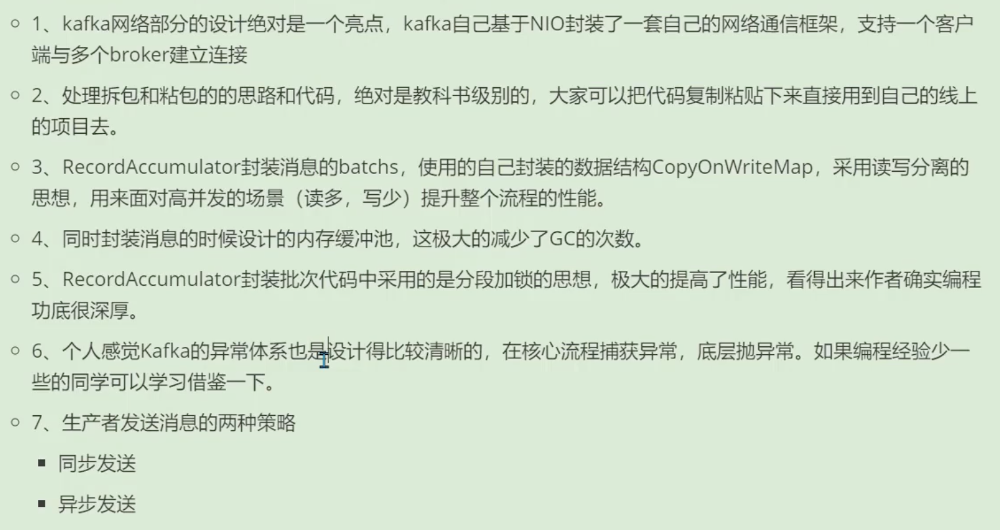

# Kafka源码

https://www.bilibili.com/video/BV1M64y1D7NN

## 源码环境准备

> 这里使用的是2.1.0
>

```
git clone https://gitee.com/jeffy-wang/kafka-2.1.0-src.git
```


## 从Demo入手

找到`exmaple`模块

### Producer

```java
public class Producer extends Thread {
    private final KafkaProducer<Integer, String> producer;
    private final String topic;
    private final Boolean isAsync;
    private int numRecords;
    private final CountDownLatch latch;


    /**
     * 构造方法
     * @param topic 主题
     * @param isAsync   是否异步
     * @param transactionalId   事物
     * @param enableIdempotency
     * @param numRecords
     * @param transactionTimeoutMs
     * @param latch
     */
    public Producer(final String topic,
                    final Boolean isAsync,
                    final String transactionalId,
                    final boolean enableIdempotency,
                    final int numRecords,
                    final int transactionTimeoutMs,
                    final CountDownLatch latch) {
        // 创建Properties配置对象
        Properties props = new Properties();
        // 指定Kafka集群的地址 bootstrap.servers + url + port
        props.put(ProducerConfig.BOOTSTRAP_SERVERS_CONFIG, KafkaProperties.KAFKA_SERVER_URL + ":" + KafkaProperties.KAFKA_SERVER_PORT);
        // client.id 一般不做设置
        props.put(ProducerConfig.CLIENT_ID_CONFIG, "DemoProducer");
        // key 和 value 的序列化
        props.put(ProducerConfig.KEY_SERIALIZER_CLASS_CONFIG, IntegerSerializer.class.getName());
        props.put(ProducerConfig.VALUE_SERIALIZER_CLASS_CONFIG, StringSerializer.class.getName());

        if (transactionTimeoutMs > 0) {
            props.put(ProducerConfig.TRANSACTION_TIMEOUT_CONFIG, transactionTimeoutMs);
        }
        if (transactionalId != null) {
            props.put(ProducerConfig.TRANSACTIONAL_ID_CONFIG, transactionalId);
        }
        props.put(ProducerConfig.ENABLE_IDEMPOTENCE_CONFIG, enableIdempotency);

        // KafkaProducer 成员变量的初始化
        producer = new KafkaProducer<>(props);
        this.topic = topic;
        this.isAsync = isAsync;
        this.numRecords = numRecords;
        this.latch = latch;
    }

    KafkaProducer<Integer, String> get() {
        return producer;
    }

    @Override
    public void run() {
        int messageKey = 0;
        int recordsSent = 0;

        // 一直往Kafka发送数据
        while (recordsSent < numRecords) {
            String messageStr = "Message_" + messageKey;
            long startTime = System.currentTimeMillis(); // 当前系统时间

            /*
            同步发送还是异步发送
             */
            if (isAsync) { // 🔥Send asynchronously

                // 将消息封装成了 ProducerRecord 对象
                // 🚀 异步会发送很多条消息给Kafka，用 DemoCallBack 回调函数 判断消息是否发送成功。
                producer.send(new ProducerRecord<>(topic,
                    messageKey,
                    messageStr), new DemoCallBack(startTime, messageKey, messageStr));
            } else { // 🔥Send synchronously 效率地下
                try {
                    // 发送一条消息，等这条消息的后续工作全部完成再继续下一条数据的发送。
                    producer.send(new ProducerRecord<>(topic,
                        messageKey,
                        messageStr)).get(); // 阻塞方法
                    System.out.println("Sent message: (" + messageKey + ", " + messageStr + ")");
                } catch (InterruptedException | ExecutionException e) {
                    e.printStackTrace();
                }
            }
            messageKey += 2;
            recordsSent += 1;
        }
        System.out.println("Producer sent " + numRecords + " records successfully");
        latch.countDown();
    }
}

// 回调函数 实现了 Callback
class DemoCallBack implements Callback {

    private final long startTime;
    private final int key;
    private final String message;

    public DemoCallBack(long startTime, int key, String message) {
        this.startTime = startTime;
        this.key = key;
        this.message = message;
    }

    /**
     * A callback method the user can implement to provide asynchronous handling of request completion. This method will
     * be called when the record sent to the server has been acknowledged. When exception is not null in the callback,
     * metadata will contain the special -1 value for all fields except for topicPartition, which will be valid.
     *
     * @param metadata  The metadata for the record that was sent (i.e. the partition and offset). An empty metadata
     *                  with -1 value for all fields except for topicPartition will be returned if an error occurred.
     * @param exception The exception thrown during processing of this record. Null if no error occurred.
     */

    public void onCompletion(RecordMetadata metadata, Exception exception) {
        long elapsedTime = System.currentTimeMillis() - startTime;
        if (metadata != null) {
            System.out.println(
                "message(" + key + ", " + message + ") sent to partition(" + metadata.partition() +
                    "), " +
                    "offset(" + metadata.offset() + ") in " + elapsedTime + " ms");
        } else {
            exception.printStackTrace();
        }
    }
}

```

上面的只要步骤：

1. 配置Properties
2. 构建Kafka生产者
3. 将数据封装成ProducerRecord对象，`发送`出去（同步或异步）

发送非常关键，下面我们开始介绍send函数

#### Producer核心流程概览



#### Producer端元数据管理


## [生产者源码之生产者发送消息整体流程总结](https://www.bilibili.com/video/BV1M64y1D7NN?p=32&spm_id_from=pageDriver)



## 生产者源码之生产者源码精华总结


