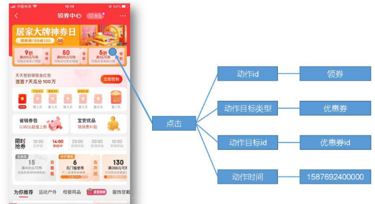

# 数据生成模块

## 目标数据

我们要收集和分析的数据主要包括`页面数据`、`事件数据`、`曝光数据`、`启动数据`和`错误数据`。


### 页面（静态）

页面数据主要记录一个页面的用户访问情况，包括 `访问时间`、`停留时间` 、`页面路径` 等信息。


### 事件（动态点击）

事件数据主要记录应用内一个具体操作行为，包括`操作类型`、`操作对象`描述等信息。



### 曝光

```
被用户看到了，就是被曝光了
```

曝光数据主要记录页面所曝光的内容，包括`曝光对象`，`曝光类型`等信息。


### 启动

启动数据记录应用的启动信息。


| 字段名称        | 字段描述               |
| --------------- | ---------------------- |
|                 |                        |
| entry           | 启动入口               |
|                 | icon("图标"),          |
|                 | notification("通知"),  |
|                 | install("安装后启动"); |
|                 |                        |
| loading_time    | 启动加载时间           |
| open_ad_id      | 开屏广告 id            |
| open_ad_ms      | 广告播放时间           |
| open_ad_skip_ms | 用户跳过广告时间       |
| ts              | 启动时间               |

### 错误

错误数据记录应用使用过程中的错误信息，包括 `错误编号` 及 `错误信息` 。

| 字段名称   | 字段描述 |
| ---------- | -------- |
| error_code | 错误码   |
| msg        | 错误信息 |


## 数据埋点

### 主流埋点方式（了解）

```markdown
- 目前主流的埋点方式，有代码埋点（前端/后端）、可视化埋点、全埋点三种。

1. 代码埋点是通过调用埋点 SDK 函数，在需要埋点的业务逻辑功能位置调用接口，上报埋点数据。例如，我们对页面中的某个按钮埋点后，当这个按钮被点击时，可以在这个按钮对应的 OnClick 函数里面调用 SDK 提供的数据发送接口，来发送数据。

2. 可视化埋点只需要研发人员集成采集 SDK，不需要写埋点代码，业务人员就可以通过访问分析平台的“圈选”功能，来“圈”出需要对用户行为进行捕捉的控件，并对该事件进行命名。圈选完毕后，这些配置会同步到各个用户的终端上，由采集 SDK 按照圈选的配置自动进行用户行为数据的采集和发送。

3. 全埋点是通过在产品中嵌入 SDK，前端自动采集页面上的全部用户行为事件，上报埋点数据，相当于做了一个统一的埋点。然后再通过界面配置哪些数据需要在系统里面进行分析。
```


### 埋点数据日志结构

我们的日志结构大致可分为两类，一是普通页面`埋点日志`，二是`启动日志`。

```markdown
1. 普通页面埋点日志格式
	普通页面日志结构如下，每条日志包含了，当前页面的页面信息，所有事件（动作）、所有曝光信息以及错误信息。除此之外，还包含了一系列公共信息，包括设备信息，地理位置，应用信息等，即common 字段。

2. 启动日志格式
	启动日志结构相对简单，主要包含公共信息，启动信息和错误信息。
```


### 埋点数据上报时机

```markdown
埋点数据上报时机包括两种方式。

1. 在离开该页面时，上传在这个页面发生的所有事情（页面、事件、曝光、错误等）。优点，批处理，减少了服务器接收数据压力。缺点，不是特别及时。

2. 每个事件、动作、错误等，产生后，立即发送。优点，响应及时。缺点，对服务器接收数据压力比较大
```


## 模拟数据/日志生成

### 使用说明

1、将 application.properties、gmall2020-mock-log-2020-04-01.jar、path2.json 上传到hadoop102 的/opt/module/applog 目录下

2、配置文件

（1）` application.properteis` 文件

可以根据需求生成对应日期的用户行为日志。

```
vim application.properties
```

修改如下内容

```properties
logging.level.root=info
#业务日期	注意：并不是生成日志的日期
mock.date=2020-06-14
#启动次数
mock.startup.count=100
#设备最大值
mock.max.mid=50
#会员最大值
mock.max.uid=500
#商品最大值
mock.max.sku-id=10
#页面平均访问时间
mock.page.during-time-ms=20000
#错误概率
mock.error.rate=3
#日志发送延迟
mock.log.sleep=100
#商品详情来源 用户查询，商品推广，智能推荐, 促销活动 
mock.detail.source-type-rate=40:25:15:20
```

（2）`path2.json`，该文件用来配置访问路径

根据需求，可以灵活配置用户点击路径。

```json
[
  {
    "path": [
      "home",
      "good_list",
      "good_detail",
      "cart",
      "trade",
      "payment"
    ],
    "rate": 20
  },
  {
    "path": [
      "home",
      "good_list",
      "good_detail",
      "login",
      "good_detail",
      "cart",
      "trade",
      "payment"
    ],
    "rate": 50
  },
  {
    "path": [
      "home",
      "mine",
      "orders_unpaid",
      "trade",
      "payment"
    ],
    "rate": 10
  },
  {
    "path": [
      "home",
      "mine",
      "orders_unpaid",
      "good_detail",
      "good_spec",
      "comment",
      "trade",
      "payment"
    ],
    "rate": 10
  },
  {
    "path": [
      "home",
      "mine",
      "orders_unpaid",
      "good_detail",
      "good_spec",
      "comment",
      "home"
    ],
    "rate": 10
  },
  {
    "path": [
      "home",
      "mine",
      "orders_undelivered"
    ],
    "rate": 20
  },
  {
    "path": [
      "home",
      "mine",
      "orders_unreceipted"
    ],
    "rate": 20
  },
  {
    "path": [
      "home",
      "mine",
      "orders_unreceipted",
      "orders_wait_comment"
    ],
    "rate": 20
  },
  {
    "path": [
      "home",
      "mine",
      "orders_all",
      "orders_wait_comment"
    ],
    "rate": 20
  },
  {
    "path": [
      "home",
      "mine",
      "favor",
      "good_detail",
      "good_spec",
      "comment",
      "trade",
      "payment"
    ],
    "rate": 20
  },
  {
    "path": [
      "home",
      "mine",
      "favor",
      "good_detail",
      "favor",
      "mine"
    ],
    "rate": 20
  },
  {
    "path": [
      "home",
      "cart",
      "good_detail",
      "good_spec",
      "comment",
      "trade",
      "payment"
    ],
    "rate": 20
  },
  {
    "path": [
      "home",
      "cart",
      "login",
      "top_n",
      "good_detail",
      "home"
    ],
    "rate": 20
  },
  {
    "path": [
      "home",
      "login",
      "top_n",
      "good_detail",
      "good_spec",
      "comment",
      "trade",
      "payment"
    ],
    "rate": 20
  },
  {
    "path": [
      "home",
      "search",
      "good_list",
      "good_detail",
      "good_spec",
      "comment",
      "trade",
      "payment"
    ],
    "rate": 20
  },
  {
    "path": [
      "home",
      "search",
      "good_list",
      "good_detail",
      "home"
    ],
    "rate": 20
  },
  {
    "path": [
      "home",
      "category",
      "activity",
      "good_detail",
      "good_spec",
      "comment",
      "trade",
      "payment"
    ],
    "rate": 20
  },
  {
    "path": [
      "home",
      "category",
      "activity",
      "category",
      "good_spec",
      "comment",
      "trade",
      "payment"
    ],
    "rate": 20
  },
  {
    "path": [
      "home",
      "category",
      "activity",
      "category",
      "home"
    ],
    "rate": 20
  },
  {
    "path": [
      "home",
      "category",
      "home"
    ],
    "rate": 20
  },
  {
    "path": [
      "home",
      "discovery",
      "good_detail",
      "good_spec",
      "comment",
      "trade",
      "payment"
    ],
    "rate": 20
  },
  {
    "path": [
      "home",
      "discovery",
      "good_detail",
      "good_spec",
      "comment",
      "good_detail",
      "discovery",
      "home"
    ],
    "rate": 20
  },
  {
    "path": [
      "home",
      "discovery",
      "home"
    ],
    "rate": 20
  },
  {
    "path": [
      "home",
      "activity",
      "good_detail",
      "good_spec",
      "comment",
      "trade",
      "payment"
    ],
    "rate": 20
  },
  {
    "path": [
      "home",
      "activity",
      "good_detail",
      "good_spec",
      "comment",
      "good_detail",
      "activity",
      "home"
    ],
    "rate": 20
  },
  {
    "path": [
      "home",
      "activity",
      "home"
    ],
    "rate": 20
  },
  {
    "path": [
      "home",
      "search",
      "top_n",
      "good_detail",
      "good_spec",
      "comment",
      "trade",
      "payment"
    ],
    "rate": 20
  },
  {
    "path": [
      "home",
      "search",
      "top_n",
      "good_detail",
      "good_spec",
      "comment",
      "good_detail",
      "top_n",
      "search"
    ],
    "rate": 20
  },
  {
    "path": [
      "home",
      "search",
      "good_list",
      "good_detail",
      "good_spec",
      "comment",
      "good_detail",
      "good_list",
      "search"
    ],
    "rate": 20
  },
  {
    "path": [
      "home",
      "search",
      "good_list",
      "good_detail",
      "good_spec",
      "comment",
      "trade",
      "payment"
    ],
    "rate": 20
  }
]
```

（3）日志生成命令

在/opt/module/applog 路径下执行日志生成命令。

```
java -jar gmall2020-mock-log-2020-04-01.jar
```

（4）在/opt/module/applog/log 目录下查看生成日志

```
ll
```


### 脚本

1）在/home/atguigu/bin 目录下创建脚本 lg.sh

```
vim lg.sh
```

2）在脚本中编写如下内容

```shell
#!/bin/bash

for i in hadoop102 hadoop103; do
	echo "========== $i =========="
ssh $i "cd /opt/module/applog/; java -jar gmall2020-mock-log-2020-04-01.jar >/dev/null 2>&1 &"

done
```

>注：
>
>（1）/opt/module/applog/为 jar 包及配置文件所在路径
>
>（2）/dev/null 代表 linux 的空设备文件，所有往这个文件里面写入的内容都会丢失，俗
>
>称“黑洞”。
>
>标准输入 0：从键盘获得输入 /proc/self/fd/0
>
>标准输出 1：输出到屏幕（即控制台） /proc/self/fd/1
>
>错误输出 2：输出到屏幕（即控制台） /proc/self/fd/2

3）修改脚本执行权限

```
chmod 777 lg.sh
```

4）将 jar 包及配置文件上传至 glong01的/opt/module/applog/路径

5）启动脚本

```
lg.sh
```

6）分别在 glong01、glong02的/opt/module/applog/log 目录上查看生成的数据

```
ls
```

