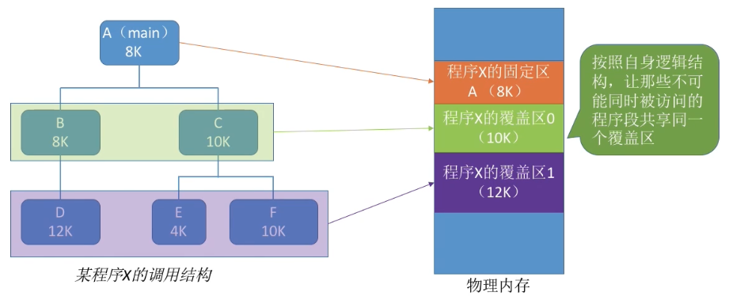
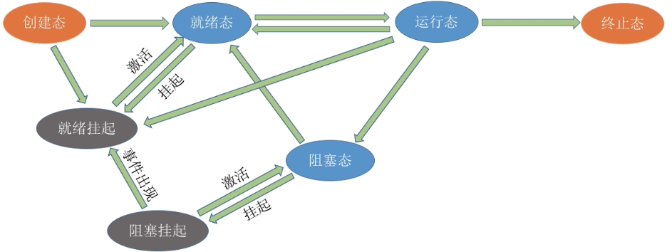
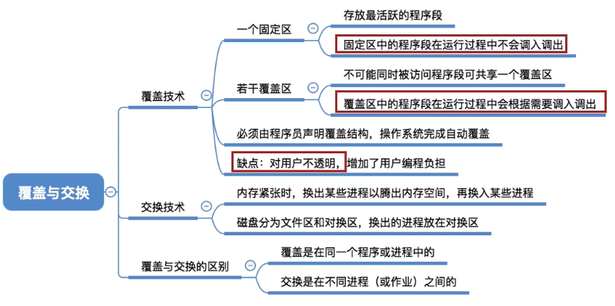
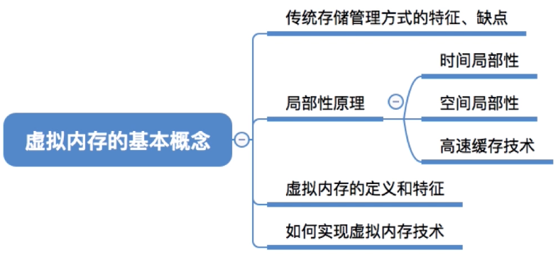
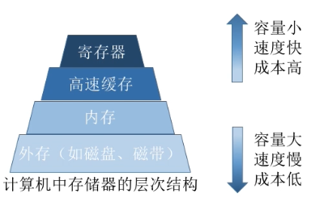
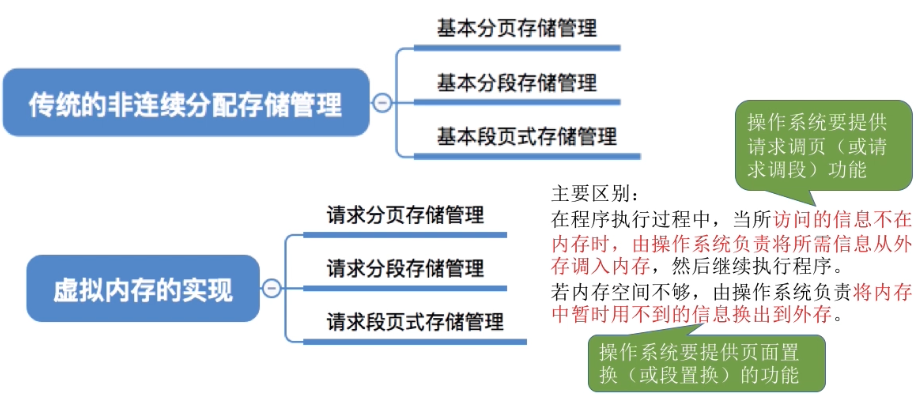

# 内存管理

## 功能:zap:

1. 内存空间的==分配和回收==。
2. 操作系统需要提供某种技术从`逻辑上`对内存空间进行`扩充`（虚拟存储）。
3. 操作系统需要提供地址转换功能，负责程序的`逻辑地址`与`物理地址`的`转换`。
4. 操作系统需要提供`内存保护`功能。保证各进程在各自存储空间内运行，不会`越界访问`，互不干扰。

## 一、内存空间的分配与回收

### 连续分配管理方式


连续分配：指为用户进程分配的必须是一个连续的内存空间。

- 内部碎片，分配给某进程的内存区域中，如果有些部分没有用上。
- 外部碎片，是指内存中的某些空闲分区由于太小而难以利用。

#### 单一连续分配

在单一连续分配方式中,内存被分为`系统区`和`用户区`。系统区通常位于内存的低地址部分，用于存放操作系统相关数据；用户区用于存放用户进程相关数据。内存中只能有一道用户程序，用户程序独占整个用户区空间。

优点：实现简单;无外部碎片;可以采用覆盖技术扩充内存;不一定需要采取内存保护(eg: 早期的PC操作系统MS-DOS)。

缺点：只能用于单用户、单任务的操作系统中;有内部碎片；存储器利用率极低。

#### 固定分区分配

20世纪60年代出现了支持多道程序的系统，为了能在内存中装入多道程序，且这些程序之间又不会相互干扰，于是将整个用户空间划分为若千个固定大小的分区，在每个分区中只装入一道作业，这样就形成了最早的、最简单的一种可运行多道程序的内存管理方式。

- 分区大小相等

分区大小相等:缺乏灵活性，但是很适合用于用一台计算机控制多个相同对象的场合。

- 分区大小不等

分区大小不等:增加了灵活性，可以满足不同大小的进程需求。根据常在系统中运行的作业大小情况进行划分(比如:划分多个小分区、适量中等分区、少量大分区)

操作系统需要建立一个数据结构-----分区说明表，来实现各个分区的分配与回收。每个表项对应一个分区，通常按分区大小排列。每个表项包括对应分区的大小、起始地址、状态(是否已分配)。

- 优点:

 实现简单，无外部碎片。

- 缺点:

 a. 当用户程序太大时，可能所有的分区都不能满足需求，此时不得不采用覆盖技术来解决，但这又会降低性能;

 b. 会产生内部碎片，内存利用率低。

#### 动态分区分配

动态分区分配又称为可变分区分配。这种分配方式不会预先划分内存分区，而是在进程装入内存时，根据进程的大小动态地建立分区，并使分区的大小正好适合进程的需要。因此系统分区的大小和数目是可变的。

###### 记录动态分区分配的数据结构

- 空闲分区表


- 空闲分区链

###### 动态分区分配放置算法

把一个新作业装入内存时，须按照一定的动态分区分配算法，从空闲分区表(或空闲分区链)中选出一个分区分配给该作业。

- Best-fit algorithm

算法思想:由于动态分区分配是- -种连续分配方式，为各进程分配的空间必须是连续的一整片区域。因此为了保证当大进程到来时能有连续的大片空间，可以尽可能多地留下大片的空闲区，即，优先使用更小的空闲区。

如何实现:空闲分区按容量递增次序链接。每次分配内存时顺序查找空闲分区链( 或空闲分区表)，找到大小能满足要求的第一个空闲分区。


缺点:每次都选最小的分区进行分配，会留下越来越多的、很小的、难以利用的内存块。因此这种方法会产生很多的外部碎片。


- First-fit algorithm

- Next-fit algorithm

算法思想:首次适应算法每次都从链头开始查找的。这可能会导致低地址部分出现很多小的空闲分区，而每次分配查找时，都要经过这些分区，因此也增加了查找的开销。如果每次都从上次查找结束的位置开始检索，就能解决上述问题。

如何实现:空闲分区以地址递增的顺序排列(可排成一个循环链表)。每次分配内存时从上次查找结束的位置开始查找空闲分区链(或空闲分区表)，找到大小能满足要求的第一个空闲分区。

1. 首次适应算法每次都要从头查找，每次都需要检索低地址的小分区。但是这种规则也决定了当低地址部分有更小的分区可以满足需求时，会更有可能用到低地址部分的小分区，也会更有可能把高地址部分的大分区保留下来(最佳适应算法的优点)
2. 邻近适应算法的规则可能会导致无论低地址、高地址部分的空闲分区都有相同的概率被使用，也就导致了高地址部分的大分区更可能被使用，划分为小分区，最后导致无大分区可用(最大适应算法的缺点)

Worst-fit algorithm

算法思想:为了解决最佳适应算法的问题—即留下太多难以利用的小碎片，可以在每次分配时优先使用最大的连续空闲区，这样分配后剩余的空闲区就不会太小，更方便使用。

如何实现:空闲分区按容量递减次序链接。每次分配内存时顺序查找空闲分区链(或空闲分区表)，找到大小能满足要求的第-一个空闲分区。

缺点:每次都选最大的分区进行分配，虽然可以让分配后留下的空闲区更大，更可用，但是这种方式会导致较大的连续空闲区被迅速用完。如果之后有**大进程**到达，就没有内存分区可用了。

### 非连续分配管理方式


如果允许将一个进程分散地装入到许多不相邻的分区中，便可充分地利用内存，而无需再进行紧凑.

#### 基本分页存储管理

假设进程A大小为23MB，但是每个分区大小只有10MB，如果进程只能占用一个分区，那显然放不下。

解决思路:如果允许进程占用多个分区，那么可以把进程拆分成10MB+10MB+3MB三个部分，再把这三个部分分别放到三个.
分区中(这些分区不要求连续) …

#### 局部性原理:star_of_david:

```
int i = 0;
int arr[100];
while(i < 100){
	a[i] = i;
	i++;
}
```

这个程序执行时，会很频繁地访问10号、23号内存块

- 时间局部性：如果执行了程序中的某条指令，那么不久后这条指令很有可能再次执行;如果某个数据被访问过，不久之后该数据很可能再次被访问。(因为程序中存在大量的循环)
- 空间局部性：一旦程序访问了某个存储单元，在不久之后，其附近的存储单元也很有可能被访问。(因为很多数据在内存中都是连续存放的)

> 由于局部性原理，可能连续很多次查到的都是同一个页表项。既然如此，能否利用这个特性减少访问页表的次数呢?

## 二、内存空间的扩充

游戏GTA的大小超过`60GB`，按理来说这个游戏程序运行之前需要把60GB数据全部放入内存。然而，实际我的电脑内存才`4GB`，但为什么这个游戏可以顺利运行呢？——虚拟技术(操作系统的虚拟性)

将`物理上`很小的内存拓展为`逻辑上`很大的内存。

### 覆盖技术

> 覆盖是在同一个程序或进程中的

覆盖技术的`思想`：将程序分为`多个段(多个模块)`。常用的段常驻内存，不常用的段在需要时调入内存。

内存中分为一个`“固定区”`和若干个`“覆盖区”`

需要常驻内存的段放在“固定区”中，调入后就不再调出(除非运行结束)



必须由程序员声明覆盖结构，操作系统完成自动覆盖。`缺点`：对用户不透明，增加了用户编程负担。

注意：

>覆盖技术只用于早期的操作系统中，已经退出历史舞台！

### 交换技术(对换)

> 交换是在不同进程(或作业)之间的

交换(对换)技术的`设计思想`：内存空间紧张时，系统将内存中某些进程暂时`换出`外存，把外存中某些已具备运行条件的进程`换入`内存(进程在内存与磁盘间动态调度)

暂时换出外存等待的进程状态为挂起状态(挂起态，suspend)，挂起态又可以进一步细分为就绪挂起、阻塞挂起两种状态。



> PCB常驻内存

#### 问题1: where/应该在外存(磁盘)的什么位置保存被换出的进程?

- 具有对换功能的操作系统中，通常把磁盘空间分为`文件区`和`对换区`两部分。
- 文件区主要用于存放文件，主要追求存储空间的利用率，因此对文件区空间的管理采用离散分配方式;
- 对换区空间只占磁盘空间的小部分，被换出的进程数据就存放在对换区。由于对换的速度直接影响到系统的整体速度，因此对换区空间的管理主要追求换入换出速度，因此通常`对换区采用连续分配方式`。
- 总之，对换区的I/O速度比文件区的更快。


#### 问题2: when/什么时候应该交换?

交换通常在许多进程运行且内存吃紧时进行，而系统负荷降低就暂停。

例如：在发现许多进程运行时经常发生缺页，就说明内存紧张，此时可以换出一些进程;如果缺页率明显下降，就可以暂停换出。

#### 问题3: what/应该换出哪些进程?

可优先换出阻塞进程；可换出优先级低的进程；为了防止优先级低的进程在被调入内存后很快又被换出，有的系统还会考虑进程在内存的驻留时间…




### 虚拟存储技术:star_of_david:

#### 虚拟内存的基本概念



#### 传统存储管理方式的特征和缺点

```markdown
#  一次性:作业必须一次性全部装入内存后才能开始运行。这会造成两个问题:
	- 1、作业很大时，不能全部装入内存，导致大作业无法运行;
	- 2、当大量作业要求运行时，由于内存无法容纳所有作业，因此只有少量作业能运行，导致多道程序并发度下降。

#  驻留性:一旦作业被装入内存，就会一直驻留在内存中，直至作业运行结束。事实上，在一个时间段内，只需要访问作业的一小部分数据即可正常运行，这就导致了内存中会驻留大量的、暂时用不到的数据，浪费了宝贵的内存资源。
```


#### 高速缓冲技术

> 由于[局部性原理](#局部性原理)的存在就有了高速缓冲技术。

`高速缓冲技术`的`思想`：将近期会频繁访问到的数据放到更高速的存储器中，暂时用不到的数据放在更低速存储器中。



> 
>
> :books:
>
> - 书包（假设谁LV这种级别的）能够存放一些平常经常用到的书，可以很便捷地拿出经常用到的书。
> - 书架 的容量很大，但是价格便宜，存书取书不方便。

快表机构就是将近期常访问的页表项副本放到更高速的联想寄存器中

1. 基于局部性原理，在程序装入时，可以将程序中很快会用到的部分装入内存，暂时用不到的部分留在外存，就可以让程序开始执行。
2. 在程序执行过程中，当所访问的信息不在内存时，由操作系统负责将所需信息从外存调入内存，然后继续执行程序。
3. 若内存空间不够，由操作系统负责将内存中暂时用不到的信息换出到外存。
4. 在操作系统的管理下，在用户看来似乎有一个比实际内存大得多的内存，这就是`虚拟内存`。

注意：

>- 虛拟内存的`最大容量`是由计算机的地址结构(CPU寻址范围)确定的
>- 虚拟内存的`实际容量` = min(内存和外存容量之和，CPU寻址范围)
>
>如：某计算机地址结构为32位，按字节编址，内存大小为512MB，外存大小为2GB。
>则虚拟内存的`最大容量`为2^32B= 4GB
>虚拟内存的`实际容量` = min (2^32B, 512MB+2GB) = 2GB+512MB

#### 虚拟内存的`特征`

1. 多次性：无需在作业运行时一次性全部装入内存，而是允许被分成多次调入内存。
2. 对换性：在作业运行时无需一直常驻内存，而是允许在作业运行过程中，将作业换入、换出。
3. 虚拟性：从逻辑上扩充了内存的容量，使用户看到的内存容量，远大于实际的容量。

#### 虚拟内存技术实现

> 虛拟内存技术，允许一个作业分多次调入内存。如果采用连续分配方式，会不方便实现。因此，虚拟内存的实现需要建立在`离散分配`的内存管理方式基础上。



#### 请求分页管理技术

##### 页表机制

```markdown
# 与基本分页管理相比，请求分页管理中，为了实现“请求调页”，操作系统需要知道每个页面是否已经调入内存;如果还没调入，那么也需要知道该页面在外存中存放的位置。

# 当内存空间不够时，要实现“页面置换”，操作系统需要通过某些指标来决定到底换出哪个页面;有的页面没有被修改过，就不用再浪费时间写回外存。有的页面修改过，就需要将外存中的旧数据覆盖，因此，操作系统也需要记录各个页面是否被修改的信息。
```


1. 访问字段：可记录最近被访问过几次，或记录上次访问的时间，供置换算法选择换出页面时参考
2. 修改位：页面调入内存后是否被修改过
3. 外存地址：页面在外存中的存放位置

```markdown
# 在请求分页系统中，每当要访问的页面不在内存时，便产生一个缺页中断，然后由操作系统的缺页中断处理程序处理中断。此时缺页的进程阻塞，放入阻塞队列，调页完成后再将其唤醒，放回就绪队列。

# 如果内存中有空闲块，则为进程分配一个空闲块，将所缺页面装入该块，并修改页表中相应的页表项。

# 如果内存中没有空闲块，则由页面置换算法选择一个页面淘汰，若该页面在内存期间被修改过，则要将其写回外存。未修改过的页面不用写回外存。
```

##### 缺页中断机构

>缺页中断是因为当前执行的指令想要访问的目标页面未调入内存而产生的，因此属于内中断一条指令在执行期间，可能产生多次缺页中断。(如:copyAtoB,即将逻辑地址A中的数据复制到逻辑地址B，而A、B属于不同的页面，则有可能产生两次中断)

**中断的分类**


##### 地址变换机构

请求分页存储管理与基本分页存储管理的主要区别:

 在程序执行过程中，当所访问的信息不在内存时，由操作系统负责将所需信息从外存调入内存，然后继续执行程序。

 若内存空间不够，由操作系统负责将内存中暂时用不到的信息换出到外存。


- 新增步骤1：请求调页(查到页表项时进行判断)
- 新增步骤2: 页面置换(需要调入页面，但没有空闲内存块时进行)
- 新增步骤3:需要修改请求页表中新增的表项

#### 页面置换算法:page_facing_up:

##### 最佳置换算法（OPT）

最佳置换算法(OPT, Optimal) :每次选择淘汰的页面将是以后永不使用，或者在最长时间内不再被访问的页面，这样可以保证最低的缺页率。


##### 先进先出置换算法(FIFO)

先进先出置换算法(FIFO) :每次选择淘汰的页面是最早进入内存的页面

实现方法:把调入内存的页面根据调入的先后顺序排成一个队列，需要换出页面时选择队头页面即可。队列的最大长度取决于系统为进程分配了多少个内存块。


##### 最近最久未使用置换算法(LRU)

最近最久未使用置换算法(LRU, least recently used) :每次淘汰的页面是最近最久未使用的页面实现方法:赋予每个页面对应的页表项中，用访问字段记录该页面自，上次被访问以来所经历的时间t。

当需要淘汰一个页面时，选择现有页面中t值最大的，即最近最久未使用的页面。

##### 时钟置换算法(CLOCK)

最佳置换算法性能最好，但无法实现;先进先出置换算法实现简单，但算法性能差;最近最久未使用置换算法性能好，是最接近OPT算法性能的，但是实现起来需要专门的硬件支持，算法开销大。时钟置换算法是一种性能和开销较均衡的算法，又称CLOCK算法，或最近未用算法(NRU，NotRecently Used )

简单的CLOCK算法实现方法:为每个页面设置-一个访问位，再将内存中的页面都通过链接指针链接成一个循环队列。当某页被访问时，其访问位置为1。当需要淘汰一个页面时，只需检查页的访问位。如果是0，就选择该页换出;如果是1，则将它置为0，暂不换出，继续检查下一个页面，若第一轮扫描中所有页面都是1，则将这些页面的访问位依次置为0后，再进行第二轮扫描(第二轮扫描中一定会有访问位为0的页面，因此简单的CLOCK算法选择一个淘汰页面最多会经过两轮扫描)

##### 改进型的时钟置换算法

简单的时钟置换算法仅考虑到一个页面最近是否被访问过。事实上，如果被淘汰的页面没有被修改过,就不需要执行I/O操作写回外存。只有被淘汰的页面被修改过时，才需要写回外存。因此，除了考虑一个页面最近有没有被访问过之外，操作系统还应考虑页面有没有被修改过。在其他条件都相同时，应优先淘汰没有修改过的页面，避免I/O操作。这就是改进型的时钟置换算法的思想。

修改位=0，表示页面没有被修改过;修改位=1, 表示页面被修改过。

算法规则:将所有可能被置换的页面排成一个循环队列.

第一轮:从当前位置开始扫描到第一个(0 0)的帧用于替换。本轮扫描不修改任何标志位
第二轮:若第一 轮扫描失败，则重新扫描，查找第一个(0,1) 的帧用于替换。本轮将所有扫描过的帧访问位设为0
第三轮:若第二轮扫描失败，则重新扫描，查找第一个(0, 0)的帧用于替换。本轮扫描不修改任何标志位
第四轮:若第三轮扫描失败，则重新扫描，查找第一个(0 , 1)的帧用于替换。

#### 页面分配策略


## 三、地址转换

操作系统负责程序的`逻辑地址`与`物理地址`的`转换`。

3种方式

1. 绝对装入: 编译器负责地址转换(单道程序阶段，无操作系统)
2. 可重定位装入: 装入程序负责地址转换(早期多道批处理阶段)
3. 动态运行时装入: 运行时才进行地址转换(现代操作系统)


## 四、内存保护

保证各进程在自己的内存空间内运行，不会`越界访问`。

2种方式

1. 在CPU中设置一对上、下限寄存器， 存放进程的上、下限地址。进程的指令要访问某个地址时，CPU检查是否越界。
2. 采用重定位寄存器(又称基址寄存器)和**界地址寄存器**(又称限长寄存器)进行越界检查。重定位寄存器中存放的是进程的起始物理地址。界地址寄存器中存放的是进程的最大逻辑地址。

