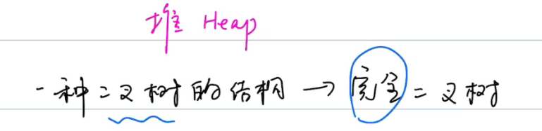
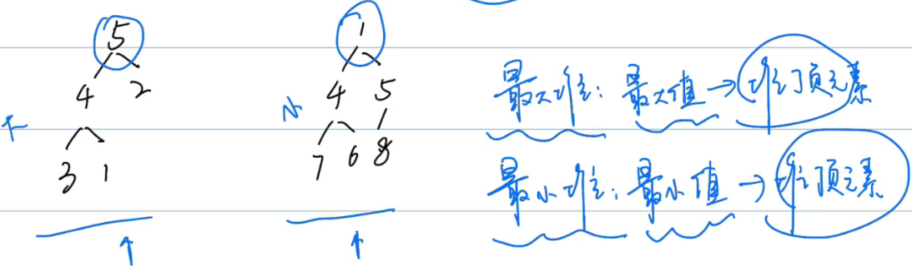
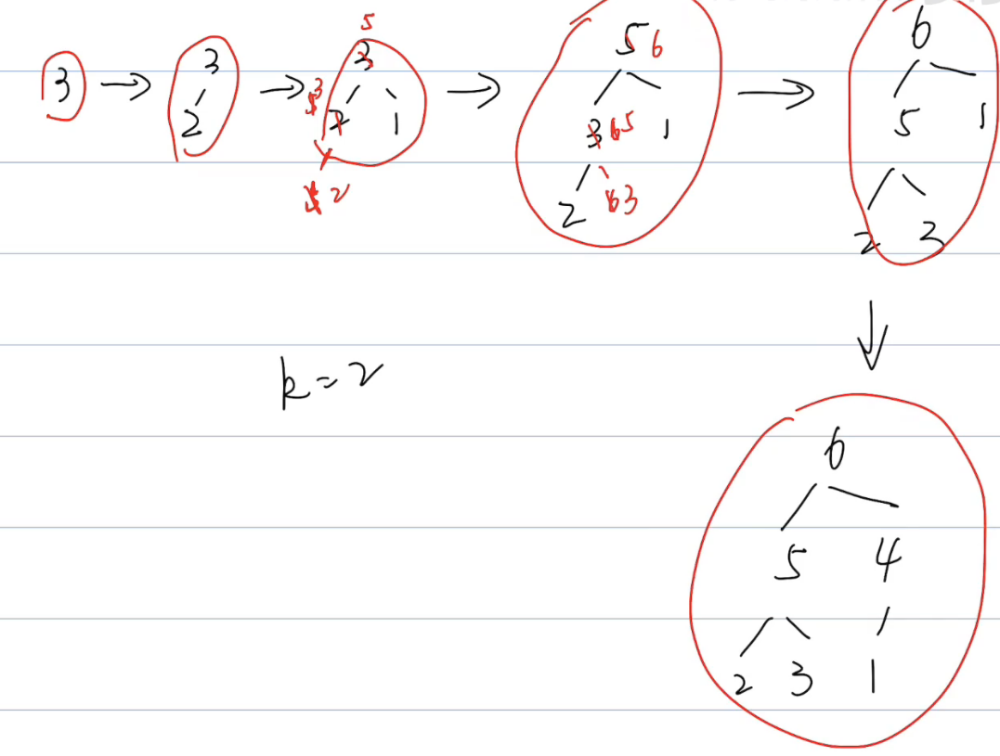

# 堆

## 特点







## 时间复杂度

```markdown
访问Acess 	不考虑
搜索Search 	堆顶元素	O(1)		
添加Insert 		O(log N)
删除Deltwo 	堆顶元素	O(log N)
```


## 堆的常用操作

```markdown
- 创建推（最大堆，最小堆）

- 添加元素

- 获取堆顶元素

- 删除堆顶元素

- 堆的长度

- 堆的遍历
```


## 练习

### [LeetCode215数组中的第K个最大元素](https://leetcode-cn.com/problems/kth-largest-element-in-an-array/)


在未排序的数组中找到第 **k** 个最大的元素。请注意，你需要找的是数组排序后的第 k 个最大的元素，而不是第 k 个不同的元素。

**示例 1:**

```
输入: [3,2,1,5,6,4] 和 k = 2
输出: 5
```

**示例 2:**

```
输入: [3,2,3,1,2,4,5,5,6] 和 k = 4
输出: 4
```

**说明:**

你可以假设 k 总是有效的，且 1 ≤ k ≤ 数组的长度。

题解：

> 最大堆



```java
class Solution{
    
}
```


### LeetCode629