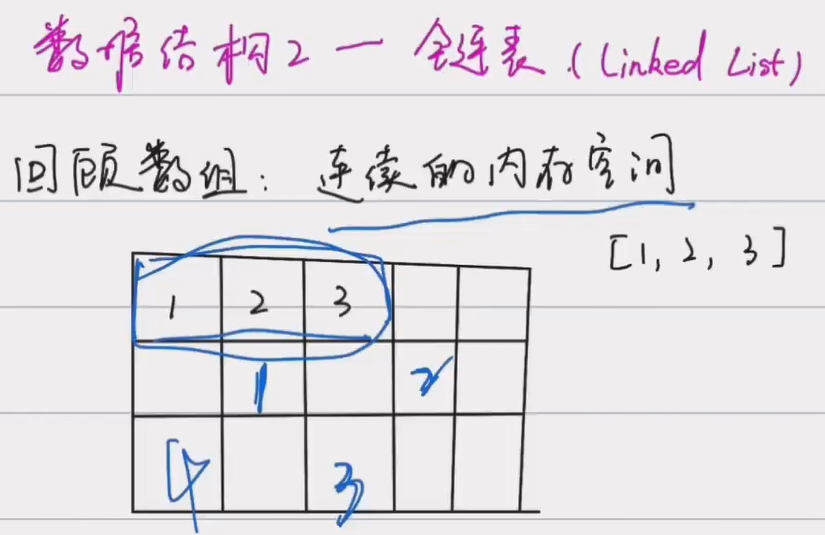
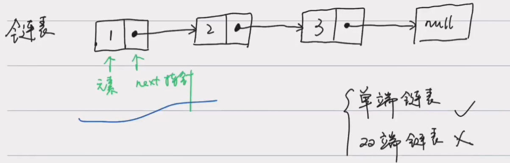
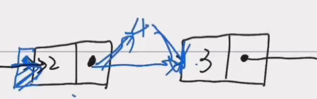
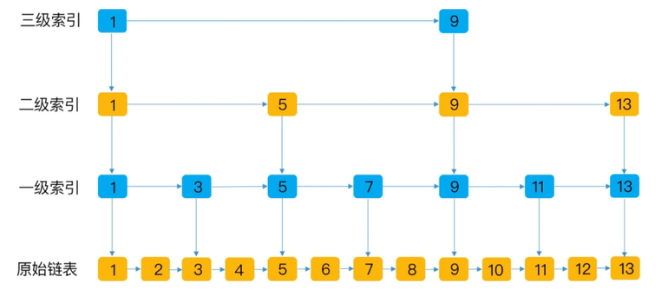

# 链表





```
value,val
next指针
```

## 时间复杂度


```markdown
访问和搜索都必须从头遍历到位
```

插入4，直接在内存空间找随便找一个地方，将元素二所在的next指针指向4，将4的指针指向3.



## 特点

```
适合读少写多
```


## 高级链表

### 双向链表

二分之一，再遍历

### 跳表



空间换时间，一维到二维

```
在原始链表之上增加一级一级的索引，以此加快查询速度
```

随机数保持平衡

```

```


## 链表常用操作

```markdown
1. 创建链表
2. 添加元素
3. 访问元素
4. 查找元素
5. 删除元素
6. 更新元素
7. 链表的长度
```

### 创建链表

```java
LinkedList<Integer> list = new LinkedList<>();
```


### 添加元素

```java
// 时间复杂度O(1)
list.add(1);
list.add(2);
list.add(3);

// 时间复杂度O(N)，本质上链表插入操作还是O(1)，但是LinkedList是要遍历一遍索引
list.add(2, 99);
```


### 访问元素

```java
// 时间复杂度O(N)
int element = list.get(2);
// 99
```


### 查找/搜索元素

```java
	// 时间复杂度O(N)
int index = list.indexOf(99);
// 2
```

### 更新元素

```java
// 时间复杂度O(N)
list.set(2, 88);
```


### 删除元素

```java
// 时间复杂度O(N)，本质上链表删除操作还是O(1)，但是LinkedList是要遍历一遍索引
list.remove(2)
```


### 链表的长度

```java
// 时间复杂度O(1)，LinkedList内部有一个变量，每次有一个添加操作，就会+1，删除操作，就会-1。当调用size()方法会直接放回一个结果，因此时间复杂度为O
int length = list.size();
// 3
```


## 练习

### [剑指 Offer 06. 从尾到头打印链表](https://leetcode-cn.com/leetbook/read/illustration-of-algorithm/5dt66m/)

输入一个链表的头节点，从尾到头反过来返回每个节点的值（用数组返回）。

示例 1：

```
输入：head = [1,3,2]
输出：[2,3,1]
```


限制：

`0 <= 链表长度 <= 10000`

题解：

> 这道题虽然是链表，但是`从头到尾`这一条件把解题方向指向了`栈`这个数据结构。
>
> 1. 栈
> 2. 链表
> 3. 数组
>
> 把链表push到栈中，再弹出栈顶元素到数组中，最后返回数组。

```java
/**
 * Definition for singly-linked list.
 * public class ListNode {
 *     int val;
 *     ListNode next;
 *     ListNode(int x) { val = x; }
 * }
 */
class Solution {
    public int[] reversePrint(ListNode head) {
        // 先来个链表结构的栈
        LinkedList<Integer> stack = new LinkedList<>();
        // 对于链表来说，遍历就是while。现在把链表遍历一遍，依次push到栈中
        while(head != null){
            stack.addLast(head.val);
            head = head.next; // head指向下一个
        }
        
        int[] res = new int[stack.size()];
        for(int i = 0; i < res.length; i++){
            res[i] = stack.removeLast(); // 弹出栈顶元素并赋值给数组
        }

        return res;
    }
}
```

或者

```java
class Solution {
    public int[] reversePrint(ListNode head) {
        int count = 0;
        Stack<Integer> stack = new Stack<>();   // 栈
        while(head != null){
            stack.push(head.val);
            head = head.next;
            count++;
        }
        int[] result = new int[count];
        for(int i = 0; i < result.length; i++){
            result[i] = stack.pop();
        }
        return result;
    }
}
```

牛客要返回ArrayList，所以要修改一下，不再遍历数组，而是遍历stack

```java
import java.util.ArrayList;
import java.util.LinkedList;
public class Solution {
    public ArrayList<Integer> printListFromTailToHead(ListNode listNode) {
        LinkedList<Integer> stack = new LinkedList<>();
        
        while(listNode != null){
            stack.addLast(listNode.val);
            listNode = listNode.next;
        }
        ArrayList<Integer> res = new ArrayList<>();
        
        while(!stack.isEmpty()){
            res.add(stack.removeLast());
        }
        return res;
    }
}
```


### 剑指 Offer 24/LeetCode206.反转链表

定义一个函数，输入一个链表的头节点，反转该链表并输出反转后链表的头节点。

示例:

```
输入: 1->2->3->4->5->NULL
输出: 5->4->3->2->1->NULL
```


限制：

- `0 <= 节点个数 <= 5000`

注意：本题与主站 206 题相同：https://leetcode-cn.com/problems/reverse-linked-list/

题解：

> 让pre回到它本该拥有的位置
>
> 快慢指针，pre就是最后结果的头节点
>
> 刚开始，cur指向pre，也就是1 -> null， 然后pre变成cur，pre = 1 -> null，但是现在这个链表就断了，必须有一个tmp存储2 -> 3 -> 4 -> 5 -> null，这样cur拿到tmp的内容，再操作，就变成了2 -> 1 -> null。。。

```java
class Solution {
    public ListNode reverseList(ListNode head) {
        ListNode cur = head, pre = null;
        while(cur != null) {	// 直到cur指向null再结束
            ListNode tmp = cur.next; // 暂存后继节点 cur.next。tmp：cur老哥，我已经存好了，你现在可以随意操作，不要怕。
            cur.next = pre;          // 修改 next 引用指向
            pre = cur;               // pre 暂存 cur
            cur = tmp;               // cur 访问下一节点
        }
        return pre;
    }
}
```


### 剑指 Offer 35/LeetCode138. 复杂链表的复制

请实现 copyRandomList 函数，复制一个复杂链表。在复杂链表中，每个节点除了有一个 next 指针指向下一个节点，还有一个 random 指针指向链表中的任意节点或者 null。

示例 1：


```
输入：head = [[7,null],[13,0],[11,4],[10,2],[1,0]]
输出：[[7,null],[13,0],[11,4],[10,2],[1,0]]
```

示例 2：

```
输入：head = [[1,1],[2,1]]
输出：[[1,1],[2,1]]
```

示例 3：

```
输入：head = [[3,null],[3,0],[3,null]]
输出：[[3,null],[3,0],[3,null]]
```

示例 4：

```
输入：head = []
输出：[]
解释：给定的链表为空（空指针），因此返回 null。
```


提示：

- `-10000 <= Node.val <= 10000`
- `Node.random `为空（null）或指向链表中的节点。
- 节点数目不超过 1000 。

注意：本题与主站 138 题相同：https://leetcode-cn.com/problems/copy-list-with-random-pointer/

题解：

```java
```


### [LeetCode203.移除链表元素](https://leetcode-cn.com/problems/remove-linked-list-elements/)

给你一个链表的头节点 head 和一个整数 val ，请你删除链表中所有满足 Node.val == val 的节点，并返回 新的头节点 。

示例 1：


```
输入：head = [1,2,6,3,4,5,6], val = 6
输出：[1,2,3,4,5]
```

示例 2：

```
输入：head = [], val = 1
输出：[]
```

示例 3：

```
输入：head = [7,7,7,7], val = 7
输出：[]
```


提示：

- 列表中的节点在范围 `[0, 104]` 内
- `1 <= Node.val <= 50`
- `0 <= k <= 50`

题解：

```java

```
