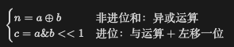

# 位运算

## 概念

## 练习

### 剑指 Offer 15. 二进制中 1 的个数

### 剑指 Offer 65. 不用加减乘除做加法

写一个函数，求两个整数之和，要求在函数体内不得使用 “+”、“-”、“*”、“/” 四则运算符号。

示例:

```
输入: a = 1, b = 1
输出: 2
```

**提示：**

- `a`, `b` 均可能是负数或 0
- 结果不会溢出 32 位整数

题解：



>0001
>
>0011
>
>异或为0010  与运算+左移一位为0010
>
>递归一次，异或为0000  与运算+左移一位为0100

```java
class Solution {
    public int add(int a, int b) {
        if (a == 0) return b;
        if (b == 0) return a;
        return add(a ^ b, (a & b) << 1);
    }
}
```

