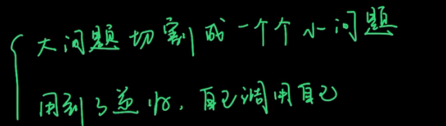
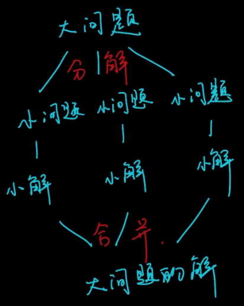
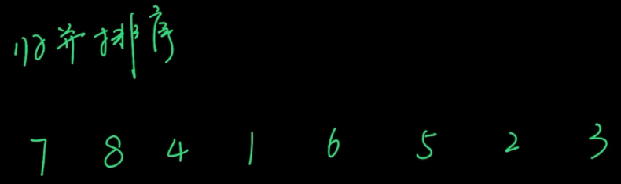
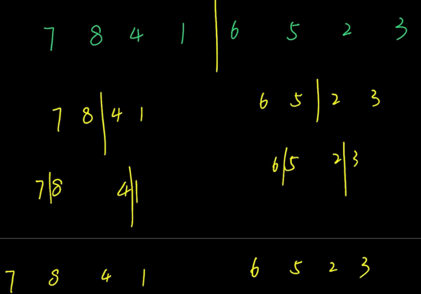

# 分治法

## 概念



可以理解为一种特殊的递归



举例，要求从小到大排序






## 练习

### [剑指 Offer 07/LeetCode105. 重建二叉树](https://leetcode-cn.com/leetbook/read/illustration-of-algorithm/99lxci/)

输入某二叉树的前序遍历和中序遍历的结果，请重建该二叉树。假设输入的前序遍历和中序遍历的结果中都不含重复的数字。

例如，给出

```
前序遍历 preorder = [3,9,20,15,7]
中序遍历 inorder = [9,3,15,20,7]
```

返回如下的二叉树：

    		3
       / \
      9  20
        /  \
       15   7

限制：

`0 <= 节点个数 <= 5000`

注意：本题与主站 105 题重复：https://leetcode-cn.com/problems/construct-binary-tree-from-preorder-and-inorder-traversal/

题解：

> 分而治之算法：1、递归参数	2、终止条件	3、递归工作
>
> 前序遍历知道根
>
> 中序遍历划分左子树，根，右子树
>
> 通过HashMap存储中序遍历的结果，中序遍历根对应的索引就是i，这个i的左边 i - 1 就应该是左子树，右边 i + 1就应该是右子树。如下图所示：
>
> ```java
> node.left = recur(root + 1, left, i - 1);              // 开启左子树递归
> node.right = recur(root + i - left + 1, i + 1, right); // 开启右子树递归
> ```
>
> 

```java
class Solution {
    int[] preorder;
    HashMap<Integer, Integer> dic = new HashMap<>();
    public TreeNode buildTree(int[] preorder, int[] inorder) {
        this.preorder = preorder;
        for(int i = 0; i < inorder.length; i++)
            dic.put(inorder[i], i);
        return recur(0, 0, inorder.length - 1);
    }
    TreeNode recur(int root, int left, int right) {
        if(left > right) return null;                          // 递归终止
        TreeNode node = new TreeNode(preorder[root]);          // 前序遍历的第一个肯定是根节点，所以建立根节点
        int i = dic.get(preorder[root]);                       // 这个i就是索引（由中序遍历得到）。划分根节点、左子树、右子树
        node.left = recur(root + 1, left, i - 1);              // 开启左子树递归，这里的根应该是原始二叉树根左右的“左”。
        node.right = recur(root + 1 + i - left, i + 1, right); // 开启右子树递归，这里的根应该是原始二叉树根左右的“右” ， i -left是左子树的大小
        return node;                                           // 回溯返回根节点
    }
}
```


### 剑指 Offer 16. 数值的整数次方

实现` pow(x, n) `，即计算 x 的 n 次幂函数（即，$x^n$）。不得使用库函数，同时不需要考虑大数问题。

示例 1：

```
输入：x = 2.00000, n = 10
输出：1024.00000
```

示例 2：

```
输入：x = 2.10000, n = 3
输出：9.26100
```

示例 3：

```
输入：x = 2.00000, n = -2
输出：0.25000
解释：2-2 = 1/22 = 1/4 = 0.25
```


提示：

- `-100.0 < x < 100.0`
- `-231 <= n <= 231-1`
- `-104 <= xn <= 104`

注意：本题与主站 50 题相同：https://leetcode-cn.com/problems/powx-n/

题解：

>使用 long 的原因在于：Java 中 int32 变量区间 $n \in [-2147483648,2147483647] $，因此当 n = -2147483648n=−2147483648 时执行 n = -n 会因`越界`而赋值出错。解决方法是先将 n 存入 long 变量 b ，后面用 b 操作即可。

```java
class Solution {
    public double myPow(double x, int n) {
        if(x == 0.0f) return 0.0d;
        long b = n;
        double res = 1.0;
        if(b < 0) {		// 如果幂次方为负数，那么翻转x，并改幂次为正。方便解决问题
            x = 1 / x;
            b = -b;
        }
        while(b > 0) {
            if((b & 1) == 1) res *= x;	// 判断是否为奇数
            x *= x;
            b >>= 1;	// 右移一位，相当于，b //= 2
        }
        return res;
    }
}
```


### LeetCode169.多数元素

### [LeetCode53.最大子序和](https://leetcode-cn.com/problems/maximum-subarray) 


