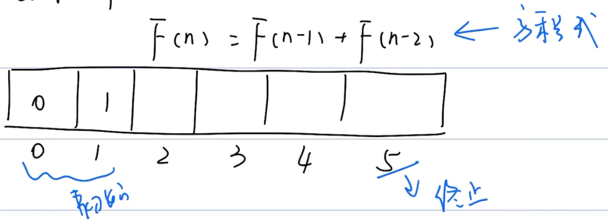
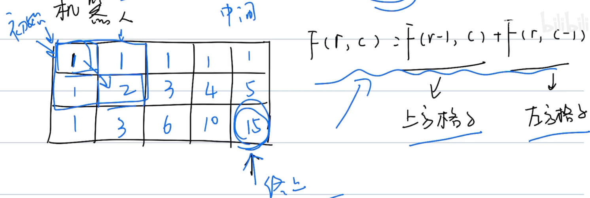
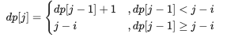
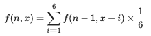

# 动态规划

## 概念

```markdown
题型千变万化
思路千变万化
```


### 动态规划四要素

```markdown
1. 状态定义
2. 初始状态
3. 方程式（状态转移方程）
4. 终止状态
```


### 动态规划的过程

#### 斐波那契-1维数组

$$
F(n)=F(n-1)+F(n-2)
$$




#### 机器人-2维数组

$$
F(r,c)=F(r-1,c)+F(r,c-1)
$$



其中，$F(r-1,c)$为上方格子， $F(r,c-1)$为左方格子

### 动态规划能干些什么

```markdown
1. 计数：
	有多少种方式|方法
    机器人从左上角到右下角多少个路径
    
2. 求最值：
	最大值 | 最小值
   	机器人从左 -> 右路径的最大数字和
   	
3. 求存在性:
	是否存在某个可能
	是否存在机器人从左 -> 右的路径
```


## 练习题

### 剑指 Offer 10- I/LeetCode509.斐波那契数列

写一个函数，输入` n `，求斐波那契（Fibonacci）数列的第` n `项（即` F(N)`）。斐波那契数列的定义如下：

```
F(0) = 0,   F(1) = 1
F(N) = F(N - 1) + F(N - 2), 其中 N > 1.
```

斐波那契数列由 0 和 1 开始，之后的斐波那契数就是由之前的两数相加而得出。

答案需要取模 1e9+7（1000000007），如计算初始结果为：1000000008，请返回 1。

示例 1：

```
输入：n = 2
输出：1
```

示例 2：

```
输入：n = 5
输出：5
```


提示：

- `0 <= n <= 100`

题解：

> 四大要素
>
> F(0) = 0,   F(1) = 1	初始状态
>
> F(N) = F(N - 1) + F(N - 2)	状态转移方程
>
> F(N) 终止状态

```java
class Solution {
    public int fib(int n) {
        int[] fibs = new int[101];
        fibs[0] = 0;	// 初始状态
        fibs[1] = 1;
        for(int i = 2; i <= n; i++){
            fibs[i] = (fibs[i -1] + fibs[i - 2]) % 1000000007;	// 状态转移方程
        }
        return fibs[n];	// 返回值
    }
}
```

### 剑指 Offer 10- II. 青蛙跳台阶问题//LeetCode70.爬楼梯

一只青蛙一次可以跳上1级台阶，也可以跳上2级台阶。求该青蛙跳上一个` n `级的台阶总共有多少种跳法。

答案需要取模 1e9+7（1000000007），如计算初始结果为：1000000008，请返回 1。

示例 1：

```
输入：n = 2
输出：2
```

示例 2：

```
输入：n = 7
输出：21
```

示例 3：

```
输入：n = 0
输出：1
```

提示：

- `0 <= n <= 100`

注意：本题与主站 70 题相同：https://leetcode-cn.com/problems/climbing-stairs/

题解：

```java
class Solution {
    public int numWays(int n) {
        if(n < 2){
            return 1;
        }
        int[] dp = new int[101];
        dp[0] = 1;	// 	确认初始值
        dp[1] = 1;
        dp[2] = 2;
        for(int i = 3; i <= n; i++){
            dp[i] = (dp[i - 1] + dp[i - 2]) % 1000000007;
        }
        return dp[n];
    }
}
```

### 剑指 Offer 42/LeetCode53. 连续子数组的最大和

输入一个整型数组，数组中的一个或连续多个整数组成一个子数组。求所有子数组的和的最大值。

要求时间复杂度为O(n)。 

示例1:

```
输入: nums = [-2,1,-3,4,-1,2,1,-5,4]
输出: 6
解释: 连续子数组 [4,-1,2,1] 的和最大，为 6。
```


提示：

- `1 <= arr.length <= 10^5`
- `-100 <= arr[i] <= 100`

注意：本题与主站 53 题相同：https://leetcode-cn.com/problems/maximum-subarray/

题解：

```java
```


### 剑指 Offer 47. 礼物的最大价值

在一个 m*n 的棋盘的每一格都放有一个礼物，每个礼物都有一定的价值（价值大于 0）。你可以从棋盘的左上角开始拿格子里的礼物，并每次向右或者向下移动一格、直到到达棋盘的右下角。给定一个棋盘及其上面的礼物的价值，请计算你最多能拿到多少价值的礼物？

示例 1:

```
输入: 
[
  [1,3,1],
  [1,5,1],
  [4,2,1]
]
输出: 12
解释: 路径 1→3→5→2→1 可以拿到最多价值的礼物
```


提示：

- `0 < grid.length <= 200`
- `0 < grid[0].length <= 200`

题解：

> ```
> 1. 定义状态
> 2. 方程			当前的值加上之前的值
> 3. 初始状态
> 4. 返回值
> ```
>
> 

```java
class Solution {
    public int maxValue(int[][] grid) {
        int m = grid.length, n = grid[0].length;
        for(int i = 0; i < m; i++) {
            for(int j = 0; j < n; j++) {
                if(i == 0 && j == 0) continue;	// 初始状态，跳出本次循环，然后继续下一个循环
                if(i == 0) grid[i][j] += grid[i][j - 1] ;	// 矩阵第一行元素,只可从左边到达；
                else if(j == 0) grid[i][j] += grid[i - 1][j];	// 矩阵第一列元素，只可从上边到达；
                else grid[i][j] += Math.max(grid[i][j - 1], grid[i - 1][j]);	// 从左边或上边到达；
            }
        }
        return grid[m - 1][n - 1];
    }
}
```

### 剑指 Offer 48. 最长不含重复字符的子字符串

请从字符串中找出一个最长的不包含重复字符的子字符串，计算该最长子字符串的长度。

示例 1:

```
输入: "abcabcbb"
输出: 3 
解释: 因为无重复字符的最长子串是 "abc"，所以其长度为 3。
```

示例 2:

```
输入: "pwwkew"
输出: 3
解释: 因为无重复字符的最长子串是 "wke"，所以其长度为 3。
     请注意，你的答案必须是 子串 的长度，"pwke" 是一个子序列，不是子串。
```

示例 3:

```
输入: "pwwkew"
输出: 3
解释: 因为无重复字符的最长子串是 "wke"，所以其长度为 3。
     请注意，你的答案必须是 子串 的长度，"pwke" 是一个子序列，不是子串。
```


提示：

- s.length <= 40000

注意：本题与主站 3 题相同：https://leetcode-cn.com/problems/longest-substring-without-repeating-characters/

题解：

>
>
>动态规划 + 双指针 + 哈希表

```java
class Solution {
    public int lengthOfLongestSubstring(String s) {
        Map<Character, Integer> dic = new HashMap<>();
        int i = -1, res = 0, len = s.length();
        for(int j = 0; j < len; j++) {
            if(dic.containsKey(s.charAt(j)))
                i = Math.max(i, dic.get(s.charAt(j))); // 更新左指针 i
            dic.put(s.charAt(j), j); // 哈希表记录
            res = Math.max(res, j - i); // 更新结果，取上轮 res 和本轮双指针区间 [i + 1,j]的宽度（即 j - i ）中的最大值。
        }
        return res;	
    }
}
```


### 剑指 Offer 49/LeetCode264. 丑数

我们把只包含质因子 2、3 和 5 的数称作丑数（Ugly Number）。求按从小到大的顺序的第 n 个丑数。

示例:

```
输入: n = 10
输出: 12
解释: 1, 2, 3, 4, 5, 6, 8, 9, 10, 12 是前 10 个丑数。
```

说明:  

```
1 是丑数。
n 不超过1690。
```

注意：本题与主站 264 题相同：https://leetcode-cn.com/problems/ugly-number-ii/

题解：

> dp[i] 是第 i + 1个丑数
>
> dp[0] = 1
>
> dp[n - 1]
>
> dp[n] = dp[n - 1] ✖️ 

```java
class Solution {
    public int nthUglyNumber(int n) {
        int a = 0, b = 0, c = 0;
        int[] dp = new int[n];	// 定义状态
        dp[0] = 1;	// 初始状态
        for(int i = 1; i < n; i++) {
            int n2 = dp[a] * 2, n3 = dp[b] * 3, n5 = dp[c] * 5;
            dp[i] = Math.min(Math.min(n2, n3), n5);
            if(dp[i] == n2) a++;
            if(dp[i] == n3) b++;
            if(dp[i] == n5) c++;
        }
        return dp[n - 1];	// 返回值
    }
}
```

### 剑指 Offer 60. n 个骰子的点数

把n个骰子扔在地上，所有骰子朝上一面的点数之和为s。输入n，打印出s的所有可能的值出现的概率。 

你需要用一个浮点数数组返回答案，其中第 i 个元素代表这 n 个骰子所能掷出的点数集合中第 i 小的那个的概率。 

示例 1:

```
输入: 1
输出: [0.16667,0.16667,0.16667,0.16667,0.16667,0.16667]
```

示例 2:

```
输入: 2
输出: [0.02778,0.05556,0.08333,0.11111,0.13889,0.16667,0.13889,0.11111,0.08333,0.05556,0.02778]
```


限制：

`1 <= n <= 11`

题解：

>假设已知 n - 1n−1 个骰子的解 f(n - 1)f(n−1) ，此时添加一枚骰子，求 nn 个骰子的点数和为 xx 的概率 f(n, x)f(n,x) 。
>
>当添加骰子的点数为 11 时，前 n - 1n−1 个骰子的点数和应为 x - 1x−1 ，方可组成点数和 xx ；同理，当此骰子为 22 时，前 n - 1n−1 个骰子应为 x - 2x−2 ；以此类推，直至此骰子点数为 66 。将这 66 种情况的概率相加，即可得到概率 f(n, x)f(n,x) 。递推公式如下所示：
>
>
>
>

```java
class Solution {
  public static double[] dicesProbability(int n) {
        double[] dp = new double[6];    //这里并不是dp全部的，而是dp[0]
        Arrays.fill(dp, 1.0 / 6.0);  //将dp[0]赋初值。
        for (int i = 2; i <= n; i++) {
            double temp[] = new double[5 * i + 1];   //temp数组就是动态过程中的dp，他的大小就是6i-i+1
    //注意j是dp的大小，而不是6，因为后面dp被赋值为temp
            for (int j = 0; j < dp.length; j++) { 
                //这里的K是增加一个筛子的过程。
                for (int k = 0; k < 6; k++) {
                    temp[j + k] += dp[j] / 6.0;
                }
            }
            dp = temp;//将动态临时temp赋值给dp
        }
        return dp;
    }
}
```


### 剑指 Offer 63. 股票的最大利润/LeetCode121.买卖股票的最佳时机

假设把某股票的价格按照时间先后顺序存储在数组中，请问买卖该股票一次可能获得的最大利润是多少？

示例 1:

```
输入: [7,1,5,3,6,4]
输出: 5
解释: 在第 2 天（股票价格 = 1）的时候买入，在第 5 天（股票价格 = 6）的时候卖出，最大利润 = 6-1 = 5 。
     注意利润不能是 7-1 = 6, 因为卖出价格需要大于买入价格；同时，你不能在买入前卖出股票。
```

示例 2:

```
输入: [7,6,4,3,1]
输出: 0
解释: 在这种情况下, 没有交易完成, 所以最大利润为 0。
```


限制：

- `0 <= 数组长度 <= 10^5`

注意：本题与主站 121 题相同：https://leetcode-cn.com/problems/best-time-to-buy-and-sell-stock/

题解：

> 初始状态dp[0] = 0
>
> 状态转移方程
> $$
> dp[i]=max(dp[i−1],prices[i]−min(prices[0:i]))
> $$
>
> $$
> 前i日最大利润=max(前(i−1)日最大利润,第i日价格−前i日最低价格)
> $$
>
> 即，对于第$i$天的最大利润，要么就是昨天$i-1$的==最大==利润更大，要么就是今天$i$的价格减掉之前的最低价格（从第$i$天截止）更大。

```java
class Solution {
    public int maxProfit(int[] prices) {
        int cost = Integer.MAX_VALUE, profit = 0;	// Integer.MAX_VALUE = 2147483647	初始状态，即第一天的利润为0。
        for(int price : prices) {	// prices[i]和profit[i](dp[i)是对应的
          	// 状态转移方程
            cost = Math.min(cost, price);
            profit = Math.max(profit, price - cost);		// 当前利润和当前价格 - 最小价格
        }
        return profit;	// 利润，profit就是返回值，相当于dp[i - 1]
    }
}
```


### LeetCode62.不同路经


### LeetCode70.爬楼梯


### LeetCode279.完全平方数


### LeetCode221.最大正方形