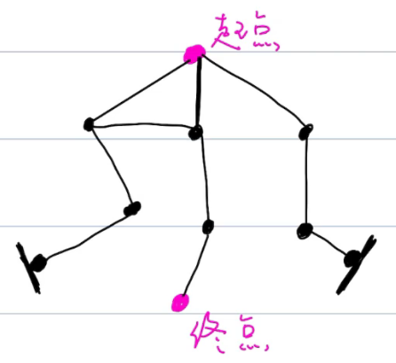
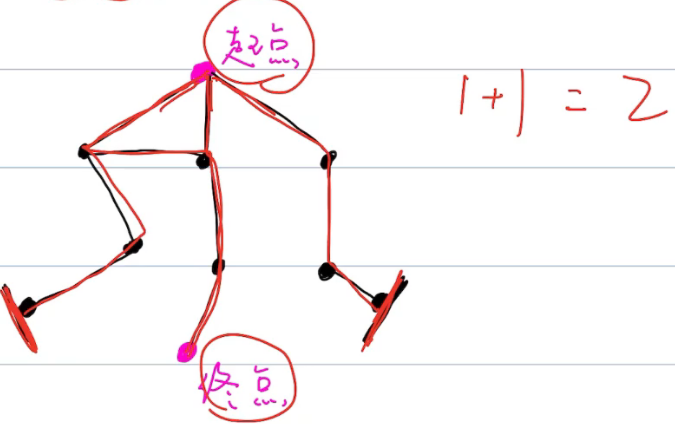

# 深度优先搜索

## 概念

> 建议先学习`回溯`。

从 root 节点开始，尽可能`深`的搜索一个分支，把一个分支的结果搜索完，再去看下一个分支。

### 四大要素

```
递归参数
终止条件/递归出口
递归工作
返回值
```

### 走迷宫






## 练习

### [剑指 Offer 12/LeetCode79. 矩阵中的路径](https://leetcode-cn.com/leetbook/read/illustration-of-algorithm/58wowd/)

给定一个 `m x n` 二维字符网格` board `和一个字符串单词` word `。如果` word `存在于网格中，返回` true `；否则，返回` false `。

单词必须按照字母顺序，通过相邻的单元格内的字母构成，其中“相邻”单元格是那些水平相邻或垂直相邻的单元格。同一个单元格内的字母不允许被重复使用。

例如，在下面的 3×4 的矩阵中包含单词 "ABCCED"（单词中的字母已标出）。


示例 1：

```
输入：board = [["A","B","C","E"],["S","F","C","S"],["A","D","E","E"]], word = "ABCCED"
输出：true
```

示例 2：

```
输入：board = [["a","b"],["c","d"]], word = "abcd"
输出：false
```


提示：

- `1 <= board.length <= 200`
- `1 <= board[i].length <= 200`
- `board`和 `word `仅由大小写英文字母组成


注意：本题与主站 79 题相同：https://leetcode-cn.com/problems/word-search/

题解：

>对于每一个元素，都要是下上又左
>
>k用来记录当前word的索引位置。

```java
class Solution {
    public boolean exist(char[][] board, String word) {
        char[] words = word.toCharArray();
      	// 遍历矩阵，从左到右
        for(int i = 0; i < board.length; i++) {
            for(int j = 0; j < board[0].length; j++) {
                if(dfs(board, words, i, j, 0)) return true;
            }
        }
        return false;
    }
    boolean dfs(char[][] board, char[] word, int i, int j, int k) {
        if(i >= board.length || i < 0 || j >= board[0].length || j < 0 || board[i][j] != word[k]) return false;	// 越界
        if(k == word.length - 1) return true;	// 到达word的最后一个索引。
        board[i][j] = '\0';	// 避免重复计算
        boolean res = dfs(board, word, i + 1, j, k + 1) || dfs(board, word, i - 1, j, k + 1) || 
                      dfs(board, word, i, j + 1, k + 1) || dfs(board, word, i , j - 1, k + 1);	// 按照下上右左，只要有一个能走通，就返回true，回溯
        board[i][j] = word[k];	// 还原
        return res;
    }
}
```


### 剑指 Offer 13. 机器人的运动范围

视频：https://www.bilibili.com/video/BV1dz411B7rt

地上有一个m行n列的方格，从坐标 `[0,0]` 到坐标 `[m-1,n-1] `。一个机器人从坐标` [0, 0] `的格子开始移动，它每次可以向左、右、上、下移动一格（不能移动到方格外），也不能进入行坐标和列坐标的数位之和大于k的格子。例如，当k为18时，机器人能够进入方格 [35, 37] ，因为3+5+3+7=18。但它不能进入方格 [35, 38]，因为3+5+3+8=19。请问该机器人能够到达多少个格子？ 

示例 1：

```
输入：m = 2, n = 3, k = 1
输出：3
```

示例 2：

```
输入：m = 3, n = 1, k = 0
输出：1
```

提示：

- `1 <= n,m <= 100`
- `0 <= k <= 20`

题解：

> 深度优先搜索，首先是递归四大要素。
>
> ```
> 递归参数： 当前元素在矩阵中的行列索引 i 和 j ，两者的数位和 si, sj 。
> 终止条件/递归出口： 当 ① 行列索引越界 或 ② 数位和超出目标值 k 或 ③ 当前元素已访问过 时，返回 00 ，代表不计入可达解。
> 递推工作：
> 标记当前单元格 ：将索引 (i, j) 存入 Set visited 中，代表此单元格已被访问过。
> 搜索下一单元格： 计算当前元素的 下、右 两个方向元素的数位和，并开启下层递归 。
> 回溯返回值： 返回 1 + 右方搜索的可达解总数 + 下方搜索的可达解总数，代表从本单元格递归搜索的可达解总数。
> ```
>
> `visited` 为辅助矩阵，表示是否已经访问过。
>
> 数位和增量公式：

```java
class Solution {
    int m, n, k;
    boolean[][] visited;	// 表面该记元素是否已经访问过，避免重复计算
    public int movingCount(int m, int n, int k) {
        this.m = m; this.n = n; this.k = k;
        this.visited = new boolean[m][n];
        return dfs(0, 0, 0, 0);
    }
    public int dfs(int i, int j, int si, int sj) {
        if(i >= m || j >= n || k < si + sj || visited[i][j]) return 0;	// 终止条件
        visited[i][j] = true;	// 设置为true，表示该元素已经访问过。
        return 1 + dfs(i + 1, j, (i + 1) % 10 != 0 ? si + 1 : si - 8, sj) + dfs(i, j + 1, si, (j + 1) % 10 != 0 ? sj + 1 : sj - 8);		// 若向下移动，只有i和si变化。 另外用到了数位和增量公式，如果i + 1没有到10的倍数，那么只要在当前基础si上直接加1即可。但是如果刚好达到10的倍数，加应该是 si - 8了。
    }
}
```


### LeetCode.938二叉搜索树的范围和

给定二叉搜索树的根结点`root`，返回值位于范围`[low,high]`之间的所有结点的值的和


题解：

