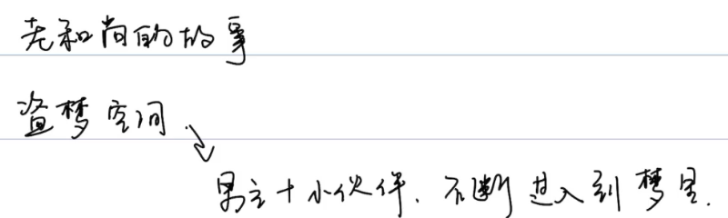
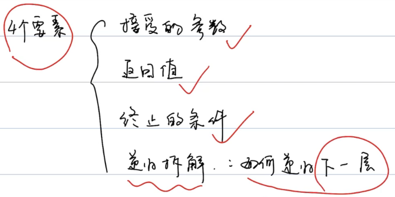
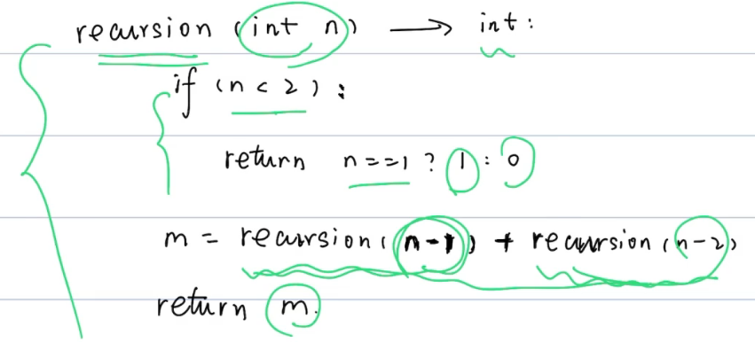
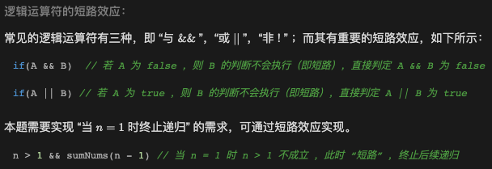

# 递归

## 定义

函数直接或者间接调用自己。


## 套娃




## 四个要素



```markdown
1. 参数
2. 返回值
3. 终止条件
4. 拆解
```





时间复杂度：O(2^N)

空间复杂度：O(N)	递归栈，先进后出


## 练习

### 剑指 Offer 64. 求 1 + 2 + … + n

求 1+2+...+n ，要求不能使用乘除法、for、while、if、else、switch、case等关键字及条件判断语句（A?B:C）。

示例 1：

```
输入: n = 3
输出: 6
```

示例 2：

```
输入: n = 9
输出: 45
```


限制：

1 <= n <= 10000

题解：




```java
class Solution {
    int res = 0;
    public int sumNums(int n) {
        boolean x = n > 1 && sumNums(n - 1) > 0;
        res += n;
        return res;
    }
}
```


### LeetCode509斐波那契数列

### LeetCode206反转链表

### LeetCode206反转字符串


